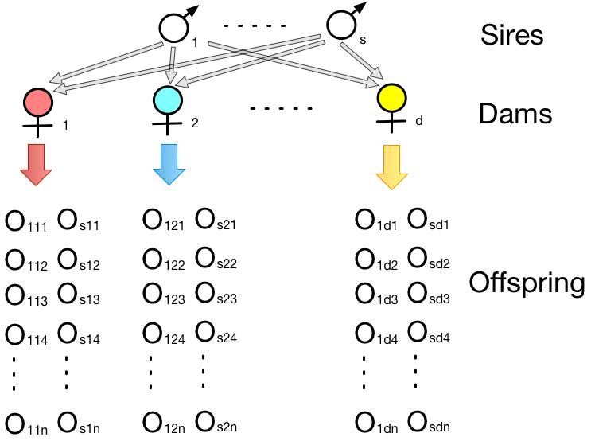
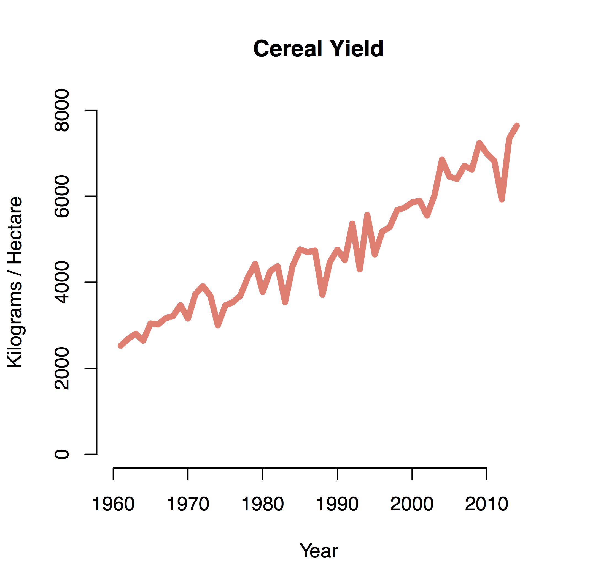

```{r setup, include=FALSE}
options(htmltools.dir.version = FALSE)
```


# Precision and design

.pull-left[
If we want to design a balanced experiment:
- __ $s$ sires__ each mated to __ $d$ dams__
- Each dam has __ $n$ progenies__
]

.pull-right[
<div align="center">

</div>
]

--

#### Questions before experimental design?

1. Parent-offspring, half-sib, full-sib, or others?
1. How many families?
2. Numbers of progeny?
3. What if it is unbalanced?


---

# Sampling variance of $b$

F & M page 178, the sampling variance of the parent-offspring regression is approximately:

\begin{align*}
SV_b = \frac{k[1+(n-1)t]}{nN}
\end{align*}

- $N$ families (offspring and parents)
- $k$ parents (1 or 2) for each family
- $n$ offspring per family
- $t$ the intra-class correlation between offspring in a family

--

### Parent-offspring regression: One parent

\begin{align*}
&k =1 \\
&SV_b = \frac{[1+(n-1)t]}{nN}\\
\end{align*}

Sampling variance is minimal when $n=1$, i.e. $(n-1)t=0$.


---

### Parent-offspring regression: One parent

.pull-left[

The __most efficient__ design:
- as many as families as possible
- measure only one offspring per family

### Sampling variance of $b$
\begin{align*}
& SV(h^2=2b) = 4/N \\
& s.e.(h^2) = 2/\sqrt{N} \\
\end{align*}
]

.pull-left[
```{r, out.width='100%', fig.align='center', echo=TRUE}
N=1:1000
se <- 2/sqrt(N)

plot(N, se, type="l", 
     lwd=5, col="red")
```
]

---

# Sampling variance of $b$

F & M page 178, the sampling variance of the regression is approximately:

\begin{align*}
SV_b = \frac{k[1+(n-1)t]}{nN}
\end{align*}

- $N$ families (offspring and parents)
- $k$ parents (1 or 2) for each family
- $n$ offspring
- $t$ the intra-class correlation between offspring in a family

--

### Parent-offspring regression: both parents

When $k=2$ (use mid-parent values), the $SV(h^2=b) = 2/N$. So the standard error, $se(h^2) = \sqrt{2/N}$


---

### Parent-offspring regression: Both-parents

.pull-left[

### Sampling variance of $b$

One parent: 

$s.e.(h^2) = 2/\sqrt{N}$

Both parents: 

$s.e.(h^2) = \sqrt{2/N}$
]


.pull-left[
```{r, out.width='100%', fig.align='center', echo=TRUE}
N=1:1000
se <- 2/sqrt(N)
se2 <- sqrt(2/N)
plot(N, se, type="l", 
     lwd=5, col="red")
lines(N, se2, type="l", 
      lwd=5, col="blue", lty=2)
```
]


---

# Sib analyses


The __correlation__ between A and P, $r_{AP}$:

\begin{align*}
r_{AP} & =  \frac{Cov(A, P)}{\sqrt{\sigma_A^2\sigma_P^2}} \\
 & = \sqrt{\frac{\sigma_A^2}{\sigma_P^2}} \\
 & = h\\
\end{align*}

--

Therefore, the __intraclass correlation (t)__, is also a function of $h$.

---

# Sib analyses

Now we look at the sampling variance of the __intraclass correlation (t)__.
According to F & M page 180, the sampling variance of __t__ is:

\begin{align*}
SV_t = \frac{2[1+(n-1)t]^2\times (1-t)^2}{n(n-1)(N-1)}
\end{align*}

- $N$ families (offspring and parents)
- $n$ offspring per family
- $t$ the intra-class correlation between offspring in a family

--

### Optimal family size

- If we let $T =nN$, the total number measured in a generation
- The sampling variance is minimized when __n (number of offspring per family) = 1/t__, approximately

---

### Optimal family size

With $n = 1/t$, approximately,

In the simplest cases with no common environmental effect in families, then
- For half-sibs: $t_{HS} = h^2/4$, then $n=4/h^2$
- For full-sibs: $t_{FS} = h^2/2$, then $n=2/h^2$

--

### Caveats:

- Some __assumption of $h^2$ ahead of time__ is essential in planning the data collection!

- Note that in the case of half-sibs, we are assuming that only one offspring per dam is measured.
so n is the __optimal number of dams per sire__.
  - in the absence of prior knowledge, half-sib family size 20-30. (Robertson 1959)


---

# The improvement through breeding

.pull-left[
<div align="center">

</div>

<div align="center">

</div>
]

--

.pull-right[

## Response to selection
### 1. Why has a character changed over generations?
### 2. Can we predict a change?

]


---


# Response to selection

.pull-left[
## Response to selection
### 1. Why has a character changed over generations?
### 2. Can we predict a change?
]

.pull-right[

Improve the body weight of chicken
<div align="center">

</div>

Increase the cob length
<div align="center">

</div>
]

---

# Response to selection

Change, or response ( $R$ ), is given by the basic equation:

\begin{align*}
R = h^2S
\end{align*}

Here S is the __selection differential__, which is equal to the mean value of the selected parents ( $\mu_S$ ) minus the population mean ( $\mu$ ).

 ---
 
.pull-left[
Improve the body weight
<div align="center">

</div>
]

--

.pull-right[
1. Base population (N=100) mean = 1,000g
2. Selected 5 chicken as the parents, with mean =1,050g.

What is $S$?
]

---

# Standardized selection differential

With the assumption that the phenotypic distributions are normal.

#### Selection differential in standard deviation units:

\begin{align*}
\frac{S}{\sigma_P}
\end{align*}

--

### __Intensity of selection ( $i$ )__

\begin{align*}
i = \frac{S}{\sigma_P}
\end{align*}


---

# Intensity of selection ( $i$ )

.pull-left[
- With the assumption that the phenotypic distributions are normal.

- And standardize the selection differential:
\begin{align*}
&i= S/\sigma_P \\
\end{align*}
]

--

.pull-right[
```{r, out.width='100%', fig.align='center', echo=TRUE}
curve(dnorm(x,0,1), xlim=c(-3,3), xaxt="n", xlab="Trait Value", main="", ylab="Density", lwd=3)
fromd <- qnorm(.95); tod <- 3
S.x  <- c(fromd, seq(fromd, tod, 0.01), tod)
S.y  <- c(0, dnorm(seq(fromd, tod, 0.01)), 0)
polygon(S.x,S.y, col="grey")
abline(v=mean(S.x**S.y)*2, col="blue", lwd=3); abline(v=0, col="red", lwd=3)
```
]

---

# Intensity of selection ( $i$ )

.pull-left[
- With the assumption that the phenotypic distributions are normal.

- And standardize the selection differential:
\begin{align*}
&i= S/\sigma_P \\
\end{align*}


- If $p$ is __the proportion selected__, i.e. the proportion of the population falling beyond the point of truncation.
- And $z$ is the __height of the ordinate__ at the point of truncation.

\begin{align*}
i = \frac{z}{p}
\end{align*}
]


.pull-right[
```{r, out.width='100%', fig.align='center', echo=TRUE}
curve(dnorm(x,0,1), xlim=c(-3,3), xaxt="n", xlab="Trait Value", main="", ylab="Density", lwd=3)
fromd <- qnorm(.95); tod <- 3
S.x  <- c(fromd, seq(fromd, tod, 0.01), tod)
S.y  <- c(0, dnorm(seq(fromd, tod, 0.01)), 0)
polygon(S.x,S.y, col="grey")
abline(v=mean(S.x**S.y)*2, col="blue", lwd=3); abline(v=0, col="red", lwd=3)
```
]

---

# Intensity of selection ( $i$ )

.pull-left[
```{r, out.width='80%', fig.align='center', echo=TRUE}

ifun <- function(p=0.5){
  x=qnorm(p=(1-p)) # get the truncation point
  z=dnorm(x) # get z
  return(z/p) # get i
}

p <- seq(0.0001, 0.5, by=0.0001)
i <- ifun(p)
plot(p, i)
```
]

.pull-right[
```{r}
head(data.frame(p, i), 20)
```
]

---

# Breeder's equation

\begin{align*}
&R = h^2S\\
&S = i\sigma_P&
\end{align*}

--

So now, we have, as a prediction:

\begin{align*}
&R = h^2i\sigma_P\\
&i = \frac{z}{p}&
\end{align*}

---

# Breeder's equation

\begin{align*}
&R = h^2i\sigma_P\\
&i = \frac{z}{p}&
\end{align*}


.pull-left[
### Genders

With differential selection opportunities between genders in sexual reproduction, we need to account for this in our predictions:

\begin{align*}
&i = \frac{1}{2}(i_m + i_f)&
\end{align*}

]

--

.pull-right[
### Generation interval

Generation interval (L) is the __"average age of the parents at the birth of their selected offspring"__.
- it is when they effectively leave the next generation that is then sampled to repeat the selection process.

\begin{align*}
&L = \frac{1}{2}(L_m + L_f)&
\end{align*}

]


---
# Breeder's equation

Now, on a time-constant basis to allow comparisons of alternatives:

\begin{align*}
R & = \frac{i}{L}h^2\sigma_A\\
& = \frac{i_m + i_f}{L_m + L_f}h^2\sigma_A\\
\end{align*}

With the $h$ and $\sigma_A$ terms possibly constant, we can simply compare the i/L portions under different scenarios of selection and reproduction.

---

# Example: selection for body weight in chicken

A chicken breeder is selecting for 56-day body weight in chicken.
- __Base population__: a random mating population of 154 males and 155 females. Mean value = 1,000g; sd = 50g.
- __Selecion scheme__: 8 males and 48 females with the highest body weight to found the next generation.
- __h2__: from previous parent-offspring regression and half-sib analysis, h2=0.45.

--

#### What is the predicted response to selection?


\begin{align*}
& R = \frac{i_m + i_f}{L_m + L_f}h^2\sigma_P\\
\end{align*}

--

```{r}
i_m <- ifun(p= 8/154) #2.05
i_f <- ifun(p= 48/155) # 1.14
(i_m + i_f)/2*50*0.45
```


---

# Example: selection for body weight in chicken

A chicken breeder is selecting for 56-day body weight in chicken.
- __Base population__: a random mating population of 154 males and 155 females. Mean value = 1,000g; sd = 50g.
- __Selecion scheme__: 8 males and 48 females with the highest body weight to found the next generation.
- __h2__: from previous parent-offspring regression and half-sib analysis, h2=0.45.


#### What is the selection differential for the male and female?

--

```{r}
Sm <- i_m*50 #102
Sf <- i_f*50 # 57
```

--

Why response 36g not equal to average value of the Sm + Sf?


