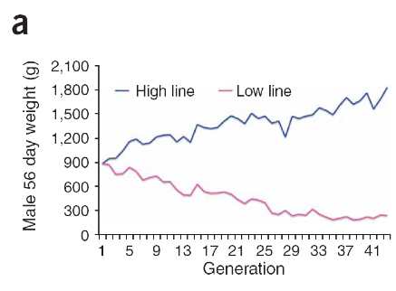

```{r setup, include=FALSE}
options(htmltools.dir.version = FALSE)
```


# Improvement of response

\begin{align*}
& R =  \frac{i h^2\sigma_P}{L} \\
\end{align*}

The form of the breeder's equation allows us to clearly see how to maximize response to selection per unit of time.


### 1. Reduce the generation interval

### 2. Increase the heritability of the trait

### 3. Increase the selection intensity

### 4. Increase additive genetic variance

---


# Measuring response to selection

Response selection of two  populations of broilers.
- One population was selected for __high__ 56-day body weight.
- One population was selected for __low__ 56-day body weight.

.pull-left[
<div align="center">

</div>
]

--

.pull-right[
<div align="center">

</div>
]


--

#### Causes of response variability to selection?

--

1. Genetic drift
2. Sampling error in estimating the generation mean
3. Differences in selection differential
4. Environmental factors


---

# Measuring response to selection

.pull-left[
<div align="center">

</div>
]

.pull-right[
#### Causes of response variability:
1. Genetic drift
2. Sampling error in estimating the generation mean
3. Differences in selection differential
4. Environmental factors
]


### How to separate these effects?

--

1. Maintain an unselected control population
2. Practice divergent selection
3. Or carry out replicated, parallel selection programs


---

# Breeder's equation

### The complex version

\begin{align*}
& R =  \frac{i h^2\sigma_P}{L} \\
\end{align*}

--

### The simple version

\begin{align*}
& R =  h^2 S \\
\end{align*}

--

The heritability, therefore

\begin{align*}
& h^2  = R/S \\
\end{align*}


---

# Realized heritability

.pull-left[

\begin{align*}
& h_R^2 =  R/S\\
\end{align*}

Shows how the response is related to the selection differential
]

--

.pull-right[
```{r, out.width='80%', fig.align='center', echo=TRUE}
S <- c(5, 6, 5, 6, 6, 10)
R <- c(3, 2, 1, 3, 2, 3)
df <- data.frame(s=cumsum(S), 
                 r=cumsum(R))

library(ggplot2)
ggplot(df, aes(x=s, y=r)) + 
  geom_point(color='red', size = 4) + 
  geom_smooth(method=lm, color='#2C3E50')
```
]

---

# Realized heritability

.pull-left[

\begin{align*}
& h_R^2 =  R/S\\
\end{align*}

Shows how the response is related to the selection differential

- The selection differential are summed across the generations plotted against the cumulative response.

- The slope of the regression line fitted to the points is equal to the average value of R/S.

]


.pull-right[
```{r, out.width='80%', fig.align='center', echo=TRUE}
S <- c(5, 6, 5, 6, 6, 10)
R <- c(3, 2, 1, 3, 2, 3)
df <- data.frame(s=cumsum(S), 
                 r=cumsum(R))

library(ggplot2)
ggplot(df, aes(x=s, y=r)) + 
  geom_point(color='red', size = 4) + 
  geom_smooth(method=lm, color='#2C3E50')
```
]

---

# Realized heritability

\begin{align*}
& h_R^2 =  R/S\\
\end{align*}

### Be cautious:

1. Reduces response to selection after first generation for high heritability traits (__Bulmer effect__)

--

  - For complex traits, each allele carries a small effect. Therefore, allele frequencies changes are gradual and change in variance through changes in individual allele frequency is slow.
  
--

  - However, what is known as the __Bulmer effect__ immediately changes the variance of complex traits subjected to one generation of selection.

---

# Realized heritability

\begin{align*}
& h_R^2 =  R/S\\
\end{align*}

### Be cautious:

1. Reduces response to selection after first generation for high heritability traits (__Bulmer effect__)


2. Systematic changes in environment or inbreeding depression will affect response.
  - comparison with control line can adjust for these effects.

--

3. Random drift affect response.
  - the magnitude of random drift can be assessed by replicated selection.


---

# Points to cover in the review:

### Novelty
- What are the main claims of the paper and how significant are they? 
- How novel is the work? Are the conclusions worth knowing? 
- Is this paper important in its discipline? 
- Are the claims properly placed in the context of the previous literature? 


### Quality
- Do the data and analyses support the authors’ claims?   
- Is the stated purpose achieved throughout the paper? 
- Would additional work improve the manuscript? 
- Is the experimentation design appropriate for the purpose of the study? 

---

# Points to cover in the review:

### Clarity
- Evaluate clarity, style and readability of the paper to scientists in the field.  
- Would you recommend the author seek the service of a professional science writer?

### Reproduciblity
- Are original data (and/or code) deposited in appropriate repositories?
- Are details of the methodology sufficient to allow the experiments to be reproduced? 

