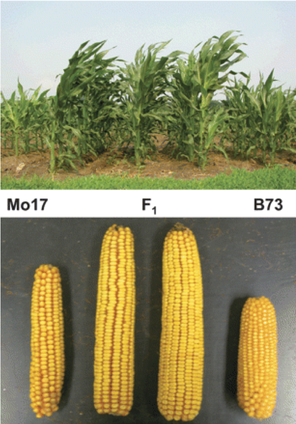
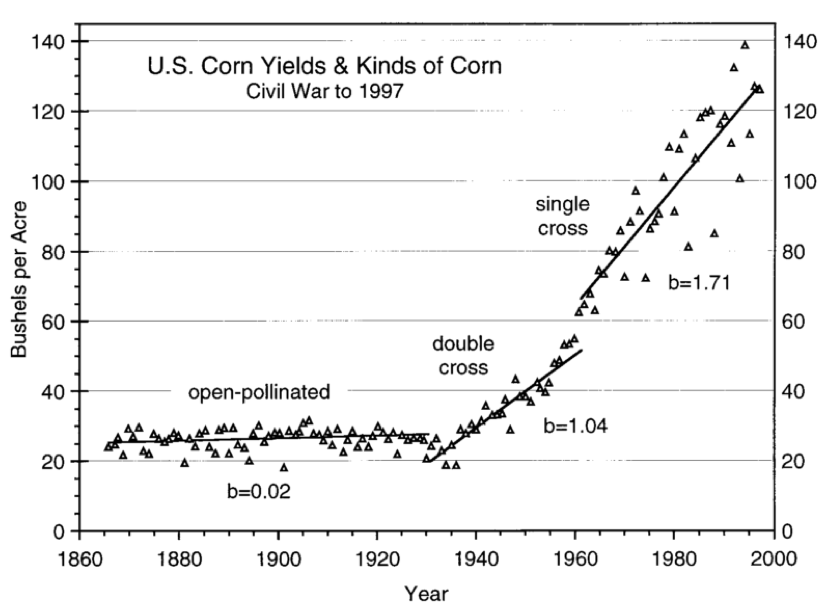
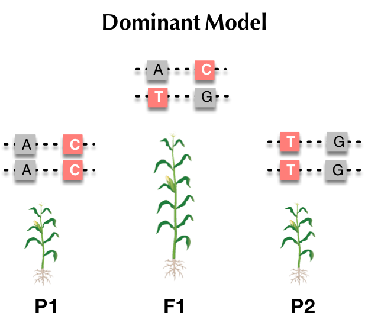
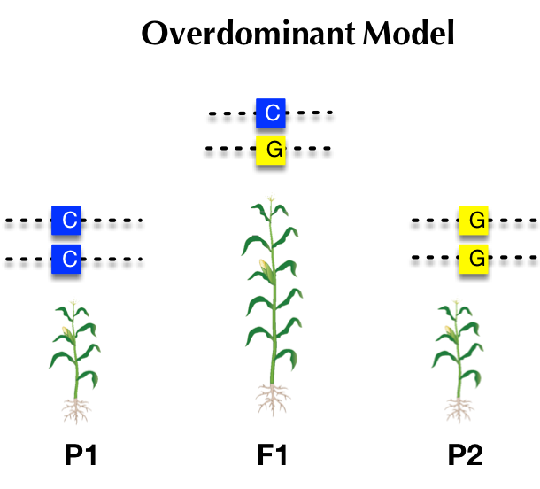
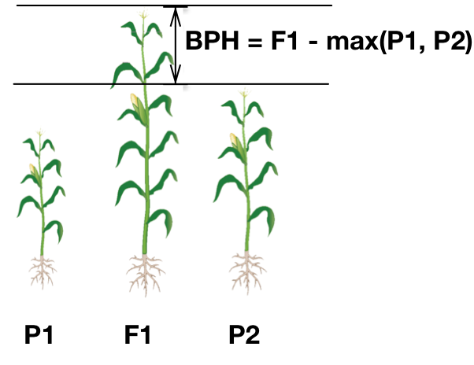
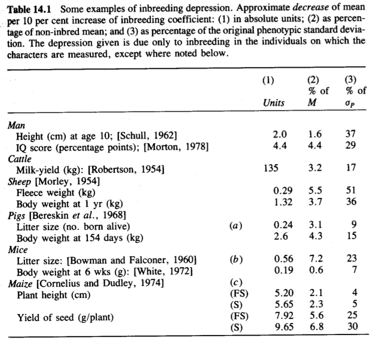
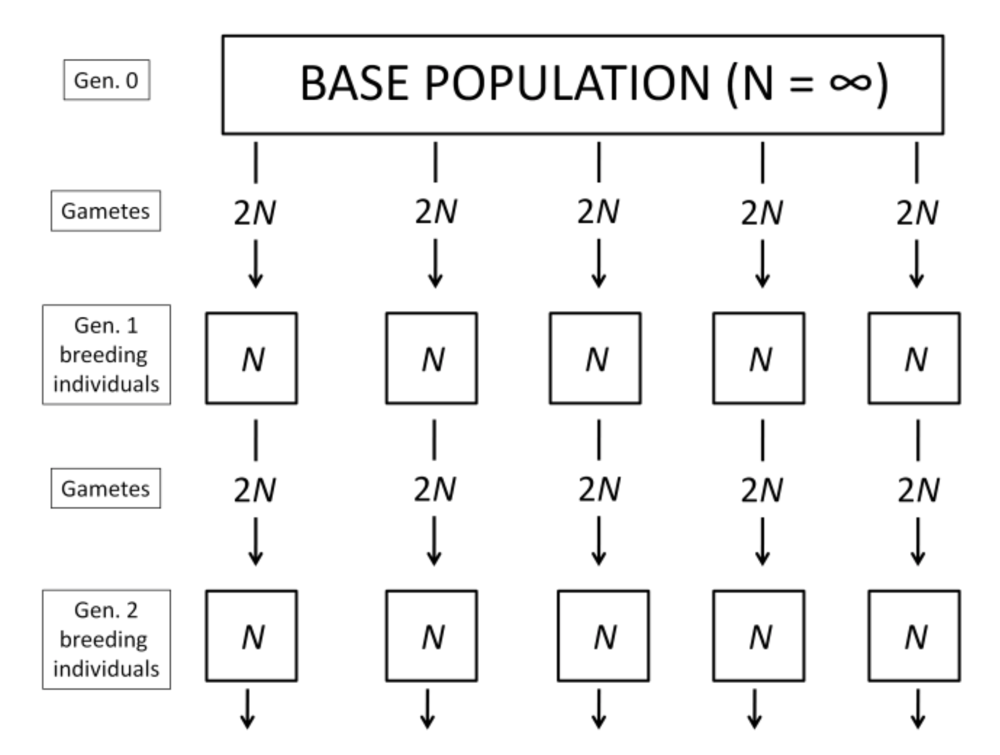

```{r setup, include=FALSE}
options(htmltools.dir.version = FALSE)
```


# Heterosis

In the absence of selection, the heterosis on crossing a set of random lines is the same as the depression upon inbreeding.

--

.pull-left[
<div align="center">

</div>
> Springer and Stupar, 2007
]

--

.pull-right[
<div align="center">

</div>
> Crow 1998
]

---

# Heterosis

.pull-left[
<div align="center">

</div>
> East, 1936; Shull, 1948; Crow, 1998; Charlesworth and Charlesworth, 1999

]

--

.pull-right[
<div align="center">

</div>
> Crow 1948; Gowen, 1952
]

--

---

- __Pseudo-overdominance__: _Cockerham and Zeng, 1996_
- __Dosage__: _Birchler et al., 2003_

---

# Measurement of heterosis

The theoretical conclusion depends upon crossing a large number of random lines from the base population.

--

Here, let's turn from the average consequences of crossing to the specific crossing of two lines.


.pull-left[
<div align="center">

</div>
]

--

### High-parental heterosis
\begin{align*}
& F_1 - Max(P_1, P_2) \\
\end{align*}

### Mid-parental heterosis

\begin{align*}
& F_1 - mean(P_1, P_2) \\
\end{align*}


---

# Mid-parental heterosis


|  | Freq ( $A_1$ )      | Freq ( $A_2$ ) |
| :-------: | :-------: | :--------: |
| $P_1$  | $p$ | $q$ |
| $P_2$  | $p'$ | $q'$ |
| $P_1 - P_2$  | $y=p-p'$ | $y=q'-q$ |
| $P_2$ re-written | $p'=p-y$ | $q'=q+y$ |

--

#### Population Mean

\begin{align*}
& M = a(p-q) + 2dpq \\
\end{align*}

--

Therefore,

\begin{align*}
M_{P_1} &  = a(p-q) + 2dpq \\
M_{P_2} &  = a(p'-q') + 2dp'q' \\
& = a(p-y - q -y ) + 2d(p-y)(q+y) \\
\end{align*}

--

The mid-parent genotypic value:

\begin{align*}
 M_\bar{P} & = 1/2(M_{P_1} + M_{P_2}) \\
& = a(p-q-y) +d[2pq + y(p-q) -y^2] \\
\end{align*}

---

# Genotypic value for F1

Frequencies:

|           | __pop1 ( $p$ )__     |  __pop1 ( $q$ )__ |
| :-------: | :-------: | :--------: |
| __pop2 ( $p-y$ )__ | $p(p-y)$  | $q(p-y)$ |
| __pop2 ( $q+y$ )__ | $p(q+y)$  | $q(q+y)$ |

--

Genotypic values:

|           | __A1__     |  __A2__ |
| :-------: | :-------: | :--------: |
| __A1__ | $A_1A_1=a$  | $A_1A_2=d$ |
| __A2__ | $A_1A_2=d$  | $A_2A_2=-a$ |


--

The mean genotypic value of the F1:

\begin{align*}
M_{F_1} & = ap(p-y) + dq(p-y) + dp(q+y) -aq(q+y) \\
& = a(p-q-y) +d[2pq + y(p-q)] \\
\end{align*}


---

# Mid-parental heterosis

\begin{align*}
& H_{F_1} = M_{F_1} - M_\bar{P} \\
\end{align*}

--

\begin{align*}
& M_{F_1} = a(p-q-y) +d[2pq + y(p-q)] \\
& M_\bar{P}  =  a(p-q-y) +d[2pq + y(p-q) -y^2] \\
\end{align*}

--

--------

\begin{align*}
& H_{F_1} = M_{F_1} - M_\bar{P} = dy^2\\
\end{align*}

Remember, $y$ is the difference in allele frequency between populations.

--

### Extending across all loci


\begin{align*}
& H_{F_1} = \sum_{i=1}^n dy^2\\
\end{align*}

---

# About MPH

\begin{align*}
& H_{F_1} = \sum_{i=1}^n dy^2\\
\end{align*}

- $y$ is the difference in allele frequency between populations.
- $n$ is the number of loci in contributing to heterosis.

--

### Three conclusions:

- __Directional dominance__ is required for heterosis

--

- Amount of heterosis __specific to each individual cross__

--

- If lines with $F=1$ crossed, then $y^2$ can be only 1 or 0. If that is the case, then $H$ is the summation of $d$s across loci with different alleles at each locus.
  - Recall that $F$ here is the inbreeding coefficient.


---

# Heterosis in F2 generation

F2 being made by random mating among the individuals of the F1.

  - Because of the random mating, allele freq in F2 will be the HW freq of the F1
  
  - Allele freq in F1, being the mean of the allele freq in the two parental popl.s $=\frac{p + p'}{2}=(p -\frac{1}{2}y)$
  
  - Similarly, another allele freq $=(q + \frac{1}{2}y)$
  
  - Plug these values in to the function to calculate population mean $M = a(p-q) + 2dpq$

--

### Population Mean and heterosis

\begin{align*}
& M_{F_2} = a(p-q-y) + d[2pq + y(p-q) - \frac{1}{2} y^2] \\
\end{align*}

--

\begin{align*}
H_{F_2} & = M_{F_2} - M_{\bar{P}} \\
& = \frac{1}{2}dy^2 = \frac{1}{2}H_{F_1} \\
\end{align*}

---
# Inbreeding decreases population mean

The change of mean from F1 to F2 may therefore be regarded as __inbreeding depression__

--

.pull-left[
Reduction of the __mean phenotypic value__ displayed by characters associated with reproductive capacity or physiological efficiency.
]

--

.pull-right[
<div align="center">

</div>
]

---

# Inbreeding decreases population mean

The change of mean from F1 to F2 may therefore be regarded as __inbreeding depression__

.pull-left[
Reduction of the __mean phenotypic value__ displayed by characters associated with reproductive capacity or physiological efficiency.
- Tends to affect traits related to __fitness and viability__ more than other traits.
]


.pull-right[
<div align="center">

</div>
]

---

# Inbreeding coefficient (F)
 
.pull-left[
- Average allele frequency across entire population does not change, they only change within each line.

- Any change in mean value must be caused by changes in __genotype frequencies__.
- As inbreeding coefficient (F) increases:
 - frequency of __heterozygotes goes down__ 
 - frequency of __homozygotes goes up__
] 

.pull-right[
<div align="center">

</div>
]

--

What we want to know is __the change in mean value__ across all lines derived from a base population.


---

# Inbreeding depression

From Chapter 3 that the genotype frequencies after inbreeding are

| Genotype | Freq      | Value | 
| :-------: | :-------: | :--------: | 
| $A_1A_1$  | $\bar{p}^2 + \bar{p}\bar{q}F$ | $a$ | 
| $A_1A_2$  | $2\bar{pq} - 2\bar{p}\bar{q}F$ | $d$ | 
| $A_2A_2$  | $\bar{q}^2 + \bar{p}\bar{q}F$ | $-a$ | 

where, $\bar{p}$ and $\bar{q}$ are the allele frequencies in the whole population.

---

# Inbreeding depression

From Chapter 3 that the genotype frequencies after inbreeding are

| Genotype | Freq      | Value |  Freq $\times$ value |
| :-------: | :-------: | :--------: | :------------:|
| $A_1A_1$  | $\bar{p}^2 + \bar{p}\bar{q}F$ | $a$ | $\bar{p}^2a + \bar{p}\bar{q}Fa$ |
| $A_1A_2$  | $2\bar{pq} - 2\bar{p}\bar{q}F$ | $d$ | $2\bar{pq}d - 2\bar{p}\bar{q}Fd$ |
| $A_2A_2$  | $\bar{q}^2 + \bar{p}\bar{q}F$ | $-a$ | $-\bar{q}^2a - \bar{p}\bar{q}Fa$ |

where, $\bar{p}$ and $\bar{q}$ are the allele frequencies in the whole population.

--

### The population mean after inbreeding is then

\begin{align*}
M_F &  =  \bar{p}^2a + \bar{p}\bar{q}Fa + 2\bar{pq}d - 2\bar{p}\bar{q}Fd -\bar{q}^2a - \bar{p}\bar{q}Fa  \\
& = a(\bar{p}^2 - \bar{q}^2) + 2d\bar{p}\bar{q}(1-F) \\
& = a(\bar{p} - \bar{q}) + 2d\bar{p}\bar{q}(1-F) \\
\end{align*}

--

Note that $M_0$ is the population mean before inbreeding.
\begin{align*}
M_0  = a(\bar{p} - \bar{q}) + 2d\bar{p}\bar{q} \\
\end{align*}

---

# The population mean after inbreeding

\begin{align*}
& M_F   =  a(\bar{p} - \bar{q}) + 2d\bar{p}\bar{q}(1-F) \\
& M_0  = a(\bar{p} - \bar{q}) + 2d\bar{p}\bar{q} \\
\end{align*}

--

Therefore,

\begin{align*}
M_F  = M_0 - 2d\bar{p}\bar{q}F \\
\end{align*}

where $M_0$ here is the population mean before inbreeding.

--

### Equation about inbreeding depression
This equation brings two important points:

- Change in population mean __only occurs when $d \neq 0$__.

- A locus contributes to inbreeding depression most __when $p = q = 0.5$__.

---

# Combined effects of all loci

\begin{align*}
M_F & = \sum a(\bar{p} - \bar{q}) + 2\sum d\bar{p}\bar{q}(1-F) \\
 & = \sum a(\bar{p} - \bar{q}) + 2\sum d\bar{p}\bar{q} - 2F\sum d\bar{p}\bar{q} \\
\end{align*}

### Equation interpretation

- This means that a preponderance of dominance in one direction is needed.
 - e.g., the alleles that increase the trait value need to be dominant more than recessive.

- In the absence of epistasis, $M_F$ declines linearly with increasing $F$.
