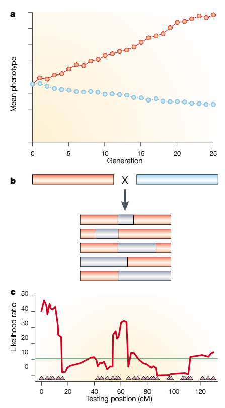

```{r setup, include=FALSE}
options(htmltools.dir.version = FALSE)
```

# Mapping quantitative trait loci

In past chapters dealing with breeding value and statistics like heritability and genetic correlation, we lumped all the QTLs for a trait together into a total, aggregate genotypic value.

--

A __quantitative trait locus (QTL)__ is a genomic region generating variation for a quantitative trait.
  - All loci affecting a quantitative trait are “quantitative trait loci”.
  
--

### Identifying QTL brings in new opportunities for applications:

  - To produce the preferred genotype
  
  - To understand the molecular mechanism at gene level
  
  - To locate the direct target for gene editing

---
# QTL mapping or linkage mapping

Crosses between individuals that differ genetically for the trait offer an ideal situation for mapping QTL.

--

.pull-left[
- The __linkage disequilibrium__ is maximized in an F1 between two parental lines
  
- LD is reduced slowly with subsequent generations of intermating.
  - Using F2 or recombinant inbred lines (RIL)

- This generation of linkage between loci that different between the two parental lines is exploited for QTL mapping. Therefore, QTL Mapping is also referred to as __linkage mapping__.
]  

.pull-right[
<div align="center">

</div>
]

---
# Linkage Mapping

Linkage mapping refers to a set of steps taken to associate chromosomal intervals, and ultimately genes to genetic variation of traits.

 - But is very unlikely to map to gene level due to the low mapping resolution 

--

### Steps for QTL mapping include:
  - 1) Create a segregating population
  - 2) Genotype individuals within this population with molecular markers
  - 3) Phenotype the individuals
  - 4) Apply statistical models to associate the markers to the phenotypic variation

--

The statistical approaches range from simple techniques such as __ANOVA__ to complex __Bayesian models__ capable of zeroing in on QTL-by-QTL interactions.
  

---
# Single marker analysis

.pull-left[
<div align="center">

</div>

- Here, $c$ is the recombination rate.
]

--

.pull-right[

#### Mean of the __AC__ genotype:
\begin{align*}
& \frac{1/2(1-c)\times d + 1/2c \times a}{1/2}\\
& = d(1-c) + ca \\
\end{align*}

#### Mean of the __CC__ genotype:
\begin{align*}
& \frac{1/2(1-c)\times a + 1/2c \times d}{1/2}\\
& = a(1-c) + cd \\
\end{align*}

#### Difference between __AC__ and __CC__ value:
\begin{align*}
& d(1-c) + ca - (a(1-c) + cd)\\
& = (d-a)(1-2c) \\
\end{align*}

]

---

# BC1 example

Conduct __ $t$-test__ to test the null hypothesis that the mean values of genotype __AC__ and __CC__ are the same.

--
### A $t$-test would be

\begin{align*}
t = \frac{\hat{u}_{AC} - \hat{u}_{CC}}{\sqrt{\frac{\sigma_{AC}^2}{N_{AC}} + \frac{\sigma_{CC}^2}{N_{CC}} } } \\
\end{align*}

- where $\sigma^2$ is equal to the within sample variance for each genotype
- $N$ is equal to the number of individuals in each genotype class

--

#### If we get a __p-value < 0.05__: 
  - Reject the null hypothesis that the two genotypes means are the same.
  
  - Or the means are different; in the other words, the marker is __linked with a QTL__.

---

# What is the QTL effect ( $a$ )?

\begin{align*}
& \hat{u}_{AC} - \hat{u}_{CC} = (d-a)(1-2c) \\
& a = d - \frac{\hat{u}_{AC} - \hat{u}_{CC}}{1-2c} \\
\end{align*}

Assume no dominance at this locus:

\begin{align*}
& a = \frac{\hat{u}_{CC} - \hat{u}_{AC}}{1-2c} \\
\end{align*}

---
# Shortcomings of the single-marker test

### The QTL effect of $a$

\begin{align*}
& a = \frac{\hat{u}_{CC} - \hat{u}_{AC}}{1-2c} \\
\end{align*}

- It is important to note that these single-marker tests confound __the QTL effect__ and __the recombination frequency__ between the marker and QTL.

- For this reason, the calculated marker effects and significance do not really tell you how far or how close a marker is to a QTL.
  
--

- This test does not tell you if __one QTL__ is controlling the trait, or __two or more linked QTLs__.


---

# Sorghum example (F2 population)

.pull-left[
<div align="center">

</div>

]

---

# Sorghum example (F2 population)


<div align="center">

</div>

---

# Sorghum example (F2 population)


<div align="center">

</div>

---

# Frequencies in F2

The frequencies of the resulting F2 individuals are simply calculated by multiplying together the frequencies of the gametes united to form those individuals.

Here we use __M__ and __m__ represent molecular marker and __Q__ and __q__ represent QTL.

| Genotype | Value      | Frequency |
| :-------: | :-------: | :--------: | 
| $MMQQ$  | a | $\frac{1}{4}(1-c)^2$ |
| $MMQq$  | d | $\frac{1}{2}c(1-c)$ |
| $MMqq$  | -a | $\frac{1}{4}c^2$ |
| $MmQQ$  | a | $\frac{1}{2}c(1-c)$ |
| $MmQq$  | d | $\frac{1}{2}((1-c)^2+c^2)$ |
| $Mmqq$  | -a | $\frac{1}{2}c(1-c)$ |
| $mmQQ$  | a | $\frac{1}{4}c^2$ |
| $mmQq$  | d | $\frac{1}{2}c(1-c)$ |
| $mmqq$  | -a | $\frac{1}{4}(1-c)^2$ |

---

# Frequencies in F2


- Because we only see the marker genotypes and not the QTL genotypes, the expected means of the different genotypes are only relevant.

- The expected values are calculated simply by taking the __weighted average of the genotypic values__ of the underlying QTL genotypes.


| Genotype  | Expected value |
| :-------: | :-------: | 
| $MM$  |  $a(1-2c) + 2dc(1-c)$ |
| $Mm$  |  $d((1-c)^2 + c^2)$ |
| $mm$  |  $-a(1-2c) + 2dc(1-c)$ |

--

After some algebra, it can be shown that the differences between the genotypic means in an F2 population are as follows:


\begin{align*}
& \mu_{MM} - \mu_{mm} = 2a(1-2c) \\
& \mu_{Mm} - \frac{\mu_{MM} - \mu_{mm}}{2} = d(1-2c)^2 \\ 
& \mu_{Mm} - \mu_{mm} = (a+d)(1-2c) \\ 
\end{align*}


---
# More on single-marker analysis

Markers are tested one by one for their effects on a trait.

--

This can be done by:

- A __ $t$-test__ contrasting the mean values of two genotypes.

- An __ $F$-test__ on all three genotypes to determine if difference in trait values exist among the genotypes.

- __Regression__ of the trait value on the number (dosage) of marker alleles.

---
# Regression approach

The __regression of phenotypic values on allele dosage__ can be represented as:

\begin{align*}
y_j = \mu + bx_j + e_j
\end{align*}

--

- where $y_j$ is the phenotypic value for individual $j$,
- $\mu$ is the population mean,
- $b$ is the regression coefficient,
- $x_j$ represents the number of a particular allele. For example, if $x_j$ was set to represent the number of __ $M$ allele__ at a marker locus: 
  - $x_j =0$ for an $mm$ individual,
  - $x_j =1$ for an $Mm$ individual,
  - $x_j =2$ for an $MM$ individual.
- $e_j$ is the residual error for individual $j$.

--

If the regression coefficient is __significantly different from zero__, there is evidence for QTL near this marker.

---
# Simulating a QTL mapping experiment


```{r, out.width='50%', fig.align='center', echo=TRUE}
library(qtl)
set.seed(12347)
# Five autosomes of cM length 50, 75, 100, 125, 60
L <- c(50, 75, 100, 125, 60)
map <- sim.map(L, L/5+1, eq.spacing=FALSE, include.x=FALSE)
# Simulate a backcross with two QTL
a <- 0.7
mymodel <- rbind(c(1, 40, a), c(4, 100, a))
pop <- sim.cross(map, type="bc", n.ind=200, model=mymodel)
plot.map(pop)
```


---

# Simulating a QTL mapping experiment

#### Checking phenotypic distribution

```{r, out.width='50%', fig.align='center', echo=TRUE}
hist(pop$pheno$phenotype, main="simulated phenotype", 
     breaks=50, xlab="Phenotype", col="#cdb79e")
```


---
# Single-marker analysis

```{r, out.width='50%', fig.align='center', echo=TRUE}
# single-QTL scan by marker regression with the simulated data
out.mr <- scanone(pop, method="mr")

# plot of marker regression results for chr 4 and 12
plot(out.mr, chr=c(1,2,3,4,5), ylab="LOD Score")
```


---
# Plot QTL effect

```{r, out.width='50%', fig.align='center', echo=TRUE, warning=FALSE}
# summary of out.mr
summary(out.mr, threshold=3)

effectplot(pop, mname1="D1M4", main="Chr1")
```


---
# Limitation of single marker analysis

The problem with above analysis is that QTL effect is completely __confounded with QTL position__.

\begin{align*}
\mu_{Mm} - \mu_{mm} = (a+d)(1-2c) \\ 
\end{align*}


--
For example, the expected difference between two genotypes is the function of $c$.

Therefore, we do not know if a significant difference is 
  - Due to a small QTL right next to the marker
  
  - Or a large QTL further away from the marker

--

Also, there is no way to tell if a significant difference is due to
  - One large QTL
  - several smaller QTLs cluster together
  


