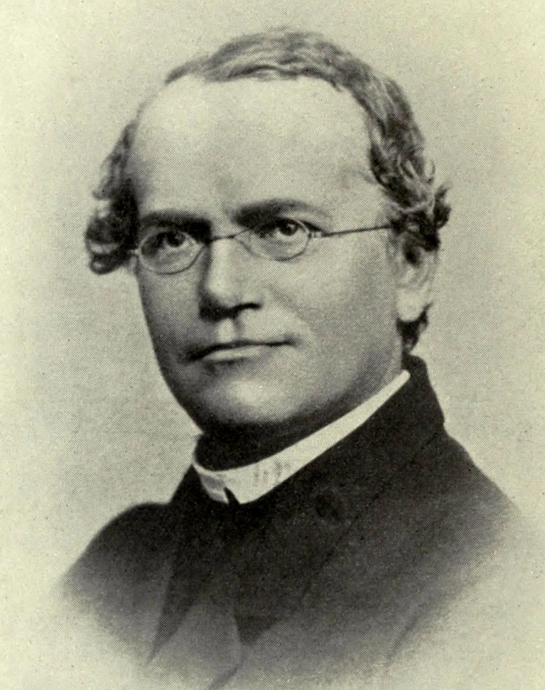
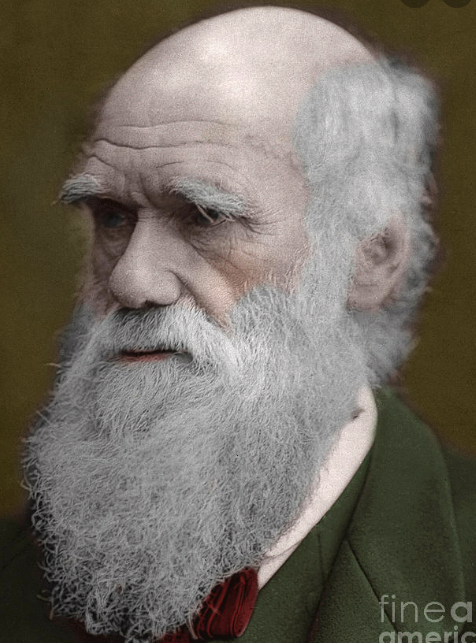
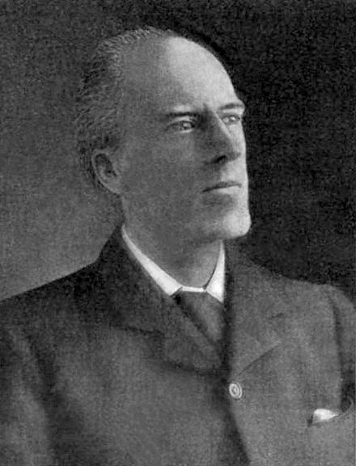
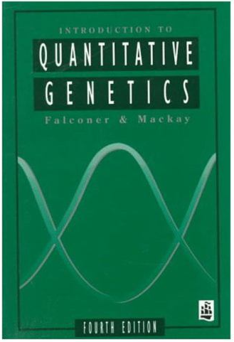
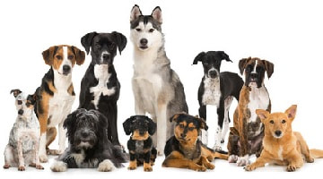

```{r setup, include=FALSE}
options(htmltools.dir.version = FALSE)
```

# About the course

### Course [website](https://jyanglab.com/agro931/)
  - Online HTML slides
  - Important dates

### Canvas 
  - Announcements
  - Handouts 
  - homework assignments (keys)

### Course format
  - In-person lecture session (with the Zoom option if needed)
  - In-class computational demo (Using [R software](https://www.r-project.org/) for statistical computing)
  
---
# Scope of the Course

### Population genetics

Study the genetic composition of natural populations and its evolutionary causes and consequences.

- `Popgen` is the study of **evolution**.

- The language of `popgen` is **Mathematics**.

--

### Quantitative genetics 

Study of the genetic basis of phenotypic variation.

- `Quantgen` is the study of the **complex trait**, or **phenotype**.

- The language of `Quantgen` is **Statistics**.

--

- [AGRO-932](https://jyanglab.com/agro932/) (Biometrical genetics and plant breeding) 
  - Spring of every even-numbered year (next offfer: Spring 2024)

---
# Population genetics

.pull-left[
<div align="center">

</div>
- __Gregor Mendel__, the founder of modern genetics.
]

.pull-right[
<div align="center">

</div>
- __Charles Darwin__, the founder of modern evolution.
]

--

Population genetics emerged from early efforts to reconcile Mendelian genetics with Darwinian thought.

- Many of the important ideas and mathematical models emerged before the 1940s
- Before DNA was discovered and yet the usefulness of these models has not diminished

---
# Quantitative genetics 

It almost synonymous with __statistics__!

.pull-left[
<div align="center">

</div>
- __R. A. Fisher__ is a founder of quantitative genetics but also of analysis of variance and randomization procedures in statistics.
]

.pull-right[
<div align="center">

</div>
- The early geneticist __Karl Pearson__ originated the concepts of regression and correlation.
]

--

In the 2nd part of the course, we will be deeply involved with the statistical evaluation of the basic quantitative genetic models.


---

# Texts and other readings

Falconer & Mackay, 1996 Introduction to Quantitative Genetics. Fourth Edition.

<div align="center">

</div>

### __Study the material before class meets.__
- Pay attention to the problems in the textbook. 
- Note that problems and solutions are presented at the end of the text.


---

# Definitions

#### Locus (plural: loci)
A __locus__ is a specific spot in the genome: maybe an entire gene, or a single base pair. 
- such as, chr1 from 1001-1005: A A __T__ C G. 

--

#### Alleles
At each genetic locus, there may be multiple genetic variants segregating in the population
--- these are known as __alleles__.

- allele 1: A A __T__ C G. 
- allele 2: A A __C__ C G. 

Allele transfers from one generation to next

--

#### Genotype
- A __Genotype__ is a pair of alleles
Genotype is not transferred from one generation to the next due to segregation of alleles.


---

# Population

A population is a group of interbreeding individuals
- Same species
- Close proximity
- Share a gene pool

--

.pull-left[
<div align="center">

</div>
]

.pull-right[
- dog 1: AA AA __TT__ CC GG 
- dog 2: AA AA __CC__ CC GG
- dog 3: AA AA __CT__ CC GG 
- dog 4: AA AA __CT__ CC GG
- dog 5: AA AA __CC__ CC GG
assuming 2 alleles per locus
]

- Each offspring = random sample of one egg and one sperm from the gene pool
- The probability of sampling a particular allele = the frequency of that allele in the gene pool, assuming equal fitness, random mating, ...

---

# Allele and genotype frequencies

.pull-left[
<div align="center">

</div>
]

.pull-right[
- dog 1: AA AA __TT__ CC GG 
- dog 2: AA AA __CC__ CC GG
- dog 3: AA AA __CT__ CC GG 
- dog 4: AA AA __CT__ CC GG
- dog 5: AA AA __CC__ CC GG
]

Consider a diploid locus segregating for two alleles ( $A_1$ and $A_2$ ).
We usually define the less frequent allele (or minor allele) as the $A_1$ allele.

### Allele frequency ( $p$ and $q$ ) 
Frequency/proportion of alleles of a particular identity at one locus

### Genotype frequency ( $f_{11}$, $f_{12}$, $f_{22}$ )
Proportion of individuals with a specific genotype (combination of alleles)

---

# Allele and genotype frequencies

.pull-left[
<div align="center">

</div>
]

.pull-right[
- dog 1: AA AA __TT__ CC GG 
- dog 2: AA AA __CC__ CC GG
- dog 3: AA AA __CT__ CC GG 
- dog 4: AA AA __CT__ CC GG
- dog 5: AA AA __CC__ CC GG
]

Let $n$ be the total number of individuals in the population. Genotype frequency of __TT__ is:

```{r}
n = 5
n11 = 1
f11 = n11/n
f11
```

The frequency of minor allele $A_1$ in the population is then given by

\begin{align*}
p = \frac{2n_{11}+n_{12}}{2n} = f_{11} + \frac{1}{2}f_{12}
\end{align*}

---

# Relationship between allele and genotype frequencies

```{r fig.height=4, fig.width=4}
p = seq(0, 1, by=0.01)
q = 1 - p
f11 <- p^2
f12 <- 2*p*q
f22 <- q^2

plot(f11, type="l", col="black", xlab="p", ylab="Genotype Frequency")
lines(f12, col="red")
lines(f22, col="blue")
```
---

# Relationship between allele and genotype frequencies

```{r echo=FALSE, fig.height=4, fig.width=4}
p = seq(0, 1, by=0.01)
q = 1 - p
f11 <- p^2
f12 <- 2*p*q
f22 <- q^2

plot(f11, type="l", col="black", xlab="p", ylab="Genotype Frequency")
lines(f12, col="red")
lines(f22, col="blue")
```

- Maximum frequency of heterozygotes occurs when p = q = 0.50

- Frequency of heterozygotes cannot be greater than 0.50

- When allele frequency is low, that allele occurs predominantly in heterozygotes

