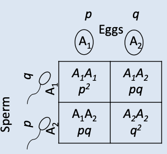

```{r setup, include=FALSE}
options(htmltools.dir.version = FALSE)
```

# Hardy-Weinberg Equilibrium

#### A population is in HWE if it has constant allele and genotype frequencies from generation to generation

- Allele frequencies in parents predict allele and genotype frequencies in offspring

--

### Caveats

  - a large, randomly-mating population 
  - no selection, no mutation, no migration, diploid, etc.
  
---

# In Hardy-Weinberg Equilibrium

If allele frequencies in parent population = $p$ & $q$, 
then, genotype frequencies in progeny after random mating are:

\begin{align*}
(p + q)^2 = p^2 + 2pq + q^2
\end{align*}

The array of genotypes in progeny equals the square of the parental gametic array. 

- (sum of allele frequencies)2 = (sum of genotype frequencies)

.pull-left[
<div align="center">

</div>
]


Allele frequency in progeny equals allele frequency in parents.

---
# For HWE to hold true

### NO

- Migration
- Mutation 
- Selection

### YES

- Random Breeding
- Large Population Size

--

--------

- If any condition is not met, allele and genotypic frequencies in the population may (will) change.
- With respect to one autosomal locus, __HWE is attained after one generation of random mating__.

