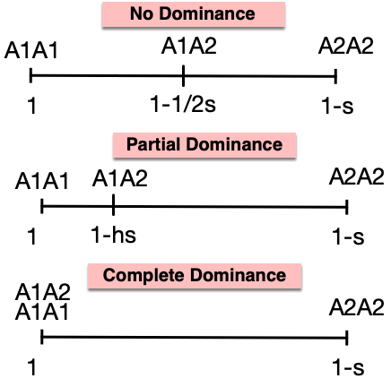

```{r setup, include=FALSE}
options(htmltools.dir.version = FALSE)
```

---

# Selection

Selection occurs due to differences in __viability__ and __fertility__ (natural or artificial)

--

The contribution of offspring to the next generation is called the __fitness__ of the individual, or _selective value_.

--

### If fitness varies by genotype, selection will occur

- __Directional__: favors phenotypes at one extreme of distribution range

- __Stabilizing__: favors intermediate phenotypes

- __Disruptive__: favors phenotypes at both extremes

---

# Selection (and Fitness)


- Selection coefficient ( $s$ ) 
  - is the proportionate __REDUCTION__ in gametic contribution of a particular genotype _compared to the standard genotype_

- Relative fitness: $w = 1 -s$
  - Most fit is set to 1

--

---------
#### For example

-  $AA$, $Aa$, and $aa$ have survival of 0.75, 0.75, and 0.5, respectively

--

- Then, the relative fitness is 1.0, 1.0, and 0.67 (0.5/0.75)

--

---

# Selection with dominance

- Dominance needs to be accounted for when quantifying allele frequency changes with selection.

- The degree of dominance influences the relative fitness of alleles. 

- Here dominance is with respect to fitness only.

<div align="center">

</div>

---

# Selection with dominance

Here, $h$ is the __level of dominance__

- It is the heterozygous effect from the fitness of the heterozygote relative to the difference between homozygotes.

--

In the example, __ $A_1$ is the most favorable allele__, conferring the greatest degree of fitness

| Degree of dominance | $A_1A_1$   | $A_1A_2$   | $A_2A_2$   |
| :-------: | : ------ : | :-------: | :-------: |
| Additive           | $1$    | $1 - s/2$    | $1 - s$     | 
| Partial dominance   |  $1$        |  $1 - hs$        |  $1 -s$   | 
| Complete dominance | $1$   | $1$    | $1 - s$    |
| Overdominance      | $1 -s_1$ | $1$ | $1-s_2$ | 


---

# Selection against the recessive allele

- Gametic contribution is the product of genotype freq and fitness

|                    | $A_1A_1$   | $A_1A_2$   | $A_2A_2$   |
| :-------: | : ------ : | :-------: | :-------: |
| Initial frq           | $p^2$    | $2pq$    | $q^2$     | 
| Coefficient of selection | $0$   | $0$      | $s$       |
| Fitness ( $w$ )   |  $1$        |  $1$        |  $1-s$   | 
| Gametic contribution | $p^2$   | $2pq$    | $q^2(1-s)$    |

---

# Selection against the recessive allele

- Gametic contribution is the product of genotype freq and fitness

|                    | $A_1A_1$   | $A_1A_2$   | $A_2A_2$   | Total |
| :-------: | : ------ : | :-------: | :-------: | :-------: |
| Initial frq           | $p^2$    | $2pq$    | $q^2$     |  $1$        |
| Coefficient of selection | $0$   | $0$      | $s$       |             |
| Fitness ( $w$ )   |  $1$        |  $1$        |  $1-s$   |            |
| Gametic contribution | $p^2$   | $2pq$    | $q^2(1-s)$    |  $1-sq^2$ |


--

### After one generation of selection against recessive

Note that there has been a proportionate loss of $sq^2$ due to the selection.

The $A_1$ allele freq, 


\begin{align*}
p_1 & = \frac{(2p^2 + 2pq)/2}{p^2 + 2pq + q^2(1-s)} = \frac{p(p+q)}{1 -sq^2}\\
& = \frac{p}{1- sq^2} \\
\end{align*}

---

# Selection

### After one generation of selection against recessive


\begin{align*}
p_1  = \frac{p}{1- sq^2} \\
\end{align*}

### Change in allele freq after one generation

\begin{align*}
\Delta p & = p_1 - p_0  = \frac{p}{1- sq^2} - p\\
& = \frac{p-p(1-sq^2)}{1-sq^2} \\
& = \frac{spq^2}{1 - sq^2}
\end{align*}

--

Then,

\begin{align*}
\Delta q & = -\Delta p = -\frac{spq^2}{1 - sq^2}
\end{align*}

---

# Simulation for selection against recessive

```{r fig.align='center', fig.height=5}
deltap <- function(s, p){
  q <- 1-p
  return((s*p*q^2)/(1 - s*q^2))
}

p <- seq(0, 1, by=0.01)
plot(p, deltap(s=0.4, p), type="l", lwd=3, col="red", xlab="p", ylab="|p1 - p0|")
lines(p, deltap(s=0.2, p), lty=2, lwd=3, col="blue")
```


---

# Effectiveness of Selection

### Initial allele freq

  - Most effective at intermediate freq
  
  - Inefficient when targeted recessive allele is rare

### Degree of dominance

---

# Allele freq change over time

- $p_0$ = current frequency
- $p_t$ = frequency at future time
- $t$ = number of generations

--
----------


### Selection for Dominant allele ( $s=1$ )

(Same as selection against recessive genotype)

\begin{align*}
p_1 = & \frac{p}{1 - sq^2} \\
= & \frac{1-q}{(1+q)(1-q)} = \frac{1}{1+q}
\end{align*}


--

\begin{align*}
p_2 = & \frac{p_1}{1 - sq^2_1} \\
= & \frac{1-q_1}{(1-q_1^2)} = \frac{1 - (1-p_1)}{1 - (1-p_1)^2} = \frac{\frac{1}{1+q}}{1 - (\frac{q}{1+q})^2}
= \frac{1+q}{1+2q}
\end{align*}


---

# Allele freq change over time

\begin{align*}
p_1  & = \frac{1}{1+q} \\
p_2  & = \frac{1+q}{1+2q} \\
p_3  & = \frac{1+2q}{1+3q} \\
\end{align*}


--

A pattern emerges ...

\begin{align*}
p_t  & = \frac{1+(t-1)q_0}{1+tq_0} \\
q_t  & = 1- p_t = \frac{q_0}{1+tq_0} \\
\end{align*}

--

The generations required to move from $p_0$ to $p_t$ is the same as to move from $q_0$ to $q_t$

\begin{align*}
1 + tq_0 & = \frac{q_0}{q_t} \\
t & = \frac{q_0 - q_t}{q_tq_0} = \frac{1}{q_t} - \frac{1}{q_0}
\end{align*}

---

# Simulation for selection against recessive

```{r fig.align='center', fig.height=5}
qt <- function(q0, t){
  return(q0/(1+t*q0))
}

t <- 1:50
plot(t, qt(0.95, t), type="l", lwd=3, col="red", xlab="generations", ylab="q", ylim=c(0, 1))
```


