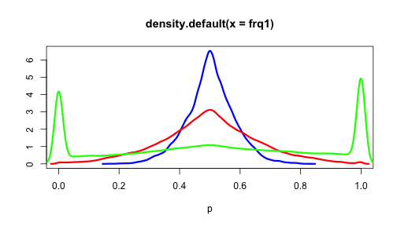
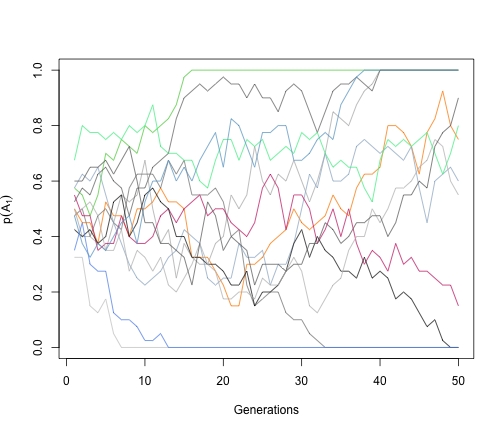

```{r setup, include=FALSE}
options(htmltools.dir.version = FALSE)
```

# Consequences of small population

In the absence of migration, mutation, or selection, what is the allele freq over time?

--

### Random drift

- Leads to allele fixation

- Leads to genetic differentiation and local group (or geographic isolation)

- Reduces diversity and becomes more alike in genotype in local groups

--

### Increased homozygosity

- Reduces heterozygotes and results in inbreeding


---

# Fixation

<div align="center">

</div>

- Over time, each sub-population fluctuates in allele freq and they become more spread apart

- Eventually, each line will become fixed

---

# After fixation

### Mean

- #### The mean allele freq of the lines is still $p_0$ and $q_0$

- #### $p_0$ is the fraction of lines expected to be fixed for $A_1$ and $q_0$ is the fraction fixed for $A_2$

--

### Variance

- #### $V(p) = V(q) = p_0q_0(1-(1-\frac{1}{2N})^t) = p_0q_0$


---

# Genotype frequencies

<div align="center">

</div>

--

- Dispersion via drift leads to increased variation among lines and less within each line

--

- For the population as a whole, this leads to __increased homozygosity__
(decreased heterozygosity)
  - Homozygotes are gained at the expense of heterozygotes

---

# Genotype frequencies

- Genotype frequencies can be deduced from the variance in allele frequencies

| Genotype | Frequency in whole population   |
| :-------: | : ------ : | 
| $A_1A_1$  | $p_0^2 + V(q)$    | 
| $A_1A_2$  | $2p_0q_0 - 2V(q)$   |  
| $A_2A_2$  | $q_0^2 + V(q)$   | 

--

- Homozygotes are gained (equally to $p$ and $q$) at the expense of heterozygotes


---

# Inbreeding

The mating together of individuals that are related to each other by ancestry.

- For an unrelated ancestry, one individual will have two parents, four grand-parents, eight great-grandparents, ...

- $t$ generations back it has $2^t$ ancestors ( $2^{20}$ > 1 million)

--

- In small populations, individuals are related to each other through common ancestors in the more or less remote past.

---

# Consequences of Inbreeding


### Inbred individuals (offspring produced by inbreeding) 

- may carry two alleles at a locus that are __replicates__ of one and the same allele in a previous generation.

--

### Identical by descent (IBD)

- Individuals carry two alleles that have originated from the replication of one single allele in a previous generation.

- IBD provides a basis for the measurement of the relationship between the mating pairs.

---

#  Inbreeding coefficient ( $F$ )

Is the probability that the two alleles at any locus in an individual are __IBD__.

--

### The range of $F$

$F$ measure the degree of relationship between the individual's parents


- If parents at any generations have mated at random, then $F=0$

- The higher the level of inbreeding the closer the $F$ approaches 1


---

# Inbreeding in the idealized population

Considering hermaphrodite marine organism, capable of self-fertilization, shedding eggs and sperm into the sea.

.pull-left[
<div align="center">

</div>
]

--

.pull-right[
- In based population, alleles at a locus are __non-identical__

- $N$ individual, each shedding equal numbers of gametes

- $2N$ different sorts of alleles

- Any gamete has a $1/2N$ chance to unit with another of the same sort
  - IBD zygotes: $1/2N$
  - Remaining proportion: $1 - 1/2N$
]

---

# Inbreeding after t generations

\begin{align*}
F_t = \frac{1}{2N} + (1-\frac{1}{2N})F_{t-1}
\end{align*}

--

### Part1: Increment

Attributable to the new inbreeding

### Part2: Reminder

Attributable to the previous inbreeding and having the inbreeding coefficients of the previous generation.


---

# Rate of inbreeding

- Let "new inbreeding" 
  - $\frac{1}{2N} = \Delta F$
  - (Remember this when we get to variance)

--

### $F_t$ expresses as a function of $\Delta F$

\begin{align*}
F_t & = \frac{1}{2N} + (1-\frac{1}{2N})F_{t-1} \\
& = \Delta F + (1- \Delta F)F_{t-1} \\
\end{align*}

--

### Rewritten the equation

\begin{align*}
\Delta F = \frac{F_t - F_{t-1}}{1 - F_{t-1}}
\end{align*}

---

# Panmictic (random mating) index

Using a symbol $P$ for the complement of the inbreeding coefficient $1-F$
  - Random mating index or panmictic index
  - $P = 1 -F$


--

------------

\begin{align*}
\Delta F & = \frac{F_t - F_{t-1}}{1 - F_{t-1}} \\
& = \frac{(F_t -1) - (F_{t-1} - 1)}{1-F_{t-1}} \\
&= \frac{-P_t + P_{t-1}} {P_{t-1}}
\end{align*}

--

------------

\begin{align*}
& \frac{P_t}{P_{t-1}} = 1 - \Delta F \\
\end{align*}
  
Thus, the P index is reduced by a constant proportion each generation.  

---

# Panmictic (random mating) index

The P index is reduced by a constant proportion each generation.  
\begin{align*}
& \frac{P_t}{P_{t-1}} = 1 - \Delta F \\
\end{align*}
  
--

- At generation 2:

\begin{align*}
& \frac{P_t}{P_{t-2}} = (1 - \Delta F)^2 \\
\end{align*}

- From gen 0 to gen t:

\begin{align*}
& \frac{P_t}{P_0} = (1 - \Delta F)^t \\
& P_t = (1 - \Delta F)^t {P_0}\\
\end{align*}


--

--------

- In base population, $F=0$, so $P=1$
- Then, inbreeding in any generation t, relative to the base population is

\begin{align*}
& F_t = 1- (1 - \Delta F)^t \\
\end{align*}

---

# Variance of allele frequency

- Previously, $V(p) = V(q) = \frac{p_0q_0}{2N}$ under random sampling

- New inbreeding: $\Delta F = \frac{1}{2N}$

--

So, in terms of inbreeding

\begin{align*}
V(p) = V(q) = p_0q_0 \Delta F
\end{align*}

--

Following the relationship after t generations

\begin{align*}
V(p_t) = V(q_t) = p_0q_0 F_t
\end{align*}

--

Back to our previous definition

\begin{align*}
V(p_t) = V(q_t) = p_0q_0 (1 - (1 - \frac{1}{2N})^t)
\end{align*}

- Remember that $F_t = 1- (1 - \Delta F)^t$
- Then $V(p_t) = V(q_t) = p_0q_0 F_t$

--

---------------

- $\Delta F$ is the rate of dispersion
- $F$ is the cumulative effect of drift

---

# Genotype Frequencies

- Change in allele freq due to drift (sampling process)

| Genotype | Frequency in whole population   |
| :-------: | : ------ : | 
| $A_1A_1$  | $p_0^2 + V(q)$    | 
| $A_1A_2$  | $2p_0q_0 - 2V(q)$   |  
| $A_2A_2$  | $q_0^2 + V(q)$   | 

--

- Now, same thing in terms of inbreeding:

| Genotype | Base pop.   | Change due to F |
| :-------: | : ------ : | : ------ : | 
| $A_1A_1$  | $p_0^2$    | $+p_0q_0 F$ |
| $A_1A_2$  | $2p_0q_0$   |  $-2p_0q_0 F$ |
| $A_2A_2$  | $q_0^2$   | $+p_0q_0 F$ |

---

# Genotype Frequencies

- But, now we know more, if we can distinguish between IBD and IBS (identity by state)


| Genotype | Base pop.   | Change due to F | Independent (HWE) | Identical
| :-------: | : ------ : | : ------ : | : ------ : | : ------ : | 
| $A_1A_1$  | $p_0^2$    | $+p_0q_0 F$ | $= p_0 (1-F)$ |  $+p_0 F$ |
| $A_1A_2$  | $2p_0q_0$   |  $-2p_0q_0 F$ |  $= 2p_0q_0(1-F)$ |   |
| $A_2A_2$  | $q_0^2$   | $+p_0q_0 F$ | $= q_0^2 (1-F)$ |  $+q_0 F$ |

- A deficiency of heterozygotes may be the indication that it is a subdivided population.