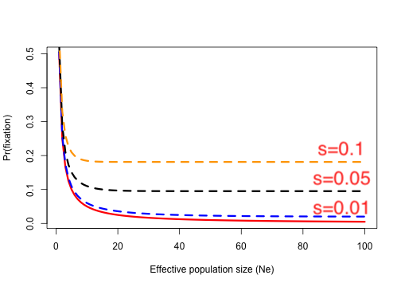

```{r setup, include=FALSE}
options(htmltools.dir.version = FALSE)
```

# Systematic and dispersive processes

### Systematic process: mutation, migration, and selection

- Bring the allele frequencies to stable equilibria at particular value


--

### Dispersive process - drift

- Scatter the allele frequencies away from these equilibrium

- Eventually lead to all alleles being either fixed or lost


---

# Non-recurrent neutral mutation

### Infinite allele model (IAM) of mutation

  - Probability of the same mutation occurs more than once is very, very, very small
  
--

### Neutral model (new allele has no effect on fitness)

  - Probability new allele becomes fixed in the absence of selection = $\frac{1}{2N}$
  
  - If $\mu$ is mutation rate at the locus, total number of new mutants = $2N\mu$
  
  - Probability of a new mutant being fixed $= 2N \mu \times \frac{1}{2N} = \mu$

> Kimura, 1983


---

# Effective neutral mutation

#### Probability of fixation of new mutation is influenced by selection 

- Favorable (beneficial) or unfavorable (deleterious)

--

\begin{align*}
Pr(fixation) \approx \frac{1}{2N_e}
\end{align*}
> Kimura, 1983

- __Effective neutral mutation__ is one  a coefficient of selection $s$ against it
  - Range from $s=0$ (neutral) to $s=\frac{1}{2N_e}$ or 

--

  - $N_es < 1/2$: effectively neutral
  
  - $N_es > 1/2$: under selection

---

# Effective neutral mutation

### $N_es < 1/2$: effectively neutral

For example, inbred lines of mice resulting from sib matings have $N_e \approx 2.5$

- To keep $N_es < 1/2$, $s$ can be as high as 0.2 and this allele could become fixed due to drift and have a negative effect on fitness

--

- The indication: favorable mutants are far too rare to conter balance the loss of fitness in small population!

---

# Selection and drift

### Selection counteracts drift

- Drift shifts allele frequency away from equilibrium

- This reduces the average fitness of the population

--

### Probability of fixation under selection

\begin{align*}
Pr(fixation) = \frac{1 - e^{-2s}}{1- e^{-4N_es}}
\end{align*}

> Moran, 1959

--

- If $2s$ and $-4N_es$ are small, numerator becomes $\approx 2s$ and denominator $\approx 4N_es$

\begin{align*}
Pr(fixation) = \frac{1 - e^{-2s}}{1- e^{-4N_es}} \approx \frac{2s}{2N_es} = \frac{1}{2N_e}
\end{align*}

---

# Probability of fixation under selection

\begin{align*}
Pr(fixation) = \frac{1 - e^{-2s}}{1- e^{-4N_es}}
\end{align*}

> Moran, 1959

- If $2N_es$ is small, an advantageous mutation has about the same Pr(fixation) as a neutral mutation


--

### R function for the fixation equation

```{r}
pfix <- function(ne, s){
  # exp computes the exponential function
  num <- 1 - exp(-2*s) # numerator
  den <- 1 - exp(-4*ne*s)  # denominator
  return(num/den)
}
```

---

# Probability of fixation under selection

- In this case, $s$ is selective advantage

```{r fig.align='center', fig.height=5}
ne <- seq(1, 100, by=1)
plot(ne, 1/(2*ne), type="l", lwd=3, col="red", xlab="Effective population size (Ne)", ylab="Pr(fixation)")
lines(ne, pfix(ne, s=0.01), lty=2, lwd=3, col="blue")
lines(ne, pfix(ne, s=0.05), lty=2, lwd=3, col="black")
lines(ne, pfix(ne, s=0.1), lty=2, lwd=3, col="orange")
```

---

# Probability of fixation under selection

<div align="center">

</div>


- Favorable mutations likely be lost

- Mutation with a 1% advantage (heterozygous, $s=0.01$), has 2% probability of being fixed

- If 10% advantage $s=0.1$, probability becomes 20%


