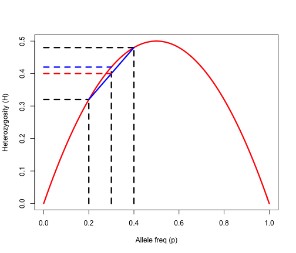

```{r setup, include=FALSE}
options(htmltools.dir.version = FALSE)
```


# Population subdivision

.pull-left[
- ### Selection
- ### Migration
- ### Mutation
- ### Drift (inbreeding)
]

.pull-right[
<div align="center">

</div>
]

--

### Cryptic population structure

Unknown (cryptic) population structure can appear as a __deficiency of heterozygotes__
- Just one more way to get reduced heterozygosity and increased homozygosity in your sample


---

# Population subdivision


| Genotype | $A_1A_1$   | $A_1A_2$    | $A_2A_2$ 
| :-------: | : ------ : | :-------: | :-------: | 
| sub-pop1  | 64    | 32    | 4    | 
| sub-pop2  | 4     | 32    | 64    | 
| Total     | 68    | 64    | 68    | 

--

The frequencies of the $A_1$ allele in sub-pop1 and sub-pop2:
\begin{align*}
p_1 & = \frac{2 \times 64 + 32}{2 \times 100} = 0.8 \\
p_2 & = \frac{2 \times 4 + 32}{2 \times 100} = 0.2 \\
\end{align*}

--

The frequency of the $A_1$ allele in the combined population:

\begin{align*}
\bar{p} & = \frac{2 \times 68 + 64}{2 \times 200} = 0.5 \\
\end{align*}

--

The expected value of heterozygotes for the combined population is:

\begin{align*}
2\bar{p}\bar{q} \times n = 2 \times 0.5 \times 0.5 \times 200 = 100 \\ 
\end{align*}

---

# Wahlund Effect

The _perceived deficiency_ of heterozygotes due to treating two different populations as one --- the __Wahlund effect__. 
> Wahlund, 1928


--

```{r wahlund, echo=FALSE, fig.align='center', fig.height=6}
geth <- function(p){return(2*p*(1-p))}
p <- seq(0, 1, by=0.01)
plot(p, geth(p), type="l", lwd=3, col="red", xlab="Allele freq (p)", ylab="Heterozygosity (H)")
lines(c(0.2, 0.2), c(0, geth(p=0.2)), lty=2, lwd=3) # add a line segment
lines(c(0, 0.2), c(geth(p=0.2), geth(p=0.2)), lty=2, lwd=3)
lines(c(0.4, 0.4), c(0, geth(p=0.4)), lty=2, lwd=3) # add a line segment
lines(c(0, 0.4), c(geth(p=0.4), geth(p=0.4)), lty=2, lwd=3)
lines(c(0.3, 0.3), c(0, geth(p=0.3)), lty=2, lwd=3) 
lines(c(0, 0.3), c(geth(p=0.3), geth(p=0.3)), lty=2, lwd=3, col="blue")
lines(c(0.2, 0.4), c(geth(p=0.2), geth(p=0.4)), lty=1, lwd=3, col="blue")
lines(c(0, 0.3), c(mean(c(geth(p=0.2), geth(p=0.4))), mean(c(geth(p=0.2), geth(p=0.4)))), lty=2, lwd=3, col="red")
```

---

# Wahlund Effect


.pull-left[
<div align="center">

</div>
]

.pull-right[

- The blue dashed horizontal segment is the $H_{exp} = 2 \bar{p}\bar{q}$

- The red dashed horizontal segment is the $H_{obs}$ 
  - mean value of the $H_1$ and $H_2$

- Because the curve is convave downward, $H_{obs}$ is always less than $H_{exp}$

]

--

Even if subpopulations are __partially isolated__, the Wahlund effect is held true.

  
---

# Heterozygosity to describe Populations 

In a subdivided population, the overall deviation from HWE heterozygosity:

- Factors acting within subpopulations
- Simply due to the subdivision itself (the Wahlund effect)

--

### Wright's F-statistics

Assuming HWE, Wright’s F describes the deviation from expected heterozygosity

\begin{align*}
F = \frac{H_e - H_o}{H_e}
\end{align*}

- Expected Heterozygosity ( $H_e$ ) = estimate of diversity

- Observed Heterozygosity ( $H_o$ )  = current characterization of the sample

--

- This measures the proportionate reduction in heterozygosity compared to HWE
  - If $H_o < H_e$, what does it mean and how can we use this?

---

# Heirarchical F-statistics

.pull-left[
<div align="center">

</div>
]

.pull-right[
<div align="center">

</div>
]

--

- $H_I$ = mean observed heterozygosities over all subpopulations = $\frac{H_1 + H_2}{2}$

- $H_S$ = mean expected heterozygosity within random mating subpopulations = $2p_iq_i$

- $H_T$ = expected heterozygosity in a random mating total population = $2 \bar{p} \bar{q}$

---

# Heirarchical F-statistics


.pull-left[
<div align="center">

</div>
]

.pull-right[
- $H_I$, the average of the observed heterozygosities

- $H_S$, the average of the expected heterozygosities
]


The average deviation in heterozygosity within subpopulations is

\begin{align*}
F_{IS} = \frac{H_S - H_I}{H_S}
\end{align*}

- The subscript $IS$ here indicates deviation among __individuals__ relative to their __subpopulation__

---

# Heirarchical F-statistics


.pull-left[
<div align="center">

</div>
]

.pull-right[
- $H_I$, the average of the observed heterozygosities

- $H_S$, the average of the expected heterozygosities

- $H_T$, the expected heterozygosity in the toal population
]

--

The deviation in heterozygosity due to subdivision alone is

\begin{align*}
F_{ST} = \frac{H_T - H_S}{H_T}
\end{align*}

- The subscript $ST$ here indicates deviation among __subpopulations__ relative to the __total population__

---

# Heirarchical F-statistics

.pull-left[
<div align="center">

</div>
]

.pull-right[
- $H_I$, the average of the observed heterozygosities

- $H_S$, the average of the expected heterozygosities

- $H_T$, the expected heterozygosity in the toal population
]


Finally, the overall deviation in heterozygosity in the total pouplation is

\begin{align*}
F_{IT} = \frac{H_T - H_I}{H_T}
\end{align*}

- The subscript $IT$ here indicates deviation among __individuals__ relative to the __total population__

---

# Summary of Heirarchical F-statistics

### $F_{ST}$

- Measures how different the subpopulations are.

- It can be interpreted as the proportion of the total heterozygosity that is due to differences in allele frequencies among subpopulations

- $F_{ST}$ can be calculated from allele frequencies lone

--

### $F_{IS}$ and $F_{IT}$

- $F_{IS}$ is due to factors (selection, drift, mutation) acting within subpopulations

- $F_{IT}$ depends on the values of $F_{ST}$ and $F_{IS}$

- $F_{IS}$ and $F_{IT}$ require observed genotype frequencies


---

# An example for F-statistics calculation


| Genotype | $A_1A_1$   | $A_1A_2$    | $A_2A_2$ 
| :-------: | : ------ : | :-------: | :-------: | 
| sub-pop1  | 64    | 32    | 4    | 
| sub-pop2  | 4     | 32    | 64    | 
| Total     | 68    | 64    | 68    | 

--


Heterozygosity indicies (over individuals $H_{I}$, subpopulations $H_{S}$, and total population $H_{T}$)

--

- $H_I$ based on __observed__ heterozygosities in __subpopulations__:

\begin{align*}
H_I & = (H_{osb1} \times N_1 + H_{obs2} \times N_2) \times \frac{1}{N_{total}} \\
& = (0.32 \times 100 + 0.32 \times 100) \times \frac{1}{200} = 0.32 \\
\end{align*}

---

# An example for F-statistics calculation

The frequencies of the $A_1$ allele in sub-pop1, sub-pop2, and combined population:
\begin{align*}
p_1  = 0.8, p_2 = 0.2, \bar{p} = 0.5 \\
\end{align*}

- $H_S$ based on __expected__ heterozygosities in __subpopulations__:

\begin{align*}
H_S & = (H_{exp1} \times N_1 + H_{exp2} \times N_2) \times \frac{1}{N_{total}} \\
& = (2 \times 0.8 \times 0.2 \times 100 + 2 \times 0.8 \times 0.2 \times 100) \times \frac{1}{200} = 0.32 \\
\end{align*}

--


- $H_T$ based on __expected__ heterozygosities in __total populations__:


\begin{align*}
H_T & = 2 \bar{p} \bar{q} \\
& = 2 \times 0.5 \times 0.5 = 0.5 \\
\end{align*}

---

# An example for F-statistics calculation

\begin{align*}
H_I & = 0.32 \\
H_S & = 0.32 \\
H_T & = 0.5 \\
\end{align*}

--------------

\begin{align*}
H_{IS} & = \frac{H_S - H_I}{H_S}  = \frac{0.32 - 0.32}{0.32} =0 \\
\end{align*}

--

\begin{align*}
H_{ST} & = \frac{H_T - H_S}{H_T}  = \frac{0.5 - 0.32}{0.5} = 0.36 \\
\end{align*}

\begin{align*}
H_{IT} & = \frac{H_T - H_I}{H_T}  = \frac{0.5 - 0.32}{0.5} = 0.36 \\
\end{align*}

--

- There is no evidence of inbreeding within each subpopulations

- But clear evidence of population subdivision

- And population subdivision accounts for all the genetic variation.


---
# More on the Hierarchical F-statistics


### $F_{IS}$ - Inbreeding index

- Reduction in heterozygosity of an individual due to non-random mating in a subpopulation

--

### $F_{ST}$  - Fixation index 

- Reduction in heterozygosity of a subpopulation relative to the total population due to drift; 

- Measure of genetic differentiation

---
# More on the Hierarchical F-statistics

### $F_{IT}$ - Overall fixation index

- Mean reduction in heterozygosity of an individual relative to the total population 

- Combined effects of non-random mating ( $F_{IS}$ ) with drift ( $F_{ST}$ )

--

### Relationship of $F_{IS}$, $F_{ST}$, and $F_{IT}$ 
However, it is NOT simple additive relationship 

They are related by the expression
\begin{align*}
(1-F_{IT}) = (1-F_{IS})(1-F_{ST})
\end{align*}

It can be rewritten as

\begin{align*}
F_{IT} = F_{IS} + F_{ST} - F_{IS}F_{ST}
\end{align*}


---

# Of course there are issues...


$F_{ST}$ must be adjusted to account for the numbers of individuals in each sub-population (sampling error)

- Unbiased estimators, such as $\hat{F_{ST}}$
  > Nei and Chesser, 1983
  
  

--

CANNOT compare $F_{ST}$ between studies or samples if they are not based upon the exact same loci!!


- Like $D'$ you can express $F_{ST}$ as $F_{ST}'$
> Hedrick, 2005

- Jost’s D uses number of effective alleles instead of heterozygosity
> Jost, 2008


