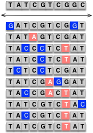

```{r setup, include=FALSE}
options(htmltools.dir.version = FALSE)
```

# Neutral theory of molecular evolution

"The neutral theory asserts that the great majority of evolutionary changes at the molecular level are caused
NOT by _Darwinian selection_ 
but by _random drift of selectively neutral or nearly neutral mutants_."

> Motoo Kimura (木村 資生), 1983 
> - Iowa State with Jay Lush and then University of Wisconsin with James Crow


--

### Core ideas of neutral theory of molecular evolution:

- #### Most mutations are not advantageous

  - Selectively (or effectively) neutral if $s < 1/2N_e$
  
- #### Most changes that are fixed over time are selectively neutral (fixed by drift)

   - Drift rather than selection predominates
---

# Neutral Theory

### What the neutral theory does not claim

- __Does NOT claim__ natural selection is unimportant in evolution

  - In fact, most morphological adaptations are the result of natural selection 

--

- It __does NOT deny__ that most mutations are (slightly) deleterious (it claims most of the variation _we see_ is neutral)

  - Most of the deleterious mutations have been eliminated
  
  - Rare mutations have been fixed


--

### Selection counteracts drift

- $s > 1/2N_e$

\begin{align*}
Pr(fix) = \frac{1 - e^{-2s}}{1-e^{-4N_es}}
\end{align*}


---

```{r echo=FALSE}
wright_fisher <- function(N=1000, A1=100, t=1000){
  p <- A1/(2*N)
  ### make a numeric vector to hold the results
  freq <- as.numeric();
  ### Use for loop to run over t generations
  for (i in 1:t){
    A1 <- rbinom(1, 2*N, p) # samling allele from a binom distribution
    p <- A1/(2*N)
    freq[i] <- p
  }
  return(freq)
}
```

```{r fig.align='center', fig.height=6}
set.seed(12347)
Ne=20; A1=1; t=4*Ne
frq <- wright_fisher(N=Ne, A1=A1, t=t)
plot(frq, type="l", ylim=c(0,1), col=3, xlab="Generations", ylab="Freq")
    for(u in 1:100){
      frq <- wright_fisher(N=N, A1=A1, t=t)
      random <- sample(1:1000,1,replace=F)
      randomcolor <- colors()[random] 
      lines(frq, type="l", lwd=3, col=(randomcolor))
    }

```

---

# Expected allele frequencies distribution

On timescales shorter than those required for mutations to fix, selection will change the mean frequency of alleles in a population.

--

For new mutations, the density of polymorphisms found at frequency $q$, is


\begin{align*}
f(q) & = \frac{2 \mu}{q(1-q)} \frac{1 - e^{(-4N_es)(1-q)}}{1 - e^{(-4N_e s)}} \\
\end{align*}

> Wright, 1969

- Where $\mu$ is the mutation rate.
- $s$ is the fitness effect. 
  - Advantageous mutations have $s > 0$ and deleterious mutations have $s <0$


---

# The expected frequency spectra

\begin{align*}
f(q) & = \frac{2 \mu}{q(1-q)} \frac{1 - e^{(-4N_es)(1-q)}}{1 - e^{(-4N_e s)}} \\
\end{align*}


```{r echo=TRUE, eval=FALSE, fig.align='center', out.width='80%'}
# expected freq spectra
f <- function(q, ns){
  frq = 2/(q*(1-q)) * (1 - exp(-4*ns*(1-q))) / (1 - exp(-4*ns))
  return(frq)}
q <- seq(from = 0.01, to =0.99, by=0.01)

## Ploting function
plot(q, f(q, ns=0.01), type="l", lty=1, lwd=3, xlab="Ns", ylab="No. of polymorhpic sites", cex.lab=2)
lines(q, f(q, ns=-50), type="l", lty=1, lwd=3, col="red")
lines(q, f(q, ns=-5), type="l", lty=2, lwd=3, col="red")
lines(q, f(q, ns=5), type="l", lty=1, lwd=3, col="blue")
lines(q, f(q, ns=50), type="l", lty=2, lwd=3, col="blue")
legend(0.6, 200, title="Ne*s", legend=c("-50", "5", "0", "-5", "50"), 
       col=c("red", "red", "black", "blue", "blue"), 
       lty=c(1,2,1,1,2), cex=2, lwd=3)
```

---

# The expected distribution of $f(q)$

\begin{align*}
f(q) & = \frac{2 \mu}{q(1-q)} \frac{1 - e^{(-4Ns)(1-q)}}{1 - e^{(-4N s)}} \\
\end{align*}

.pull-left[
```{r echo=FALSE, fig.align='center', out.width='100%'}
# expected freq spectra
f <- function(q, ns){
  frq = 2/(q*(1-q)) * (1 - exp(-4*ns*(1-q))) / (1 - exp(-4*ns))
  return(frq)}
q <- seq(from = 0.01, to =0.99, by=0.01)

## Ploting function
plot(q, f(q, ns=0.01), type="l", lty=1, lwd=3, xlab="Frq of allele", ylab="No. of polymorhpic sites", cex.lab=1.5)
lines(q, f(q, ns=-50), type="l", lty=1, lwd=3, col="red")
lines(q, f(q, ns=-5), type="l", lty=2, lwd=3, col="red")
lines(q, f(q, ns=5), type="l", lty=1, lwd=3, col="blue")
lines(q, f(q, ns=50), type="l", lty=2, lwd=3, col="blue")
legend(0.6, 200, title="Ne*s", legend=c("-50", "-5", "0", "5", "50"), 
       col=c("red", "red", "black", "blue", "blue"), 
       lty=c(1,2,1,1,2), cex=2, lwd=3)
```
]


--

.pull-right[
- #### Deleterious alleles => lower frequencies
 - most strongly deleterious mutations are immediately removed from the population
 
- #### Advantage alleles shifted toward higher frequencies
  - most strongly advantageous mutations fix very rapidly.
]


---

# Types of selection

To find loci that are under selection we test for departures from the neutral theory

--

### Purifying selection: 
  - Deleterious mutations are eliminated

### Positive selection: 
  - Opposite of purifying
  - Favorable mutations are selected

### Balancing selection: 
  - Maintains two or more variants at a locus


---

# Genetic diversity within pops

### Expected diversity 
- Number of alleles/locus (allelic richness) 
- Polymorphism (loci with > 1 allele)
- Theta ( $\theta$ ) = $4N_e \mu$
  - $N_e$ = effective population size
  - $\mu$ = mutation rate per generation

--

### Expected heterozygosity

$H_{exp}$ = 1 - (avg expected __homozygosity__ over all loci)

\begin{align*}
H_{exp} = 1 - \frac{1}{m}\sum_{k=l}^{m} \sum_{i=l}^{k} p_{ki}^2
\end{align*}
  - $m$ is the number of loci
  - $k$ is the number of alleles at a particular locus
  - $p_{ki}$ is the frq of $i^{th}$ allele at $k^{th}$ locus

# Common estimators of $\theta$ under the infinite sites model

For an individual SNP, one allele has sample frequency $p$, alternative allele frequency is $q$, such that $p +q =1$.

--

__Heterozygosity__ at this SNP site is:

\begin{align*}
h = \frac{n}{n-1}(1 - p^2 - q^2)
\end{align*}

- where $n$ is the number of sequences in the sample. 

---

# Under the infinite sites model

\begin{align*}
\pi = & \sum_{j=1}^{S}h_j \\
\end{align*}

- Where $S$ is the number of segregating sites
- $h_j$ is the heterozygosity at the $j$th SNP site.

--

Under the __infinite sites model__ for a diploid population at HWE,

\begin{align*}
E(\pi) = & \theta = 4N_e \mu\\
\end{align*}

Which is why this statistic is sometimes called $\theta_\pi$.


---
# An alternative method: Watterson' theta

In this method, we summarize SNPs using the total number of segregating sites, $S$, in the sample.

However, because larger sample sizes will result in larger values of $S$, we must adjust the statistic to be

\begin{align*}
\theta_W = & \frac{S}{a} \\
\end{align*}

Where $a$ is,

\begin{align*}
a=\sum_{i=1}^{n-1}\frac{1}{i}
\end{align*}
  - $n$ is the number of samples

Or, combine them together

\begin{align*}
\theta_W = & \frac{S}{\sum_{i=1}^{n-1}\frac{1}{i}} \\
\end{align*}

---

# An Alternative method: Watterson' theta

<div align="center">

</div>


\begin{align*}
\theta_W = & \frac{S}{\sum_{i=1}^{n-1}\frac{1}{i}} \\
= & 2/(1/1 + 1/2 + 1/3) \\
= & 1.09
\end{align*}

The per site measure would be $1.09/10=0.109$, which is very similar to $\theta_\pi$


---
# The frequency spectrum of alleles

<div align="center">

</div>


In this case, among these 10 haplotypes are 10 segregating sites, each of which can have a frequency between $1/n$ and $(n-1)/n$

--

Visually summarize the MAF of all segregating sites using the __allele frequency spectrum__
  

---
# The frequency spectrum of alleles

The allele frequency specturm is also referred to as the __site frequency spectrum (SFS)__.

.pull-left[
<div align="center">

</div>
]

--

.pull-left[
```{r, out.width='80%', fig.align='center', echo=TRUE}
maf <- c(0.1, 0.1, 0.3, 0.1, 0.3, 
         0.2, 0.1, 0.4, 0.1, 0.1)
sfs <- table(maf)
barplot(sfs, col="#cdc0b0", xlab="Minor allele frequency", 
        ylab="No. of segregating sites", 
        cex.axis =1.5, cex.names = 1.5, cex.lab=1.5)
```
]

---
# The frequency spectrum of alleles

- The allele frequency specturm is also referred to as the __site frequency spectrum (SFS)__.
- Use the sequences of one or more closely related species, we can get the ancestral state.
- Therefore, we can describe variation at each site using the __derived allele frequency (DAF)__.

.pull-left[
<div align="center">

</div>
]

--

.pull-left[
```{r, out.width='50%', fig.align='center', echo=TRUE}
maf <- c(0.1, 0.1, 0.3, 0.1, 0.3, 
         0.2, 0.1, 0.6, 0.9, 0.9)
sfs <- table(maf)
barplot(sfs, col="#cdc0b0", xlab="Derived allele frequency", ylab="No. of segregating sites", 
        cex.axis =1.5, cex.names = 1.5, cex.lab=1.5)
```
]

---

# Signature of negative selection


.pull-left[
<div align="center">

</div>
]

--

.pull-left[
- Comparison of expected and observed is __uneven__

- The rare alleles are at lower freq than expected

- Evidence of __negative selection__ (or __purifying selection__)

- However, confounded by population demographics (i.e., bottleneck effect)
]

---

# Signature of positive/balancing selection


.pull-left[
<div align="center">

</div>
]

--

.pull-left[
- Comparison of expected and observed is __too even__

- The most common allele is more common than expected

- Evidence of __positive selection__ or __balancing selection__

- However, confounded by population demographics (i.e., population expansion)
]

---
# Diversity measurement

We now consider several statistics summarizing sequencing diversity that use informtion about the frequency of derived alleles, as these capture more information about our sequencing data.

Fu and Li (1993) defined a statistic, $\epsilon_1$, based on the number of __derived singletons__ in a sample.

\begin{align*}
\epsilon_1 = S_1 \\
\end{align*}

- Where $S_1$ is the number of segregating site with derived alleles found on only one haplotype.

--

If we don't know the ancestral status, we can aslo define a statistic, $\eta_1$, based on all singletons in a sample

\begin{align*}
\eta_1 = S_1^*\frac{n-1}{n} \\
\end{align*}

- Where $S_1^*$ is all the singletons.

---
# Diversity measurement

A second summary statistic of diversity that uses ancestral state information is $\theta_H$:

\begin{align*}
\theta_H = \frac{\sum_{i=1}^{n-1} i^2S_i}{n(n-1)/2} \\
\end{align*}

- Where $S_i$ is again the number of segregating sites where $i$ haplotypes carry the derived allele (Fay and Wu, 2000).

--

.pull-left[
<div align="center">

</div>
]

--

.pull-left[
\begin{align*}
\theta_H = & \frac{\sum_{i=1}^{n-1} i^2S_i}{n(n-1)/2} \\
= & \frac{(1^2 \times 4 + 2^2 \times 1 + 3^2 \times 2 + 6^2 \times 1 + 9^2 \times 2)}{10(10-1)/2} \\
= 4.98
\end{align*}
]

---

# Summary of the $\theta$ statistics

All of these statistics --- $\theta_\pi, \theta_W, \epsilon_1, \eta_1, \theta_H$ --- are estimators of $\theta$ 
- at __mutation-drift__ equilibrium 
- under an __infinite sites__ mutational model


--

Specifically,

\begin{align*}
E(\epsilon_1) = E(\eta_1) = E(\theta_H)
\end{align*}

These relationships arise because we know the expected shape of the allele frequency distribution under our standard neutral assumptions.


