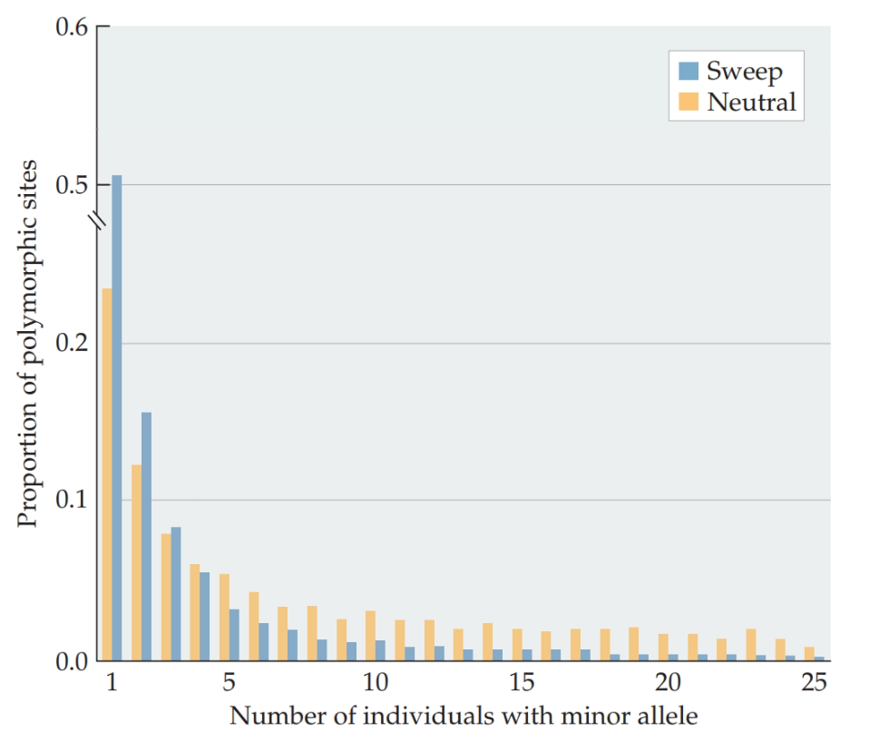
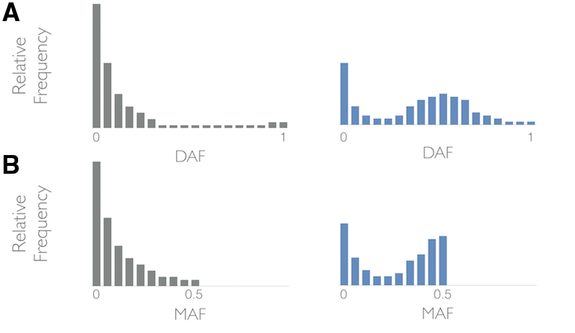

```{r setup, include=FALSE}
options(htmltools.dir.version = FALSE)
```


# Detecting selection using the SFS

## The effects of positive selection


.pull-left[
<div align="center">

</div>
> Hanh, 2020
]

.pull-right[
- After sweep ended, new mutations started to accumulate.

- These new mutations are by definition __singletons__
 - there is only one origin in the sample with each derived allele.
]

The SFS can be skewed toward an excess of low-frequency polymorphisms relateive to the neutral spectrum.

---
# Detecting selection using the SFS

## The effects of balancing selection

Here we consider a simple scenario with a single biallelic site that has been under balancing selection for a long time.
- Variation within each allelic class has been able to __build up__ and __reach equilibrium__

.pull-left[
<div align="center">

</div>
> Bitarello et al., 2018
]

.pull-right[
- Neutral mutations has accumulated both within and between allelic classes

- Overall variation is higher

- SNPs at intermediate frequency show __a distinctive "bump"__ in the SFS.
]


---
# Detecting selection using SFS

A straightforward way would be test a difference between two SFSs.
- However, linkage among sites means that __SNPs at a locus are not independent__, which violates the assumptions made by almost all such test.

--

### Instead, we use $\theta$ to detect deviations.

- $\pi$: pairwise necleotide diversity.

--

- $\theta_W$: watterson's $\theta$, using total number of segregating sites

--

- $\epsilon_1 = S_1$: the number of derived singletons in a sample.
- $\eta_1$: based on all singletons in a sample.

--

Under the standard neutral model, all of these test statistics are expected to have a mean of 0.

---

# Tajima's D and related tests

Tajima (1989) constructed the first test to detect difference between the SFS. 

His statistic, $D$, was defined as:

\begin{align*}
D = \frac{\pi - \theta_W}{\sqrt{Var(\pi - \theta_W)}}
\end{align*}

--

Fu and Li (1993) created similar statistics. These are known as Fu and Li's $D$, $F$, $D^*$, and $F^*$.

\begin{align*}
D = \frac{\pi - \epsilon_1}{\sqrt{Var(\pi - \epsilon_1)}}
\end{align*}

\begin{align*}
F = \frac{\theta_W - \epsilon_1}{\sqrt{Var(\theta_W - \epsilon_1)}}
\end{align*}

\begin{align*}
D^* = \frac{\pi - \eta_1}{\sqrt{Var(\pi - \eta_1)}}
\end{align*}

\begin{align*}
F^* = \frac{\theta_W - \eta_1}{\sqrt{Var(\theta_W - \eta_1)}}
\end{align*}

---

# Tajima's D and related tests

Tajima (1989) constructed the first test to detect difference between the SFS. 

His statistic, $D$, was defined as:

\begin{align*}
D = \frac{\pi - \theta_W}{\sqrt{Var(\pi - \theta_W)}}
\end{align*}

Originally designed to fit a normal distribution, however, none of these test statistics fit a parametric distribution very well.

### Calculation

- Only variable sites at each locus are needed
- The number of invariant sites do not figure into any calculations.

---

# Interpreting values of the test statistics

Tajima's $D$, Fu and Li's $D, F, D^*, F^*$:

\begin{align*}
D = \frac{\pi - \theta_W}{\sqrt{Var(\pi - \theta_W)}}
\end{align*}

After a sweep, all SNPs are low in frequency, $\pi$ will be much lower than expected.

While statistics based on counts of segregating sites (like $\theta_W$) will be much closer to their expected values.

--

------

- All __negative__ when there has been a sweep


---

# Interpreting values of the test statistics

Tajima's $D$, Fu and Li's $D, F, D^*, F^*$:

\begin{align*}
D = \frac{\pi - \theta_W}{\sqrt{Var(\pi - \theta_W)}}
\end{align*}

Balancing selection lead to an excess of intermediate frequency neutral variation surrounding a selected site.

In such case, $\pi$ will be greater than $\theta_W$ and other statistics.

--

------

- All __negative__ when there has been a sweep

- All __positive__ when there is balancing selection

--

- Are usually __significant__ when the values  $> +2$ or $< -2$
  - The exact thresholds depend on sample size, number of SNPs, etc.


---
# The power of the SFS

The time window for positive selection is limited.
- Too early during the sweep 
  - signal will be not strong enough
  
--
  
- Too late after the sweep
  - Both levels and frequencies of variants will have returned to normal

--

Power also determined by the distance between our studied loci and the location of the selected site.
- Because of the effect of the recombination.
- Move far away enough and there will be no signal of selection at all.


