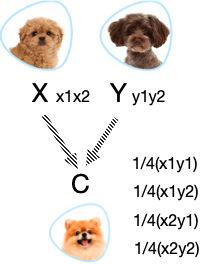
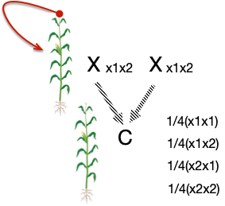
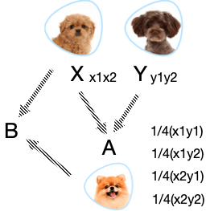
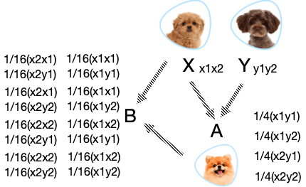
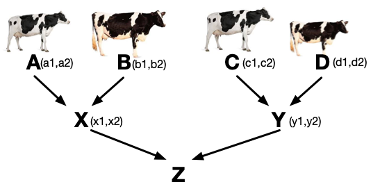
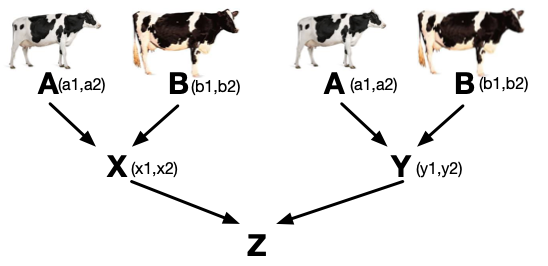

```{r setup, include=FALSE}
options(htmltools.dir.version = FALSE)
```

# Individual Inbreeding: $F_X$


\begin{align*}
F_{X} = (\frac{1}{2})^n(1 + F_{A})
\end{align*}

- Where $n$ is the number of individuals in the path from the individual’s sire (dad), through the common ancestor, to the dam (mom).

- If multiple common ancestors, must sum the individual estimates.


--
------------

The inbreeding coefficient of an individual X depends on the amount of common ancestry in its two parents.

# Coancestry (Kinship): $f_{XY}$

- Coancestry of two parents = inbreeding of their offspring

- Probability of IBD of two haplotypes, one drawn from each parent X and Y, symbolized by $f_{XY}$
 

---

# Coancestry

Coancestry ( $f_{XY}$ ) is the probability of two gametes, one from each parent (X and Y), will contain haplotypes that are IBD

### Example: $X \times Y$ mating

.pull-left[
<div align="center">

</div>
]

--

.pull-right[
### Coancestry $f_{XY}$
\begin{align*}
f_{XY} = & \frac{1}{4}Pr(x_1 	\equiv y_1) \\
& + \frac{1}{4}Pr(x_1 	\equiv y_2) \\
& + \frac{1}{4}Pr(x_2 	\equiv y_1) \\
& + \frac{1}{4}Pr(x_2 	\equiv y_2) \\
\end{align*}
]

---

# Case study 1: selfing

### Coefficient of coancestry with one’s self.

<div align="center">

</div>

--

- If __ $x1x2$__ are sampled, the probability they are IBD depends on whether or not the individual could have obtained these gametes from a common ancestor

- This is reflected by the inbreeding coefficient of the individual __ $F_X$__

- If inbreeding = 0, this combination of gametes does NOT contribute to the possibility of IBD.


---

# Case study 1: selfing

### Coefficient of coancestry with one’s self.

<div align="center">

</div>

\begin{align*}
f_{XX} = & \frac{1}{4}Pr(x_1 	\equiv x_1) + \frac{1}{4}Pr(x_1 	\equiv x_2)  + \frac{1}{4}Pr(x_2 	\equiv x_1)  + \frac{1}{4}Pr(x_2 	\equiv x_2) \\
= & \frac{1}{2}(1 + F_X) \\
\end{align*}

--

This result suggests that $f_{XX} = \frac{1}{2}$ if individual X is a non-inbred with $F_X=0$.

---
# Case study 2: Parent-Offspring

Draw gametes at random (one from each individual X and its progeny A), what is probability they are IBD (or $f_{XA}$)?

<div align="center">

</div>

---
# Case study 2: Parent-Offspring

Draw gametes at random (one from each individual X and its progeny A), what is probability they are IBD (or $f_{XA}$)?

<div align="center">

</div>

--

#### Eight possible combinations

- 1) $x_1x_1$ 2) $x_1x_2$ 3) $x_2x_1$ 4) $x_2x_2$

- 5) $x_1y_1$ 6) $x_1y_2$ 7) $x_2y_1$ 8) $x_2y_2$


---
# Case study 2: Parent-Offspring


.pull-left[
<div align="center">

</div>
]

.pull-right[
#### Eight possible combinations
- 1) $x_1x_1$ 2) $x_1x_2$ 3) $x_2x_1$ 4) $x_2x_2$

- 5) $x_1y_1$ 6) $x_1y_2$ 7) $x_2y_1$ 8) $x_2y_2$

]

------

- If gamete from X is $x_1$, and gamete from A is $y_1$, the probability of IBD depends on if there is a relationship between X and Y (the parents of A)

--

  - This is quantified by the coefficient of coancestry between those parents $f_{XY}$

  - In total, of the 8 possible combinations, 4 include a gamete from parent Y where this relationship holds

---
# Case study 2: Parent-Offspring


.pull-left[
<div align="center">

</div>
]

.pull-right[
#### Eight possible combinations
- 1) $x_1x_1$ 2) $x_1x_2$ 3) $x_2x_1$ 4) $x_2x_2$

- 5) $x_1y_1$ 6) $x_1y_2$ 7) $x_2y_1$ 8) $x_2y_2$
]

------
\begin{align*}
f_{XA} = & \frac{1}{8}[Pr(x_1 	\equiv x_1) + Pr(x_1 	\equiv x_2)  + Pr(x_2 	\equiv x_1)  + Pr(x_2 	\equiv x_2) )\\
& + Pr(x_1 	\equiv y_1) + Pr(x_1 	\equiv y_2)  + Pr(x_2 	\equiv y_1)  + Pr(x_2 	\equiv y_2)] \\
= & \frac{1}{8}(1 + F_X+ F_X+1 + 4f_{XY})\\
= & \frac{1}{4}(1 + F_X + 2f_{XY})\\
\end{align*}

--

Assuming no inbreeding, i.e., $F_X = 0$ and $f_{XY}=0$

Coefficient of coancestry of parent-offspring, $f_{XA}=\frac{1}{4}$


---

# Relationship vs Coancestry

### Coefficient of coancestry: 

Pick an allele from X. The probability that you will __pick__ that allele in Y is the coefficient of coancestry.

--

### Coefficient of relationship: 

Pick an allele from X. The probability that Y __has__ that allele is the coefficient of relationship

--

----------------

Therefore: __coancestry = 1⁄2 relationship__

---

# Relationship vs Coancestry

|  | Coancestry   | Relationship    | 
| :-------: | : ------ : | :-------: | 
| Parent-offspring  | 0.25    | 0.5    | 
| Full-siblings     | 0.25    | 0.5    |
| Half-siblings     | 0.125   | 0.25    |

- Full-sibs have two parents in common

- Half-sibs have one parent in common

---

# The basic rule relating coancestries

<div align="center">

</div>

#### What is coancestry of X and Y (or $f_{XY}=Pr(x \equiv y)$)?

--

Coancestry between X and Y depends on relationship among parents

\begin{align*}
f_{XY} & = Pr(x \equiv y) \\
& = Pr(a 	\equiv c) + Pr(a 	\equiv d)  + Pr(b 	\equiv c)  + Pr(b 	\equiv d )
\end{align*}

--

Consider one part of this equation: $Pr(a \equiv c)$
- This is the probability that a random allele from X is derived from individual A 
- And a randomly chosen allele from Y is from individual C 
- And these are IBD

---

# The basic rule relating coancestries

<div align="center">

</div>

\begin{align*}
f_{XY} & = Pr(x \equiv y) \\
& = Pr(a 	\equiv c) + Pr(a 	\equiv d)  + Pr(b 	\equiv c)  + Pr(b 	\equiv d )
\end{align*}

### Consider one part of this equation: $Pr(a \equiv c)$

\begin{align*}
Pr(a 	\equiv c) & =  \frac{1}{4}\frac{1}{4}Pr(a_1 	\equiv c_1) + \frac{1}{4}\frac{1}{4}Pr(a_1 	\equiv c_2)  + \frac{1}{4}\frac{1}{4}Pr(a_2 	\equiv c_1)  + \frac{1}{4}\frac{1}{4}Pr(a_2 	\equiv c_2) \\
& = \frac{1}{16}(Pr(a_1 	\equiv c_1) + Pr(a_1 	\equiv c_2) + Pr(a_2 	\equiv c_1) + Pr(a_2 	\equiv c_2)) \\
& = \frac{1}{16}(4f_{AC}) = \frac{1}{4}(f_{AC})
\end{align*}

---

# The basic rule relating coancestries

### Repeat for the 3 other terms

<div align="center">

</div>

\begin{align*}
f_{XY} & = Pr(x \equiv y) \\
& = Pr(a 	\equiv c) + Pr(a 	\equiv d)  + Pr(b 	\equiv c)  + Pr(b 	\equiv d ) \\
& = \frac{1}{4}(f_{AC} + f_{AD} + f_{BC}+ f_{BD})
\end{align*}

--

In summary, $f_{XY}$ is equal to the average coefficient of coancestry between the parents of X and Y
- Avg coancestry between parents: AC, AD, BC, and BD


---

# Relationship vs Coancestry

|  | Coancestry   | Relationship    | 
| :-------: | : ------ : | :-------: | 
| Parent-offspring  | 0.25    | 0.5    | 
| Full-siblings     | 0.25    | 0.5    |
| Half-siblings     | 0.125   | 0.25    |

- Full-sibs have two parents in common

<div align="center">

</div>

--

\begin{align*}
f_{XY} & = Pr(x \equiv y) \\
& = \frac{1}{4}(f_{AA} + f_{AB} + f_{BA}+ f_{BB})
\end{align*}

With no previous inbreeding or relationship, and $f_{AA}=f_{BB}$=1/2, $f_{XY}=1/4$


