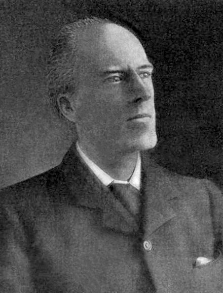
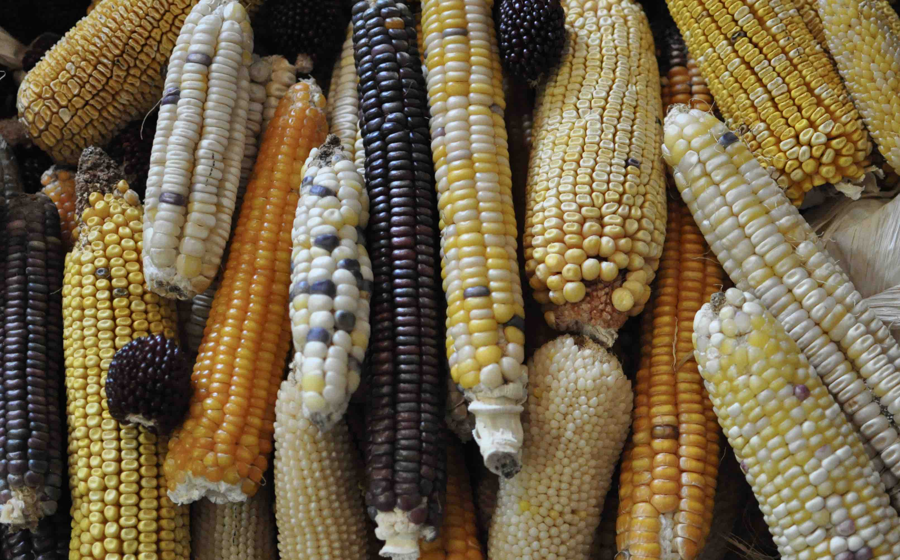
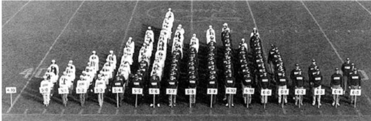

```{r setup, include=FALSE}
options(htmltools.dir.version = FALSE)
```

# Population Genetics vs. Quantitative genetics?

### Population genetics
- `Pop-gen` is the study of **evolution**.

- The language of `pop-gen` is **Mathematics**.

--

### Quantitative genetics 
- `Quant-gen` is the study of the **complex trait**, or **phenotype**.
- The language of `Quant-gen` is **Statistics**.


---
# Quantitative genetics almost synonymous with statistics

.pull-left[
<div align="center">

</div>
- __R. A. Fisher__ is a founder of quantitative genetics but also of analysis of variance and randomization procedures in statistics.
]

.pull-right[
<div align="center">

</div>
- The early geneticist __Karl Pearson__ originated the concepts of regression and correlation.
]

--

In the next couple weeks, we will be deeply involved with the statistical evalution of the basic quantiative genetic models.


---
# Quantitative genetics vs. statistics

- Many genetic factors

  - Determining the quantitative traits are almost always __normally distributed__

--

- Genetic factors act in pairs (two alleles per locus)
  - __Explanatory variables__
  - Each with two or three __levels of variation__
  
--

- Passed on to progeny at random 

  - __Random events__
  
--

- Genetic factors sometimes show independent assortment 

  - __Independence__


---
# Quantitative traits: statistical notation

#### Conceptual Notation
<center>
<div>

=
 + error 
</div>
</center>


--
#### Matrix Notation
\begin{align*}
\underbrace{\begin{bmatrix}    
Y_1\\
Y_2\\
\vdots \\
Y_n\end{bmatrix}}_{n \times 1}  
&= \underbrace{\begin{bmatrix}
   X_{11} & X_{12} & \cdots & X_{1m} \\
    X_{21} & X_{22} & \cdots & X_{2m} \\
    \vdots & \vdots & \ddots & \vdots \\
    X_{n1} & X_{n2} & \cdots & X_{nm}
\end{bmatrix}}_{n \times m} \quad
\underbrace{\begin{bmatrix}
a_1\\
a_2\\
\vdots \\
a_m\end{bmatrix}}_{m \times 1} 
+\underbrace{\begin{bmatrix}
\epsilon_1\\
\epsilon_2\\
\vdots \\
\epsilon_m\end{bmatrix}}_{n \times 1} 
\end{align*}


--
#### Statistical Notation
\begin{align*}
Y_{i} = \sum\limits_{j=1}^{j=m} X_{ij} \alpha_{j} + \epsilon_i
\end{align*}
  
---
# Why the normal distribution?

--

### The Central Limit Theorem (CLT)

- The CLT states that the sums of a set of random variables $(X_1, X_2, X_3, ..., X_n)$ is normally
distributed no matter the distribution the individual X's were sampled from, 
as long as they were sampled from __identical distributions__.


---
# A simulation experiment

\begin{align*}
Y_{i} = \sum\limits_{j=1}^{j=m} X_{ij} \alpha_{j} + \epsilon_i
\end{align*}


- For a given individual ( $i=1$ ) with a number of loci ( $m=1,000$ )

- Each allele is $X_j \in (A, a)$ , with the probability of $p$ or $q=1-p$

--

- The effect of $j$th allele ( $\alpha_j$ ) can be samples from any distribution (e.g., _uniform distribution_)

According to the CLT, if $m$ is __sufficiently large__, the sum is normally distributed.

--

```{r}
m <- 1000
## for each allele, the chance of A or a is equal to 0.5
x <- rbinom(n=m, size=1, prob=0.5)
## sample effect from a uniform distribution:
a <- runif(n=m)
y <- sum(x*a) + 0
y
```

---
# A simulation experiment

\begin{align*}
Y_{i} = \sum\limits_{j=1}^{j=m} X_{ij} \alpha_{j} + \epsilon_i
\end{align*}


```{r, out.width='25%', fig.align='center'}
set.seed(1234) # seed for random number generator
m <- 1000
n = 2000 # simulate a population of 2,000 individuals
out <- c() # create an empty vector
for(i in 1:n){ #<<
  x <- rbinom(n=m, size=1, prob=0.5) ## for each allele, the chance of A = 0.5
  a <- runif(n=m) ## sample effect from a uniform distribution:
  y <- sum(x*a)
  out <- c(out, y)
} 
#shapiro.test(out) # W = 0.99928, p-value = 0.6622
hist(out, breaks=50, col="#b8860b", main="Phenotype Distribution", xlab="")
```


---
# A simulation experiment

\begin{align*}
Y_{i} = \sum\limits_{j=1}^{j=m} X_{ij} \alpha_{j} + \epsilon_i
\end{align*}


```{r, out.width='25%', fig.align='center'}
set.seed(1234) # seed for random number generator
m <- 2 #<<
n = 2000 # simulate a population of 2,000 individuals
out <- c()
for(i in 1:n){
  x <- rbinom(n=m, size=1, prob=0.5) ## for each allele, the chance of A = 0.5
  a <- runif(n=m) ## sample effect from a uniform distribution:
  y <- sum(x*a)
  out <- c(out, y)
} 
#shapiro.test(out) # W = 0.91117, p-value < 2.2e-16
hist(out, breaks=50, col="#b8860b", main="Phenotype Distribution", xlab="")
```

---
# Probability Density

For a continuous trait, i.e., kernel number per ear (raning from 0 to 1,000), what is the $Pr(Y=100)$?

--

Assuming **wheat plant height** in a population is normally distributed, with m = 30 inch, sd=5.
Question: $Pr(30 < Y \leq 50)$?

--

Using the __probability density function__ (or **pdf**) and integration, we can calculate the probability that Y is contained in a certain bracket as:

\begin{align*}
Pr(30 < Y \leq 50) = \int_{30}^{50} f(y)d_y
\end{align*}

--

```{r echo=FALSE, fig.align='center', out.width='30%'}
m <- 30 ; sd <- 5 # mean and standard deviation
x <- seq(-4, 4, length=100)*sd + m
hx <- dnorm(x, mean=m, sd=sd)
plot(x, hx, type="n", xlab="", ylab="", main="", axes=FALSE)

lb = 30; ub = 50 # low bound and upper bound
i <- x >= lb & x <= ub
lines(x, hx, lwd=5, col="darkblue")
# integrate(function(x) dnorm(x, m=30, sd=5), 30, 50)
polygon(c(lb,x[i],ub), c(0,hx[i],0), col="red") 
```


---
# Expectation and variance 

Define the random variable $X$ (i.e. for genotype) which counts the number of allele $A$.
\begin{align*}
  X &=
  \begin{cases}
    2 & \text{if } AA  \text{ with frequency } p^2 \\
    1 & \text{if } Aa \text{ with frequency } 2p(1-p) \\
    0 & \text{if } aa \text{ with frequency } (1-p)^2
  \end{cases} \\
\end{align*}
where $p$ is the allele frequency of $A$. 

--

Then, according to *Formula (1)* in the Note:
  
\begin{align*}
E(f(X)) = \sum\limits_{i=1}^kf(x_i)Pr(X = x_i)
\end{align*}

--

Expected value of $X$:

--

\begin{align*}
E[X] &= 0 \times (1 - p)^2 + 1 \times [2p(1-p)] + 2 \times p^2 = 2p \\
\end{align*}

---
# Expectation and variance 

Define the random variable $X$ which counts the number of allele $A$.
\begin{align*}
  X &=
  \begin{cases}
    2 & \text{if } AA  \text{ with frequency } p^2 \\
    1 & \text{if } Aa \text{ with frequency } 2p(1-p) \\
    0 & \text{if } aa \text{ with frequency } (1-p)^2
  \end{cases} \\
\end{align*}
where $p$ is the allele frequency of $A$. 

--

Expected value of __ $X^2$__:

--

\begin{align*}
E[X^2] &= 0^2 \times (1 - p)^2 + 1^2 \times [2p(1-p)] + 2^2 \times p^2 \\
&= 2p(1-p) + 4p^2 \\
\end{align*}

--

Thus, the variance of allelic counts is 

--

\begin{align*}
Var(X) &= E[X^2] - E[X]^2 \\
&= 2p(1-p) + 4p^2  - (2p)^2\\
&= 2p(1-p)
\end{align*}


---
# Alternative coding 

Define the random variable $X$ as below:

\begin{align*}
  X &=
  \begin{cases}
    1 & \text{if } AA  \text{ with frequency } p^2 \\
    0 & \text{if } Aa \text{ with frequency } 2p(1-p) \\
    -1 & \text{if } aa \text{ with frequency } (1-p)^2
  \end{cases} \\
\end{align*}
where $p$ is the allele frequency of $A$. 

--

Then, 
\begin{align*}
E[X] &= -1 \times (1 - p)^2 + 0 \times [2p(1-p)] + 1 \times p^2 \\
&= −(1 − 2p + p^2) + p^2 = 2p-1 \\
E[X^2] &= (-1)^2 \times (1 - p)^2 + 0^2 \times [2p(1-p)] + 1^2 \times p^2 \\
&= 1 − 2p + p^2 +p^2  = 2p^2 − 2p + 1 \\
\end{align*}
Thus, the variance of allelic counts is 
\begin{align*}
Var(X) &= E[X^2] - E[X]^2 \\
&= 2p^2 − 2p + 1 − (4p^2 − 4p + 1)\\
&= -2p^2 + 2p = 2p(1-p)
\end{align*}


---
# Examples for probabilities

Two variables: Genotype and Milk Yield (MY)

| Genotype (G) | $MY \leq 100$ | $100 < MY \leq 300$ | $MY > 300$  | Marginal $Pr(G)$  | 
| :-------: | :-------: | :-------: | :-------: | :-------:| 
| aa      | 0.10 | 0.04 |  0.02  | 0.16    |
| Aa     |  0.14 | 0.18 | 0.16 | 0.48 |
| AA | 0.06 | 0.10 | 0.20 | 0.36 |
| Marg. Prob.|  0.30 | 0.32 | 0.38 | 1.00 |

--

### Joint Probability

Two random variables to occur together.

--

- What is the joint probability of $Pr(G=aa, MY > 300)$?


---
# Examples for probabilities

Two variables: Genotype and Milk Yield (MY)

| Genotype (G) | $MY \leq 100$ | $100 < MY \leq 300$ | $MY > 300$  | Marginal $Pr(G)$  | 
| :-------: | ------- | ------- | ------- | ------- | ------- |
| aa      | 0.10 | 0.04 |  0.02  | 0.16    |
| Aa     |  0.14 | 0.18 | 0.16 | 0.48 |
| AA | 0.06 | 0.10 | 0.20 | 0.36 |
| Marg. Prob.|  0.30 | 0.32 | 0.38 | 1.00 |

--

### Marginal Probability

A sum of **mutually exclusive** and **exhaustive** set of events.

--

- What is the marginal probability of $Pr(G=Aa)$?


---
# Examples for probabilities

Two variables: Genotype and Milk Yield (MY)

| Genotype (G) | $MY \leq 100$ | $100 < MY \leq 300$ | $MY > 300$  | Marginal $Pr(G)$  | 
| :-------: | ------- | ------- | ------- | ------- | ------- |
| aa      | 0.10 | 0.04 |  0.02  | 0.16    |
| Aa     |  0.14 | 0.18 | 0.16 | 0.48 |
| AA | 0.06 | 0.10 | 0.20 | 0.36 |
| Marg. Prob.|  0.30 | 0.32 | 0.38 | 1.00 |

--

### Conditional Probability

$$
Pr(X = x | Y = y) = \frac{Pr(X = x, Y = y)}{ Pr(Y = y)}
$$

--

- What is the conditional probability of $Pr(MY \leq 100 | G=Aa)$?

