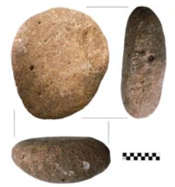

```{r setup, include=FALSE}
options(htmltools.dir.version = FALSE)
```

# About Me

- Bachelor and Master degrees from CAU!

- About 15 years experience in maize genetics and genomics

--

### Prefessional Experience

- 2008-2014: __Ph.D.__ @ Iowa State University 
  - Genetics and Genomics
  
- 2014-2017: __PostDoc__ @ University of California, Davis 
  - Evolutionary Genetics

- 2017-Now: __Assistant Professor__ @ University of Nebraska-Lincoln
  - Quantitative Genetics and Statistical Genomics

---

# About my lab

- My lab focuses on __quantitative genetics__ and __statistical genomics__ of maize and its wild relatives

--

<div align="center">

</div> 

- From historical _domestication_ to future _improvement_.


---

# Slides for this class module

- Scan QR code to view the HTML slides: 

<div align="center">

</div> 

--

- Lab website: https://jyanglab.com/
  - TEACHING: Courses
    - __Module 1__: [[HTML](https://jyanglab.com/slides/2022-module/week1/w1.html)]
      

---

# Goals and Objectives

### Overall goal: 

- Understand the basic principles of population genomics

- Apply the knowledge for study crop domestication and its implication for crop improvement

--

### Objectives:

- 1) Learn basic population genomics terminology

- 2) Learn how to measure diversity using sequencing data

- 3) Understand the statistics for measuring population differentiation

- 4) Be able to scan for direct and linked selection to detect selective sweeps

---

# A timely topic

### __Nobel Prize in Physiology or Medicine 2022__


.pull-left[
<div align="center">

</div>
]


--

.pull-right[
<div align="center">

</div>
A maize cob from the Ocampo Caves (Valenzuela cave), dated to 3890 ± 60 years before the present. Length, 47 mm. 
> from Paabo's 2003 Science paper
]

--

-----------

__Svante Paabo__ represents the field of _evolutionary genetics_ and/or _population genetics!!!_

---
# Future jobs

.pull-left[
<div align="center">

</div>
> Google X, the Moonshot Factory

A job description __Data Scientist, Plant Biology__ in [Google X](https://x.company/careers-at-x/6434423002/)
]

--

.pull-right[
### What you should have

- Experience working with biological data, with an emphasis on NGS.

- Understanding of molecular biology, field trial design, or population genetics.

- Experience in the agriculture industry.

- Knowledge of statistical methods and applied machine learning.

...
]

---

# Syllabus

### Module 1: Introduction and popgen terminology
- Introduction of population genomics
- Basic principles of evolutionary processes

### Module 2: Diversity measurement
- NGS and diversity measurement
- Population differentiation

### Module 3: Scan for direct and linked selection
- Direct selection
- Linked selection


---
# 151 crops and their domestication origins

<div align="center">

</div>

---
# Maize domestication


<div align="center">

</div>


--

---------

.pull-left[
<div align="center">

</div>
]

.pull-right[
<div align="center">

</div>
]

This __8,700__ year-old milling stone (excavated in an area of __the Balsas Valley__ in southwestern Mexico) was used to process maize and other crops. Maize starch grains were recovered from the stone.


---
# Plant Domestication

<div align="center">

</div>

- “Plant domestication is the _genetic modification_ of a wild species to create a new form of a plant altered _to meet human needs_.” 
> Doebley et al., 2006

--

__Plant domestication__ is the process whereby wild plants have been evolved into crop plants through artificial selection. 

- This usually involves an early hybridization event followed by selective breeding.

---
# Wild and domesticated species

<div align="center">

</div>

--

__Fitness__ are different between wild ancestors and domesticated crops

- Fitness describes individual __reproductive__ success.

---

# Domestication Syndrome

.pull-left[
<div align="center">

</div>
]

.pull-left[
Compared to their progenitors, crops typically have:
- Larger grains or fruits

- More robust plants overall

- More determinate growth or increased apical dominance  

- A loss of natural seed dispersal

> Doebley et al., 2006
]

---
# Genes controlling domestication traits

<div align="center">

</div>
> Doebley et al., 2006


---
# Population genomics for domestication

### Understand the popgen
- To identify the selective sweeps 
  - [Hufford et al., 2012](https://www.nature.com/articles/ng.2309) Nature Genetics
- To infer the history of populations
  - [Beissinger et al., 2016](https://www.nature.com/articles/nplants201684) Nature Plants
- To examine the relative effects of evolutionary forces across the genome 
  - [Xu et al., 2020](https://www.nature.com/articles/s41467-020-19333-4) Nature Communications
  
--

### Design a selection scan experiment
- Sampling wild and domesticated populations
- DNA sequencing and data analysis

---
# Sequencing platforms

### Illumina (HiSeq, MiSeq, NextSeq)
- Throughput: very high
- Read length: up to 2x300 bp 
- Accuracy: high (error rate is < 1%)

--

### PacBio
- Throughput: moderate
- Read length: very long (> 70kb)
- Accuracy: low (error rate is about 10%)

--

### Nanopore
- Throughput: moderate
- Read length: super long (> 1Mb)
- Accuracy: low (error rate is about 10-20%) 

---
# DNA Sequencing

#### Short read sequencing can often be produced as either single-end or paired-end.

- #### Paired-end (SE) 

  - Means that two reads of equal length come from the same larger piece of DNA
  
  - The length is approximately known

- #### Single-end (SE) 
  - Just have one read.

---
# Basic sequence terminology

.pull-left[
<div align="center">

</div>

- An alignment of three sequences sampled from 3 plants of a population

- Each of the sequences has 10 nucleotides, from the same locus on a chromosome.
]

--

.pull-right[
There are two __polymorphisms__ (or segregating sites)

Single nucleotide polymorphisms ( __SNPs__ )
  - In the 3rd position, we have T/C alleles
  - In the 8th position, we have G/T alleles
]


The set of alleles found on a single sequence is referred to as a __haplotype__.
- _TG_ haplotype and _CT_ haplotype

--

__Allele frequency__:

- In the 3rd position, __Major allele__ is T and __Minor allele__ is C
- Minor allele frequency is 1/3

---

# Allele and genotype frequencies

.pull-left[
<div align="center">

</div>
]


.pull-right[
- dog 1: AA AA __TT__ CC GG 
- dog 2: AA AA __CC__ CC GG
- dog 3: AA AA __CT__ CC GG 
- dog 4: AA AA __CT__ CC GG
- dog 5: AA AA __CC__ CC GG
]

Consider a diploid locus segregating for two alleles ( $A_1$ and $A_2$ ).
We usually define the less frequent allele (or minor allele) as the $A_1$ allele.

### Allele frequency ( $p$ and $q$ ) 
Frequency/proportion of alleles of a particular identity at one locus

### Genotype frequency ( $f_{11}$, $f_{12}$, $f_{22}$ )
Proportion of individuals with a specific genotype (combination of alleles)

---

# Allele and genotype frequencies

.pull-left[
<div align="center">

</div>
]

.pull-right[
- dog 1: AA AA __TT__ CC GG 
- dog 2: AA AA __CC__ CC GG
- dog 3: AA AA __CT__ CC GG 
- dog 4: AA AA __CT__ CC GG
- dog 5: AA AA __CC__ CC GG
]

Let $n$ be the total number of individuals in the population. Genotype frequency of __TT__ is:

```{r}
n = 5
n11 = 1
f11 = n11/n
f11
```

--

The frequency of minor allele $A_1$ in the population is then given by

\begin{align*}
p = \frac{2n_{11}+n_{12}}{2n} = f_{11} + \frac{1}{2}f_{12}
\end{align*}


---

# Hardy-Weinberg Equilibrium

#### A population is in HWE if it has constant allele and genotype frequencies __from generation to generation__

- Allele frequencies in parents predict allele and genotype frequencies in offspring

--

### Caveats

- A large, randomly-mating population for diploid species

- No selection, no mutation, no migration, etc.
  
---

# In Hardy-Weinberg Equilibrium

If allele frequencies in parent population = $p$ & $q$, 
then, genotype frequencies in progeny after random mating are:

\begin{align*}
(p + q)^2 = p^2 + 2pq + q^2
\end{align*}

- The array of genotypes in progeny equals the square of the parental gametic array. 

- (sum of allele frequencies) $^2$ = (sum of genotype frequencies)


---
# Allele effects relative to fitness


<div align="center">

</div>

--

.pull-left[
### Advantageous
Increase the fitness

### Deleterious
Decrease the fitness

### Neutral
Have no effect

]

--

.pull-right[
### Positive selection
Increase the advantageous alleles

### Negative (purifying) selection
Remove the deleterious alleles

### Balancing selection
Keep both alleles
]


---
# Positive selection

.pull-left[
<div align="center">

</div>
]

--

.pull-right[
<div align="center">

</div>
]

--

-----------

##### Refers to a history of a locus in which advantageous mutations have arisen and fixed or are in the process of fixing.

--

- Advantageous mutations __much rarer__ than deleterious mutations.

- Advantageous mutation can rapidly increase in frequency.
- Patterns generated by this rapid rise are used to detect signatures of positive selection.

---
# Negative (purifying) selection

.pull-left[
<div align="center">

</div>
]

--

.pull-right[
<div align="center">

</div>
]

--

-----------

#### Refers to a history of a locus in which the vast majority of mutations that have arisen and been removed due to their deleterious effects.

--

- A gene or noncoding region under negative selection is often conserved.

- These genes or regions are constrained by selection.

- Relatively common

--

> Yang et. al., 2017, PLOS Genetics.
- [Incomplete dominance of deleterious alleles contribute substantially to trait variation and heterosis in maize](https://journals.plos.org/plosgenetics/article?id=10.1371/journal.pgen.1007019)

---
# Balancing selection


- Alleles under balancing selection are not universally advantageous or deleterious.

--

- Balanced polymorphisms consist of alleles whose fitness changes with time, space, or population frequency. 

  - __Heterozygote advantage (or overdominant) selection__: heterozygotes genotypes have higher fitness than either homozygous genotype
  
  - __Spatially or temporally varying selection__: Fitness of alleles in a population is dependent on the environment or season

--

> Xu et. al., 2022, bioRxiv.
- [A historically balanced locus under recent directional selection in responding to changed nitrogen conditions during modern maize breeding](https://www.biorxiv.org/content/10.1101/2022.02.09.479784v1)


  
---

# Basic principles of evolutionary processes

Factors lead  to changes of allele frequency

### Systematic processes

Predictable both in amount and in direction

- _Migration_
  - not a major concern in plant breeding

- _Mutation_
  - Mutation is the ultimate source of genetic variation
  - Mutation alone produces slow change in allele frequency

--

- __Selection__
  - An important forces in shaping the allele frequency changes

---

# Basic principles of evolutionary processes

Factors lead  to changes of allele frequency


### Stochastic process

Arises in small populations from the effect of sampling.

- __Genetic drift__

  - Predictable in amount but not in direction


---

# Selection (on Fitness)


- Selection coefficient ( $s$ ) 
  - The proportionate __REDUCTION__ in gametic contribution of a particular genotype _compared to the standard genotype_

- Relative fitness: $w = 1 -s$
  - Most fit is set to 1

--

---------
#### For example

-  $AA$, $Aa$, and $aa$ have survival of 0.75, 0.75, and 0.5, respectively

--

- Then, the relative fitness is 1.0, 1.0, and 0.67 (0.5/0.75)

--

---

# Selection with dominance

- Dominance needs to be accounted for when quantifying allele frequency changes with selection.

- The degree of dominance influences the relative fitness of alleles. 

- Here dominance is with respect to fitness only.


<div align="center">

</div>

---

# Selection with dominance

Here, $h$ is the __level of dominance__

- It is the heterozygous effect from the fitness of the heterozygote relative to the difference between homozygotes.

--

In the example, __ $A_1$ is the most favorable allele__, conferring the greatest degree of fitness

| Degree of dominance | $A_1A_1$   | $A_1A_2$   | $A_2A_2$   |
| :-------: | : ------ : | :-------: | :-------: |
| Additive           | $1$    | $1 - s/2$    | $1 - s$     | 
| Partial dominance   |  $1$        |  $1 - hs$        |  $1 -s$   | 
| Complete dominance | $1$   | $1$    | $1 - s$    |
| Overdominance      | $1 -s_1$ | $1$ | $1-s_2$ | 


---

# Selection against the recessive allele

- Gametic contribution is the product of genotype freq and fitness

|                    | $A_1A_1$   | $A_1A_2$   | $A_2A_2$   |
| :-------: | : ------ : | :-------: | :-------: |
| Initial frq           | $p^2$    | $2pq$    | $q^2$     | 
| Coefficient of selection | $0$   | $0$      | $s$       |
| Fitness ( $w$ )   |  $1$        |  $1$        |  $1-s$   | 
| Gametic contribution | $p^2$   | $2pq$    | $q^2(1-s)$    |

---

# Selection against the recessive allele

- Gametic contribution is the product of genotype freq and fitness

|                    | $A_1A_1$   | $A_1A_2$   | $A_2A_2$   | Total |
| :-------: | : ------ : | :-------: | :-------: | :-------: |
| Initial frq           | $p^2$    | $2pq$    | $q^2$     |  $1$        |
| Coefficient of selection | $0$   | $0$      | $s$       |             |
| Fitness ( $w$ )   |  $1$        |  $1$        |  $1-s$   |            |
| Gametic contribution | $p^2$   | $2pq$    | $q^2(1-s)$    |  $1-sq^2$ |


--

### After one generation of selection against recessive

Note that there has been a proportionate loss of $sq^2$ due to the selection.

The $A_1$ allele freq, 


\begin{align*}
p_1 & = \frac{(2p^2 + 2pq)/2}{p^2 + 2pq + q^2(1-s)} = \frac{p(p+q)}{1 -sq^2}\\
& = \frac{p}{1- sq^2} \\
\end{align*}

---

# Selection

### After one generation of selection against recessive


\begin{align*}
p_1  = \frac{p}{1- sq^2} \\
\end{align*}

### Change in allele freq after one generation

\begin{align*}
\Delta p & = p_1 - p_0  = \frac{p}{1- sq^2} - p\\
& = \frac{p-p(1-sq^2)}{1-sq^2} \\
& = \frac{spq^2}{1 - sq^2}
\end{align*}

--

Then,

\begin{align*}
\Delta q & = -\Delta p = -\frac{spq^2}{1 - sq^2}
\end{align*}

---

# Simulation for selection against recessive

```{r fig.align='center', fig.height=5}
deltap <- function(s, p){
  q <- 1-p
  return((s*p*q^2)/(1 - s*q^2))
}

p <- seq(0, 1, by=0.01)
plot(p, deltap(s=0.4, p), type="l", lwd=3, col="red", xlab="p", ylab="|p1 - p0|")
lines(p, deltap(s=0.2, p), lty=2, lwd=3, col="blue")
```


---

# Effectiveness of Selection

### Initial allele freq

  - Most effective at intermediate freq
  
  - Inefficient when targeted recessive allele is rare

--

### Degree of dominance

- It will become more complex


---

# Wright-Fisher Simulation

In the absence of migration, mutation, or selection, what is the allele freq over time?

--

```{r}
wright_fisher <- function(N=1000, A1=100, t=1000){
  p <- A1/(2*N)
  ### make a numeric vector to hold the results
  freq <- as.numeric();
  ### Use for loop to run over t generations
  for (i in 1:t){
    A1 <- rbinom(1, 2*N, p) # samling allele from a binom distribution
    p <- A1/(2*N)
    freq[i] <- p
  }
  return(freq)
}
frq <- wright_fisher(N=1000, A1=100, t=1000)
```

- N: population size = # of individuals per generation (assuming it is constant)
- A1: # of A1 allele in generation 0
- t: generations

---

```{r, fig.align='center', fig.height=6}
set.seed(12347)
N=2000; A1=2000; t=50
frq <- wright_fisher(N=N, A1=A1, t=t)
plot(frq, type="l", ylim=c(0,1), col=3, xlab="Generations",ylab=expression(p(A[1])))
    for(u in 1:100){
      frq <- wright_fisher(N=N, A1=A1, t=t)
      random <- sample(1:1000,1,replace=F)
      randomcolor <- colors()[random] 
      lines(frq,type="l",col=(randomcolor))
    }
```

---

```{r, fig.align='center', fig.height=6}
set.seed(12347)
N=20; A1=20; t=50
frq <- wright_fisher(N=N, A1=A1, t=t)
plot(frq, type="l", ylim=c(0,1), col=3, xlab="Generations",ylab=expression(p(A[1])))
    for(u in 1:20){
      frq <- wright_fisher(N=N, A1=A1, t=t)
      random <- sample(1:1000,1,replace=F)
      randomcolor <- colors()[random] 
      lines(frq,type="l",col=(randomcolor))
    }
```

---

# Small Populations

### Genetic drift

Change in allele frequencies __by chance__ from the random sampling of gametes in a finite (small) population

--

Allele frequencies are subject to __random fluctuations__ arsing from the sampling of gametes.


---

# Consequences of small population

### Random drift

- Leads to allele fixation

--

### Differentiation between sub-populations

- Leads to genetic differentiation and local group (or geographic isolation)

--

### Uniformity within sub-populations

- Reduces diversity and becomes more alike in genotype in local groups

--

### Increased homozygosity

- Reduces heterozygotes and results in inbreeding


