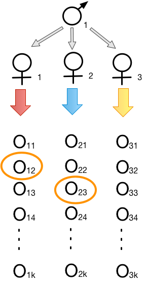
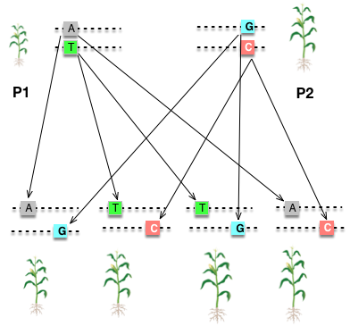

```{r setup, include=FALSE}
options(htmltools.dir.version = FALSE)
```

# Announcements


### Next Exam date: __Nov. 15th (F) at 7:30am__


---
# Parent-offspring

### From Breeding value

- Parent genotypic value: $G = A + D$.
- Offspring (half the breeding value of the parents) : $G=1/2A$

\begin{align*}
Cov(P, O) & = Cov(A + D, 1/2A) \\
& = 1/2Cov(A, A) + 1/2Cov(A, D) = \frac{1}{2}\sigma_A^2 \\
\end{align*}

Because $Cov(A, D) = 0$.

--

#### Assumptions
1. Diploidy
2. Autosomal loci
3. Linkage equilibrium
4. No maternal effects
5. No GxE interactions
6. No selection

---
# Parent-offspring


| Genotype  | Freq      | Breeding Value | Dominance Deviation  | Genotypic value | Offspring ( $\mu_G$ ) |
| :-------: | :-------: | :-----------: |  :-------: | :-------: | :-------: | :-------: |
| $A_1A_1$  | $p^2$     | $2q\alpha$    |   $-2q^2d$   |  $2q(\alpha - qd)$ | ? |
| $A_1A_2$  | $2pq$     | $(q-p)\alpha$ |  $2pqd$   | $(q-p)\alpha + 2pqd$  | ? |
| $A_2A_2$  | $q^2$     | $-2p\alpha$   |  $-2p^2d$   |  $-2p(\alpha + pd)$ | ? |

---
# Parent-offspring


| Genotype  | Freq      | Breeding Value | Dominance Deviation  | Genotypic value | Offspring ( $\mu_G$ ) |
| :-------: | :-------: | :-----------: |  :-------: | :-------: | :-------: | :-------: |
| $A_1A_1$  | $p^2$     | $2q\alpha$    |   $-2q^2d$   |  $2q(\alpha - qd)$ | $q\alpha$ |
| $A_1A_2$  | $2pq$     | $(q-p)\alpha$ |  $2pqd$   | $(q-p)\alpha + 2pqd$  | $1/2(q-p)\alpha$ |
| $A_2A_2$  | $q^2$     | $-2p\alpha$   |  $-2p^2d$   |  $-2p(\alpha + pd)$ | $-p\alpha$ |

--

$$
\begin{aligned}
Cov(X, Y) & = E(XY) - E(X)E(Y) \\
\end{aligned}
$$

where,

$$
\begin{aligned}
E(XY) = \sum_i \sum_j x_i y_j Pr(X = x_i, Y = y_j)
\end{aligned}
$$

--
$$
\begin{aligned}
E(PO) = & p^2 \times 2q(\alpha-qd) \times q\alpha + 2pq \times ((q-p)\alpha+2pqd) \times 1/2(q-p)\alpha \\
        & + q^2 \times (-2p(\alpha+pd)) \times (-p\alpha) \\
      = & [2p^2q^2\alpha^2 - 2p^2q^3d\alpha] + [pq\alpha^2(q^2-2pq+p^2) + 2p^2q^2d\alpha(q-p)] \\
        & + [2p^2q^2\alpha^2 + 2p^3q^2d\alpha] \\
      = & pq\alpha^2(2pq + q^2 -2pq +p^2 + 2pq) + 2p^2q^2d\alpha(-q+q-p+p) \\
      = & pq\alpha^2
\end{aligned}
$$
---
# Parent-offspring


| Genotype  | Freq      | Breeding Value | Dominance Deviation  | Genotypic value | Offspring ( $\mu_G$ ) |
| :-------: | :-------: | :-----------: |  :-------: | :-------: | :-------: | :-------: |
| $A_1A_1$  | $p^2$     | $2q\alpha$    |   $-2q^2d$   |  $2q(\alpha - qd)$ | $q\alpha$ |
| $A_1A_2$  | $2pq$     | $(q-p)\alpha$ |  $2pqd$   | $(q-p)\alpha + 2pqd$  | $1/2(q-p)\alpha$ |
| $A_2A_2$  | $q^2$     | $-2p\alpha$   |  $-2p^2d$   |  $-2p(\alpha + pd)$ | $-p\alpha$ |


$$
\begin{aligned}
Cov(P, O) & = E(PO) - E(P)E(O) \\
\end{aligned}
$$

--
$$
\begin{aligned}
E(PO) = & pq\alpha^2 \\
E(O) = & 0
\end{aligned}
$$
--
Therefore,

$$
\begin{aligned}
Cov(P, O) & = E(PO) - E(P)E(O) \\
          & = pq\alpha^2 \\
          & = 1/2 V_A
\end{aligned}
$$
Because $V_A = 2pq\alpha^2$.


---
# Offspring and mid-parent

The covariance of the mean of the offsrping and the mean of both parents (commonly called the __mid-parent__)


Let $P$ and $P'$ be the values of the two parents,
therefore $\bar{P}=1/2(P + P')$

--

$$
\begin{aligned}
Cov(\bar{P}, O) & = Cov(1/2(P + P'), O) \\
          & = 1/2(Cov(P,O) + Cov(P', O))\\
          & = 1/2 V_A
\end{aligned}
$$
If $P$ and $P'$ have the same variance.

See _P149 of F&M_ for the algebraic reduction.


---
# What is the genetic covariance for half sibs?

<div align="center">

</div>

---
# Genetic covariance for half sibs?

\begin{align*}
Cov(1/2A, 1/2A) & = 1/4V_A\\
\end{align*}

--


| Genotype  | Freq      | Breeding Value | Dominance Deviation  | Genotypic value | Offspring ( $\mu_G$ ) |
| :-------: | :-------: | :-----------: |  :-------: | :-------: | :-------: | :-------: |
| $A_1A_1$  | $p^2$     | $2q\alpha$    |   $-2q^2d$   |  $2q(\alpha - qd)$ | $q\alpha$ |
| $A_1A_2$  | $2pq$     | $(q-p)\alpha$ |  $2pqd$   | $(q-p)\alpha + 2pqd$  | $1/2(q-p)\alpha$ |
| $A_2A_2$  | $q^2$     | $-2p\alpha$   |  $-2p^2d$   |  $-2p(\alpha + pd)$ | $-p\alpha$ |

--

\begin{align*}
Cov_{HS} = & p^2(q\alpha)^2 + 2pq \times 1/4(q-p)^2\alpha^2  + q^2 \times p^2\alpha^2 \\
=& pq\alpha^2[pq + 1/2(q-p)^2 + pq] \\
=& pq\alpha^2[1/2(p+q)^2] \\
=& 1/2pq\alpha^2 \\
= & 1/4V_A
\end{align*}

---
# Genetic covariance for full sibs?

### Additive genetic covariance

- Genotypic value for full sibs:
\begin{align*}
G_{o1} & = \frac{1}{2}A + \frac{1}{2}A'\\
G_{o2} & = \frac{1}{2}A + \frac{1}{2}A'\\
\end{align*}

--

- The genetic covariance for full sibs:
\begin{align*}
Cov(G_{o1}, G_{o2}) = & Cov(\frac{1}{2}A + \frac{1}{2}A', \frac{1}{2}A + \frac{1}{2}A') \\
= & Var(\frac{1}{2}(A + A')) \\
= & \frac{1}{4}(\sigma_A^2 + \sigma^2_{A'}) \\
= & \frac{1}{2}\sigma_A^2 \\
\end{align*}

---
# Genetic covariance for full sibs?


<div align="center">

</div>

--

- Among the progeny, only __four possible genotypes__, each with a frequency of 1/4.
  - $A_1A_3$, $A_1A_4$, $A_2A_3$, $A_2A_4$
  
--

- Let the first sib has any of these genotypes. The 2nd has the same genotype is 1/4.
  - Thus one-quarter of all sib-pairs have the same genotype and consequently the same dominance deviation, $D$.
  
--

- Thus, the cross-product of the dominance deviation is $\sigma_D^2$, times frequency 1/4 = $1/4\sigma_D^2$

---
# Genetic covariance for full sibs?

### The genetic covariance of full sibs is therefore,

\begin{align*}
Cov_{FS} = \frac{1}{2}\sigma_A^2 + \frac{1}{4}\sigma_D^2
\end{align*}

--

### Covariance of half sibs

\begin{align*}
Cov_{HS} = \frac{1}{4}\sigma_A^2
\end{align*}

--

In priciple, dominance variance can be calculated using full sibs and half sibs:

\begin{align*}
Cov_{FS} - 2Cov_{HS} = & \frac{1}{2}\sigma_A^2 + \frac{1}{4}\sigma_D^2 - 2 \times \frac{1}{4}\sigma_A^2 \\
= & \frac{1}{4}\sigma_D^2
\end{align*}

---
# Twins


### Monozygotic (identical) twins 

$$
Cov_{MZ} = V_G
$$

--

### Dizygotic (fraternal) twins
- Not identical twins
- = Full sibs

---
# Summary


| Relationship  |       | r (of $\sigma^2_A$) | u (of $\sigma^2_D$)  | 
| :-------: | :-------: | :-----------: | :-------: | :-------: | 
| Identical twins |  | 1 | 1|
| First degree  | Parent-offspring   | 1/2    |  0  |  
| Second degree  | Half sibs    | 1/4 |  0 |  
|                | Full sibs     | 1/2 |  1/4 |  


