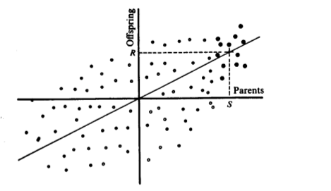

```{r setup, include=FALSE}
options(htmltools.dir.version = FALSE)
```


# The improvement through breeding

.pull-left[
<div align="center">

</div>

<div align="center">

</div>
]

--

.pull-right[

## Response to selection
### 1. Why has a character changed over generations?
### 2. Can we predict a change?

Especially one that we wish for in a direction, through actions such as imposing artificial selection?

]


---

# Response to selection

Change, or response ( $R$ ), is given by the basic equation:

\begin{align*}
R = h^2S
\end{align*}

- Here $S$ is the __selection differential__

- Is equal to the mean value of the selected parents ( $\mu_S$ ) minus the population mean ( $\mu$ ).

 ------
 
--

<div align="center">

</div>

---

# Response to selection

Change, or response ( $R$ ), is given by the basic equation:

\begin{align*}
R = h^2S
\end{align*}

- Here $S$ is the __selection differential__

- Is equal to the mean value of the selected parents ( $\mu_S$ ) minus the population mean ( $\mu$ ).

------
 
The regression of offspring on mid-parent is equal to the heritability
  - No non-genetic cause of resemblance
  - No natural selection, i.e. same fertility and viability
  
--

Therefore,

\begin{align*}
R = b_{O\bar{P}}S \\
R = h^2S
\end{align*}


---

# Response to selection

Change, or response ( $R$ ), is given by the basic equation:

\begin{align*}
R = h^2S
\end{align*}

Here S is the __selection differential__, which is equal to the mean value of the selected parents ( $\mu_S$ ) minus the population mean ( $\mu$ ).

 ------
 

.pull-left[
Improve the body weight
<div align="center">

</div>
]


.pull-right[
1. Base population ( $N=100$ ) mean = 1,000g

2. Selected 5 chicken as the parents, with mean =1,050g.

What is $S$?
]

---

# Response to selection

Change, or response ( $R$ ), is given by the basic equation:

\begin{align*}
R = h^2S
\end{align*}

Here S is the __selection differential__, which is equal to the mean value of the selected parents ( $\mu_S$ ) minus the population mean ( $\mu$ ).

 ------
 

.pull-left[
Improve the body weight
<div align="center">

</div>
]


.pull-right[
1. Base population ( $N=100$ ) mean = 1,000g

2. Selected 5 chicken as the parents, with mean =1,050g.

If $b_{OP}$ = 0.25.

What is $R$?
]

---

# Standardized selection differential

With the assumption that the phenotypic distributions are normal.

- Same $S$ means different selection pressure if the variances of the normal distributions are different

--

#### Selection differential in standard deviation units:

\begin{align*}
\frac{S}{\sigma_P}
\end{align*}

--

### __Intensity of selection ( $i$ )__

\begin{align*}
i = \frac{S}{\sigma_P}
\end{align*}

- $i$ is the "standarized selection differential"

- it better reflects the selection effort

---

# Intensity of selection ( $i$ )

.pull-left[
- With the assumption that the phenotypic distributions are normal.

- And standardize the selection differential:
\begin{align*}
&i= \frac{S}{\sigma_P} \\
\end{align*}
]


.pull-right[
```{r, out.width='100%', fig.align='center', echo=TRUE}
curve(dnorm(x,0,1), xlim=c(-3,3), xaxt="n", xlab="Trait Value", main="", ylab="Density", lwd=3)
fromd <- qnorm(.95); tod <- 3
S.x  <- c(fromd, seq(fromd, tod, 0.01), tod)
S.y  <- c(0, dnorm(seq(fromd, tod, 0.01)), 0)
polygon(S.x,S.y, col="grey")
abline(v=mean(S.x**S.y)*2, col="blue", lwd=3); abline(v=0, col="red", lwd=3)
```
]

---

# Intensity of selection ( $i$ )

.pull-left[

\begin{align*}
&i= \frac{S}{\sigma_P} \\
\end{align*}


- If $p$ is __the proportion selected__, i.e. the proportion of the population falling beyond the point of truncation.

- And $z$ is the __height of the ordinate__ at the point of truncation.

\begin{align*}
i = \frac{z}{p}
\end{align*}
]


.pull-right[
```{r, out.width='100%', fig.align='center', echo=TRUE}
curve(dnorm(x,0,1), xlim=c(-3,3), xaxt="n", xlab="Trait Value", main="", ylab="Density", lwd=3)
fromd <- qnorm(.95); tod <- 3
S.x  <- c(fromd, seq(fromd, tod, 0.01), tod)
S.y  <- c(0, dnorm(seq(fromd, tod, 0.01)), 0)
polygon(S.x,S.y, col="grey")
abline(v=mean(S.x**S.y)*2, col="blue", lwd=3); 
abline(v=0, col="red", lwd=3)
```
]

---

# Intensity of selection ( $i$ )

A table of these values is found in Appendix A of the F&M book.

.pull-left[
```{r, out.width='80%', fig.align='center', echo=TRUE}

ifun <- function(p=0.5){
  x=qnorm(p=(1-p)) # get the truncation point
  z=dnorm(x) # get z
  return(z/p) # get i
}

p <- seq(0.005, 1, by=0.005)
i <- ifun(p)
plot(p, i)
```
]

.pull-right[
```{r}
head(data.frame(p, i), 20)
```
]

---

# Breeder's equation

Given:
\begin{align*}
&R = h^2S\\
&S = i\sigma_P&
\end{align*}

--

So now, we have, as a prediction:

\begin{align*}
&R = h^2i\sigma_P\\
\end{align*}

where $i = \frac{z}{p}$.

---

# Breeder's equation

\begin{align*}
&R = h^2i\sigma_P\\
&i = \frac{z}{p}&
\end{align*}


.pull-left[
### Genders

With differential selection opportunities between genders in sexual reproduction, we need to account for this in our predictions:

\begin{align*}
&i = \frac{1}{2}(i_m + i_f)&
\end{align*}

]

--

.pull-right[
### Generation interval

Generation interval ( $L$ ) is the __"average age of the parents at the birth of their selected offspring"__.
- it is when they effectively leave the next generation that is then sampled to repeat the selection process.

\begin{align*}
&L = \frac{1}{2}(L_m + L_f)&
\end{align*}

]


---
# Breeder's equation

Now, on a time-constant basis to allow comparisons of alternatives:

\begin{align*}
R & = \frac{i}{L}h^2\sigma_P\\
& = \frac{i_m + i_f}{L_m + L_f}h^2\sigma_P\\
\end{align*}

With the $h^2$ and $\sigma_P$ terms possibly constant, we can simply compare the $\frac{i}{L}$ portions under different scenarios of selection and reproduction.

---

# Example: selection for body weight

A poultry breeder is selecting for 56-day body weight in chicken.

- __Base population__: a random mating population of 154 males and 155 females. Mean value = 1,000g; sd = 50g.

- __Selection scheme__: 8 males and 48 females with the highest body weight to found the next generation.
- __h2__: from previous parent-offspring regression and half-sib analysis, $h^2=0.45$.

--

#### What is the predicted response to selection in next generation?


\begin{align*}
& R = \frac{i_m + i_f}{2}h^2\sigma_P\\
\end{align*}

--

```{r}
i_m <- ifun(p= 8/154) #2.05
i_f <- ifun(p= 48/155) # 1.14
(i_m + i_f)/2*0.45*50
```


---

# Example: selection for body weight in chicken

A poultry breeder is selecting for 56-day body weight in chicken.

- __Base population__: a random mating population of 154 males and 155 females. Mean value = 1,000g; sd = 50g.

- __Selection scheme__: 8 males and 48 females with the highest body weight to found the next generation.
- __h2__: from previous parent-offspring regression and half-sib analysis, $h^2=0.45$.


#### What is the selection differential for the male and female?

\begin{align*}
&S = i\sigma_P&
\end{align*}

--

```{r}
Sm <- i_m*50 #102
Sf <- i_f*50 # 57
```

--

Why response 36g not equal to average value of the $S_m$ and $S_f$?


---

# Example: selection for body weight


<div align="center">

</div>

- $S_m =102$ and $S_f=57$ are the means of the selected parents
- $R=36$ is the mean of the offspring.

--

Not equal because the heritability is less than one, which means that the phenotypes of the parents was less than a perfect indictor of their breeding values.


---

# Improvement of response

\begin{align*}
& R =  \frac{i h^2\sigma_P}{L} \\
\end{align*}

The form of the breeder's equation allows us to clearly see how to maximize response to selection per unit of time.

--

### 1. Reduce the generation interval
This factor is bound by the biology of the organisms, but ways to reduce the generation interval are possible.

--

 - Selection during the off-season in plants
 
  - winter nursery
  - [speed breeding](https://youtu.be/Zwk1IGYPJiA) (Watson et al., 2018), up to 6 six generations per year

--

 - __Genomic selection__
  - Selection without phenotyping
 

---

# Improvement of response

\begin{align*}
& R =  \frac{i h^2\sigma_P}{L} \\
\end{align*}


### 2. Increase the heritability of the trait
Depends on the genetic architecture, not always under the control of the breeder.

--

 - Maximizing the repeatability of trait evaluation.
 
 - Sound measurement methods and proper experimental design
 
---

# Improvement of response

\begin{align*}
& R =  \frac{i h^2\sigma_P}{L} \\
\end{align*}


### 3. Increase the selection intensity

- Reduce the number of individuals selected to serve as parents of the next generation

--
  - __Be cautious__: increase the inbreeding coefficient and hence loss of alleles through genetic drift.
  
  - __Increase $i$ is likely not the most efficient path!__
    i.e. p from 10% to 5% => i from 1.755 to 2.063.

--

- Increase the population size from which selections are made

 
---

# Improvement of response

\begin{align*}
& R =  \frac{i h^2\sigma_P}{L} \\
\end{align*}


### 4. Increase additive genetic variance

\begin{align*}
& h^2 = \frac{\sigma_A^2}{\sigma^2_P}; & h = \frac{\sigma_A}{\sigma_P} \\
\end{align*}

--

\begin{align*}
& R =  i h\sigma_A/L\\
\end{align*}

--

- The breeding population needs to contain adequate additive genetic variation for the trait of interest.

- If no difference in breeding values exist between individuals within the population, genetic gain through selection is not possible.


