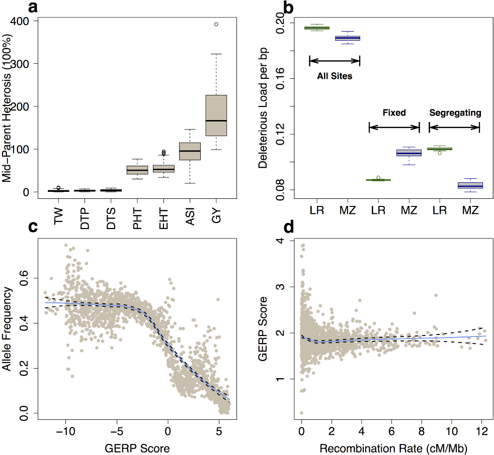
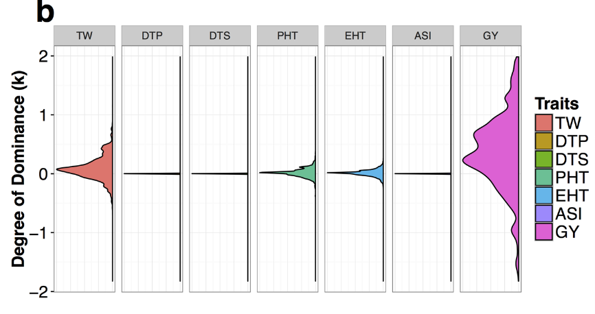

```{r setup, include=FALSE}
options(htmltools.dir.version = FALSE)
```


### Equation interpretation

- This means that a preponderance of dominance in one direction is needed.
 - e.g., the alleles that increase the trait value need to be dominant more than recessive.

- In the absence of epistasis, $M_F$ declines linearly with increasing F.

---

# Variation of inbreeding depression

Bowman and Falconer, 1960 found an inbred strain of mice with litter size greater than original population.

--

- Selection can reduce inbreeding depression
- Genetic variation for degree and rate of inbreeding depression exists


---

# Effect of epistasis 

- Failure of wide crosses to exhibit heterosis could be attributed to epistasis
 - It could be that when individuals are adapted to widely different conditions, their F1 is adapted to neither.
 - Alleles at many loci could be "co-adapted" and exhibit favorable epistasis.

--

# Outbreeding depression
- Data from Moll et al., 1965 shows decrease in heterosis with diversity of cross. However, no evidence of epistasis.

---
# Deleterious alleles and heterosis

- Heterosis in the F1 caused by the masking of __deleterious recessive alleles__ in heterozygotes by dominant favorable alleles.
- It is likely that both parents carry some deleterious alleles, reducing the genotypic value of the inbred parents.

--

### Empirical evidence

.pull-left[
<div align="center">

</div>
]

.pull-right[
> Yang et al., 2017. Incomplete dominance of deleterious alleles contributes substantially to trait variation and heterosis in maize

]

---
# Deleterious alleles and heterosis


### Empirical evidence

.pull-left[
<div align="center">

</div>
]

.pull-right[
> Yang et al., 2017. Incomplete dominance of deleterious alleles contributes substantially to trait variation and heterosis in maize

]
