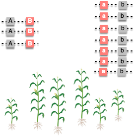
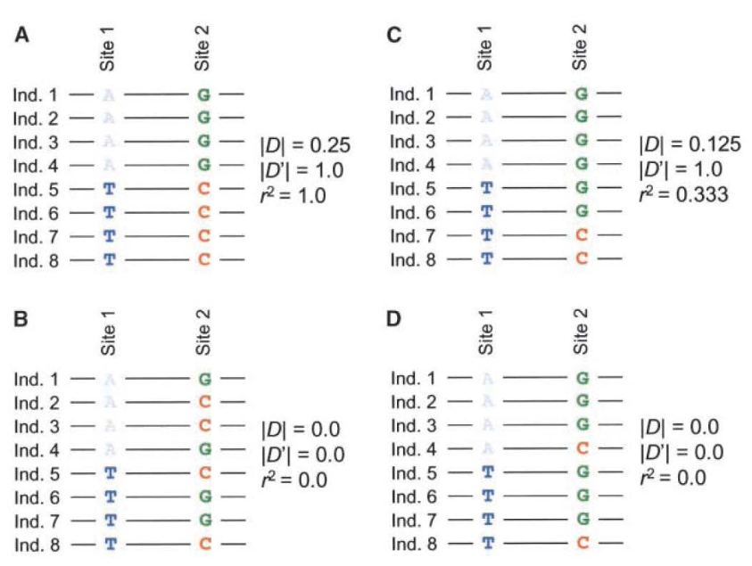
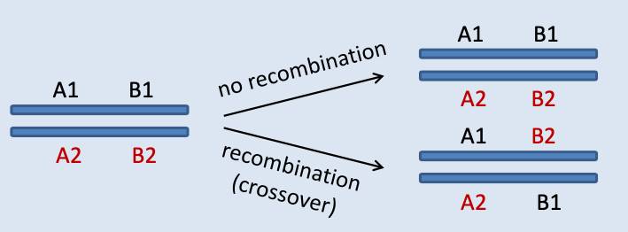

```{r setup, include=FALSE}
options(htmltools.dir.version = FALSE)
```

# Two SNP Loci

.pull-left[
<div align="center">

</div>
]

.pull-right[
- dog 1: AA AA __TT__ CC __CC__ 
- dog 2: AA AA __CC__ CC __GG__
- dog 3: AA AA __CT__ CC __CC__ 
- dog 4: AA AA __CT__ CC __GC__
- dog 5: AA AA __CC__ CC __CC__
]

--

---------

.pull-right[
- dog 1: A A __T__ C __C__ / A A __T__ C __C__
- dog 2: A A __C__ C __G__ / A A __C__ C __G__
- dog 3: A A __C__ C __C__ / A A __T__ C __C__
- dog 4: A A __C__ C __G__ / A A __T__ C __C__
- dog 5: A A __C__ C __C__ / A A __C__ C __C__
]

### Haplotype Phasing:  
- Involves separating maternally and paternally inherited copies of each chromosome into haplotypes to get a complete picture of genetic variation.

---

# Two or more SNP loci

The __expected haplotype frequency__ = the product of the frequencies of the individual alleles that make up the haplotype

--

.pull-left[
<div align="center">

</div>
]

.pull-right[
- dog 1: A A __T__ C __C__ / A A __T__ C __C__
- dog 2: A A __C__ C __G__ / A A __C__ C __G__
- dog 3: A A __C__ C __C__ / A A __T__ C __C__
- dog 4: A A __C__ C __G__ / A A __T__ C __C__
- dog 5: A A __C__ C __C__ / A A __C__ C __C__
]

#### Example:

- Two loci: A and B with alleles $A_1$ (T) $A_2$ (C) and $B_1$ (G) $B_2$ (C)

- Consider Haplotype $A_1B_2$ ( __--T-C__ )

- Allele frequencies: $f_{A_1}=0.4$ and $f_{B_2} = 0.7$

--

- Expected frequency of the haplotype = $f_{A_1} \times f_{B_2} = 0.4 \times 0.7 = 0.28$

- Observed haplotype freq = 4/10 = 0.4

---

# Linkage Equilibrium (LE)

If the observed haplotype frequency fits expectations under HWE, the alleles are inherited independent of one another

- They are in __Linkage Equilibrium__, 

\begin{align*}
f_{AB} & = p_Ap_B \\
f_{Ab} & = p_Ap_b = p_A(1-p_B) \\
f_{aB} & = p_ap_B = (1- p_A)p_B \\
p_{ab} & = p_ap_b = (1 - p_A)(1 - p_B) \\
\end{align*}

--

- Otherwise, would be in __Linkage Disequilibrium__
 - Genotype frequencies are __not__ as expected with independent assortment (and HWE)


\begin{align*}
f_{AB} & \ne p_Ap_B \\
f_{Ab} & \ne p_Ap_b = p_A(1-p_B) \\
f_{aB} & \ne p_ap_B = (1- p_A)p_B \\
p_{ab} & \ne p_ap_b = (1 - p_A)(1 - p_B) \\
\end{align*}


---

# Linkage Disequilibrium (LD)

LD measures the extent to which alleles are associated

- The non-random association between alleles at two loci

--

### Why do we care?

- Linkage mapping

- Information regarding effective population size/inbreeding

- Can be leveraged to detect genome structural variation, i.e., inversion

---

# Linkage Disequilibrium (LD)


.pull-left[
<div align="center">

</div>
]

.pull-right[
- Allele at one locus is correlated with allele at 2nd locus

- Non-random association of alleles
]

---

# Measuring LD: $D$ Statistics

$D$ stat measures the deviation of haplotype frequencies from expected values based on allele frequencies.

\begin{align*}
D_{AB} & = f_{AB} - p_Ap_B \\
\end{align*}

- $f_{AB}$ is the observed freq of AB haplotype

- $p_Ap_B$ is the expected freq given allele freqs

- If $D = 0$, the alleles are inherited independently.

--

\begin{align*}
D_{AB} & = D_{ab} \\
 & = -D_{Ab} = -D_{aB} 
\end{align*}


---

# Measuring LD: $D$ Statistics

\begin{align*}
D_{AB} & = f_{AB} - p_Ap_B \\
\end{align*}

------------

.pull-left[
<div align="center">

</div>
]

--

.pull-right[
Observed:
- $p_{AB} = 3/10 = 0.3$

Expected: 
- $p_A = 3/10 = 0.3$
- $p_B = 3/10 = 0.3$
- $p_Ap_B = 0.3 \times 0.3 = 0.09$

LD:
- $D_{AB} = 0.3 - 0.09 = 0.21$
]

--

$D_{AB} \ne 0$
- A and B alleles are observed together more often than expected
- These two alleles are in LD

---
# Summary of LD

| Gamete | AB   | Ab   | aB   | ab  |
| :-------: | : ------ : | :-------: | :-------: | :-------: | 
| Observed  | $f_{AB}$    | $f_{Ab}$    | $f_{aB}$     | $f_{ab}$     | 
|           |  $r$        |  $s$        |  $t$   |  $u$       |
| Expected (HWE)  | $p_Ap_B$   | $p_Aq_b$    | $q_ap_B$    | $q_aq_b$    | 
| Obs - Exp | $+D$ | $-D$ | $-D$ | $+D$ |

--

- $r$ and $u$: coupling gametes (AB and ab)
- $s$ and $t$: repulsion gametes (Ab and aB)

--

Here, we know:
\begin{align*}
p_A & = f_{AB} + f_{Ab} \\
p_B & = f_{AB} + f_{aB} \\
\end{align*}

--

And 
\begin{align*}
D_{AB} & = f_{AB} - p_Ap_B \\
 & = f_{AB} - (f_{AB} + f_{Ab})(f_{AB} + f_{aB}) = r - (r + s)(r + t) \\
 &  = r - r^2 - rt -sr -st = r(1 -r - t -s) - st \\
 & = ru -st \\
\end{align*}

---
# Summary of LD

| Gamete | AB   | Ab   | aB   | ab  |
| :-------: | : ------ : | :-------: | :-------: | :-------: | 
| Observed  | $f_{AB}$    | $f_{Ab}$    | $f_{aB}$     | $f_{ab}$     | 
|           |  $r$        |  $s$        |  $t$   |  $u$       |
| Expected (HWE)  | $p_Ap_B$   | $p_Aq_b$    | $q_ap_B$    | $q_aq_b$    | 
| Obs - Exp | $+D$ | $-D$ | $-D$ | $+D$ |


- $r$ and $u$: coupling gametes (AB and ab)
- $s$ and $t$: repulsion gametes (Ab and aB)

----------

\begin{align*}
D & =  ru -st \\
\end{align*}

### D = coupling gametes - repulsion gametes


---

# Range of $D$ through simulation

```{r fig.height=5}
fab <- seq(0, 1, by=0.01)
pa <- seq(0, 1, by=0.01)
pb <- seq(0, 1, by=0.01)
plot(fab - pa * pb, type ="l", ylab="D stat", xlab="hap frq")
```
---

# Range of $D$

If all gametes are AB or ab (completely linked) and $P_A =P_B = 0.5$

\begin{align*}
D_{AB} & =  f_{AB} - p_Ap_B = 0.5 - 0.5 \times 0.5 = 0.25 \\
D_{AB} & = -D_{Ab}
\end{align*}

Therefore, __ $D$ ranges from $-0.25$ to $0.25$__


--


- In real life, this range is not usually maximized and can be determined by allele frequencies

- Due to dependence on allele frequencies, D cannot be compared between different sets of loci

---

# Measuring LD: $D'$

Richard Lewontin described how to normalize D for easier interpretation

\begin{align*}
D' & =  \frac{D}{D_{max}}
\end{align*}

--

------------------

$D_{max}$ is the max value of the greatest possible LD for a given set of allele frequencies.

If $D > 0$,
\begin{align*}
D_{max} & =  min(p_Aq_b, q_ap_B)
\end{align*}

If $D < 0$,

\begin{align*}
D_{max} & =  min(p_Ap_B, q_aq_b)
\end{align*}

--

- $D'$ therefore ranges from 0 to 1

- $D'$ allows to be more informative in comparisons


---

# From our prior example

\begin{align*}
D_{AB} & = f_{AB} - p_Ap_B \\
\end{align*}

------------

.pull-left[
<div align="center">

</div>
]


.pull-right[
Observed:
- $p_{AB} = 3/10 = 0.3$

Expected: 
- $p_A = 3/10 = 0.3$
- $p_B = 3/10 = 0.3$
- $p_Ap_B = 0.3 \times 0.3 = 0.09$

LD:
- $D_{AB} = 0.3 - 0.09 = 0.21$
]

--

\begin{align*}
D & > 0 \\
D_{max} & =  min(p_Aq_b, q_ap_B) \\
& = min(0.3 \times 0.7, 0.7 \times 0.3) = 0.21 \\
D' &= \frac{D}{D_{max}} = 1
\end{align*}

---

# Alternatives to D

Hill and Robertson use $r^2$: correlation between two loci
- ranges from 0 to 1

\begin{align*}
r^2 = \frac{D^2}{p_Aq_ap_Bq_b}
\end{align*}

--

Because $r^2$ considers allele frequency while $D'$ uses frequency for normalization, $D'$ can be high with low $r^2$

---

# Comparison of $D$, $D'$ and $r^2$


<div align="center">

</div>

> From [Gaut and Long 2003](https://academic.oup.com/plcell/article/15/7/1502/6010073). Plant Cell


---

# Interpreting LD

### The case when $D' = 1$ is referred to as __Complete LD__

- In this case, there are at most 3 of the 4 possible haplotypes present in the populations.

- The intuition behind complete LD is that the two loci are not being separated by a recombination in this population since at least one of the haplotypes does not occur in the populations.

--

### The case when $r^2 = 1$ is referred to as __Perfect LD__

- The case of perfect LD occurs when there are exactly 2 of the 4 possible haplotypes present in the population.

- As a result, the two loci also have the same allele frequencies.

- Loci that are in __perfect LD__ are necessarily in __complete LD__


---

# Causes of LD

- Natural selection

- Genetic drift

- Population subdivision/bottlenecks

- Inbreeding

--

### This does not only apply to haplotypes
- Alleles can be on different chromosomes and still in LD!

---

# Applications

- Mutation/gene mapping

- Detecting selection

- Estimating allele age


---

# LD decays over time via recombination

- $D_0$ = LD at time zero
- $D_1$ = LD at generation 1

--

The value of $D_1$ depends on recombination rate

<div align="center">

</div>

---

# Decay of LD

### Recombination frequency ( $c$ )

The probability of crossover between A and B 

- $c$ ranges from 0 (no crossover) to 0.5 (independent loci)

--

For Example, we are interested in freq of $A_1B_1$ haplotype in progeny

Two ways to get an $A_1B_1$ gamete:

- #### From $A_1B_1/A_xB_x$ with no recombination
  - Frequency of this $= r(1-c)$
  - $r$ is frq of $p_{A_1B_1}$ in parental gametes
  
--

- #### From recombination from $A_1B_x/A_xB_1$ genotype
  - Frequency $=p_Ap_Bc$
  - $p_A = f_{A_1Bx}$ and $p_B = f_{A_xB_1}$


---

# Frequency of $A_1B_1$ in progeny

Frequency of the haplotype being maintained (no recombination) + frequency it is generated through recombination

\begin{align*}
r_1 = r(1-c) + p_Ap_Bc
\end{align*}

--

### What about LD in progeny?

Observed - expected:

\begin{align*}
D_1 & = r_1 - p_Ap_B \\
\end{align*}

--

Substitute in $r_1$ from above,

\begin{align*}
D_1 & = r(1-c) + p_Ap_Bc - p_Ap_B \\
& = r(1-c) - p_Ap_B(1-c) \\
& = (1-c)(r - p_Ap_B)
\end{align*}

--

Note that $r$ is the observed haplotype freq $f_{AB}$,

\begin{align*}
D_1 & = D(1-c)
\end{align*}

---

# LD after $t$ generations

\begin{align*}
D_t & = D(1-c)^t
\end{align*}

For unlinked loci ( $c =0.5$, the red line), LD decays by half each generation.

```{r fig.height=4}
t = seq(0,25, by=1)
D <- function(t, c){return(0.25*(1-c)^t)} 
plot(t, D(t, c=0), type="l", col="blue", ylim=c(0, 0.3), xlab="Generation", ylab="LD (D)")
lines(t, D(t, c=0.01), type="l", col="green")
lines(t, D(t, c=0.05), type="l", col="yellow")
lines(t, D(t, c=0.1), type="l", col="orange")
lines(t, D(t, c=0.5), type="l", col="red")
```


