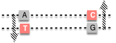
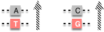

```{r setup, include=FALSE}
options(htmltools.dir.version = FALSE)
```

# Expectation and Variance 

### Expectation $E(X)$:  
- A measure of the __mean value__ of a variable

\begin{align*}
E[X] &= \mu_X \\
&= \sum\limits_{i=1}^kf(x_i)Pr(X = x_i)
\end{align*}


--

### Variance $Var(X)$: 
- A measure of the __spread__ of a variable

\begin{align*}
Var(X) & = \sigma_X^2 \\
       & = E[X^2] - E[X]^2 \\
\end{align*}


---
# An example: Tobacco leaves

Number of leaves per plant in a F1 population (N=25) crossed from two inbred lines of tobacco:
```{r table1, echo=FALSE, warnings=FALSE}
library(knitr)
library(kableExtra)
f1 <- data.frame(v1=c(18, 15, 16, 18, 15),
                 v2= c(16, 14, 16, 18, 17),
                 v3=c(16, 13, 16, 14, 16),
                 v4=c(15, 16, 15, 15, 16),
                 v5=c(15, 16, 16, 15, 16))
kable(f1, col.names = NULL)
```

--

Then, made N=25 F2 plants:
```{r table2, echo=FALSE, warnings=FALSE}
f2 <- data.frame(v1=c(16, 20, 19, 17, 14),
                 v2=c(16, 14, 14, 15, 17),
                 v3=c(20, 13, 12, 15, 16),
                 v4=c(21, 18, 15, 14, 18),
                 v5=c(14, 17, 13, 15, 13))
kable(f2, col.names = NULL)
```

---
# An example: Tobacco leaves

### Mean and variance of F1 and F2 populations?
```{r, warnings=FALSE}
f1 <- as.vector(as.matrix(f1))
f2 <- as.vector(as.matrix(f2))
mean(f1)
mean(f2)
```

--

```{r}
var(f1)
var(f2)
```

---
# Tobacco example


```{r, out.width='40%', fig.align='center', warnings=FALSE}
library(ggplot2)
df <- rbind(data.frame(number=f1, pop="F1"), data.frame(number=f2, pop="F2"))
ggplot(df, aes(x=pop, y=number, fill=pop)) +
  scale_fill_manual(values=c("#E69F00", "#56B4E9")) +
  geom_violin(trim=FALSE) +
  guides(fill=guide_legend(title="Popl.s")) +
  theme_classic() +
  theme(legend.position=c(0.2, 0.8), axis.text=element_text(size=20),
              axis.title=element_text(size=20))
```


---
# Covariance

To quantify to what extent the two variables **co-vary**.

$$
\begin{aligned}
Cov(X, Y) & = \sigma_{XY} \\
& = E([X - E(X)][Y - E(Y)]) \\
& = E(XY) - E(X)E(Y) \\
\end{aligned}
$$

where,

$$
\begin{aligned}
E(XY) = \sum_i \sum_j x_i y_j Pr(X = x_i, Y = y_j)
\end{aligned}
$$

--

### The variance of a sum

\begin{align*}
& Var(X+Y) = Var(X) + Var(Y) + 2Cov(X, Y) \\
& \sigma_{X+Y}^2 = \sigma_X^2 + \sigma_Y^2 + 2\sigma_{XY} \\
\end{align*}


---
# Phenotypic variance partitioning

### Phenotypic model: P = G + E

\begin{align*}
& Var(P) = Var(G+E) \\
& \sigma_{P}^2 = \sigma_{G+E}^2 = \sigma_G^2 + \sigma_E^2 + 2\sigma_{GE}
\end{align*}

--

- $\sigma_{G}^2$ is the variance of the genotypic effects
- $\sigma_{E}^2$ is the variance of the environmental deviation
- $\sigma_{GE}$ is the covariance between genotypic effects and environmental deviation. **Normally, we assume $\sigma_{GE} = 0$**

--

Therefore,
\begin{align*}
& \sigma_{P}^2 = \sigma_G^2 + \sigma_E^2
\end{align*}

---

# Genetic variance partitioning 

The genotypic value could be partitioned into the breeding value and dominance deviation.

### Genotypic model:  $G = A + D$

\begin{align*}
& \sigma_{G}^2 = \sigma_A^2 + \sigma_D^2
\end{align*}

--

### Breeding Value:  $A = \alpha_i + \alpha_j$

\begin{align*}
& \sigma_{A}^2 = \sigma_{\alpha_i}^2 + \sigma_{\alpha_j}^2
\end{align*}

Therefore,

\begin{align*}
& \sigma_{G}^2 = \sigma_{\alpha_i}^2 + \sigma_{\alpha_j}^2 + \sigma_{\delta_{ij}}^2
\end{align*}

---
# Epistatic effect for multiple loci

### Genotypic effect model

\begin{align*}
& G_{ijkl} = \mu + (\alpha_i + \alpha_j + \delta_{ij}) + (\alpha_k + \alpha_l + \delta_{kl}) + I_{ijkl}
\end{align*}

--
### Genotypic variance

\begin{align*}
\sigma_{G_{ijkl}}^2 = & (\sigma_{\alpha_i}^2 + \sigma_{\alpha_j}^2 + \sigma_{\delta_{ij}}^2) \\
                    & + (\sigma_{\alpha_k}^2 + \sigma_{\alpha_l}^2 + \sigma_{\delta_{kl}}^2) \\
                    & + \sigma^2_{I_{ijkl}} \\
                    = & (\sigma_{\alpha_i}^2 + \sigma_{\alpha_j}^2 + \sigma_{\alpha_k}^2 + \sigma_{\alpha_l}^2 ) \\
                    & + (\sigma_{\delta_{ij}}^2 + \sigma_{\delta_{kl}}^2) \\
                    & + \sigma^2_{I_{ijkl}}\\
                    = & \sigma_A^2 + \sigma_D^2 + \sigma_I^2 \\
\end{align*}


---
# Additive and dominance variance


| Genotype  | Freq      | Breeding Value | $A^2$  | Dominance Deviation  | $D^2$ |
| :-------: | :-------: | :-----------: | :-------: | :-------: | :-------: | :-------: |
| $A_1A_1$  | $p^2$     | $2q\alpha$    |    |  $-2q^2d$   |   |
| $A_1A_2$  | $2pq$     | $(q-p)\alpha$ |   |  $2pqd$   |   |
| $A_2A_2$  | $q^2$     | $-2p\alpha$   |   |  $-2p^2d$   |   |

--

#### Variance $Var(X)$: **a measure of the spread of a variable**
\begin{align*}
Var(X) & = \sigma_X^2 = V_A \\
       & = E[X^2] - E[X]^2 \\
\end{align*}

--
### What is the $\sigma^2_{A}$ and $\sigma^2_{D}$?

Remember that the means of **breeding value** and **dominance deviation** are **0**.


---
# Additive and dominance variance


| Genotype  | Freq      | Breeding Value | $A^2$  | Dominance Deviation  | $D^2$ |
| :-------: | :-------: | :-----------: | :-------: | :-------: | :-------: | :-------: |
| $A_1A_1$  | $p^2$     | $2q\alpha$    | $(2q\alpha)^2$  |  $-2q^2d$   | $(-2q^2d)^2$ |
| $A_1A_2$  | $2pq$     | $(q-p)\alpha$ | $(q-p)^2\alpha^2$ |  $2pqd$   | $(2pqd)^2$ |
| $A_2A_2$  | $q^2$     | $-2p\alpha$   | $(-2p\alpha)^2$ |  $-2p^2d$   | $(-2p^2d)^2$ |

\begin{align*}
Var(X) & = \sigma_X^2 = V_A \\
       & = E[A^2] - E[A]^2 \\
       & = E[A^2]
\end{align*}

The __additive genetic variance__ in a HWE population is:

--

\begin{align*}
\sigma_A^2 & = p^2(2q\alpha)^2 + 2pq(q-p)^2\alpha^2 + q^2(-2p\alpha)^2 \\
           & = 2pq\alpha^2(2pq + (q-p)^2 + 2pq) \\
           & = 2pq\alpha^2(p+q)^2 \\
           & = 2pq\alpha^2 \\
           & = 2pq(a + d(q-p))^2 \\
\end{align*}
  
  
---
# Additive and dominance variance


| Genotype  | Freq      | Breeding Value | $A^2$  | Dominance Deviation  | $D^2$ |
| :-------: | :-------: | :-----------: | :-------: | :-------: | :-------: | :-------: |
| $A_1A_1$  | $p^2$     | $2q\alpha$    | $(2q\alpha)^2$  |  $-2q^2d$   | $(-2q^2d)^2$ |
| $A_1A_2$  | $2pq$     | $(q-p)\alpha$ | $(q-p)^2\alpha^2$ |  $2pqd$   | $(2pqd)^2$ |
| $A_2A_2$  | $q^2$     | $-2p\alpha$   | $(-2p\alpha)^2$ |  $-2p^2d$   | $(-2p^2d)^2$ |


Likewise, the variance due to dominance deviations in a HWE population is:

\begin{align*}
Var(X) & = \sigma_X^2 = V_D \\
       & = E[D^2] - E[D]^2 \\
       & = E[D^2]
\end{align*}
--

\begin{align*}
\sigma_D^2 & = p^2(-2q^2d)^2 + 2pq(2pqd)^2 + q^2(-2p^2d)^2 \\
           & = 4p^2q^2d^2(q^2 + 2pq + p^2) \\
           & = 4p^2q^2d^2 \\
           & = (2pqd)^2 \\
\end{align*}
  

---
# Graphical Representation

```{r, out.width='45%', fig.align='center'}
a = 1
d = 0*a # pure additive#<<
q = seq(0, 1, by=0.01)
p = 1 - q
va <- 2*p*q*(a + d*(q-p))^2
vd <- (2*p*q*d)^2
vg <- va + vd
plot(p, vg, lty=1, lwd=5, type="l", xlab="Allele Freq", ylab="Variance")
lines(p, va, lty=2, lwd=5, col="red")
lines(p, vd, lty=3, lwd=5, col="blue")
```


---
# Graphical Representation

```{r, out.width='50%', fig.align='center', echo=FALSE}
a = 1
d = 0*a #<<
q = seq(0, 1, by=0.01)
p = 1 - q

va <- 2*p*q*(a + d*(q-p))^2
vd <- (2*p*q*d)^2
vg <- va + vd

par(mfrow=c(2,2))
plot(p, vg, lty=1, lwd=5, type="l", xlab="Allele Freq", ylab="Variance", main="a=1, d=0")
lines(p, va, lty=2, lwd=5, col="red")
lines(p, vd, lty=3, lwd=5, col="blue")

d = 0.5*a #<<
va <- 2*p*q*(a + d*(q-p))^2
vd <- (2*p*q*d)^2
vg <- va + vd

plot(p, vg, lty=1, lwd=5, type="l", xlab="Allele Freq", ylab="Variance", main="a=1, d=0.5")
lines(p, va, lty=2, lwd=5, col="red")
lines(p, vd, lty=3, lwd=5, col="blue")

d = 1*a #<<
va <- 2*p*q*(a + d*(q-p))^2
vd <- (2*p*q*d)^2
vg <- va + vd
plot(p, vg, lty=1, lwd=5, type="l", xlab="Allele Freq", ylab="Variance", main="a=1, d=1")
lines(p, va, lty=2, lwd=5, col="red")
lines(p, vd, lty=3, lwd=5, col="blue")

a = 0
d = 1 #<<
va <- 2*p*q*(a + d*(q-p))^2
vd <- (2*p*q*d)^2
vg <- va + vd
plot(p, vg, lty=1, lwd=5, type="l", xlab="Allele Freq", ylab="Variance", main="a=0, d=1")
lines(p, va, lty=2, lwd=5, col="red")
lines(p, vd, lty=3, lwd=5, col="blue")

```


- Genetic variance components are typically maximized at intermediate allele frequencies. 
- Additive genetic variance typically makes up most of the genetic variance except in unusual situations, such as when overdominant gene action is present or allele frequencies are at the extremes.


---

# Variance due to disequilibrium

Consider two loci that affect a trait. The genotypic value across both loci is

### G'' = G' + G

\begin{align*}
& Var(G'') = Var(G'+G) \\
& \sigma_{G''}^2 = \sigma_{G'}^2 + \sigma_G^2 + 2\sigma_{G'G} \\
& \sigma_{G''}^2 = \sigma_{G'}^2 + \sigma_G^2 + 2E[(G' - \mu_{G'})(G - \mu_G)]
\end{align*}

--

- #### When the loci are independent, the covariance term equals to zero.

--

- #### When loci in LD, what do you think the covariance term will be?
  - i.e., positive or negative?

---

# Variance due to disequilibrium

\begin{align*}
& \sigma_{G''}^2 = \sigma_{G'}^2 + \sigma_G^2 + 2E[(G' - \mu_{G'})(G - \mu_G)] \\
& \sigma_{G''}^2 = \sigma_{G'}^2 + \sigma_G^2 + 2E(G' - \mu_{G'}) \times E(G - \mu_G)
\end{align*}

### Negative covariance
Two loci are linked in repulsion phase. => reduce the genetic variance.

<div align="center">

</div>

--

### Positive covariance
Two loci are in coupling linkage, i.e., assortative mating.

<div align="center">

</div>

---

# Variance due to GxE interaction


```{r, out.width='50%', fig.align='center', echo=FALSE}
l1 <- 1+1
l2 <- 2+2

plot(c(1,2), c(1,2), pch=c("B", "B"), xlim=c(0.5, 2.5), ylim=c(0.5,3.5), cex=2, xaxt="n", yaxt="n", xlab="Locations", ylab="Hybrid Yield", cex.lab=1.5)
points(c(1,2), c(2,3), pch=c("A", "A"), cex=2)
lines(c(1,2), c(1,2))
lines(c(1,2), c(2,3))  
  
```

Here, we have two genotypes (or varieties) A and B, tested in two different locations.

---

# Variance due to GxE interaction

Often time, different genotypes react to different environments differently.

```{r, out.width='50%', fig.align='center', echo=FALSE}

par(mfrow=c(2,2))
plot(c(1,2), c(1,2), pch=c("B", "B"), xlim=c(0.5, 2.5), ylim=c(0.5,3.5), cex=2, xaxt="n", yaxt="n", xlab="", ylab="Hybrid Yield", cex.lab=1.5)
points(c(1,2), c(2,3), pch=c("A", "A"), cex=2)
lines(c(1,2), c(1,2))
lines(c(1,2), c(2,3))  

plot(c(1,2), c(1,2), pch=c("B", "B"), xlim=c(0.5, 2.5), ylim=c(0.5,4), cex=2, xaxt="n", yaxt="n", xlab="", ylab="", cex.lab=1.5)
points(c(1,2), c(2,4), pch=c("A", "A"), cex=2)
lines(c(1,2), c(1,2))
lines(c(1,2), c(2,4)) 

plot(c(1,2), c(1,2), pch=c("B", "B"), xlim=c(0.5, 2.5), ylim=c(0.5,3.5), cex=2, xaxt="n", yaxt="n", xlab="Location", ylab="Hybrid Yield", cex.lab=1.5)
points(c(1,2), c(2,1), pch=c("A", "A"), cex=2)
lines(c(1,2), c(1,2))
lines(c(1,2), c(2,1))  

plot(c(1,2), c(1,3.3), pch=c("B", "B"), xlim=c(0.5, 2.5), ylim=c(0.5,3.5), cex=2, xaxt="n", yaxt="n", xlab="Location", ylab="", cex.lab=1.5)
points(c(1,2), c(2,1), pch=c("A", "A"), cex=2)
lines(c(1,2), c(1,3.5))
lines(c(1,2), c(2,1))  

```


---

# Variance due to GxE interaction

In this case, 

\begin{align*}
& P = G + E + G \times E \\
\end{align*}

--
Or,
\begin{align*}
& P = G + E + I_{GE} \\
\end{align*}
where $I_{GE}$ is the __interaction effect__ between genotype and environment.

--

And the variance is,

\begin{align*}
& \sigma_P^2 = \sigma^2_G + \sigma^2_E + 2Cov(G, E) + \sigma^2_{I_{GE}} \\
\end{align*}

--

- The covariance between genetic and non-genetic effects is often zero except in special circumstances.

- The variance due to interaction between genotype and environment is considered a non-genetic variance and is typically pooled in with $\sigma_E^2$.


