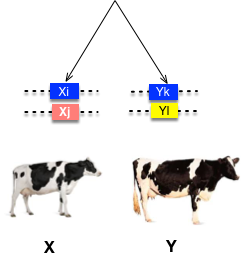
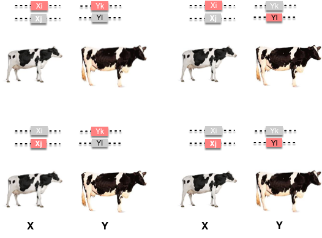
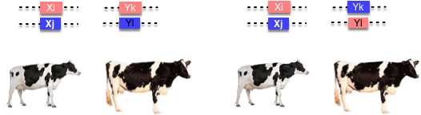
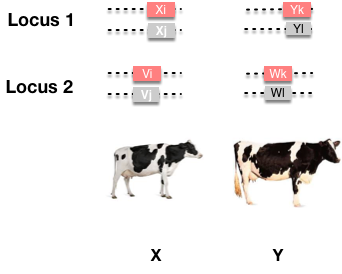

```{r setup, include=FALSE}
options(htmltools.dir.version = FALSE)
```


# General framework for genetic covariance

<div align="center">

</div>

--

If allele $x_i$ carried by individual X is IBD to allele $y_k$ in Y, then the covariance due to this allele is:

\begin{align*}
Cov(\alpha_i, \alpha_k) & =  E[(\alpha_i - \mu_{\alpha})(\alpha_k - \mu_{\alpha})] \\
& = E[(\alpha_i - \mu_{\alpha})^2] \\
& = \sigma_{\alpha}^2
\end{align*}

Because $\alpha_i = \alpha_k$ if alleles $x_i$ and $y_k$ are IBD.

---
# Additive genetic covariance


Alleles in individuals $X (x_ix_j)$ and $Y (y_ky_l)$ can be IBD through four possible events:
  
--

<div align="center">

</div>

\begin{align*}
& x_i \equiv y_k \\
& x_i \equiv y_l \\
& x_j \equiv y_k \\
& x_j \equiv y_l \\
\end{align*}

---
# Additive genetic covariance

Therefore, the covariance due to additive genetic effects:

\begin{align*}
Cov_\alpha(X, Y) = & P(x_i \equiv y_k)Cov(\alpha_i, \alpha_k) + P(x_i \equiv y_l)Cov(\alpha_i, \alpha_l) \\
 & + P(x_j \equiv y_k)Cov(\alpha_j, \alpha_k) + P(x_j \equiv y_l)Cov(\alpha_j, \alpha_l) \\
 = & 4f_{XY}\sigma_\alpha^2 \\
 = & 2f_{XY}\sigma_A^2 \\
\end{align*}

Because $\sigma_A^2 = \sigma_{\alpha_i}^2 + \sigma_{\alpha_j}^2 = 2\sigma_\alpha^2$ and $\alpha_i = \alpha_k$ when alleles $i$ and $k$ are IBD.


---

# Covariance due to dominance deviations

To get dominance deviations, must be two alleles IBD:

<div align="center">

</div>

--

\begin{align*}
& x_i \equiv y_k,  x_j \equiv y_l\\
& x_j \equiv y_l,  x_j \equiv y_k \\
\end{align*}

--

Therefore,

\begin{align*}
Cov_\delta(X, Y) = & P(x_i \equiv y_k,  x_j \equiv y_l)Cov(\delta_{ij}, \delta_{kl}) + P(x_j \equiv y_l,  x_j \equiv y_k)Cov(\delta_{ij}, \delta_{kl}) \\
 = & (P(x_i \equiv y_k,  x_j \equiv y_l) + P(x_j \equiv y_l,  x_j \equiv y_k))Cov(\delta_{ij}, \delta_{kl}) \\
 = & \Delta_{XY}\sigma_D^2 \\
\end{align*}


---
# Genetic covariances for general relatives

\begin{align*}
& Cov_\alpha(X, Y) = 2f_{XY}\sigma_A^2 \\
& Cov_\delta(X, Y) = \Delta_{XY}\sigma_D^2 \\
\end{align*}

--

The genetic covariance between relative now is:

\begin{align*}
Cov_G(X, Y) = 2f_{XY}\sigma_A^2 + \Delta_{XY}\sigma_D^2 \\
\end{align*}

--

### Simplify it:

\begin{align*}
Cov_G = r\sigma_A^2 + u\sigma_D^2
\end{align*}

Where,
\begin{align*}
& r = 2f_{XY} \\
& u = \Delta_{XY} \\
\end{align*}


---

# Genetic covariances for general relatives

\begin{align*}
& Cov_G = 2f_{XY}\sigma_A^2 + \Delta_{XY}\sigma_D^2 \\
& Cov_G = r\sigma_A^2 + u\sigma_D^2 \\
\end{align*}

Note that $u$ is normally zero unless they IBD through __both of their respective parents__.
for example, full sibs and double first cousins.

--

| Relationship  |       | Coancestry | r (of $\sigma^2_A$) | u (of $\sigma^2_D$)  | 
| :-------: | :-------: | :------: | :-----------: | :----------: | :-----------: | 
| First degree  | Parent:offspring   |  1/4  | ?    |  0  |  
| Second degree  | Half sibs    |    1/8     | ? |  0 |  
|                | Full sibs     |   1/4    | ? |  __1/4__ |  
|                | Grantparent:offspring | 1/8 | ? | 0 |
| Third degree   | great-grantparent:offspring |  1/16   | ? |  0 |  


---

# Genetic covariances for general relatives

\begin{align*}
& Cov_G = 2f_{XY}\sigma_A^2 + \Delta_{XY}\sigma_D^2 \\
& Cov_G = r\sigma_A^2 + u\sigma_D^2 \\
\end{align*}

Note that $u$ is normally zero unless they IBD through __both of their respective parents__.
for example, full sibs and double first cousins.


| Relationship  |       | Coancestry | r (of $\sigma^2_A$) | u (of $\sigma^2_D$)  | 
| :-------: | :-------: | :-----------: | :-----------: | :-------: | :-------: | 
| First degree  | Parent:offspring   |  1/4  | 1/2    |  0  |  
| Second degree  | Half sibs    |    1/8     | 1/4 |  0 |  
|                | Full sibs     |   1/4    | 1/2 |  __1/4__ |  
|                | Grantparent:offspring | 1/8 | 1/4 | 0 |
| Third degree   | great-grantparent:offspring |  1/16   | 1/8 |  0 |  

---

# Genetic covariances for general relatives

\begin{align*}
& Cov_G = 2f_{XY}\sigma_A^2 + \Delta_{XY}\sigma_D^2 \\
& Cov_G = r\sigma_A^2 + u\sigma_D^2 \\
\end{align*}

Note that $u$ is normally zero unless they IBD through __both of their respective parents__.
for example, full sibs and double first cousins.


|    Relationship   | $f_{XY}$ | r | u   | Regression (b) or correlation (t) |
| :-------: | :-------: | :-----------: | :-----------: | :-------: | :-------: | :---:|
| Parent:Offspring   |  1/4  | 1/2    |  0  |  $b=\frac{Cov_{OP}}{V_P}=\frac{1}{2}\frac{V_A}{V_P}$ |
| Mid-Parent:Offspring   |  1/4  | 1/2    |  0  |  $b=\frac{Cov_{O\bar{P}}}{V_\bar{P}}=\frac{V_A}{V_P}$ |
| Half sibs    |    1/8     | 1/4 |  0 |  $t=\frac{Cov_{HS}}{V_P}=\frac{1}{4}\frac{V_A}{V_P}$ |
| Full sibs     |   1/4    | 1/2 |  1/4 |  $t=\frac{Cov_{FS}}{V_P}=\frac{1}{2}\frac{V_A}{V_P} + \frac{1}{4}\frac{V_D}{V_P}$ |

Note that $V_P$ is the variance of parents.

---

# Genetic covariances for general relatives

Note that though the covariance of offspring with the mean of both parents is the same,
the __degree of resemblance__ is not the same.

--

It is defined as the regression of offspring on mid-parent values:

\begin{align*}
b=\frac{Cov_{O\bar{P}}}{V_\bar{P}}=\frac{1/2V_A}{V_\bar{P}}
\end{align*}

where $V_\bar{P}$ is the variance of mid-parent value.

--

Note that the variance of the mean of $n$ individuals is one $n$th of the variance of single individuals.

\begin{align*}
b=& \frac{Cov_{O\bar{P}}}{V_\bar{P}}=\frac{1/2V_A}{V_\bar{P}} \\
 =& \frac{1/2V_A}{1/2V_{P}} = \frac{V_A}{V_P}
\end{align*}

---

# Epistasis

<div align="center">

</div>

When epistasis is present, alleles that are IBD across multiple loci:


---
# Additive by additive epistasis $\sigma_{AA}^2$

<div align="center">

</div>


#### __At the first locus__:
Random allele from X and a random allele from Y are IBD.

This can occur through four possible events, each with probability of $f_{XY}$.


--

#### __At the 2nd locus__:

Same is true for the 2nd locus.

---

### Joint probability

- There are __ 16 different pairs__ meeting the two conditions.
- The joint probability of each pair of alleles is __ $f_{XY}^2$__.
- The probability both conditions are met, therefore, is __ $16f_{XY}^2$__.


--

### The two locus epistatic effect

\begin{align*}
I_{ijkl} = & \alpha_{i}\alpha_{k} +  \alpha_{i}\alpha_{l} +  \alpha_{j}\alpha_{k} +  \alpha_{j}\alpha_{l} \\
& + \alpha_{i}\delta_{kl} + \alpha_{j}\delta_{kl} + \delta_{ij}\alpha_{k} + \delta_{ij}\alpha_{l} \\
& + \delta_{ij}\delta_{kl} \\
\end{align*}

- The first four terms are additive by additive epistatic effects.

--

### Variance of the additive by additive

\begin{align*}
\sigma^2_{AA} = & \sigma^2_{\alpha_{i}\alpha_{k}} +  \sigma^2_{\alpha_{i}\alpha_{l}} +  \sigma^2_{\alpha_{j}\alpha_{k}} +  \sigma^2_{\alpha_{j}\alpha_{l}} \\
= & 4 \sigma^2_{\alpha}
\end{align*}


---

### Joint probability

- There are __ 16 different pairs__ meeting the two conditions.
- The joint probability of each pair of alleles is __ $f_{XY}^2$__.
- The probability both conditions are met, therefore, is __ $16f_{XY}^2$__.


--

#### For two relatives:

The covariance due to the additive epistasis is:

\begin{align*}
Cov(I_{AA}, I'_{AA}) = & Cov( \alpha_{i}\alpha_{k} +  \alpha_{i}\alpha_{l} +  \alpha_{j}\alpha_{k} +  \alpha_{j}\alpha_{l},  \alpha_{i}\alpha_{k} +  \alpha_{i}\alpha_{l} +  \alpha_{j}\alpha_{k} +  \alpha_{j}\alpha_{l}) \\
= & 16f_{XY}^2 Cov(\alpha_{i}\alpha_{k}, \alpha_{i}\alpha_{k}) \\
= & 16f_{XY}^2 Var(\alpha_{i}\alpha_{k}) \\
= & 16f_{XY}^2 \sigma^2_{\alpha} \\
= & 4f_{XY}^2 \sigma^2_{AA} \\
= & r^2 \sigma^2_{AA}
\end{align*}

---

# Covariance considering epistasis


By including two loci epistatic effects, the genetic covariance between relatives can be extended to:

\begin{align*}
Cov_G = r\sigma_A^2 + u\sigma_D^2 + r^2\sigma^2_{AA} + ru\sigma^2_{AD} + u^2\sigma^2_{DD}
\end{align*}

--

If considering three loci interactions,

\begin{align*}
 Cov_G = & r\sigma_A^2 + u\sigma_D^2 + r^2\sigma^2_{AA} + ru\sigma^2_{AD} + u^2\sigma^2_{DD} \\
& + u^3\sigma_{AAA}^2 + ...
\end{align*}

--

Notice that the coefficients in front of the variance components become __smaller and smaller__ as more loci are added to the epistatic component.


---
# Environmental covariance

### Common environment ( $V_{Ec}$)

__Between-group__ environmental component.
- e.g. litters of mice reared together

--

- sources of the common environmental variance:
  - nutrition, climatic conditions or, in human, cultural influences.

---
# Environmental covariance

### Maternal effects

The young are subject to a maternal environment during the first stages of their life.
- e.g. larger mice give more milk

--

### Competition effects

__Reduce__ resemblance between relatives
- members of the same family compete for limited resources, e.g. food. 


