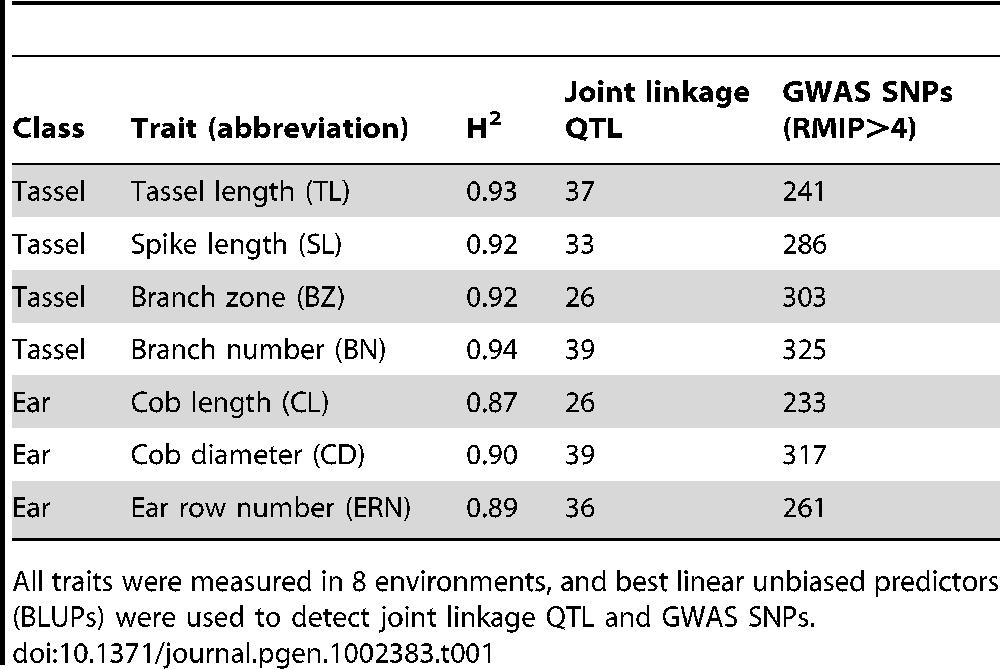
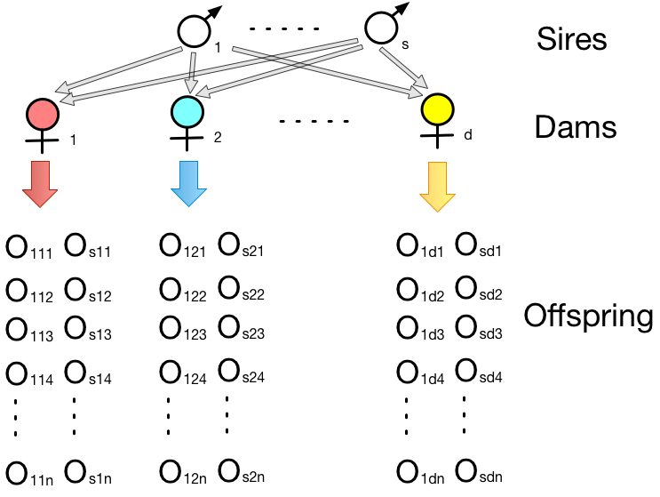

```{r setup, include=FALSE}
options(htmltools.dir.version = FALSE)
```

# Why estimate heritability?

### For several practical purposes:

- Comparison between traits
  - Fitness related traits show the lowest heritabilities (F&M Table 10.1)

--

- Prediction:
  - Predict response to selection (__breeding__)
  - Predict the genetic risk of disease

--

- Deterimine the power of gene mapping studies
 - Low mapping power for traits with low heritability


---

# Estimation of heritability


\begin{align*}
h^2 & = \frac{V_A}{V_P} =  \frac{\sigma_A^2}{\sigma_P^2} \\
H^2 & = \frac{V_G}{V_P} =  \frac{\sigma_A^2 + \sigma_D^2}{\sigma_P^2}
\end{align*}


--


### Interpretation of heritability

- $h^2$ or $H^2$ influenced by allele frequencies, and therefore differ from one __population__ to another
- Depends on __environments__ and __number of measurements__ 
- Varies from __traits__ to traits
- Varies from __species__ to species

--

> "The choice of method", (hence design), "is usually determined more by the practical consideration and be freedom from bias, than by precision". - F & M.

---

## In plant breeding

We are normally using the __average of a family in a plot__, e.g. ear numbers in a row, and thus we will need to consider heritability of a family average.

--

Or, usually using __inbreed lines__, therefore, estimate broad sense heritability ( $H^2$ ).


<div align="center">

</div>
> Brown et al., 2011

---

## In animal breeding

We are mostly working with __individuals__ when using the concept of heritability.

--


| Trait  |   Paternal half-sibs ( $h^2 \pm se$ )   | Maternal half-sibs ( $h^2 \pm se$ )  | 
| :-------: | :-------: | :-----------: | 
| ACP1  | 0.47 $\pm$ 0.26   |  0.49 $\pm$ 0.35  | 
| GRP1  | 0.36 $\pm$ 0.25   |  0.58 $\pm$ 0.34    |  
| AFA1  | 0.49 $\pm$ 0.26   |  0.49 $\pm$ 0.35    | 
| ACP2  | __0.09 $\pm$ 0.32__   |  __0.91 $\pm$ 0.43__ |
| GPR2  | 0.37 $\pm$ 0.35   | NA |
| AFA2  | 0.13 $\pm$ 0.32   | 0.87 $\pm$ 0.43 |
| WNCP  | 0.24 $\pm$ 0.34   | 0.03 $\pm$ 0.53 |
| FAIN  | 0.27 $\pm$ 0.34   |  0.24 $\pm$ 0.50   |

> Irgang and Robinson, 1984. 
- ACP1 and ACP2: ages at first and second conception
- AFA1 and AFA2: ages at first and second farrowing
- GPR1 and GPR2: ages at first and second gestation periods
- WNCP: weaning to conception interval
- FAIN: farrowing interval


---

# Narrow sense heritability

- Parents transmit only one allele to offspring
- Most relatives share only one or zero alleles that are IBD, therefore, only share the average effect of one allele.

Therefore, the __narrow sense heritability ( $h^2$ )__ is the most important component.

--

### $h^2$ is important for breeding

- Is a fundamental statistics we use in __predicting response__ to selection

- Is very informative for __designing breeding schemes__

- Enters to __almost every formula__ connected with breeding methods.


---

# Regression 

From Math foundation:

\begin{align*}
b_{XY}  & =  \frac{Cov(X, Y)}{Var(Y)} \\
\end{align*}

--

### Breeding value and phenotypic value

\begin{align*}
b_{AP}  & =  \frac{Cov(A, P)}{\sigma^2_P} \\
& = \frac{Cov(A, A+D+I+E)}{\sigma^2_P} \\
& = \frac{Cov(A, A)}{\sigma^2_P} = \frac{\sigma_A^2}{\sigma^2_P} = h^2\\
\end{align*}

--

Therefore, $h^2 = b_{AP}$ is the __regression coefficient__ of breeding value on phenotypic value: $A = h^2P$.

---

# Bristle number in Drosophila


In total, 38 families with mother's score and mean score of her offspring.

> Data from Bob Sheehy, 1996.

```{r, out.width='50%', fig.align='center', echo=TRUE}
d <- read.csv('https://jyanglab.com/AGRO-931/data/drosophila.csv')
dim(d)
head(d)
```

---

# Bristle number in Drosophila


```{r, out.width='40%', fig.align='center', echo=TRUE}
library(ggplot2)
ggplot(d, aes(x=Mother, y=Offspring.Mean)) + 
  geom_point(color='red', size = 4) 
```

---

# Bristle number in Drosophila


```{r echo=TRUE, fig.align='center', message=FALSE, warning=FALSE, out.width='30%'}
ggplot(d, aes(x=Mother, y=Offspring.Mean)) + 
  geom_point(color='red', size = 4) + 
  geom_smooth(method=lm, color='#2C3E50')

lm(Offspring.Mean ~ Mother, data=d)
```

---

# Parent-Offspring correlation 

\begin{align*}
b_{OP}  & =  \frac{Cov(O, P)}{\sigma^2_P} \\
& = \frac{Cov(1/2A, A+D+I+E)}{\sigma^2_P} \\
& = \frac{Cov(A, 1/2A)}{\sigma^2_P} = \frac{1\sigma_A^2}{2\sigma^2_P} = 1/2h^2\\
\end{align*}

--

In this case,

The estimated heritability is $2\times b_{OP} = 2 \times 0.4144 = 0.8288$.

--

### To predict a mother with score=20?

--

\begin{align*}
E(O) = b_{OP}P = 0.4144 \times 20 + \mu
\end{align*}

---

# Predicted bristle number 


```{r, out.width='45%', fig.align='center', echo=TRUE, warning=FALSE, error=FALSE}
fit <- lm(Offspring.Mean ~ Mother, data=d)
o <- predict(fit, data.frame(Mother=20, Offspring.Mea=NA))

ggplot(d, aes(x=Mother, y=Offspring.Mean)) + 
  geom_point(color='red', size = 4) + 
  geom_smooth(method=lm, color='#2C3E50') +
  geom_point(aes(x=20, y=o), colour="blue", size=10)

```


---

# Genetic covariances for general relatives

\begin{align*}
& Cov_G = 2f_{XY}\sigma_A^2 + \Delta_{XY}\sigma_D^2 \\
& Cov_G = r\sigma_A^2 + u\sigma_D^2 \\
\end{align*}

Note that $u$ is normally zero unless they IBD through __both of their respective parents__.
For example, full sibs and _[double first cousins](https://whoareyoumadeof.com/blog/what-is-a-double-first-cousin/)_.


|    Relationship   | $f_{XY}$ | r | u   | Regression (b) or correlation (t) |
| :-------: | :-------: | :-----------: | :-----------: | :-------: | :-------: | :---:|
| Parent:Offspring   |  1/4  | 1/2    |  0  |  $b=\frac{Cov_{OP}}{V_P}=\frac{1}{2}\frac{V_A}{V_P}$ |
| Mid-Parent:Offspring   |  1/4  | 1/2    |  0  |  $b=\frac{Cov_{O\bar{P}}}{V_\bar{P}}=\frac{V_A}{V_P}$ |
| Half sibs    |    1/8     | 1/4 |  0 |  $t=\frac{Cov_{HS}}{V_P}=\frac{1}{4}\frac{V_A}{V_P}$ |
| Full sibs     |   1/4    | 1/2 |  1/4 |  $t=\frac{Cov_{FS}}{V_P}=\frac{1}{2}\frac{V_A}{V_P} + \frac{1}{4}\frac{V_D}{V_P}$ |

Note that $V_P$ is the variance of parents.

---

# A sib design

<div align="center">

</div>

--

Offspring-parent regression: $h^2=0.51$; Half-sib correlation: $h^2=0.48$; Full-sib correlation: $h^2=0.53$
> Clayton et al., 1957

---
# Analysis of variance (ANOVA) 


### Two ANOVA identities:

- Total variance = between-familiy (group) variance + within-familiy (group) variance. 
  - Or __Var(Total) = Var(B) + Var(W)__
  
- The variance between-family (group) = the covariance within-family (group). 
  - Or __Var(B) = Cov(W)__


---

# Sib Analysis

If we have a balanced design of $s$ sires each mated to $d$ dams, and each dam has $n$ progenies.
- Random mating, gametic phase equilibrium, absence of epistasis and common environmental effects

<div align="center">

</div>

--

\begin{align*}
p_{ijk}  & =  \mu + s_i + d_{ij} + w_{ijk} \\
\end{align*}

- $p_{ijk}$ is the phenotypic value of the $k$th offspring from the family of the $i$th sire and $j$th dam.
- $s_i$ is the effect of the $i$th sire, $d_{ij}$ is the effect of $j$th dam mated to the $i$th sire, and $w_{ijk}$ is the within dam residual deviation.

---

# A sib design

\begin{align*}
p_{ijk}  & =  \mu + s_i + d_{ij} + w_{ijk} \\
\end{align*}

### Phenotypic variance

- Under the assumption that individuals are random members of the same population
- $s_i$, $d_{ij}$, and $w_{ijk}$ are independent

Therefore, 

\begin{align*}
\sigma^2_P  & = \sigma^2_S + \sigma^2_D + \sigma^2_W \\
\end{align*}

---
# A sib design

\begin{align*}
p_{ijk}  & =  \mu + s_i + d_{ij} + w_{ijk} \\
\end{align*}


--

### ANOVA Table:

| Source        |    df     |  Sums of Squares      | MS      | E(MS) |
| :------:      | :-------: | :--------------------:|:------: | :---------------: |
| Sires         | s-1       |  ? | $MS_s$ | ?    |
| Dams (Sires)  | s(d-1)    |  ? | $MS_d$  | ? | 
| Sibs (Dams)   | sd(n-1)   |  ? | $MS_w$       | ? |

- $\bar{p}_{ij}$: the mean value for the __full-sib family__ of the $i$th sire and $j$ dam.
- $\bar{p}_{i}$: the mean value for the __half-sib family__ of the $i$th sire.
- $\bar{p}$: the __overall__ mean.

---
# A sib design

\begin{align*}
p_{ijk}  & =  \mu + s_i + d_{ij} + w_{ijk} \\
\end{align*}


### ANOVA Table:


| Source        |    df     |  Sums of Squares      | MS      | E(MS) |
| :------:      | :-------: | :--------------------:|:------: | :---------------: |
| Sires         | s-1       |  $dn\sum\limits_{i=1}^s(\bar{p}_i - \bar{p})^2$ | $MS_s$ | ?   |
| Dams (Sires)  | s(d-1)    |  $n\sum\limits_{i=1}^s\sum\limits_{j=1}^d(\bar{p}_{ij} - \bar{p}_i)^2$ | $MS_d$  | ? | 
| Sibs (Dams)   | sd(n-1)   |  $\sum\limits_{i=1}^s\sum\limits_{j=1}^d\sum\limits_{k=1}^n(p_{ijk} - \bar{p}_{ij})^2$  | $MS_w$       | ? |

- $\bar{p}_{ij}$: the mean value for the __full-sib family__ of the $i$th sire and $j$ dam.
- $\bar{p}_{i}$: the mean value for the __half-sib family__ of the $i$th sire.
- $\bar{p}$: the __overall__ mean.

---

# A sib design

### What is the E(SS) for sibs?

\begin{align*}
E\Bigg(\sum\limits_{i=1}^s\sum\limits_{j=1}^d\sum\limits_{k=1}^n(p_{ijk} - \bar{p}_{ij})^2\Bigg)
\end{align*}

---

# A sib design

### What is the E(SS) for sibs?

\begin{align*}
& E\Bigg(\sum\limits_{i=1}^s\sum\limits_{j=1}^d\sum\limits_{k=1}^n(p_{ijk} - \bar{p}_{ij})^2\Bigg) \\
& = \sum\limits_{i=1}^s\sum\limits_{j=1}^d E\Bigg(\sum\limits_{k=1}^n(p_{ijk} - \bar{p}_{ij})^2\Bigg)
\end{align*}

--

Where, by definition

\begin{align*}
\frac{\sum\limits_{k=1}^n(p_{ijk} - \bar{p}_{ij})^2}{n-1} = \sigma_W^2
\end{align*}
is an __unbiased estimate of the variance among full-sibs__ and from our assumption it equals to $\sigma_W^2$.

--

E(SS) $= sd(n-1)\sigma_W^2$


---
# A sib design

### ANOVA Table:

| Source        |    df     |  Sums of Squares      | MS      | E(MS) |
| :------:      | :-------: | :--------------------:|:------: | :---------------: |
| Sires         | s-1       |  $dn\sum\limits_{i=1}^s(\bar{p}_i - \bar{p})^2$ | $MS_s$ | ?    |
| Dams (Sires)  | s(d-1)    |  $n\sum\limits_{i=1}^s\sum\limits_{j=1}^d(\bar{p}_{ij} - \bar{p}_i)^2$ | $MS_d$  | ? | 
| Sibs (Dams)   | sd(n-1)   |  $\sum\limits_{i=1}^s\sum\limits_{j=1}^d\sum\limits_{k=1}^n(p_{ijk} - \bar{p}_{ij})^2$  | $MS_w$       | $= \sigma_W^2$ |

- $\bar{p}_{ij}$: the mean value for the __full-sib family__ of the $i$th sire and $j$ dam.
- $\bar{p}_{i}$: the mean value for the __half-sib family__ of the $i$th sire.
- $\bar{p}$: the __overall__ mean.

---

# MS Between Dams (within Sires)


The variance among dams is calculated by taking the __average value for each full-sib family (the offspring of each dam)__ and averaging these means, after correcting for differences among sire means. 


--

So the between-dam component is estimated as:

\begin{align*}
& \sigma_D^2 = \frac{1}{n}(MS_d - MS_w) \\
& MS_d  =  MS_w + n\sigma_D^2 = \sigma^2_W + n\sigma_D^2 \\
\end{align*}

--

| Source        |    df     |  Sums of Squares      | MS      | E(MS) |
| :------:      | :-------: | :--------------------:|:------: | :---------------: |
| Sires         | s-1       |  $dn\sum\limits_{i=1}^s(\bar{p}_i - \bar{p})^2$ | $MS_s$ | ?    |
| Dams (Sires)  | s(d-1)    |  $n\sum\limits_{i=1}^s\sum\limits_{j=1}^d(\bar{p}_{ij} - \bar{p}_i)^2$ | $MS_d$  | $= \sigma_W^2 + n\sigma_D^2$ | 
| Sibs (Dams)   | sd(n-1)   |  $\sum\limits_{i=1}^s\sum\limits_{j=1}^d\sum\limits_{k=1}^n(p_{ijk} - \bar{p}_{ij})^2$  | $MS_w$       | $= \sigma_W^2$ |


---

# MS Among Sires

Similarly, the variance among sires is found by taking __the mean of all offspring of each sire__ and calculating the variance of these sire means.

Between-sire component is estimated as:

\begin{align*}
& \sigma_s^2 = \frac{1}{dn}(MS_s - MS_d) \\
& MS_s   = MS_d + dn\sigma_S^2 = \sigma^2_W + n\sigma_D^2 + dn\sigma_S^2 \\
\end{align*}

--

| Source        |    df     |  Sums of Squares      | MS      | E(MS) |
| :------:      | :-------: | :--------------------:|:------: | :---------------: |
| Sires         | s-1       |  $dn\sum\limits_{i=1}^s(\bar{p}_i - \bar{p})^2$ | $MS_s$ | $= \sigma_W^2 + n\sigma_D^2 + dn\sigma_S^2$   |
| Dams (Sires)  | s(d-1)    |  $n\sum\limits_{i=1}^s\sum\limits_{j=1}^d(\bar{p}_{ij} - \bar{p}_i)^2$ | $MS_d$  | $= \sigma_W^2 + n\sigma_D^2$ | 
| Sibs (Dams)   | sd(n-1)   |  $\sum\limits_{i=1}^s\sum\limits_{j=1}^d\sum\limits_{k=1}^n(p_{ijk} - \bar{p}_{ij})^2$  | $MS_w$       | $= \sigma_W^2$ |


