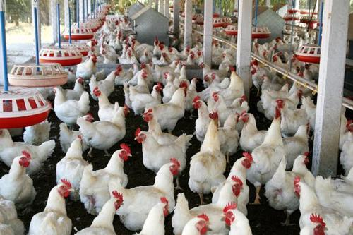

```{r setup, include=FALSE}
options(htmltools.dir.version = FALSE)
```


# Improvement of response

\begin{align*}
& R =  \frac{i h^2\sigma_P}{L} \\
\end{align*}

The form of the breeder's equation allows us to clearly see how to maximize response to selection per unit of time.


### 1. Reduce the generation interval

### 2. Increase the heritability of the trait

### 3. Increase the selection intensity

### 4. Increase additive genetic variance

---


# Measuring response to selection

Response to selection of two  populations of broilers.

- One population was selected for __high__ 56-day body weight.
- One population was selected for __low__ 56-day body weight.

.pull-left[
<div align="center">

</div>
]

--

.pull-right[
<div align="center">

</div>
]


--

#### Causes of response variability to selection?

--

1. Genetic drift
2. Sampling error in estimating the generation mean
3. Differences in selection differential
4. Environmental factors


---

# Measuring response to selection

.pull-left[
<div align="center">

</div>
]

.pull-right[
#### Causes of response variability:
1. Genetic drift
2. Sampling error in estimating the generation mean
3. Differences in selection differential
4. Environmental factors
]


### How to separate these effects?

--

1. Maintain an unselected control population
2. Practice divergent selection
3. Or carry out replicated, parallel selection programs


---

# The Breeder's equation

### The complex version

\begin{align*}
& R =  \frac{i h^2\sigma_P}{L} \\
\end{align*}

--

### The simple version

\begin{align*}
& R =  h^2 S \\
\end{align*}

--

The heritability, therefore

\begin{align*}
& h^2  = \frac{R}{S} \\
\end{align*}


---

# Realized heritability

.pull-left[

\begin{align*}
& h_R^2 =  \frac{R}{S} \\
\end{align*}

Shows how the response is related to the selection differential
]

--

.pull-right[
```{r, out.width='80%', fig.align='center', echo=TRUE}
S <- c(5, 6, 5, 6, 6, 10)
R <- c(3, 2, 1, 3, 2, 3)
df <- data.frame(s=cumsum(S), 
                 r=cumsum(R))

library(ggplot2)
ggplot(df, aes(x=s, y=r)) + 
  geom_point(color='red', size = 4) + 
  geom_smooth(method=lm, color='#2C3E50')
```
]

---

# Realized heritability

.pull-left[

\begin{align*}
& h_R^2 =  \frac{R}{S}\\
\end{align*}

Shows how the response is related to the selection differential

- The selection differential are summed across the generations plotted against the cumulative response.

- The slope of the regression line fitted to the points is equal to the average value of R/S.

]


.pull-right[
```{r, out.width='80%', fig.align='center', echo=TRUE}
S <- c(5, 6, 5, 6, 6, 10)
R <- c(3, 2, 1, 3, 2, 3)
df <- data.frame(s=cumsum(S), 
                 r=cumsum(R))

library(ggplot2)
ggplot(df, aes(x=s, y=r)) + 
  geom_point(color='red', size = 4) + 
  geom_smooth(method=lm, color='#2C3E50')
```
]

---

# Realized heritability

\begin{align*}
& h_R^2 =  \frac{R}{S} \\
\end{align*}

### Be cautious:

1. Reduces response to selection after first generation for high heritability traits (__Bulmer effect__)

--

  - For complex traits, each allele carries a small effect. Therefore, allele frequencies changes are gradual and change in variance through changes in individual allele frequency is slow.
  
--

  - However, what is known as the __Bulmer effect__ immediately changes the variance of complex traits subjected to one generation of selection.

---

# Realized heritability

\begin{align*}
& h_R^2 =  \frac{R}{S} \\
\end{align*}

### Be cautious:

1. Reduces response to selection after first generation for high heritability traits (__Bulmer effect__)

2. Systematic changes in environment or inbreeding depression will affect response.
  - Comparison with control line can adjust for these effects.

--

3. Random drift affect response.
  - The magnitude of random drift can be assessed by replicated selection.

---

# A breeding simulation example:

In a chicken breeding program, the breeders aim to increase the 56-day body weight.
They plan to conduct 40 discrete generations of selection.

--
### Assumptions:

1. The quantitative trait, 56-day body weight, is modeled as being controlled by ~100 genetic loci (or QTLs). 

2. These QTL are equally split across 39 chromosomes so that there are about 3 QTLs per chromosome. 

3. $h^2=0.5%$

---

# A breeding simulation example:

## Breeding schemes:

- The base population consists of 100 animals, of which 50 are male and 50 are female. 
- Suppose the breeders can only handle 100 replacement animals per generation.

--

#### 1. Balanced selection scheme

- In each generation, the best 30 males are selected on the basis of their phenotypic value for a single polygenic trait (56-day body weight) and mated to the females ( $N=30$ ) to produce 100 replacement animals. 


#### 2. Unbalanced selection scheme
- In each generation, the best 10 males are selected on the basis of their phenotypic value for a single polygenic trait (56-day body weight) and mated to the females ( $N=50$ ) to produce 100 replacement animals. 


---
# Breeding simulation

### Simulate a founder population with genomic data

[AlphaSimR](https://github.com/gaynorr/AlphaSimR)
  - An R package for breeding program simulations
  - Here is the [introduction](https://cran.r-project.org/web/packages/AlphaSimR/vignettes/intro.html) of the package

--

### Creating founder population

```{r eval=TRUE, message=FALSE, warning=FALSE}
# install.packages("AlphaSimR")
library(AlphaSimR)
founderPop = runMacs(nInd=100, nChr=39, segSites=10000)
founderPop
```


---
# Breeding simulation

### Simulate the phenotype

1. The quantitative trait, 56-day body weight, is modeled as being controlled by 100 genetic loci (or QTLs). 
2. These QTL are equally split across 39 chromosomes so that there are 3 QTLs per chromosome. 
3. $h^2=0.5$

--

### Setting Simulation Parameters

```{r, eval=TRUE}
SP = SimParam$new(founderPop)
# The ‘A’ at the end indicates that the trait’s QTL only have additive effects.
SP$addTraitA(nQtlPerChr=3) 

# Systematic assignment is used to ensure that there is always equal numbers
# of males and females.
SP$setSexes("yes_sys")

SP$setVarE(h2=0.5)
```


---
# Conduct the selection

### Simulating the breeding program

- This step will take the haplotypes in `founderPop` and the information in `SP` to create an object of `Pop-class`.

```{r, eval=TRUE}
set.seed(12345)
pop1 = newPop(founderPop)
pop2 = newPop(founderPop)
# compute the mean in the current generation
genMean1 = meanG(pop1)
genMean2 = meanG(pop2)
for(generation in 1:40){
  pop1 = selectCross(pop=pop1, nFemale=50, nMale=10, use="pheno", nCrosses=100)
  pop2 = selectCross(pop=pop2, nFemale=30, nMale=30, use="pheno", nCrosses=100)
  genMean1 = c(genMean1, meanG(pop1))
  genMean2 = c(genMean2, meanG(pop2))
}
```

---
# Examining the Results

```{r eval=TRUE, out.width='60%', fig.align='center'}
plot(0:40, genMean1, type="l", col="blue", lwd=3, 
     xlab="Generation", ylab="Mean Genotypic Value")
lines(0:40, genMean2, col="red", lwd=3)
```

---
# Conduct the selection

### Compare different selection schemes

```{r, eval=TRUE}
set.seed(12345)
pop1 = newPop(founderPop)
pop2 = newPop(founderPop)
pop3 = newPop(founderPop)
# compute the mean in the current generation
genMean1 = meanG(pop1)
genMean2 = meanG(pop2)
genMean3 = meanG(pop3)
for(generation in 1:40){
  pop1 = selectCross(pop=pop1, nFemale=30, nMale=30, use="bv", nCrosses=100)
  pop2 = selectCross(pop=pop2, nFemale=30, nMale=30, use="pheno", nCrosses=100)
  pop3 = selectCross(pop=pop3, nFemale=30, nMale=30, use="rand", nCrosses=100)
  genMean1 = c(genMean1, meanG(pop1))
  genMean2 = c(genMean2, meanG(pop2))
  genMean3 = c(genMean3, meanG(pop3))
}
```

---
# Examining the Results

```{r eval=TRUE, out.width='60%', fig.align='center'}
plot(0:40, genMean1, type="l", col="blue", lwd=3, 
     xlab="Generation", ylab="Mean Genotypic Value")
lines(0:40, genMean2, col="red", lwd=3)
lines(0:40, genMean3, col="green", lwd=3)
```


