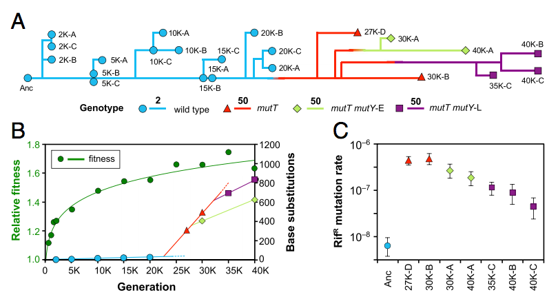

```{r setup, include=FALSE}
options(htmltools.dir.version = FALSE)
```


# Theoretical maximum limit

### Without considering mutation

\begin{align*}
& R_{max} = 2N_eih^2\sigma_P = 2N_e i \frac{V_A}{V_P}\sigma_P = 2N_e i \frac{V_A}{\sigma_P}\\
\end{align*}

Set an upper limit to what can be expected.

--

-----

Long-term selection is expected to reduce the phenotypic variance of a population because of gradual shifts in allele frequency toward 0 or 1.

--

### Unexpected results


However, the variance often surprisingly remains the same over long-term selection

- Conversion of variance due to epistasis to $V_A$

- Generation of new alleles through __mutation__


---
# Response upon long-term selection

### Considering mutation

Dr. __W. G. Hill__ in 1982, developed theory to include mutations as a wellspring of continuing new variation upon which selection could produce response.

--

Analogous to $R=2 N_e \times i \frac{V_A}{\sigma_P}$, he got:

\begin{align*}
& R = 2N_e \times \frac{iV_M}{\sigma_P} \\
\end{align*}

- Where $V_M$ is the __additive genetic variance__ arising from __new mutations of each generation__.

---

# Considering mutation

\begin{align*}
& R = \frac{2N_eiV_M}{\sigma_P} \\
\end{align*}

- Where $V_M$ is the __additive genetic variance__ arising from new mutations of each generation.

--

- And $V_M = 2pq(a_M + d_M(q-p))^2$

--

### Important notes:

1. Additive variance of new mutation is a function of allele frequency.

2. It takes at least 20 generations for mutations to be __high enough in frequency__.


--

### Take home message:

Increasing the mutation rate through __mutagenesis__ is not expected to enhance response in the short term.


---

# Number of effective factors

\begin{align*}
& n = \frac{R_T^2}{8\sigma_A^2} \\
\end{align*}

Where $n$ is the number of loci with many assumptions:
  - 1) unrelated loci 
  - 2) same effect size

--

If takes LD into consideration, the above equation actually defines __the number of effective factors__.
  - The numer of loci affecting a trait is larger than the number of effective factor, resulting from __LD between loci__ 

--

If considering  __large differences__ in effect size between loci
  - Not to actually using the above formula, but rather understanding the nature of genetic variation


---

# Definition of Evolvability

### General definition:

The ability for a species or breeding population 
- to adapt to its environment through __natural selection__
- to be improved through __artificial selection__

is known as __evolvability__.

--

### Other possible definition:

- The ability of a population to respond to selection

- The ability of a genomic architecture to facilitate change

- The ability of a genetic system to produce and maintain potentially adaptive genetic variants

- Propensity to evolve novel structures

---

# Definition of Evolvability

### General definition:

The ability for a species or breeding population 
- to adapt to its environment through __natural selection__
- to be improved through __artificial selection__

is known as __evolvability__.

### __Is evolvability evolvable?__
  - Or is evolvability genetically determined?
  - Does natural selection in favor populations that are more evolvable?

---

# E. Coli Long-term selection experiment (LTEE)

.pull-left[
- Richard Lenski and co-workers, at Michigan State University since 1988

- Selection for fitness under glucose-limited conditions for __> 50,000 generations__ with __12 independent populations__

- Transferring 0.1 ml of culture into 9.9 ml of fresh medium __each day (about 6.6 life cycles)__
]

.pull-right[

<div align="center">

</div>

Rich makes the 10,000th transfer.
]

---
# E. Coli Long-term selection experiment 

__Response__: 
- They store a sample every 75 days, or about 500 generations.
- The __relative fitness__ can be compared to ancestral populations by competing two populations one another and counting the number of cells from each population.

--

<div align="center">

</div>
The figure is from Dawkins 2009.

- Left: the response for 1/12 populations.
- Right: responses of all 12 populations.


---
# Mutations


<div align="center">

</div>
> Tenaillon et. al., 2016.

Mutations accumulated over time.

- Left: total mutations over time in the 12 LTEE.
- Right: total mutations rescaled to reveal the trajectories for the six populations that did not become __hypermutable__ for point mutations, and for the other six before they evolved hypermutability.

---
# Mutations accumulated over time


<div align="center">

</div>
> Barrick et. al., 2009.


- Inside ring represents genome of clone from 2K generations.
- Outside ring represents clone from 20K generations.
- In between, intermediate clones.

???
Note that, mutations in the form of SNPs, deletions, insertions, and inversions have accumulated across the generations.

---

# Large effect mutation

<div align="center">

</div>
> Dawkins et. al., 2009.

--

- Increase in bacterial population density after 33,000 generations of one of the twelve populations. 

- This population accumulated the __large effect mutations__ necessary to metabolize citrate, greatly increasing the food source availability.

- And thus greatly increase in the bacterial population.

---

# Mutations affecting mutation rate

Recently, Wielgoss et al., 2013 reported an interesting interaction between __mutations affecting mutation rate__, which involves mutations falling in genes controlling the cellular repair machinery.

<div align="center">

</div>
> Wielgoss et. al., 2013.


---

# Mutations affecting mutation rate

<div align="center">

</div>
> Wielgoss et. al., 2013.

--

- A mutation in __mutT__ between 20,000 and 30,000 generations dramatically increased the mutation rate.

- Then, two mutations in __mutY__ (__mutY-E__ and __mutY-L__) between generations 35,000 and 40,000, which decreased the mutation rate

---

# Mutations affecting mutation rate

<div align="center">

</div>
> Wielgoss et. al., 2013.


- The interesting part is that because __mutY__ is involved in DNA repair, mutations in __mutY__ are expected to be hypermutators themselves.

--

- But in the background of the __mutT__, it actually decrease the mutation rate, because these mutations coincidentally repair the mutations made by __mutT__.


