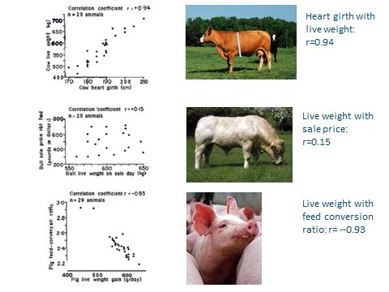

```{r setup, include=FALSE}
options(htmltools.dir.version = FALSE)
```


# The correlation between two traits

.pull-left[
<div align="center">

</div>
]

.pull-right[
- Heart girth vs. Body weight

- Body weight with sale price

- Body weight with feed conversion ratio
]

--


### Genetic correlation

- Pleiotropy
  - property of a locus whereby it affects two or more traits
  
--
  
- Linkage disequilibrium
  - Two loci that each affect a trait may be in LD caused by physical linkage
  - transient cause of correlation.
  
---

# The correlation between two traits

.pull-left[
<div align="center">

</div>
]

.pull-right[
- Plant height vs. canopy coverage 

- Plant height vs. Biomass
]

--

### Environmental correlation

Caused by common response of two traits to shared environmental conditions.

---

# The correlation between two traits

Knowing the values of each component of the phenotype allows the calculation of the different types of correlations.

### Genetic correlation

  - This can be further broken down into __additive genetic correlation__ by correlating breeding values for two traits
  
### Environmental correlation
  
  - Different __environmental factors__

--
  
  ---
  
\begin{align*}
& Cov_P  =  Cov_A + Cov_E  \\
\end{align*}

- Here, $Cov_P$, $Cov_A$, and $Cov_E$ denotes the phenotypic, additive genetic and environmental covariance of the __two traits X and Y__.

---

# The correlation between two traits

The __phenotypic correlation__ between __two traits__ X and Y:

\begin{align*}
& r_P  =  \frac{Cov_P}{\sigma_{P_X}\sigma_{P_Y}}  \\
\end{align*}

--
\begin{align*}
& Cov_P  =  r_P\sigma_{P_X}\sigma_{P_Y}  \\
\end{align*}

- __ $Cov_P$__: the phenotypic covariance between the two traits X and Y
- __ $r_P$__: the phenotypic correlation between the two traits X and Y

--

-----

\begin{align*}
& Cov_P  =  Cov_A + Cov_E  \\
& r_P\sigma_{P_X}\sigma_{P_Y} = r_A\sigma_{A_X}\sigma_{A_Y} + r_E\sigma_{E_X}\sigma_{E_Y} \\
\end{align*}

- __ $r_A$__: the genetic correlation due to breeding values between X and Y
- __ $r_E$__: the environmental correlation between X and Y, including non-additive genetic effects.
- __ $\sigma$__: standard deviation, with subscripts P, A, and E, and X or Y to the traits referred to.
  - e.g., $\sigma_{A_Y}$, standard deviation of the trait Y due to breeding value.

---

# The correlation between two traits

\begin{align*}
& h^2  =  \frac{\sigma_A^2}{\sigma_P^2}  \\
& 1 - h^2 = 1 - \frac{\sigma_A^2}{\sigma_P^2} \\
\end{align*}

--

\begin{align*}
 e^2 = & 1 - h^2 = \frac{\sigma_P^2 - \sigma_A^2}{\sigma_P^2} = \frac{\sigma_E^2}{\sigma_P^2} \\
\end{align*}

Here, $\sigma_E^2$ includes __non-additive genetic effects__ and __environmental effects__.

--

\begin{align*}
 & e^2  = \frac{\sigma_E^2}{\sigma_P^2} \\
 & e  = \frac{\sigma_E}{\sigma_P} \rightarrow e \sigma_P = \sigma_E \\ 
\end{align*}

---
# The correlation between two traits

\begin{align*}
& Cov_P  =  Cov_A + Cov_E  \\
& r_P\sigma_{P_X}\sigma_{P_Y} = r_A\sigma_{A_X}\sigma_{A_Y} + r_E\sigma_{E_X}\sigma_{E_Y} \\
\end{align*}

By subsitituing: 
\begin{align*}
 &  \sigma_E = e \sigma_P \\
 & \sigma_A =h\sigma_P \\ 
\end{align*}

--

We get:

\begin{align*}
& r_P\sigma_{P_X}\sigma_{P_Y} = r_Ah_X\sigma_{P_X}h_Y\sigma_{P_Y} + r_Ee_X\sigma_{P_X}e_Y\sigma_{P_Y} \\
\end{align*}

--

Divide through by $\sigma_{P_X}\sigma_{P_Y}$:

\begin{align*}
& r_P = r_Ah_Xh_Y + r_Ee_Xe_Y \\
\end{align*}

---
# The correlation between two traits

\begin{align*}
& r_P = r_Ah_Xh_Y + r_Ee_Xe_Y \\
\end{align*}

- __ $r_P$__: the phenotypic correlation between two traits X and Y
- __ $r_A$__: the genetic correlation due to breeding values between X and Y
- __ $r_E$__: the environmental correlation between X and Y, including non-additive genetic effects
- __ $h^2$__: heritability
- __ $e^2$__: $1-h^2$

--

  ---
  
This proof generally shows that the genetic and environmental correlation come together to create the phenotypic correlation.

--

- If both traits have __low heritabilites__: 
  - then phenotypic correlation is determined mainly be the environmental correlations.
  
- If they have __high heritabilities__:
  - genetic correlation is more important.

---

# The correlation between two traits

\begin{align*}
& r_P = r_Ah_Xh_Y + r_Ee_Xe_Y \\
\end{align*}

  ---

### Estimates of genetic correlation

- Rests on the resemblance between relatives in a similar manner to the estimation of $h^2$.

- But rather than perform an ANOVA, perform an __analysis of covariance__. 
  - The interpretation of covariance is exactly the same.

---

# The correlation between two traits

\begin{align*}
& r_P = r_Ah_Xh_Y + r_Ee_Xe_Y \\
\end{align*}

  ---


### Some precautions with genetic correlations:

- They have large sampling error.
  - Increasing the precision of genetic correlations can be attained through using the same techniques for increasing the precision of heritability estimates.

--

- Subject to change with allele frequency differences.
  
---

# Correlated response to selection

If we select on trait X, how will trait Y change?

--

This comes down to the relationship between the breeding values (BVs) for trait Y and breeding values for trait X.

- It can be expressed as __"what is the expected BV of Y given a BV of X"__

--

- Or conditional expectation: $E(A_Y | A_X)$


--

.pull-left[
```{r, out.width='80%', fig.align='center', echo=FALSE}
Ax <- c(5, 6, 5, 6, 6, 10, 5, 6, 8, 9, 7)
Ay <- c(3, 2, 1, 3, 2, 3, 2.5, 3, 4.7, 6, 2)
df <- data.frame(Ax=Ax,  Ay=Ay)

library(ggplot2)
ggplot(df, aes(x=Ax, y=Ay)) + 
  geom_point(color='red', size = 4) + 
  geom_smooth(method=lm, color='#2C3E50')
```
]

--

.pull-right[

\begin{align*}
& b_{A_{YX}} = \frac{Cov_A}{\sigma^2_{A_X}} \\
& Cov_A = r_A\sigma_{A_X}\sigma_{A_Y} \\
\end{align*}

Therefore,
\begin{align*}
 b_{A_{YX}} & = \frac{Cov_A}{\sigma^2_{A_X}} \\
&  = \frac{r_A\sigma_{A_Y}}{\sigma_{A_X}} \\
\end{align*}

]


---
# Correlated response to selection

\begin{align*}
 b_{A_{YX}}  = r_A\frac{\sigma_{A_Y}}{\sigma_{A_X}} \\
\end{align*}

--

Recall that $R_X = ih_X^2 \sigma_{P_X} = ih_X\sigma_{A_X}$, correlated response of trait Y is:

--

\begin{align*}
CR_Y &  =  b_{A_{YX}}R_X  \\
& = r_A \frac{\sigma_{A_Y}}{\sigma_{A_X}} ih_X\sigma_{A_X}\\
& = ih_Xr_A\sigma_{A_Y} \\
\end{align*}

--

Because $\sigma_{A_Y} = h_Y\sigma_{P_Y}$, therefore,

\begin{align*}
& CR_Y = ih_Xh_Yr_A\sigma_{P_Y} \\
\end{align*}

--

In the formula:
- $h_Xh_Yr_A$ is referred to as the __coheritability__, as it takes the place of the heritability in the direct response equation.

- If $h_Xh_Yr_A$ is larger than $h^2$ of trait Y, then selection on a correlated trait should be used.


