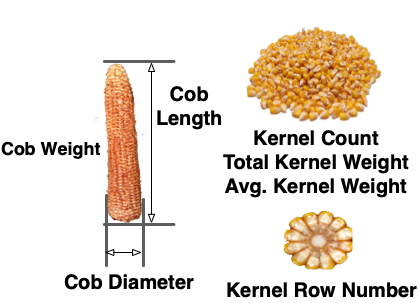

```{r setup, include=FALSE}
options(htmltools.dir.version = FALSE)
```


# The correlation between two traits

\begin{align*}
& r_P = r_Ah_Xh_Y + r_Ee_Xe_Y \\
\end{align*}

- __ $r_P$__: the phenotypic correlation between two traits X and Y
- __ $r_A$__: the genetic correlation due to breeding values between X and Y
- __ $r_E$__: the environmental correlation between X and Y, including non-additive genetic effects
- __ $h^2$__: heritability
- __ $e^2$__: $1-h^2$


----
  
This proof generally shows that the genetic and environmental correlation come together to create the phenotypic correlation.

- If both traits have __low heritabilites__: 
  - then phenotypic correlation is determined mainly be the environmental correlations.
  
- If they have __high heritabilities__:
  - genetic correlation is more important.

---
# Correlated response to selection


\begin{align*}
& CR_Y = ih_Xh_Yr_A\sigma_{P_Y} \\
\end{align*}

- Here $i$ is the selection intensity for trait X, or $i_X$.

-----

In the formula:

- $h_Xh_Yr_A$ is referred to as the __coheritability__, as it takes the place of the heritability in the direct response equation.

- If $h_Xh_Yr_A$ is larger than $h^2$ of trait Y, then selection on a correlated trait should be used.


---

# Indirect selection

The trade-off between selection on a correlated trait and direct selection on a trait can also be seen:

\begin{align*}
\frac{CR_Y}{R_Y}  & =  \frac{i_Xh_Xr_A\sigma_{A_Y}}{i_Yh_Y\sigma_{A_Y}} \\
& = \frac{i_Xh_Xr_A}{i_Yh_Y}\\
\end{align*}

--

### Assuming selection intensity is the same

- When __ $h_Xr_A > h_Y$__, a correlated response from selection on a secondary trait (X) is greater than response to direct selection on Y .

--

- Note that this exact same property applies to usefulness of molecular markers for __marker-assisted selection__

---

# Indirect selection

The trade-off between selection on a correlated trait and direct selection on a trait can also be seen:

\begin{align*}
\frac{CR_Y}{R_Y}  & =  \frac{i_Xh_Xr_A\sigma_{A_Y}}{i_Yh_Y\sigma_{A_Y}} \\
& = \frac{i_Xh_Xr_A}{i_Yh_Y}\\
\end{align*}


### Practical considerations

- If trait Y is very __expensive__ and __difficult__ to measure, but trait X is very cheap and easy to measure.
  - e.g. high-throughput phenotyping technologies

--

- Or the desired traits is measurable __in one sex__ only, but the secondary traits is measurable in both.
  - e.g. milk yield and body weight in dairy cow

---


# Indirect selection

The trade-off between selection on a correlated trait and direct selection on a trait can also be seen:

\begin{align*}
\frac{CR_Y}{R_Y}  & =  \frac{i_Xh_Xr_A\sigma_{A_Y}}{i_Yh_Y\sigma_{A_Y}} \\
& = \frac{i_Xh_Xr_A}{i_Yh_Y}\\
\end{align*}


### Genotype-by-environment interaction

- Performance in different environments can be regarded as __two separate, but correlated traits__.

- Improvement in one environment by selection in another environment can be predicted by knowing the heritability in each environment and the genetic correlation between them.
  - For future environments in the face of climate change
 

---

# Selection on multiple traits

Total economic value is a composite of many traits. How does one __maximize response for many traits__ simultaneously?


--

#### Options for multiple trait selection

- __Tandom selection__: 

  - Selection for one trait at a time until that trait is improved to a desired level.
  - After that, selection proceeds for another trait.

--

- __Independent culling levels__: 
  - Only individuals that meet the minimum standard for each trait are selected.

--

- __Index selection__: 
  - Select for multiple traits simultaneously by constructing an index value.
  - Index value is then treated as a single economic trait.

---

# Genetic merit

- Any individual has a genetic value for what we'll call as __genetic merit__, or simply, __merit__.

--

  - Merit is the summation of all traits contributing to an individual's worth, fitness, economic value, etc.

--

#### The __true value of merit__ is represented as:

\begin{align*}
T & = a_1G_1 + a_2G_2 + ... + a_mGm \\
& = \sum_{i=1}^ma_iG_i \\
\end{align*}

- $G_i$ is the genetic value for trait $i$

- $a_i$ is the economic weight placed on trait $i$
  - The economic weights are set by the breeder according to production needs and value. 


---
# Index trait

To accurately predict genentic merit $T$, we want to combine the values of multiple traits into one value, denoted $I$. 

--

\begin{align*}
I & = b_1P_1 + b_2P_2 + ... + b_mPm \\
& = \sum_{i=1}^mb_iP_i \\
\end{align*}

- $P_i$ is the phenotypic value for trait $i$ that goes into the index

- $b_i$ is the weighting factor on trait $i$

--

### Correlation between T and I

The goal is to __find the values of the $b_i$s__ that could __maximize the correlations__ between $T$ and $I$, or $r_{TI}$.

\begin{align*}
r_{TI} = \frac{Cov(T, I)}{\sigma_T\sigma_I}
\end{align*}


---

# Correlation between T and I

\begin{align*}
r_{TI} = \frac{Cov(T, I)}{\sigma_T\sigma_I}
\end{align*}

Obtaining the maximum value of the correlation involves taking the derivative and setting to zero. 


--
### Optimum index

The vector of weights, which is called the __Smith-Hazel index__, or __optimum index__:
  - It is the most widely used set of weights for a linear selection index
  - See [here](ch37_index-selection.pdf) Page 411 for the proof

\begin{align*}
& \mathbf{b} = \mathbf{P^{-1}}\mathbf{G^Ta}  \\
\end{align*}

- $\mathbf{P}$ is the phenotypic variance-covariance matrix
- $\mathbf{G}$ is the genetic variance-covariance matrix
- $\mathbf{a}$ is the vector of __known__ economic weights
- $\mathbf{b}$ is the vector of __unknow__ weights, or the weights to be applied to the phenotypic values of the different traits composing the index, $I$.

---

# Optimum index

The vector of weights, which is called the __Smith-Hazel index__, or __optimum index__:

\begin{align*}
& \mathbf{b} = \mathbf{P^{-1}}\mathbf{G^Ta}  \\
\end{align*}

--

- The vector of $\mathbf{b}$ can be estimated if we know the __phenotypic and genetic variances__ and the __phenotypic and genetic covariances__

--

- This assumes that we have good information on the economic weights, which can be hard to determine.

--

- Then the resulting vector of weights will give a selection index that maximized genetic gain in $T$, the true genetic merit.


--

- The drawback of this index is that the genetic variance and covariances are often estimated with large amounts error, which may reduce the correlation between I and T.


---
# A simulated example

- A corn breeder, aiming to increase grain yield in a cost-effective manner for their small breeding program,  selects key yield component traits instead of relying solely on combine-based yield measurements. 

- These traits include kernel count (KC), three ear-related traits and three cob-related traits.

<div align="center">

</div>

--

How to build a selection index to maximize the genetic gain?

\begin{align*}
I & =  \sum_{i=1}^{m=7}b_iP_i \\
\end{align*}

---
# A simulated example

```{r}
G <- read.csv("https://jyanglab.com/slides/2024-agro931/Gmatrix.csv")
P <- read.csv("https://jyanglab.com/slides/2024-agro931/Pmatrix.csv")
a <- read.csv("https://jyanglab.com/slides/2024-agro931/Wmatrix.csv")

# in R solve function gives the inverse of a matrix
solve(as.matrix(P[, -1]))

# function t to compute transpose
t(as.matrix(G[,-1]))
```

---
# A simulated example

The vector of weights, which is called the __Smith-Hazel index__, or __optimum index__:

\begin{align*}
& \mathbf{b} = \mathbf{P^{-1}}\mathbf{G^Ta}  \\
\end{align*}

```{r}
b <- solve(as.matrix(P[, -1])) %*% t(as.matrix(G[, -1])) %*% as.matrix(a[,1])
b
```

