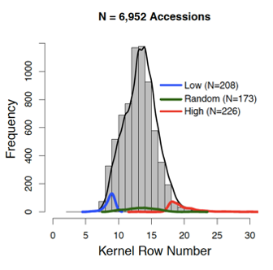

```{r setup, include=FALSE}
options(htmltools.dir.version = FALSE)
```


---
# QTL or Linkage Mapping

Linkage mapping uses statistical techniques to localize chromosomal
regions that might contain genes contributing to phenotypic variation in a complex trait of interest.


#### Steps for QTL mapping include:

  - 1) Create a segregating population
    - __mating design__
  
  - 2) Genotype individuals within this population with molecular markers
    - __genotyping by sequencing__
  
  - 3) Phenotype the individuals
    - __field experimental design__
  
  - 4) Apply statistical models to associate the markers to the phenotypic variation
    - __single-marker analysis__ or __interval mapping__


---
# Recombinant inbred lines (RILs)

.pull-left[
<div align="center">

</div>
> Mauricio et al., 2001
]

--

#### a. Select the parental lines with extreme phenotypes

  - The density of hairs that occur on a plant leaf

--

#### b. Selfing an F1 to form a population of F2 individuals 

--

#### c. Each F2 is selfed for six additional generations

  - Forming a population of recombinant inbred lines (RILs)

  - Each RIL is homozygous for a section of a parental chromosome

---
# Simulating a QTL mapping experiment

#### Simulate a F2 population with 250 individuals

```{r, out.width='50%', fig.align='center', echo=TRUE}
library(qtl)
set.seed(12347)
# Five autosomes of cM length 50, 75, 100, 125, 60
L <- c(50, 75, 100, 125, 60)
map <- sim.map(L, n.mar=L/5+1, eq.spacing=FALSE, include.x=FALSE)
# simulate founder genotypes
pg <- simFounderSnps(map, "4")
pop <- sim.cross(map, type="f2", n.ind=250, model = rbind(c(1,45,1,1),c(5,20,0.5,-0.5)))
plot.map(pop)
```

---

# Simulating a QTL mapping experiment

#### Checking phenotypic distribution

```{r, out.width='50%', fig.align='center', echo=TRUE}
hist(pop$pheno$phenotype, main="simulated phenotype", 
     breaks=50, xlab="Phenotype", col="#cdb79e")
```


---
# Single-marker analysis

```{r, out.width='50%', fig.align='center', echo=TRUE}
# single-QTL scan by marker regression with the simulated data
out.mr <- scanone(pop, method="mr")

# plot of marker regression results for chr 4 and 12
plot(out.mr, chr=c(1,2,3,4,5), ylab="LOD Score")
```


---
# Haley-knott Regression

This is a version of interval mapping which is a very good approximation to interval mapping via maximum likelihood.


```{r, out.width='50%', fig.align='center', echo=TRUE, warning=FALSE}
# single-QTL scan using Haley-knott Regression approach
out.hk <- scanone(pop, method="hk")

# plot of marker regression results for chr 4 and 12
plot(out.hk, chr=c(1,2,3,4,5), ylab="LOD score")
```

---
# Plot QTL effect

```{r, out.width='40%', fig.align='center', echo=TRUE, warning=FALSE}
# summary of out.mr
summary(out.mr, threshold=3)

effectplot(pop, mname1="D1M10", main="Chr1")
```

---
# Plot QTL effect

```{r, out.width='40%', fig.align='center', echo=TRUE, warning=FALSE}
# summary of out.mr
summary(out.mr, threshold=3)

effectplot(pop, mname1="D5M6", main="Chr5")
```

---

# QTL recap

.pull-left[
<div align="center">

</div>
> Candela and Hake, 2008
]

.pull-right[
### Traditional bi-parental QTL:

- Newly created recombination events (very few)

- Low mapping resolution (Mb level, ~ hundreds of genes)

- Limited number of QTLs

- Can be used for marker assistant selection (MAS)
]

---

# GWAS: A brief overview

.pull-left[
<div align="center">

</div>

]

.pull-right[
### GWAS in a nutshell:

- Utilize existing populations

- Leverage historical recombination events

- Achieve high mapping resolution but need high density marker
]

---

# Nested association mapping (NAM) 

<div align="center">

</div>
> Yu et al., 2008

---

# SNP projection for NAM RILs

<div align="center">

</div>

- More than 15 years ago

- No reference genome available and the genotyping is challenging

- It is a cost effective method to identify trait-associated genes in high resolution

---

# A diversity panel for GWAS

.pull-left[
<div align="center">

</div>
> Liu et al., 2003

- NSS, SS, TS, popcorn, sweet corn, mixed group
]

--

.pull-right[
<div align="center">

</div>

- With diverse genetic backgrounds repsenting different subpopulations

- Individuals with known or unknown predigrees or ancestral origins

- Representative sampling of alleles across the genome to capture genetic variation
]

---

# Population structure and grelatedness

<div align="center">

</div>

--

__Subpopulations (Q) __: ancestral origins and subgroups due to population subdivision

__Genetic relatedness (K)__: the degree of genetic similarity within a subpopulation

---

# Mixed linear model for GWAS

<div align="center">

</div>
> Yu et al., 2006

--

- __False Discovery Rate (FDR)__: the proportion of __false positive__ results among all statistical significant associations identified in a GWAS

- __GWAS Power__: the ability of a GWAS to detect __true positive__ genetic associations with phenotypic traits

---

# Other strategies for association analysis

.pull-left[

### Extreme Phenotype GWAS (or XP-GWAS)

<div align="center">

</div>
> J. Yang et al., 2015
]

--

.pull-right[
#### Pros:
- Increased power due to variants likely have large effect size

- Cost effective for genotyping and no need for additional phenotyping

#### Cons:
- Limited generalizability: only for a given trait

- Collecting large sample size can be challenging

- Extreme phenotype selection may introduce bias if differs systematically
]