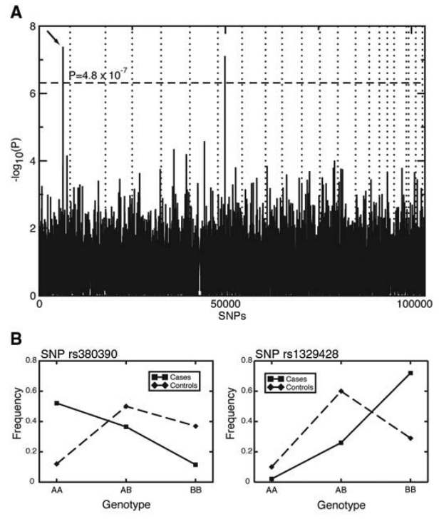
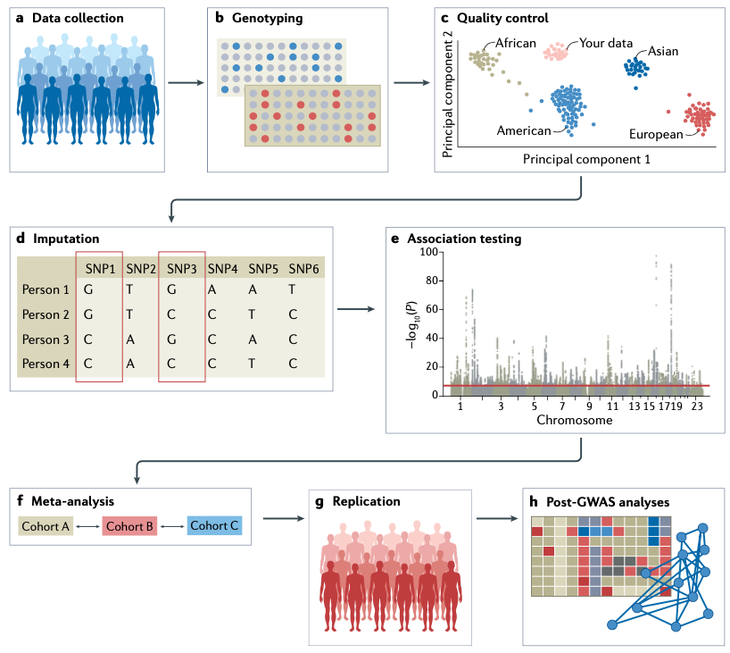

```{r setup, include=FALSE}
options(htmltools.dir.version = FALSE)
```

# GWAS --- 15 years and on

The very first GWAS was published in 2015 about age-related macular degeneration.
> Klein, et al., 2005, Science

--

<div align="center">

</div>

---

# GWAS --- 15 years and on

- More than 4,300 papers have reported on 4,500 GWAS studies

- Over 55,000 unique loci for nearly 5,000 diseases and traits

--

## User-friendly data portals to query GWAS results

- [GWAS catalog](https://www.ebi.ac.uk/gwas/): a searchable database of SNP-trait association

- [PhenoScanner](http://www.phenoscanner.medschl.cam.ac.uk/): a curated database holding publicly available GWAS results

- [GTex](https://gtexportal.org/home/) (Genotype-Tissue Expression) eQTL Browser: is a resource to study human gene expression and regulation and its relationship to genetic variation

- [ENCODE](https://www.encodeproject.org/): Encyclopedia of DNA elements, including elements that act at the protein and RNA levels, and regulatory elements.

> Loos, 2020, Nature Communications

---
# The driving forces for GWAS

- The decreasing cost of genome-wide gentoyping
  - Now > 20 times less expensive than 15 years ago

--

- The number of variants tested has increased
  - In human study, from ~500k variants in the early days to nearly 10 million in the lastest GWAS

--

- More refined phenotypes
  - Such as imaging-derived traits and multi-Omics outcomes (i.e., gene expression as a trait for GWAS)

--

- Advanced statistical analyses and sophisticated modeling
  - Multivariate GWAS to identify loci that affect multiple traits simultaneously
  - Integrate intermeidate Omics data to conduct causal inference 
    > [Z. Yang et al., 2022](https://doi.org/10.1093/genetics/iyac057)
  

---
# Validation of GWAS results

Identifying GWAS loci is only the first step of a long journey

--

### Translation of genetic loci into new biological insights

- Integrate multi-Omcis data

- Targeted molecular experiments is critical to establish the role of the prioritized genes.

--

### Implement the knowledge into breeding practice

- Marker assistant selection (using large effect markers only)

- Genomic selection (using all genome-wide markers)


---
# Steps for conducting GWAS

<div align="center">

</div>
> [Uffelmann et al., 2021](https://www.nature.com/articles/s43586-021-00056-9)


---
# Testing for associations

A quantitative trait is sometimes controlled jointly by
- __major QTLs__ with large effects 
- __minor QTLs__ with small effects

--

### Prevent Shrinkage

If markers that correspond to the major QTLs are known 
- Then these markers can be treated as having fixed effects
  - It will prevents _shrinkage of their estimates_
  
- The remaining markers can be treated as having random effects
  - Their effects can still be estimated through __RR-BLUP__ or other approaches.

---

# Linear Mixed Model (LMM)

\begin{align*}
\mathbf{y} &= \mathbf{Xb} + \mathbf{Zm} + \mathbf{e} \\
\end{align*}

\begin{align*}
V(\mathbf{m}) &= \mathbf{I}V_{M_i} \\
 & = \mathbf{I}(V_{G}/n_M) 
\end{align*}


--

### Fit a marker as a fixed effect

With some modification of the above LMM model, a mixed-model approach can be used for association mapping:

\begin{align*}
\mathbf{y} &= \mathbf{Xb} + \mathbf{w_i}m_i + \mathbf{Zm^*} + \mathbf{e} \\
\end{align*}

- Where $\mathbf{m_i}$ is the fixed effect due to the $i$th SNP marker
- $\mathbf{w_i}$ is an incidence vector for the SNP marker

---

# G Model

\begin{align*}
\mathbf{y} &= \mathbf{Xb} + \mathbf{w_i}m_i + \mathbf{Zm^*} + \mathbf{e} \\
\end{align*}

- Where $\mathbf{m_i}$ is the fixed effect due to the $i$th SNP marker
- $\mathbf{w_i}$ is an incidence vector for the SNP marker

---------------

This G model utilizes marker effects to account for variation due to QTL found on the background chromosomes.
> Bernardo, 2013

- Like the QTL composite interval mapping approach

- The disadvantage of this type of approach is the uncertainty in how many background markers should be included.

 - If too few, the background variation will be underestimated
 
 - If too many, overfitting the model.


---

# K model for GWAS

\begin{align*}
\mathbf{y} &= \mathbf{Xb} + \mathbf{w_i}m_i + \mathbf{Zu} + \mathbf{e} \\
\end{align*}

In this LMM, the covariance matrix of $\mathbf{u}$ becomes equal to $\mathbf{A}V_A'$

- Where $\mathbf{A}$ is the additive relationship matrix, or kinship ( $\mathbf{K}$ ) matrix

- And $V_A'$ is the portion of the additive variance that is not accounted for by $\mathbf{m_i}$

--

In practice, $V_A'$ will need to be estimated by an iteractive procedure.

--

### Multiple marker model

With multiple SNP markers
- $\mathbf{w_i}$ => an incidence matrix $\mathbf{W}$

- $m_i$ => a vector of $\mathbf{m}$

---

# Multiple marker GWAS model

\begin{align*}
\mathbf{y} &= \mathbf{Xb} + \mathbf{Wm} + \mathbf{Zu} + \mathbf{e} \\
\end{align*}

### A two-step approach

- First, a single marker is included at a time

  - The significance of individual marker effects is then tested by z-tests
  
--

- Second, the markers found significant in the single-marker analyses are included in a multiple-marker model.
  
  - A standard model-selection procedure, such as __backward elimination__, maybe used to determine which markers should be incorporated in the final multiple-marker model.


---
# Multiple sub-populations

In breeding context, we define each germplasm group or heterotic pattern as a __subpopulation__ of the larger pool of inbred, hybrids, or clones.

- In maize, dent (Iowa Stiff Stalk Synthetic, BSSS) and flint (non-BSSS)

- Barley inbreds comprise six-row and two-row types

--

### Population structure

- Separate analysis: 
One-subpopulation-at-a-time approach

- Joint analysis to account for the differences between the subpopulations


---
# QK model for multiple sub-populations

### K model

\begin{align*}
\mathbf{y} &= \mathbf{Xb} + \mathbf{w_i}m_i + \mathbf{Zu} + \mathbf{e} \\
\end{align*}

--

### QK model

\begin{align*}
\mathbf{y} &= \mathbf{Xb} + \mathbf{Qv} + \mathbf{w_i}m_i + \mathbf{Zu} + \mathbf{e} \\
\end{align*}

- In this model, the effects due to different sub-populations are captured by $\mathbf{Qv}$

- The relatedness among lines within each sub-population is specified by the covariance matrix of $\mathbf{u}$.

---
# Use PCA method to construct Q matrix

> Price et al., 2006

Proposed a method to use principal components analysis (PCA) of marker-allele frequencies and the use of PCA scores as the $\mathbf{Qv}$ matrix.

--

### What is in the Q matrix:

1. The columns in Q correspond to different PCA axes

2. The rows in Q correspond to PCA scores of the lines in $\mathbf{y}$

--

### How many PCs?

- The first PC captures the largest amount of variation, and the 2nd captures the second-largest amount of variation, and so on.

- No fixed rule, but knowing the number of germplasm groups will help.

---
# GWAS methods summary

#### K model

Account for relatedness using either pedigree records or marker data.

- Mainly $\mathbf{A}$ matrix (only considering additive relationship)

- $\mathbf{AD}$ matrix might be better

#### QK model 

Account for effects of subpopulations and the relatedness within each subpopulation
- K matrix estimated from marker better than from pedigres
> Stich et al., 2008; Yu et al., 2006

--

-------------------

#### G model or QG model

Utilizes RR-BLUP marker effects to account for variation due to QTL found on the background chromosomes.

