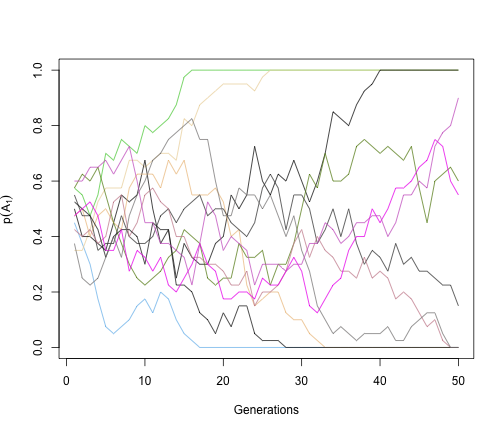
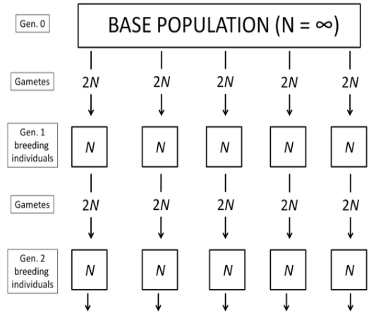
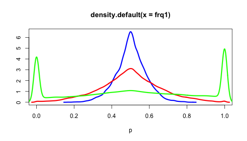
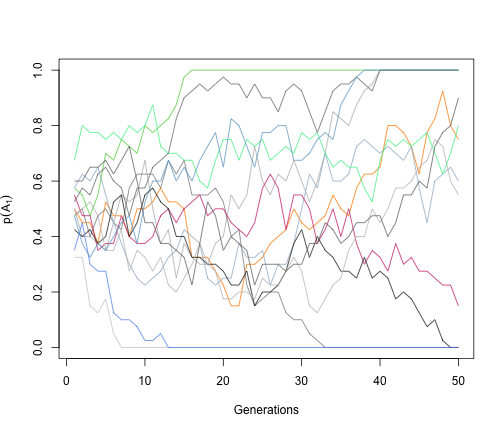

```{r setup, include=FALSE}
options(htmltools.dir.version = FALSE)
```

# Wright-Fisher Simulation

In the absence of migration, mutation, or selection, what is the allele freq over time?

--

```{r}
wright_fisher <- function(N=1000, A1=100, t=1000){
  p <- A1/(2*N)
  ### make a numeric vector to hold the results
  freq <- as.numeric();
  ### Use for loop to run over t generations
  for (i in 1:t){
    A1 <- rbinom(1, 2*N, p) # samling allele from a binom distribution
    p <- A1/(2*N)
    freq[i] <- p
  }
  return(freq)
}
frq <- wright_fisher(N=1000, A1=100, t=1000)
```

- N: population size = # of individuals per generation (assuming it is constant)
- A1: # of A1 allele in generation 0
- t: generations

---

```{r, fig.align='center', fig.height=6}
set.seed(12347)
N=2000; A1=2000; t=50
frq <- wright_fisher(N=N, A1=A1, t=t)
plot(frq, type="l", ylim=c(0,1), col=3, xlab="Generations",ylab=expression(p(A[1])))
    for(u in 1:100){
      frq <- wright_fisher(N=N, A1=A1, t=t)
      random <- sample(1:1000,1,replace=F)
      randomcolor <- colors()[random] 
      lines(frq,type="l",col=(randomcolor))
    }
```

---

```{r, fig.align='center', fig.height=6}
set.seed(12347)
N=20; A1=20; t=50
frq <- wright_fisher(N=N, A1=A1, t=t)
plot(frq, type="l", ylim=c(0,1), col=3, xlab="Generations",ylab=expression(p(A[1])))
    for(u in 1:20){
      frq <- wright_fisher(N=N, A1=A1, t=t)
      random <- sample(1:1000,1,replace=F)
      randomcolor <- colors()[random] 
      lines(frq,type="l",col=(randomcolor))
    }
```

---

# Small Populations

### Genetic drift

Change in allele frequencies __by chance__ from the random sampling of gametes in a finite (small) population

--

Allele frequencies are subject to __random fluctuations__ arsing from the sampling of gametes.


---

# Consequences of small population

### Random drift

- Leads to allele fixation

--

### Differentiation between sub-populations

- Leads to genetic differentiation and local group (or geographic isolation)

--

### Uniformity within sub-populations

- Reduces diversity and becomes more alike in genotype in local groups

--

### Increased homozygosity

- Reduces heterozygotes and results in inbreeding


---

# Two different perspectives

## Sampling process

- Describe it in terms of sampling variance

- Focus on understanding the binomial sampling

--

## Inbreeding process

- Describe it in terms of the genotypic changes resulting from matings between related individuals

- Understand the causes and consequences of inbreeding

---

# Sampling: the idealized population


.pull-left[
<div align="center">

</div>
]

.pull-right[
<div align="center">

</div>
]

--------------------

Several random drawn sets of gametes to form several sub-populations

- Each line is distinct and of size $N$
- Generations do not overlap
- Random mating within each line, including self-fertilization, no selection, disregard mutation

---

# Sampling: the idealized population

- For each sub-population with N individuals => $2N$ alleles

- If they segregating for two alleles ( $A_1$ and $A_2$ ) at a given locus, you can think of sampling one allele ( $A_1$ ) like flipping a coin (to get head). 
  - Need to update the freq ( $p_t$ ) of each generation
  
Therefore, this approximates a binomial sampling process

---

# Binomial distribution

A binomial distribution can be thought of as simply the probability of a __SUCCESS__ or __FAILURE__ outcome in an experiment that is repeated multiple times. 

### Distribution function

\begin{align*}
Pr(X=x) & = \frac{n!}{x!(n-x)!}p^x(1-p)^{n-x}
\end{align*}

- $n$, number of trials
- $x$, number of successes
- $p$, probability of success


#### Expected value (mean)

\begin{align*}
E(X) = np
\end{align*}

#### Variance

\begin{align*}
V(X) = np(1-p)
\end{align*}

---

# Binomial Distribution

__Flipping a coin to get heads__

### Distribution function


\begin{align*}
Pr(X=x) & = \frac{n!}{x!(n-x)!}p^x(1-p)^{n-x}
\end{align*}

- $n$, number of trials -  __total times we flip the coin__
- $x$, number of successes - __# of flips when we get heads__
- $p$, probability of success - __fair coin = 0.5__

--

Mean: __Number of flips $\times$ probability of heads__
\begin{align*}
E(X) = np
\end{align*}

Variance: __Number of flips $\times$ prob of heads $\times$ prob of tails__

\begin{align*}
V(X) = np(1-p)
\end{align*}

---

# Binomial Distribution

__Get $A_1$ allele__

### Distribution function


\begin{align*}
Pr(X=x) & = \frac{n!}{x!(n-x)!}p^x(1-p)^{n-x}
\end{align*}

- $n$, number of trials -  __total number of gametes ( $2N$ )__
- $x$, number of successes - __# of sampling when we get $A_1$__
- $p$, probability of success - __Allele freq of $A_1$ ( $p_0$ )__


---

# Variance of allele frequencies

\begin{align*}
Pr(X=x) & = \frac{n!}{x!(n-x)!}p^x(1-p)^{n-x}
\end{align*}

- Let $X=$ number of $A_1$ alleles in the sample 

- $2N$ = number of gametes

- $p_0$ = probability of getting the $A_1$ allele (or the allele freq)


--

### Variance


\begin{align*}
V(X) & = np(1-p) \\
 & = 2Np_0(1-p_0)
\end{align*}

__Number of gametes $\times$ prob of $A_1$ $\times$ prob of $A_2$__


---

# Variance of allele frequencies

### Variance

\begin{align*}
V(X) & = 2Np_0(1-p_0)
\end{align*}

#### Describe variance in terms of $p$ in the sample

- Freq of $A_1 = p = \frac{X = n_{A_1}}{2N}$


\begin{align*}
V(p) & = V(\frac{X}{2N}) = \frac{V(X)}{4N^2} = \frac{p_0(1-p_0)}{2N} \\
\end{align*}

--

#### Change in allele freq to generation 1

$\Delta p = p_1 - p_0$, because $p_0$ is constant (no variance), so:

--

\begin{align*}
V(\Delta p)  = V(p) & = \frac{p_0(1-p_0)}{2N} \\
& = V(q) = V(\Delta q)
\end{align*}

---

# Variance of allele frequencies

\begin{align*}
V(\Delta p)  = V(\Delta q) & = \frac{p_0(1-p_0)}{2N} \\
& = \frac{p_0q_0}{2N} \\
\end{align*}

- Variance in $\Delta p$ expresses the __magnitude of change in allele freq__

- With the assumption that the mean of __total__ population is unchanged, it measures:

  - Expected change in any one individual
  
  - Variance of allele freq across individuals at generation 1

--

# Variance at generation t

\begin{align*}
V(q)  =  p_0q_0(1-(1-\frac{1}{2N})^t) \\
\end{align*}


---


```{r eval=FALSE, fig.align='center', fig.height=4}
set.seed(12347)
N=2000; A1=2000; t=50
frq1 <- frq2 <- frq3 <- c()
for(u in 1:1000){
  ft1 <- wright_fisher(N=N, A1=A1, t=N/10)
  frq1 <- c(frq1, ft1)
  ft2 <- wright_fisher(N=N, A1=A1, t=N/2)
  frq2 <- c(frq2, ft2)
  ft3 <- wright_fisher(N=N, A1=A1, t=3*N)
  frq3 <- c(frq3, ft3)
}

plot(density(frq1),  xlim=c(0,1), col="blue", lwd=3, xlab="p", ylab= "", main="Fig 3.4")
lines(density(frq2), col="red", lwd=3)
lines(density(frq3), col="green", lwd=3)
```

<div align="center">

</div>

---
# Fixation

<div align="center">

</div>

- Over time, each sub-population fluctuates in allele freq and they become more spread apart

- Eventually, each line will become fixed
  - But, the mean allele freq of the lines is still $p_0$ and $q_0$
  - So, $p_0$ is the fraction of lines expected to be fixed for $A_1$ and $q_0$ the fraction fixed for $A_2$

---

# Genotype frequencies

<div align="center">

</div>

--

- Dispersion via drift leads to increased variation among lines and less within each line

--

- For the population as a whole, this leads to __increased homozygosity__
(decreased heterozygosity)
  - Homozygotes are gained at the expense of heterozygotes

