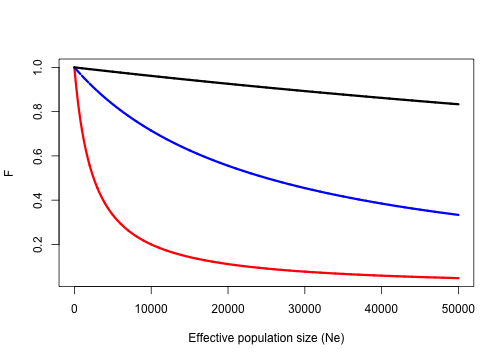
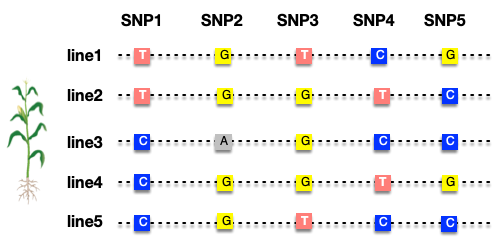
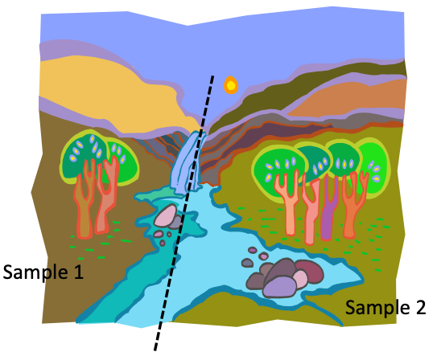

```{r setup, include=FALSE}
options(htmltools.dir.version = FALSE)
```


# Probability of fixation under selection

.pull-left[
<div align="center">

</div>
]

.pull-right[
\begin{align*}
Pr(fixation) = \frac{1 - e^{-2s}}{1- e^{-4N_es}}
\end{align*}

- $s$, the selection coefficient of __advantageous mutation__
]

--

- Favorable mutations likely be lost

- Mutation with a 1% advantage (heterozygous, $s=0.01$), has 2% probability of being fixed

- If 10% advantage $s=0.1$, probability becomes 20%

---

# Fixation for recessive homozygotes

### In a recessive model

- Normal homozygotes have same fitness as heterozygotes

- The equations don't fit

--

### For recessive advantageous mutation

\begin{align*}
Pr(fixation) \approx 1.13 \sqrt{\frac{s}{2N_e}}
\end{align*}

- $s$ is the selective advantage of homozygote mutant

> Kimura, 1962

---

# Polymorphism and Neutral Theory

Polymorphism is not always maintained by selection

### Mutation-drift equilibrium (in the absence of selection)

- Drift is reducing the number of alleles in the population

- While, mutation is increasing

- Eventually, equilibrium is reached with respect to the inbreeding coefficient ( $F$ )


---

# Mutation-drift equilibrium

- Probability two alleles are homozygous

\begin{align*}
F_t = \frac{1}{N_e} + (1 - \frac{1}{2N_e})F_{t-1}
\end{align*}

--

- With mutation occurring at rate $\mu$, the probability two alleles are IBD is $F_t \times (1-\mu)^2$
  
  - $(1 - \mu)^2$ is the probability both alleles don't mutate to another allele

  
\begin{align*}
F_t = [\frac{1}{N_e} + (1 - \frac{1}{2N_e})F_{t-1}] (1 - \mu )^2
\end{align*}

--

- At equilibrium ( $F_e$ ), $F_t = F_{t-1}$, through rearrangement:

\begin{align*}
F_e = \frac{(1 - \mu )^2}{2N_e - (2N_e -1)(1 - \mu)^2}
\end{align*}

--

- But $\mu$ is small as compared to 1 and can be ignored, so:

\begin{align*}
F_e \approx \frac{1}{4N_e\mu + 1}
\end{align*}


---

# Mutation-drift equilibrium

\begin{align*}
F_e \approx \frac{1}{4N_e\mu + 1}
\end{align*}


- $F_e$ is identify (or homozygosity)

- So, the expected heterozygosity at equilibrium is ( $1 - F_e$ ) or

\begin{align*}
1- F_e & \approx 1- \frac{1}{4N_e\mu + 1} \\
H_e  & \approx \frac{4N_e \mu}{4N_e\mu + 1}
\end{align*}

--

- Only the __probability of homozygosity__ remains constant at equilibrium

- The actual alleles are constantly changing, mutating, and drifting


---

# Mutation-drift equilibrium

\begin{align*}
F_e \approx \frac{1}{4N_e\mu + 1}
\end{align*}

- The relationship between $N_e$, $\mu$, and $F$ at quilibrium.

```{r}
fe <- function(ne, mu){
  den <- 4*ne*mu + 1  # denominator
  return(1/den)
}
```

---

# Mutation-drift equilibrium

```{r fig.align='center', fig.height=5}
ne <- seq(1, 50000, by=10)
plot(ne, fe(ne, mu=10^-4), type="l", lwd=3, col="red", xlab="Effective population size (Ne)", ylab="F")
lines(ne, fe(ne, mu=10^-5), lty=2, lwd=3, col="blue")
lines(ne, fe(ne, mu=10^-6), lty=2, lwd=3, col="black")
```


---

# Mutation-drift equilibrium


.pull-left[

<div align="center">

</div>
\begin{align*}
1- F_e & \approx 1- \frac{1}{4N_e\mu + 1} \\
H_e  & \approx \frac{4N_e \mu}{4N_e\mu + 1}
\end{align*}
]

--

- #### When the mutation rate is low (black line, $10^{-6}$), $F$ is high even at very large Ne

  - Mutations happen very infrequently and do not contribute much to the heterozygosity
  
  - Mutated alleles are easily lost through drift


- #### When the mutation rate is relative high (__red line__, $10^{-4}$)

  - Mutation counteracts drift through introducing new alleles at a high rate


---

# From Heterozygosity to Diversity


### Expected Heterozygosity ( $H_{exp}$ )

- Probability that two randomly chosen copies of a locus are different alleles

- $H_{exp}$ is often reported to __compare populations__

  - Predict outlook for population or infer ancestral events
  
  - For example, high $H_{exp}$ = maybe in HWE, large size, no obvious drift/inbreeding

--

$H_{exp}$ = 1 - (avg expected __homozygosity__ over all loci)

\begin{align*}
H_{exp} = 1 - \frac{1}{m}\sum_{k=l}^{m} \sum_{i=l}^{k} p_{ki}^2
\end{align*}

  - $m$ is the number of loci
  - $k$ is the number of alleles at a particular locus
  - $p_{ki}$ is the frq of $i^{th}$ allele at $k^{th}$ locus

---

# Expected Heterozygosity


| Loci | Allele   | Frq   | 
| :-------: | : ------ : | :-------: | 
| locus A   | $A_1$    | $0.2$    | 
|           | $A_2$    | $0.8$    |
| locus B   |  $B_1$        |  $0.3$        |  
|           |  $B_2$        |  $0.7$        |  

--

\begin{align*}
H_{exp} = 1 - \frac{1}{m}\sum_{k=l}^{m} \sum_{i=l}^{k} p_{ki}^2
\end{align*}

  - $m=2$ is the number of loci
  - $k=2$ is the number of alleles at a particular locus
  - $p_{ki}$ is the frq of $i^{th}$ allele at $k^{th}$ locus

--

\begin{align*}
H_{exp} & = 1 - \frac{1}{2}\sum_{k=1}^{2} \sum_{i=1}^{2} p_{ki}^2 \\
& = 1 - \frac{1}{2}(0.2^2 + 0.8^2 + 0.3^2 + 0.7^2) \\
& = 0.37
\end{align*}

---

# Expected Heterozygosity


- If $H_e$ is high, it does not mean that there are a lot of heterozygotes.

- It reflects potential diversity 

- And how much __heterozygosity you would expect__ if the population were to randomly mate (no selection, migration, mutation, etc.).

--

# Diversity - allelic richness

- Count of how many alleles are in a sample

- Informative when comparing populations

  - A population with fewer alleles may be prone to inbreeding
  
  - A locus with fewer alleles compared to others may indicate it is selected for/against (i.e., minor alleles tends to be deleterious alleles)
  

---

# Nucleotide Diversity ( $\pi$ )

- Average of nucleotide difference between any two copies of a locus

- When you look at a nucleotide position of two random copies of a gene, diversity  ( $\pi$ ) is the __probability they are different__

--

\begin{align*}
\Pi = \frac{n}{n-1} \sum_{ij} x_i x_j \pi_{ij}
\end{align*}

- $x_i$ and $x_j$ is the freq of the $i^{th}$ and $j^{th}$ haplotype
- $\pi_{ij}$ is the proportion of nucleotide differences between $i^{th}$ and $j^{th}$ haplotype


---

# An example of Nucleotide Diversity

Here, we sequenced a population of 5 maize inbred lines for 500 bp and identified SNP variants as below.

<div align="center">

</div>

--

--------------

- Total number of bp: $N_t = 500$
- Number of polymorphic: $N_p = 5$

- Proportion of polymorphic site: $P_n = \frac{N_p}{N_t} = \frac{5}{500} = 0.01$


---

# An example of Nucleotide Diversity

<div align="center">

</div>

--------------

\begin{align*}
\Pi = \frac{n}{n-1} \sum_{ij} x_i x_j \pi_{ij}
\end{align*}

- $x_i$ and $x_j$ is the freq of the $i^{th}$ and $j^{th}$ haplotype
- $\pi_{ij}$ is the proportion of nucleotide differences between $i^{th}$ and $j^{th}$ haplotype

---

# An example of Nucleotide Diversity

<div align="center">

</div>

--------------

\begin{align*}
\Pi = \frac{n}{n-1} \sum_{ij} x_i x_j \pi_{ij}
\end{align*}

- $x_i$ and $x_j$ is the freq of the $i^{th}$ and $j^{th}$ haplotype
- $\pi_{ij}$ is the proportion of nucleotide differences between $i^{th}$ and $j^{th}$ haplotype


- $\pi_{12} =3/500$, $\pi_{13} =3/500$, $\pi_{14} =3/500$, $\pi_{14} =2/500$
- $\pi_{23} =3/500$, $\pi_{24} =2/500$, $\pi_{14} =3/500$
- ...

---

# An example of Nucleotide Diversity

<div align="center">

</div>

--------------

```{r}
df <- data.frame(hap=paste0("line", 1:5), snp1=c(0,0,1,1,1), 
                 snp2=c(1,1,0,1,1), snp3=c(0,1,1,1,0), 
                 snp4=c(1,0,1,0,1), snp5=c(0,1,1,0,1))
snp <- t(df[,-1])
getpi <- function(snp, totbp=500){
  nhap = ncol(snp) # number of hap
  td <- c()
  for(i in 1:(nhap -1)){
    for(j in (i+1):nhap){
      cn <- sum(abs(snp[,i] - snp[,j])) # count the nucleotide differences
      td <- c(td, cn)
    }
  }
  return(nhap/(nhap -1)*(1/nhap)^2*sum(td)/totbp)
}
```

---

# An example of Nucleotide Diversity

```{r}
getpi(snp, totbp=500)
```

Heterozygosity at this SNP site is:


\begin{align*}
h = \frac{n}{n-1}(1- p^2 - q^2)
\end{align*}

- $n$ is the number of haplotypes in a population

--

then the sum of site heterozygosities is:

\begin{align*}
\sum_{i=1}^S h_i
\end{align*}

- Here, $S$ is the number of polymorphic sites
- $h_i$ is the heterozygosity at the $i$th site

---

# An example of Nucleotide Diversity

<div align="center">

</div>

--------------

```{r}
geth <- function(snp, totbp=500){
  nhap = ncol(snp) # number of hap
  q <- apply(snp, 1, sum)/nhap
  p <- 1 -q
  return(nhap/(nhap -1) * sum(rep(1, nhap) - p^2 - q^2)/totbp/2)
}
geth(snp, totbp=500)
```
---
# An example of Nucleotide Diversity

<div align="center">

</div>

# Heterozygosity and Nucleotide Diversity

This estimate of heterozygosity gives us the average number of pairwise necleotide difference.

\begin{align*}
\Pi = \sum_{i=1}^S h_i
\end{align*}

---

# Population structure

What if you did not know population boundaries before sampling?


<div align="center">

</div>

--

### Wahlund Effect

- Unknown (cryptic) population structure can appear as __a deficiency of heterozygotes__
  - Add this to the list of forces that can created reduced heterozygosity and increased homozygosity in your sample
