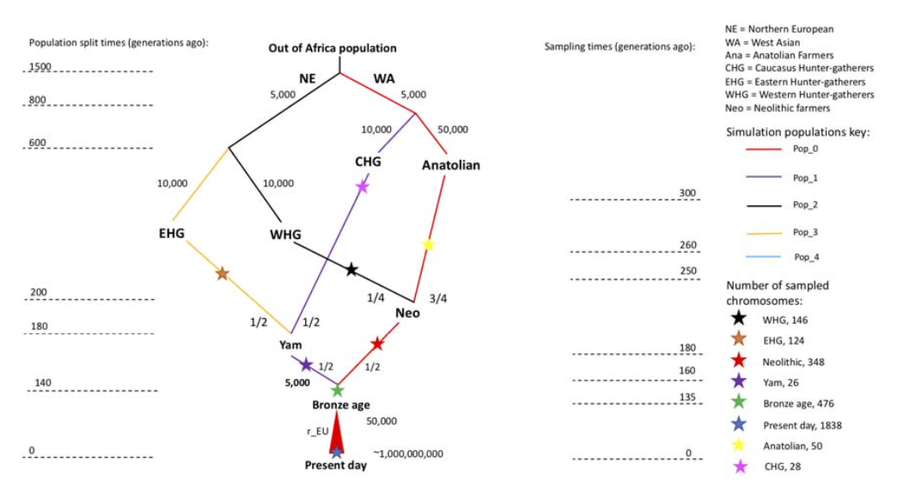
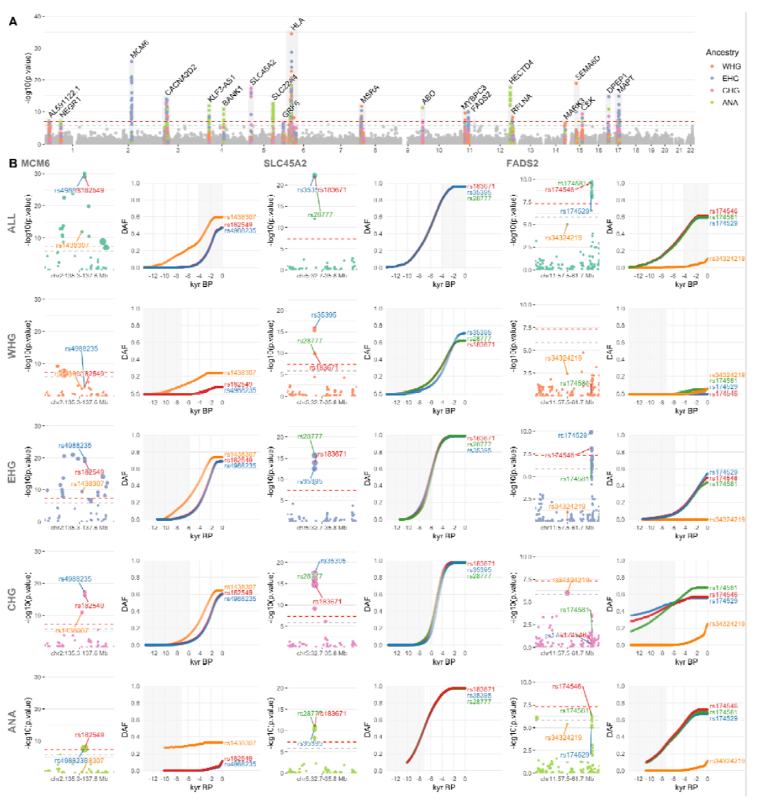
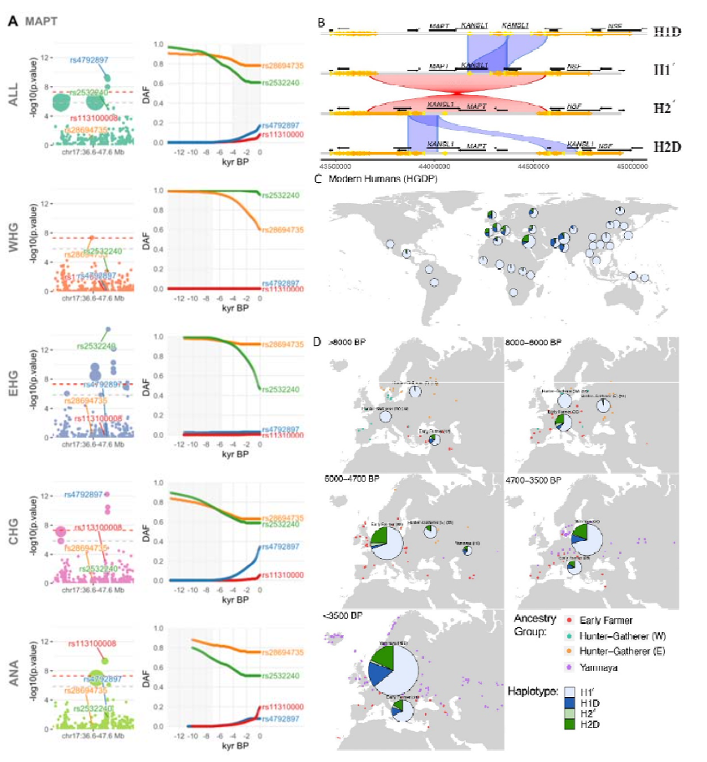
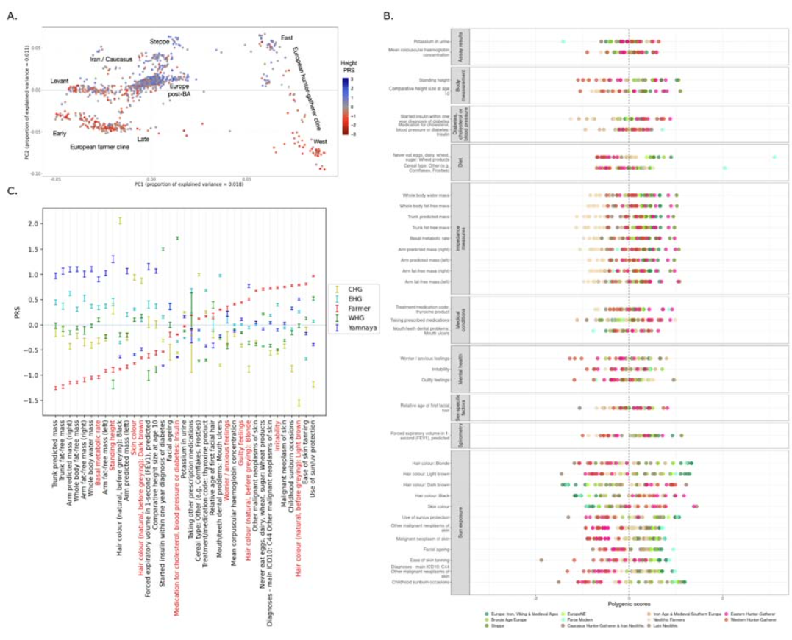

```{r setup, include=FALSE}
options(htmltools.dir.version = FALSE)
```


# Points to cover in the review:

- ### 1. Novelty

- ### 2. Quality

- ### 3. Clarity

- ### 4. Reproducibility

---

# Points to cover in the review:
### Novelty

- What are the main claims of the paper and how significant are they? 

- How novel is the work? Are the conclusions worth knowing? 

- Is this paper important in its discipline? 

- Are the claims properly placed in the context of the previous literature? 

---

# Points to cover in the review:
### Novelty

- What are the main claims of the paper and how significant are they? 

--

> Our results paint a picture of the combined contributions of migration and selection in shaping the phenotypic landscape of present-day Europeans that suggests __a combination of ancient selection and migration__, rather than recent local selection, is the primary driver of present-day phenotypic differences in Europe.

--

- How novel is the work? Are the conclusions worth knowing? 

> __Ancient DNA (aDNA)__ provides the potential to resolve these issues, by directly observing changes in trait associated allele frequencies over time.

--

> We used __a novel chromosome painting technique__, ... This allows us to identify many trait-associated genetic variants with hitherto unknown evidence for positive selection, as well as __resolve long-standing questions about the timing of selection__ for key health, dietary and pigmentation associated loci.


---

# Points to cover in the review:

### Novelty
- Is this paper important in its discipline? 

> Prehistoric humans underwent three major migration events across Eurasia, ... Each of these events represents a crucial period in human history that has shaped the genetic diversity observed in present-day Europe, ...
- By [Attwaters 2024](https://www.nature.com/articles/s41576-024-00702-4?utm_source=nrg_etoc&utm_medium=email&utm_campaign=toc_41576_25_3&utm_content=20240220) 

--

- Are the claims properly placed in the context of the previous literature? 

> Whilst numerous prior studies have used ancient DNA to infer patterns of selection in Eurasia during the Holocene (e.g., 8–10), many key questions remain unanswered. 

---

# Points to cover in the review:

### Quality

- Do the data and analyses support the authors’ claims?   
  - 1664 _imputed diploid?_ ancient genomes from different times and spaces
  > using imputed aDNA genotype probabilities, we identified 11 genome-wide significant selective sweeps in the GWAS variants

- Is the stated purpose achieved throughout the paper? 

- Would additional work improve the manuscript? 

- Is the experimentation design appropriate for the purpose of the study? 

---

# Results: Figure 1

<div align="center">

</div>

---

# Results: Figure 2

<div align="center">

</div>

---

# Results: Figure 3

<div align="center">

</div>

---

# Results: Figure 4

<div align="center">

</div>


---

# Points to cover in the review:

### Clarity

- Evaluate clarity, style and readability of the paper to scientists in the field.  

  - May need an overview diagram to show the sample collection sites.
  - Some fig legends are hard to read

--

- Would you recommend the author seek the service of a professional science writer?

---

# Points to cover in the review:

### Reproducibility

- Are original data (and/or code) deposited in appropriate repositories?

> __Data availability__
All collapsed and paired-end sequence data for novel samples sequenced in this study will be made publicly available on the European Nucleotide Archive, together with trimmed sequence alignment map files, aligned using human build GRCh37. Previously published ancient genomic data used in this study are detailed in Supplementary Table VII of 11, and are all already publicly available.


- Are details of the methodology sufficient to allow the experiments to be reproduced? 

> __Code availability__
The modified version of CLUES used in this study is available from https://github.com/standard-aaron/clues 
...

> All other analyses relied upon available software which has been fully referenced in the manuscript and detailed in the relevant supplementary notes.

