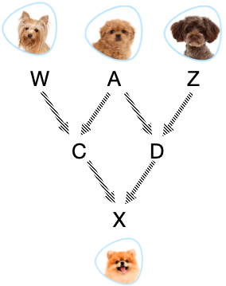
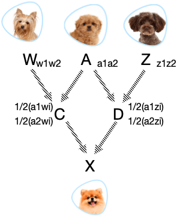
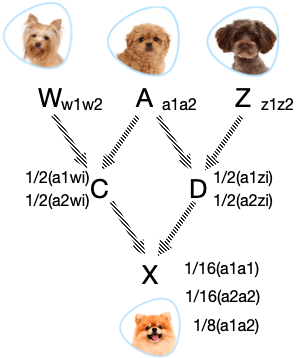
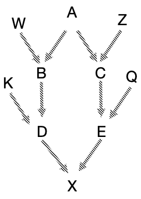
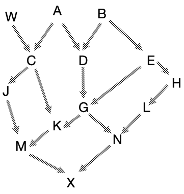

```{r setup, include=FALSE}
options(htmltools.dir.version = FALSE)
```


# Inbreeding coefficient

- The probability of any individual being an identical homozygous

- Or the probability that a pair of haplotypes within an individual are IBD

--

### Inbreeding coefficent at generation $t$

\begin{align*}
F_{t} =\frac{1}{2N_e} + (1 - \frac{1}{2N_e})F_{t-1}
\end{align*}
> From F&M Ch3 without considering mutation

This equation estimates the average inbreeding coefficient of __all individuals__ of a generation!

--

### How about the inbreeding coefficient for a given individual $F_X$?

- The above calculation is just an approximation

- Pedigree information can be leveraged to get more accurate results


---

# Pedigreed population

.pull-left[
<div align="center">

</div>
]

--

.pull-right[
- A “common ancestor” is an individual who could pass copies of haplotypes through both sides of the pedigree to some future offspring.

- Letters for the haplotypes reflect the parent source.

]

---

# Pedigreed population

.pull-left[
<div align="center">

</div>
]


.pull-right[
- A “common ancestor” is an individual who could pass copies of haplotypes through both sides of the pedigree to some future offspring.

- Letters for the haplotypes reflect the parent source.

- Haplotypes in genotypes ( $a_1a_1$ ) and ( $a_2a_2$ ) are identical copies of haplotypes from A.

- Haplotypes in genotypes ( $a_1a_2$ ) may be identical by descent if parents of A are related.
  - The probability that $a_1 \equiv a_2 = F_A$.
  - here, $\equiv$ means IBD
]

---

# Pedigreed population

Question: what is the inbreeding of individual dog X?

.pull-left[
<div align="center">

</div>
]

--

.pull-right[
\begin{align*}
F_X  = & Pr_X(a_1a_1) +  Pr_X(a_2a_2) \\
& + Pr_X(a_1a_2)Pr(a_1 \equiv a_2) \\
\end{align*}
]

---

# Pedigreed population

Question: what is the inbreeding of individual dog X?

.pull-left[
<div align="center">

</div>
]


.pull-right[
\begin{align*}
F_x  = & Pr_X(a_1a_1) +  Pr_X(a_2a_2) \\
& + Pr_X(a_1a_2)Pr(a_1 \equiv a_2) \\
= & (\frac{1}{2})^4 + (\frac{1}{2})^4 + 2(\frac{1}{2})^4F_A \\
= & (\frac{1}{2})^3 + (\frac{1}{2})^3F_A \\
= & (\frac{1}{2})^3(1 + F_A)
\end{align*}
]

---

# Pedigreed population

Question: what is the inbreeding of individual dog X?

.pull-left[
<div align="center">

</div>
]


.pull-right[
\begin{align*}
F_x  = & Pr_X(a_1a_1) +  Pr_X(a_2a_2) \\
& + Pr_X(a_1a_2)Pr(a_1 \equiv a_2) \\
= & (\frac{1}{2})^4 + (\frac{1}{2})^4 + 2(\frac{1}{2})^4F_A \\
= & (\frac{1}{2})^3 + (\frac{1}{2})^3F_A \\
= & (\frac{1}{2})^3(1 + F_A)
\end{align*}
- Look for “paths” connecting the parents and the common ancestor
- Or for example, __C A D = 3__ individuals (let this be n)
]


---

# Individual Inbreeding

Now we can write an expression for $F_X$:

\begin{align*}
F_X  = (\frac{1}{2})^n(1 + F_A)
\end{align*}

--

- In the previous example, $F_X  = (\frac{1}{2})^3(1 + F_A) = 1/8(1 + F_A)$

--

- If there are more generations between the common ancestor and parents – change $n$.

--
--------------

.pull-left[
<div align="center">

</div>
]

--

.pull-right[
- Path: D B __A__ C E

- $F_X  = (\frac{1}{2})^5(1 + F_A)$
]


---

# It is never be that simple ...

.pull-left[
#### Inbreeding of X if $F_A=F_B=F_E=0$?
<div align="center">

</div>
]

--

.pull-right[
### Paths for $F_X$
- M K __G__ N
- M K G D __B__ E H L N
- M K C __A__ D G N
- M J C __A__ D G N
- M K G __E__ H L N
]

---

# It is never be that simple ...

.pull-left[
#### Inbreeding of X if $F_A=F_B=F_E=0$?
<div align="center">

</div>
]

.pull-right[
### Paths for $F_X$
- M K __G__ N (n=4)
- M K G D __B__ E H L N (n=9)
- M K C __A__ D G N (n=7)
- M J C __A__ D G N (n=7)
- M K G __E__ H L N (n=7)

#### Summing all these:
- Note: $F_G=1/8$
- $F_{X}=49/512 = 0.096$ or $9.6\%$
]

--

X is expected to have __9.6% fewer heterozygous loci__ than a non-inbreeding individual in the same population.


---

# What does it mean for $F_X=9.6\%$?

### Assuming 4 loci segregating in the population

#### The frequencies: 
- $p_{A1}=0.05$, $p_{B1}=0.1$, $p_{C1}=0.15$, $p_{D1}=0.45$

--

#### $H_{exp}$ in the population = $\frac{1}{m}\sum2pq$

```{r}
h <- function(p){return(2*p*(1-p))}
(h(p=0.05)+h(p=0.1)+h(p=0.15)+h(p=0.45))/4
```
- Avg across 4 loci = 0.26

--

- A non-inbreeding individual is expected to be heterozygous at 26% of its loci

- Individual X ( $F_X = 0.096$ ) is expected to be heterozygous at $(1-0.096) \times 0.26 = 23.5\%$ of the loci


