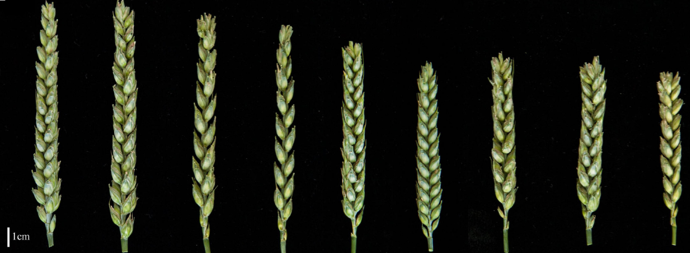

```{r setup, include=FALSE}
options(htmltools.dir.version = FALSE)
```


# Expectation and Variance 

### Expectation $E(X)$:  
\begin{align*}
E(f(X)) = \sum\limits_{i=1}^kf(x_i)Pr(X = x_i)
\end{align*}


\begin{align*}
E[X] &= 0 \times (1 - p)^2 + 1 \times [2p(1-p)] + 2 \times p^2 = 2p \\
\end{align*}

--

### Variance $Var(X)$:
\begin{align*}
Var(X) &= E[X^2] - E[X]^2 \\
       &= 2p(1-p) \\
\end{align*}


---
# Examples for probabilities

| Genotype (G) | $MY \leq 100$ | $100 < MY \leq 300$ | $MY > 300$  | Marginal $Pr(G)$  | 
| :-------: | ------- | ------- | ------- | ------- | ------- |
| aa      | 0.10 | 0.04 |  0.02  | 0.16    |
| Aa     |  0.14 | 0.18 | __0.16__ | __0.48__ |
| AA | 0.06 | 0.10 | 0.20 | 0.36 |
| Marg. Prob.|  0.30 | 0.32 | 0.38 | 1.00 |

#### Joint Probability

Two random variables to **occur together**.
- In the `Milk Yield` example, the joint probability of $Pr(G=Aa, MY > 300) = 0.16$

--

#### Marginal Probability

A sum of **mutually exclusive** and **exhaustive** set of events.
- The marginal probability of $Pr(G=Aa)=0.48$ for all possible MY

---
# Examples for probabilities

| Genotype (G) | $MY \leq 100$ | $100 < MY \leq 300$ | $MY > 300$  | Marginal $Pr(G)$  | 
| :-------: | ------- | ------- | ------- | ------- | ------- |
| aa      | 0.10 | 0.04 |  0.02  | 0.16    |
| Aa     |  0.14 | 0.18 | __0.16__ | __0.48__ |
| AA | 0.06 | 0.10 | 0.20 | 0.36 |
| Marg. Prob.|  0.30 | 0.32 | 0.38 | 1.00 |

#### Conditional Probability

Conditional probability is the likelihood of an event occurring, based on the occurrence of a previous event.

--

- What is the conditional probability of $Pr(MY > 100 | G=Aa)$?

--

$$
\begin{align*}
Pr(X = x | Y = y) & = \frac{Pr(X = x, Y = y)}{ Pr(Y = y)} \\
Pr(MY > 100 | G=Aa) & = \frac{Pr(G=Aa, MY > 300)}{Pr(G=Aa)} = \frac{0.16}{0.48} = 0.33 \\
\end{align*}
$$


---
# Genotype (G) and Milk Yield (MY)


| Genotype (G) | $MY \leq 100$ | $100 < MY \leq 300$ | $MY > 300$  | Marginal $Pr(G)$  | 
| :-------: | ------- | ------- | ------- | ------- | ------- |
| aa      | 0.10 | 0.04 |  0.02  | 0.16    |
| Aa     |  0.14 | 0.18 | 0.16 | 0.48 |
| AA | 0.06 | 0.10 | __0.20__ | __0.36__ |
| Marg. Prob.|  0.30 | 0.32 | __0.38__ | 1.00 |

#### Statistical Independence

Two events X and Y are statistical independent if and only if their joint probability can be factorized into their marginal probabilities. 
- $Pr(X = x_i, Y = y_j) = Pr(X = x_i) \times Pr(Y = y_j)$


--

$$
\begin{align*}
&Pr(MY > 300, G = AA) = 0.20\\
&Pr(MY > 300) \times Pr(G = AA) = 0.36 \times 0.38 = 0.14 \\
\end{align*}
$$


---
# Genotype (G) and Milk Yield (MY)


| Genotype | $MY = 100$ | $MY = 150$ | $MY = 300$  | Marginal $Pr(G)$  | 
| :-------: | ------- | ------- | ------- | ------- | ------- |
| aa      | 0.10 | 0.04 |  0.02  | 0.16    |
| Aa     |  0.14 | 0.18 | 0.16 | 0.48 |
| AA | 0.06 | 0.10 | 0.20 | 0.36 |
| Marg. Prob.|  0.30 | 0.32 | 0.38 | 1.00 |

What are the genotype effects, or $E(MY | X_{AA})$, $E(MY | X_{aa})$, $E(MY | X_{Aa})$?

--

#### Conditional Expectation

The expectation (=mean) for variable $X$ conditional on variable $Y=y$ is:

\begin{align*}
E(X|Y = y) & = \sum\limits_{i=1}^k x_i Pr(X = x_i | Y = y) \\
& = \sum\limits_{i=1}^k x_i \frac{Pr(X = x_i, Y = y)}{Pr(Y = y)} \\
\end{align*}


---
# Genotype (G) and Milk Yield (MY)


| Genotype | $MY = 100$ | $MY = 150$ | $MY = 300$  | Marginal $Pr(G)$  | 
| :-------: | ------- | ------- | ------- | ------- | ------- |
| aa      | 0.10 | 0.04 |  0.02  | 0.16    |
| Aa     |  0.14 | 0.18 | 0.16 | 0.48 |
| AA | 0.06 | 0.10 | 0.20 | 0.36 |
| Marg. Prob.|  0.30 | 0.32 | 0.38 | 1.00 |

What are the genotype effects, or $E(MY | X_{AA})$, $E(MY | X_{aa})$, $E(MY | X_{Aa})$?

--

$$
\begin{align*}
E(MY| X_{AA}) & = \sum\limits_{i=1}^3 MY_i Pr(MY = MY_i | X = X_{AA}) \\
& = 100 \times 0.06/0.36 + 150 \times 0.10/0.36 + 300 \times 0.20/0.36 = 81/0.36 = 225
\end{align*}
$$
--

$$
\begin{align*}
E(MY| X_{aa}) & = \sum\limits_{i=1}^3 MY_i Pr(MY = MY_i | X = X_{aa}) \\
& = 100 \times 0.10/0.16 + 150 \times 0.04/0.16 + 300 \times 0.02/0.16 = 22/0.16 = 137.5
\end{align*}
$$
$$
\begin{align*}
E(MY| X_{Aa}) & = \sum\limits_{i=1}^3 MY_i Pr(MY = MY_i | X = X_{Aa}) \\
& = 100 \times 0.14/0.48 + 150 \times 0.18/0.48 + 300 \times 0.16/0.48 = 89/0.48 = 185.4
\end{align*}
$$


---
# Covariance

To quantify to what extent the two variables **co-vary**.

#### If X and Y are independent

Then the expectation operator $E$ has the property

$$
\begin{align*}
E(XY) = E(X)E(Y) \\
\end{align*}
$$
And Covariance is zero $Cov(X, Y) =0$

--

#### If X and Y are NOT independent

$$
\begin{aligned}
Cov(X, Y) & = E(XY) - E(X)E(Y) \\
\end{aligned}
$$
where,
$$
\begin{aligned}
E(XY) = \sum_i \sum_j x_i y_j Pr(X = x_i, Y = y_j)
\end{aligned}
$$

---
# A plant spikelet example

The number of spikelets per spike:

\begin{align*}
Y_{i} = G_i + E_i = \sum\limits_{j=1}^{j=m} X_{ij} \alpha_{j} + E_i
\end{align*}

<div align="center">

</div>

--

```{r tables-mtcars, echo=FALSE}
library(knitr)
library(kableExtra)
dt <- data.frame(Variety=c("NE03490", "NE03490", "Aspen", "Aspen", "Hawken", "Hawken"),
                 P=c(3, 2, 3, 2, 3, 2)*10,
                 G=c(2.8, 2.8, 2.6, 2.6, 2.2, 2.2)*10,
                 E=c(0.2, -0.8, 0.4, -0.6, 0.8, -0.2)*10,
                 Prob=c(0.20, 0.05, 0.30, 0.20, 0.05, 0.20))
kable(dt)
```


--

#### What is the covariance between G and P?


---
# A plant spikelet example

#### What is the covariance between G and P?


$$
\begin{aligned}
Cov(G,P) &=E(GP) - E(G)E(P) \\
\end{aligned}
$$ 


```{r}
dt <- data.frame(Variety=c("NE03490", "NE03490", "Aspen", "Aspen", "Hawken", "Hawken"),
                 P=c(30, 20, 30, 20, 30, 20),
                 G=c(28, 28, 26, 26, 22, 22),
                 E=c(2, -8, 4, -6, 8, -2),
                 Prob=c(0.20, 0.05, 0.30, 0.20, 0.05, 0.20))
```

--

```{r, results='markup'}
sum(with(dt, G*P*Prob)) # E(GP) #<<
sum(with(dt, G*Prob)) # E(G) #<<
sum(with(dt,  P*Prob)) # E(P) #<<
```

---
# A plant spikelet example

#### What is the covariance between G and P?


$$
\begin{aligned}
Cov(G,P) &=E(GP) - E(G)E(P) \\
&= 655 - (25.5)^2 = 4.75 \\
\end{aligned}
$$ 

--

#### What is the covariance between G and E?

Similarly, to calculate $Cov(G, E) =E(GE) - E(G)E(E)$:

```{r}
sum(dt$G * dt$E * dt$Prob) # E(GE) #<<
sum(dt$E * dt$Prob) # E(E) #<<
```
$$
\begin{aligned}
Cov(G, E) &=E(GE) - E(G)E(E) \\
&= 0 - (25.5) \times 0 = 0 \\
\end{aligned}
$$ 
---
# Correlation between X and Y

A mutual relationship between two variables. 
- It is any statistical relationship, whether __causal or not__, between two random variables.

$$
\begin{align*}
r_{XY} & = Corr(X, Y) \\
& = \frac{Cov(X, Y)}{\sqrt{Var(X)Var(Y)} }\\
\end{align*}
$$

--

### The correlation coefficent between G and P

$$
\begin{align*}
 r_{GP} & = \frac{Cov(G, P)}{\sqrt{Var(G)Var(P)} }\\
\end{align*}
$$

---

# The correlation coefficent between G and P

$$
\begin{align*}
 r_{GP} & = \frac{Cov(G, P)}{\sqrt{Var(G)Var(P)} }\\
\end{align*}
$$

- $Cov(G, P) =4.75$

--

- $Var(G) = E(G^2) - E(G)^2$

```{r}
sum(dt$G^2 * dt$Prob) - sum(dt$G * dt$Prob)^2
```

--

- $Var(P) = E(P^2) - E(P)^2$

```{r}
sum(dt$P^2 * dt$Prob) - sum(dt$P * dt$Prob)^2
```

--

$$
\begin{align*}
 r_{GP} & = \frac{Cov(G, P)}{\sqrt{Var(G)Var(P)} }\\
        & = \frac{4.75}{\sqrt{4.75 \times 24.75}} = 0.438\\
\end{align*}
$$

---
# Linear Regression

The regression of $Y$ on $X$:

$$
\begin{align*}
\hat{y} = E(Y|X)
\end{align*}
$$
This is also called the **best predictor** of $Y$ given $X$.

--

Regression can be used to define **a linear model**:
$$
y = \hat{y} + e
$$
where $e$ is called the residual.

--

Another definition of the simple linear regression model:

$$
\begin{aligned}
y = \bar{y} & + \beta_{YX}(x - \bar{x})+e \\
\text{with } & \bar{y} = E(Y) \\
& \beta_{YX} = \frac{Cov(Y, X)}{Var(X)} \\
\end{aligned}
$$

---
# Predict G based on P


$$
\begin{align*}
& G = \bar{G}  + \beta_{GP}(P - \bar{P}) + e \\
\end{align*}
$$
--

For the bread wheat spikelet data:

- $\begin{align*} \bar{P} & = E(P) = 25.5 \end{align*}$
- $\begin{align*} \bar{G} & = E(G) = 25.5 \end{align*}$

--

And regression coefficient:
$$
\begin{align*}
\beta_{GP} & = \frac{Cov(G, P)}{Var(P)} \\
& = 4.75/24.75 = 0.192\\
\end{align*}
$$
--

Therefore, the **best predictor** of $G$ given $P$ 

$$
\begin{aligned}
\hat{G} & = \bar{G} + \beta_{GP}(P- \bar{P} ) \\
& = 25.5 + 0.192(P-25.5)
\end{aligned}
$$

---
# Prediction Model

$$
\begin{aligned}
\hat{G} & = 25.5 + 0.192 \times (P - 25.5) \\
& = 20.604 + 0.192 \times P
\end{aligned}
$$
--

```{r, out.width='40%', fig.align='center'}
plot(x=1, y=1, ylim=c(0, 50), xlim=c(0, 30), type="n", xlab="P", ylab="G")
# a, b : single values specifying the intercept and the slope of the line
abline(a=20.604, b=0.192, lwd=3, col="red")
```

---
# Get predicted G

Using the prediction model: 
$$
\begin{aligned}
G = 20.604 + 0.192 \times P
\end{aligned}
$$

```{r}
dt$ghat <- 20.604 + 0.192*dt$P
kable(dt)
```

---
# Accuracy of prediction

The accuracy of the prediction is equal to the **correlation of $\hat{y}$ with its true value $y$**. 

We can derive accuracy as:
$$
\begin{aligned}
r_{XY} & = \frac{Cov(x, y)}{\sqrt{Var(x) Var(y)}} \\
r_{\hat{y}y} & =  \frac{Cov(\hat{y}, y)}{\sqrt{Var(\hat{y})Var(y)}} \\
\end{aligned}
$$


---
# Accuracy of prediction

```{r}
kable(dt)
```

--

$$
\begin{aligned}
r_{\hat{G}G} & =  \frac{Cov(\hat{G}, G)}{\sqrt{Var(\hat{G})Var(G)}} \\
\end{aligned}
$$

```{r}
vg <- sum(dt$G^2 * dt$Prob) - sum(dt$G * dt$Prob)^2
vghat <- sum(dt$ghat^2 * dt$Prob) - sum(dt$ghat * dt$Prob)^2
cov_g_ghat <- sum(dt$ghat * dt$G * dt$Prob) - sum(dt$G * dt$Prob) * sum(dt$ghat * dt$Prob)
r_ghat_g <- cov_g_ghat / sqrt(vg*vghat)
r_ghat_g
```


