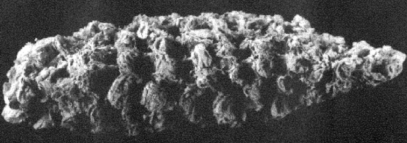

```{r setup, include=FALSE}
options(htmltools.dir.version = FALSE)
```


# Nobel Prize in Physiology or Medicine 2022

.pull-left[
<div align="center">

</div>
]

.pull-right[
<div align="center">

</div>
A maize cob from the Ocampo Caves (Valenzuela cave), dated to 3890 ± 60 years before the present. Length, 47 mm. 
> from Paabo's 2003 Science
]

-----------

Svante Paabo represents the field of __evolutionary genetics__ and/or __population genetics!!!__

---

# Points to cover in the review:

- ### 1. Novelty

- ### 2. Quality

- ### 3. Clarity

- ### 4. Reproduciblity

---

# Points to cover in the review:
### Novelty

- What are the main claims of the paper and how significant are they? 

- How novel is the work? Are the conclusions worth knowing? 

- Is this paper important in its discipline? 

- Are the claims properly placed in the context of the previous literature? 

---

# Points to cover in the review:

### Quality

- Do the data and analyses support the authors’ claims?   

- Is the stated purpose achieved throughout the paper? 

- Would additional work improve the manuscript? 

- Is the experimentation design appropriate for the purpose of the study? 

---

# Points to cover in the review:

### Clarity

- Evaluate clarity, style and readability of the paper to scientists in the field.  

- Would you recommend the author seek the service of a professional science writer?

---

# Points to cover in the review:

### Reproduciblity

- Are original data (and/or code) deposited in appropriate repositories?

- Are details of the methodology sufficient to allow the experiments to be reproduced? 

--

------

### Paper for discussion

Kielf et al., 2022 [BioRxiv](https://www.biorxiv.org/content/10.1101/2022.03.02.482602v1)

