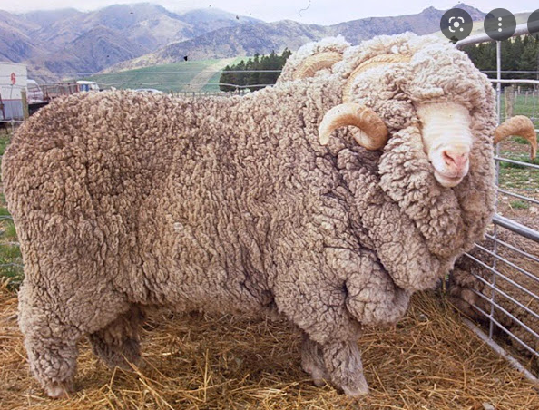
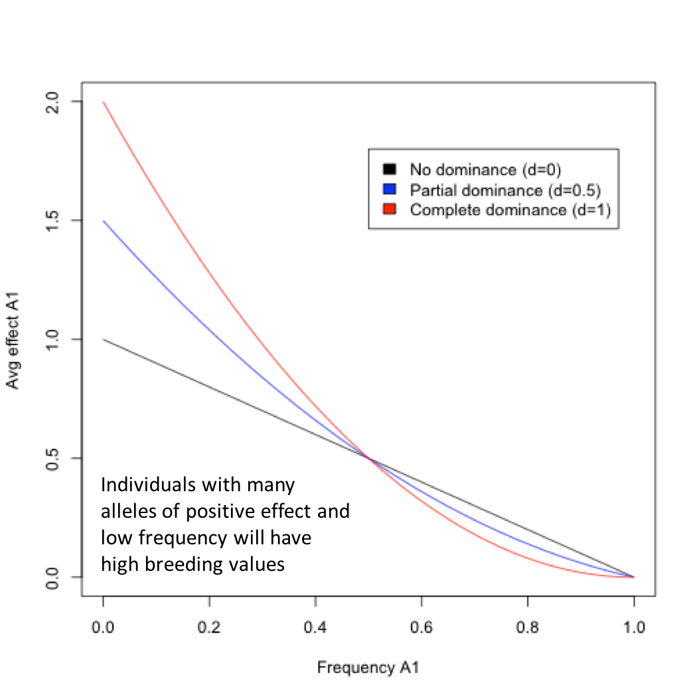

```{r setup, include=FALSE}
options(htmltools.dir.version = FALSE)
```


# Basic Genetic Model

\begin{align*}
\mathbf{P} &= \mathbf{G} + \mathbf{E} \\
\end{align*}


- $\mathbf{P}$: Phenotypic value
- $\mathbf{G}$: Genotypic value
- $\mathbf{E}$: Environmental deviation

--

If we replicate a genotype in a large number of environments 
- Average environmental deviation would be __zero__ 
- And phenotypic average would be equal to the genotypic value of that genotype

--

### Genotypic Value (G)

When a single locus is under consideration,

\begin{align*}
\mathbf{G} &= \mathbf{A} + \mathbf{D} \\
\end{align*}


- $\mathbf{A}$: Additive genetic value
- $\mathbf{D}$: Dominance deviation


---

# Genotypic value

<div align="center">

</div>

- We need to assign arbitrary values to genotypes to dissect the genotypic value of an individual


- Midpoint between $A_1A_1$ and $A_2A_2$ is commonly standardized to 0. Or, represented as $m$.

--

### Gene action (or mode of inheritance):

- Value of $A_1A_2$ indicates gene action at the locus
  - $d = 0$: __additive__ gene action
  - $d = a$ or $-a$: __complete dominance__ or __complete recessive__
  - $d > a$ or $d < -a$: __overdominance__ or __underdominance__
  - Any other values of $d$ besides those above values are __partial dominance__


---

# Population Mean

In a population in HWE:

| Genotype  | Freq.   | Value   | 
| :-------: |: ------- :| :-------: | 
| $A_1A_1$  | $p^2$   | $+a$    | 
| $A_1A_2$  | $2pq$   | $d$     | 
| $A_2A_2$  | $q^2$   | $-a$    |

#### What is the Population mean ( $M$ ) or the expected genotypic value?

--

According to *Formula (1)* in the STAT Note:
  
\begin{align*}
E(f(X)) = & \sum\limits_{i=1}^kf(x_i)Pr(X = x_i) \\
M = & p^2a + 2pqd - q^2a \\
       = & a(p-q) + 2pqd
\end{align*}

--
where $M$ is the deviation from the midpoint of the homozygotes.
- The first term comes from the homozygote values
- The second from the value of the heterozygote

---

# B Locus Example

Booroola (B) locus influences fecundity in Merino sheep

.pull-left[
| Genotype  | Mean litter size   | 
| :-------: |: ------- :| 
| $B_1B_1$  | $2.66$   |  
| $B_1B_2$  | $2.46$   |
| $B_2B_2$  | $1.48$   |

- Freq of $B_1 = 0.25$
]

.pull-right[
<div align="center">

</div>
]

--

#### What is the M?

- First, determine midpoint:

- then, determine $a$ and $d$: 

- And finally calculate the population mean

---

# B Locus Example

Booroola (B) locus influences fecundity in Merino sheep

.pull-left[
| Genotype  | Mean litter size   | 
| :-------: |: ------- :| 
| $B_1B_1$  | $2.66$   |  
| $B_1B_2$  | $2.46$   |
| $B_2B_2$  | $1.48$   |

- Freq of $B_1 = 0.25$
]

.pull-right[
<div align="center">

</div>
]

#### What is the M?

- First, determine midpoint:
  - $(2.66 + 1.48)/2 = 2.07$
- then, determine $a$ and $d$: 
  - $a=2.66 - 2.07 = 0.59$
  - $d=2.46 - 2.07 = 0.39$
- And finally calculate the population mean
  $M = a(p-q) + 2pqd = 0.59 \times (0.25 - 0.75) + 2 \times 0.25 \times 0.75 \times 0.39 = -0.149$

--

Note that this is the __deviation from the midpoint__, 2.07.

---
# Multiple Loci

When multiple loci are acting **independently** and contributing to overall value, the mean is:

\begin{align*}
M =  \sum_{i=1}^k{a}_i(p_i - q_i) + 2\sum_{i=1}^kp_iq_id_i
\end{align*}

- Summation over all the loci

- $k$ is the number of loci affecting the genotypic value of a trait

---
# Average effect of an allele

- Parents pass on **alleles**, not _genotypes_

- The average effect of an allele depends on 
  - the genotypic values ( $a$, $d$ ) 
  - and allele frequency ( $p$, $q$ )

- Thus, an average effect can be unique for each population because of differences in allele freq between populations.

--
### Average effect of $A_1$

- Mean deviation from the population mean of individuals who received that allele from one parent

- The other allele is received at random 
  - i.e., according to the allele freq, $q$, from the population


---

# The avarage effect of $A_1$

- Consider the $A_1$ allele. Under HWE, the probability an $A_1$ allele combines with another $A_1$ allele to form an $A_1A_1$ genotype is $p$. The value of the $A_1A_1$ genotype is $a$. 


- The probability an $A_1$ allele combines with an $A_2$ allele to form a heterozygote, with value $d$, is $q$. 

--

- The upshot of this is that 
  - allele $A_1$ forms __genotypes $A_1A_1$__  with value of $a$ at a frequency of $p$, 
  - and forms __genotypes $A_1A_2$__ with a value of $d$ at a frequency of $q$. 

- Thus, the mean value of individuals that received $A_1$ is $pa + qd$ 
  - and, the average effect of allele $A_1$ is (recall definition above):

--

\begin{align*}
\alpha_1 = & pa + dq - M \\
  = & pa + dq - (a(p-q) + 2pqd) \\
  = & q(a + d(q - p))
\end{align*}

  
---
# Allele Substitution 


<div align="center">

</div>

--
What is effect of substituting an $A_1$ allele for $A_2$?

- This can be simply expressed as the difference in average effect of the two alleles:

\begin{align*}
\alpha = & \alpha_1 - \alpha_2 \\
  = & q(a + d(q-p)) - (-p(a + d(q-p))) \\
  = & a + d(q - p)
\end{align*}


---

# Revist the Booroola locus example


| Genotype  | Mean litter size   | 
| :-------: |: ------- :| 
| $B_1B_1$  | $2.66$   |  
| $B_1B_2$  | $2.46$   |
| $B_2B_2$  | $1.48$   |

- Freq of $B_1 = 0.25$, $p = 1- q = 0.25$ 
- Recall that $a= 0.59$, $d = 0.39$, and $M=-0.149$

#### What is the average effect of allele $B_1$?

--

- Mean of individuals receiving a $B_1$ allele (others coming from random) is:  $pa + qd$
  - $0.25 \times 0.59 + 0.75 \times 0.39 = 0.44$
  
- Averge effect of $B_1$:
  - $\alpha_1 = 0.44 - M = 0.44 - (-0.149) = 0.589$


---

# Revist the Booroola locus example

| Genotype  | Mean litter size   | 
| :-------: |: ------- :| 
| $B_1B_1$  | $2.66$   |  
| $B_1B_2$  | $2.46$   |
| $B_2B_2$  | $1.48$   |

- Freq of $B_1 = 0.25$, $p = 1- q = 0.25$
- Recall that $a= 0.59$, $d = 0.39$, and $M=-0.149$

#### What is the average effect of allele substitution $\alpha$?

--

\begin{align*}
\alpha = & a + d(q - p) \\
 = & 0.59 + 0.39 \times (0.75 - 0.25) \\
 = & 0.785
\end{align*}

--

#### The average effect of allele $B_2$ or $\alpha_2$?

\begin{align*}
\alpha = & \alpha_1 - \alpha_2 \\
\alpha_2 = & \alpha_1 - \alpha \\
 = & 0.589 - 0.785 = - 0.196 \\
\end{align*}


---

# Revist the Booroola locus example

| Genotype  | Mean litter size   | 
| :-------: |: ------- :| 
| $B_1B_1$  | $2.66$   |  
| $B_1B_2$  | $2.46$   |
| $B_2B_2$  | $1.48$   |

- Freq of $B_1 = 0.25$, $p = 1- q = 0.25$
- Recall that $a= 0.59$, $d = 0.39$, and $M=-0.149$


#### What is the $M$ and $\alpha$ values if __ $B_1 = 0.85$__?

--

\begin{align*}
M = & a(p-q) + 2pqd \\
 = & 0.59 \times (0.85-0.15) + 2 \times 0.85 \times 0.15 \times 0.39 \\
 = & 0.512 \\
\alpha = & a + d(q - p) \\
 = & 0.59 + 0.39 \times (0.15 - 0.85) \\
 = & 0.317
\end{align*}

--
As population mean increases, average effect of the allele substitution decreases.

---

# Avg effect of A1 vs. allele freq

\begin{align*}
\alpha_1 = & q(a + d(q - p)) \\
\end{align*}

When d=0, 
\begin{align*}
\alpha_1 = & q(a + d(q - p))  = (1-p)a = a - pa\\
\end{align*}

<div align="center">

</div>

Average effect of an allele plotted against its frequency in the population. 

---

# Avg effect  vs. allele freq

\begin{align*}
\alpha_1 = & q(a + d(q - p)) \\
\alpha = & a + d(q - p) \\
\alpha_1 =& q\alpha \\
\end{align*}


- If dominant is absent (i.e. d=0), $A_1A_2$ is right in the middle in any case, so $\alpha$ is just equal to $a$.


--

- If dominant is present, randomly change $A_2$ alleles to $A_1$ alleles will have a greater effect when $A_1$ alleles are less frequent.

\begin{align*}
\alpha = & a + d(q - p) \\
= & a + d(1-p-p) \\
= & (a +d) - 2d \times p \\
\end{align*}


