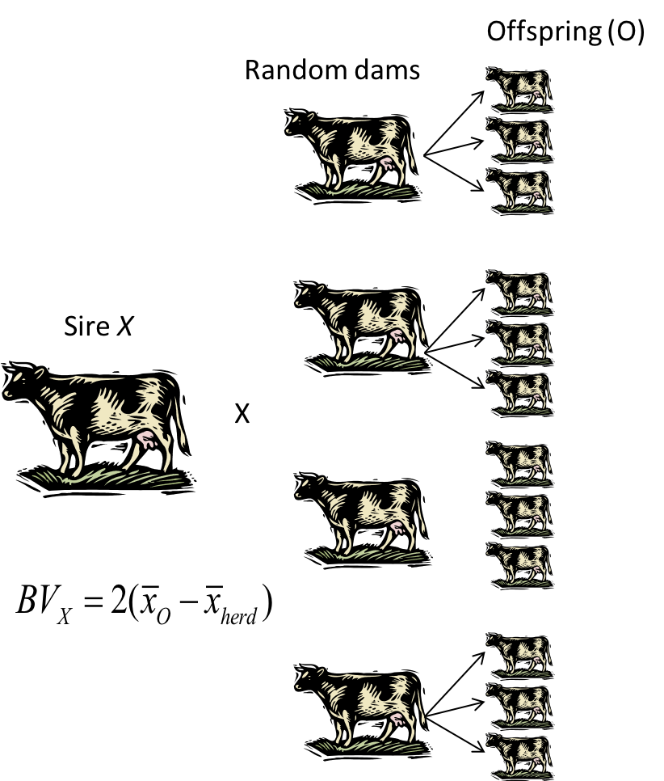

```{r setup, include=FALSE}
options(htmltools.dir.version = FALSE)
```


# Genotypic value

| Genotype  | Freq.   | Value   | Freq. $\times$ Val.   | 
| :-------: |: ------- :| :-------: | :-------:  | 
| $A_1A_1$  | $p^2$   | $+a$    |  $p^2a$        |
| $A_1A_2$  | $2pq$   | $d$     | $2pqd$           |
| $A_2A_2$  | $q^2$   | $-a$    | $-q^2a$          |
|           |         | Sum =   | $a(p-q) + 2pqd$  |

--

### Parents pass on **alleles**, not genotypes.

--

### Average Effect of $A_1$ and $A_2$


---

# Average Effect of $A_1$ and $A_2$

The average effect of $A_1$ is the **mean deviation** from the **population mean** of individuals which received that allele from one parent, and the alleles received from the other parents being at random.

--

According to Falconer & Mackey `Table 7.2`:

\begin{align*}
\alpha_1 = q(a + d(q-p))
\end{align*}

\begin{align*}
\alpha_2 = -p(a + d(q-p))
\end{align*}

--

### Allele substitution effect

\begin{align*}
\alpha =  \alpha_1 - \alpha_2 =  a + d(q-p) \\
\end{align*}

--

therefore,
\begin{align*}
\alpha_1 = & q\alpha \\
\alpha_2 = & -p\alpha \\
\end{align*}

---
# Breeding value (A)


Breeding value is the "value" of an individual as a parent. 
- The value of an individual, judged by the mean value of its progeny, is called the *breeding value* (__A__) of the individual.

- Note that breeding value is **population specific**.

--


### Theoretical definition

Sum of the average effects of the alleles an individual carries.

\begin{align*}
BV =  \sum_{i=1}^k\sum_{j=1}^2\alpha_{ij}
\end{align*}

Where summation occurs across the number of loci ( $k$ ) and the two alleles present at each locus.

---
# Breeding value (A)

### Operational/Practical definition

The deviation of the value of an individual's offspring from the population mean.


.pull-left[
<div align="center">

</div>
]

--

.pull-right[
### To get the BV of sire X
1. mate it to many random dams

2. measure the performance of all the offspring

3. subtract population mean from the offspring mean and multiply by 2
]


---
# Breeding value (A)

Consider only one locus using the theoretical definition:

| Genotype  | Breeding Value  | 
| :-------: | :-------: | 
| $B_1B_1$  | $2\alpha_1$ |  
| $B_1B_2$  | $\alpha_1 + \alpha_2$ |
| $B_2B_2$  | $2\alpha_2$  | 

--

### Booroola locus example

Returning to our two example populations and looking at breeding values of the three genotypes.

- Recall that $a=0.59$ and $d=0.39$

- In __pop1__, freq of $B_1$ allele is 0.25

- In **pop2**, freq of $B_1$ allele is 0.85


---
# Breeding value (A)

Consider only one locus using the theoretical definition:

| Genotype  | Breeding Value  | BV of pop1 | BV of pop2 |
| :-------: | :-------: | | |
| $B_1B_1$  | $2\alpha_1$ | | |
| $B_1B_2$  | $\alpha_1 + \alpha_2$ | | |
| $B_2B_2$  | $2\alpha_2$  | | |

### Booroola locus example

Returning to our two example populations and looking at breeding values of the three genotypes.

- Recall that $a=0.59$ and $d=0.39$

- In __pop1__, freq of $B_1$ allele is 0.25

- In **pop2**, freq of $B_1$ allele is 0.85

- $\alpha = a+d(q-p)$, 0.785 for pop1 and 0.317 for pop2

---
# Breeding value (A)

Consider only one locus using the theoretical definition:

| Genotype  | Breeding Value  | BV of pop1 | BV of pop2 |
| :-------: | :-------: | :----: | :----: |
| $B_1B_1$  | $2\alpha_1$ | 1.18 | 0.10 |
| $B_1B_2$  | $\alpha_1 + \alpha_2$ | 0.39 | $-0.22$ |
| $B_2B_2$  | $2\alpha_2$  | $-0.39$ | $-0.54$ |

### Booroola locus example

Returning to our two example populations and looking at breeding values of the three genotypes.

- Recall that $a=0.59$ and $d=0.39$
- In __pop1__, freq of $B_1$ allele is 0.25
- In **pop2**, freq of $B_1$ allele is 0.85
- $\alpha = a+d(q-p)$, 0.785 for pop1 and 0.317 for pop2

This demonstrates that the BV of an individual is dependent on the population of reference.
In pop1, where the freq of $B_1$ is less, there is greater value of an $B_1B_1$ individual as a parent.


---
# Breeding value (A)

Consider only one locus using the theoretical definition:

| Genotype  | Breeding Value  | Freq |
| :-------: | :-------: | :----: |
| $B_1B_1$  | $2\alpha_1=2q\alpha$ | $p^2$ | 
| $B_1B_2$  | $\alpha_1 + \alpha_2 = q\alpha - p\alpha$ | $2pq$ |
| $B_2B_2$  | $2\alpha_2 = -2p\alpha$  | $q^2$ |

### What is the mean BV if the population is in HWE?

--

\begin{align*}
BV = & 2q\alpha \times p^2 + (q\alpha - p\alpha) \times 2pq - 2p\alpha \times q^2 \\
   = & 2pq\alpha \times (p +q) - 2pq\alpha \times (p + q) \\
   = & 0
\end{align*}

---

# BV of offspring

The expected breeding value of offspring (o) is $1/2$ the sum of the sire and dam breeding values.


\begin{align*}
E(A_o) = & 1/2(A_s + A_d)
\end{align*}

Note here $o$, $s$, and $d$ refer to offspring, sire (male), and dam (female) respectively. 

--

- Different offspring of the same parents will differ in BV

--

- The expected BV is also the individual's expected phenotypic value

\begin{align*}
E(P_o) = E(A_o) = & 1/2(A_s + A_d)
\end{align*}

---

# Dominance deviation (D)

We can examine the failure of the additive value to reflect the genotypic value as a deviation --- **a dominance deviation**.

--

### G = A + D

- Population mean: $M = a(p-q) + 2dpq$

- Avg. allele substitution effect: $\alpha = a+d(q-p)$

| Genotype  | Genotypic Value | Value as deviated from $M$      | 
| :-------: | :-------: | :-----------: |
| $A_1A_1$  | $a$   |  ?   |
| $A_1A_2$  | $d$   |   ?  | 
| $A_2A_2$  | $-a$  |   ?  | 


---

# Dominance deviation (D)

We can examine the failure of the additive value to reflect the genotypic value as a deviation --- **a dominance deviation**.


### G = A + D

- Population mean: $M = a(p-q) + 2dpq$

- Avg. allele substitution effect: $\alpha = a+d(q-p)$

| Genotype  | Genotypic Value | Value as deviated from $M$      | 
| :-------: | :-------: | :-----------: |
| $A_1A_1$  | $a$   |  $a -M = 2q(a-pd) = 2q(\alpha - qd)$   |
| $A_1A_2$  | $d$   |   $d- M = a(q-p) + d(1-2pq) = (q-p)\alpha + 2pqd$  | 
| $A_2A_2$  | $-a$  |   $-a-M = -2p(a+qd) = -2p(\alpha + pd)$  | 


---

# Dominance deviation (D)

We can examine the failure of the additive value to reflect the genotypic value as a deviation --- **a dominance deviation**.

--

### G = A + D

| Genotype  |  Value as deviated from $M$      | Breeding Value  | Dominance Deviation  | 
| :-------: |  :-----------: | :-----------: | :-------: | :-------: | 
| $A_1A_1$  |   $2q(\alpha - qd)$   | $2q\alpha$    |   ?  |  
| $A_1A_2$  |   $(q-p)\alpha + 2pqd$  | $(q-p)\alpha$ |    ?   |  
| $A_2A_2$  |   $-2p(\alpha + pd)$  | $-2p\alpha$   |  ?   |   

---

# Dominance deviation (D)

We can examine the failure of the additive value to reflect the genotypic value as a deviation --- **a dominance deviation**.


### G = A + D

| Genotype  |  Value as deviated from $M$      | Breeding Value  | Dominance Deviation  | 
| :-------: | :-------: | :-----------: | :-----------: | :-------: | :-------: | 
| $A_1A_1$  |   $2q(\alpha - qd)$   | $2q\alpha$    |   $-2q^2d$   |  
| $A_1A_2$  |   $(q-p)\alpha + 2pqd$  | $(q-p)\alpha$ |    $2pqd$   |  
| $A_2A_2$  |   $-2p(\alpha + pd)$  | $-2p\alpha$   |  $-2p^2d$   |   

- Note that in the absence of dominance, breeding values and genotypic values are the same.

---

# Dominance deviation (D)


| Genotype  |  Value as deviated from $M$      | Breeding Value  | Dominance Deviation  | 
| :-------: | :-------: | :-----------: | :-----------: | :-------: | :-------: | 
| $A_1A_1$  |   $2q(\alpha - qd)$   | $2q\alpha$    |   $-2q^2d$   |  
| $A_1A_2$  |   $(q-p)\alpha + 2pqd$  | $(q-p)\alpha$ |    $2pqd$   |  
| $A_2A_2$  |   $-2p(\alpha + pd)$  | $-2p\alpha$   |  $-2p^2d$   |   

- It follows that the mean dominance deviation is zero.

--

The mean dominance deviation:

\begin{align*}
 = & p^2 \times (-2q^2d) + 2pq \times 2pqd + q^2 \times (-2p^2d) \\
 = & - 2p^2q^2d + 4p^2q^2d - 2p^2q^2d \\
 = & 0
\end{align*}


---
# Interaction deviation (epistasis)

- Epistasis = interaction of alleles at **different** loci

- Also causes deviation of genotypic value from additive genetic value (or BV)

--

Imagine a trait controlled by two loci, A and B. Then

\begin{align*}
 G = & G_A + G_B + I_{AB} \\
   = & (\alpha_i + \alpha_j + \delta_{ij}) + (\alpha_k + \alpha_l + \delta_{kl}) + I_{AB}
\end{align*}

--

Where 

\begin{align*}
 I_{AB} = & \alpha_i\alpha_k + \alpha_i\alpha_l + \alpha_j\alpha_k + \alpha_j\alpha_l \\
    & + \alpha_i\delta_{kl} + \alpha_j\delta_{kl} + \alpha_k\delta_{ij} + \alpha_l\delta_{ij} \\
    & + \delta_{ij}\delta_{kl}
\end{align*}


---
# Interaction deviation (epistasis)

- Interaction effect can arise through interaction
  - Between the average allele effects at each locus ( __A__ $\times$ __A__ )
  - Between average effect and dominance deviation ( __A__ $\times$ __D__ )
  - And between dominance deviations ( __D__ $\times$ __D__ )

- As # of loci increases, so does # of interactions (exponentially)

--

- Summed to contribute to the epistatic deviation ( $I$ )

\begin{align*}
G = \sum_{i=1}^k(A_i + D_i) + I
\end{align*}


