```{r setup, include=FALSE}
options(htmltools.dir.version = FALSE)
```

# About Me

- Bachelor's and Master's degrees from CAU (2001-2008)

--

### Professional Experience

- 2008-2014: __Ph.D.__ @ Iowa State University 
  - Genetics and Genomics
  
- 2014-2017: __PostDoc__ @ University of California, Davis 
  - Evolutionary Genetics

- 2017-2023: __Assistant Professor__ @ University of Nebraska-Lincoln
- 2023-now: __Associate Professor__ @ University of Nebraska-Lincoln
  - Quantitative Genetics and Statistical Genomics


---

# About my lab

- [My lab](https://jyanglab.com/people/) focuses on __quantitative genetics__ and __statistical genomics__ of maize and its wild relatives

--

<div align="center">
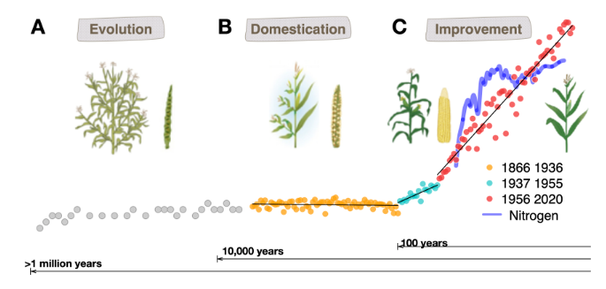
</div> 

- From historical _domestication_ to future _improvement_
  - Particularly interested in __Nitrogen Use Efficiency (NUE)__ using PopGen approaches


---

# Slides for this class module


- Lab website: https://jyanglab.com/teaching/
    - __Module 1__: [[HTML](https://jyanglab.com/slides/2024-module/week1/w1.html)]
    - __Module 2__: [[HTML](https://jyanglab.com/slides/2024-module/week2/w2v1.html)]
    - __Module 3__: [[HTML](https://jyanglab.com/slides/2024-module/week3/w3v1.html)]
       
--

### If you know someone who is going to do a Ph.D. or looking for a PostDoc position

- __[Complex Biosystems](https://cbio.unl.edu/) Ph.D. program @UNL__
  - Rotation in multiple labs
  - Across disciplines
  
- __Heuermann Postdoctoral Fellow @UNL__
  - Competitive annual salary
  - Working with two PIs
  - Develop research projects of your design
  
---

# Learning Goals and Objectives

### Overall learning goals: 

- Understand the basic principles of population genomics

- Apply the knowledge for study crop domestication and its implication for crop improvement

--

### Objectives:

- 1) Learn basic population genomics terminology

- 2) Learn how to measure diversity using sequencing data

- 3) Understand the statistics for measuring population differentiation

- 4) Understand different methods to scan for direct and linked selection to detect selective sweeps

---

# A timely and hot topic

### __Nobel Prize in Physiology or Medicine 2022__


.pull-left[
<div align="center">

</div>
]


--

.pull-right[
<div align="center">

</div>
A maize cob from the Ocampo Caves (Valenzuela cave), dated to 3890 ± 60 years before the present. Length, 47 mm. 
> from Paabo's 2003 Science paper
]

--

-----------

__Svante Paabo__ represents the field of _evolutionary genetics_ and/or _population genetics!!!_

---
# Future (or Current) jobs

.pull-left[
<div align="center">
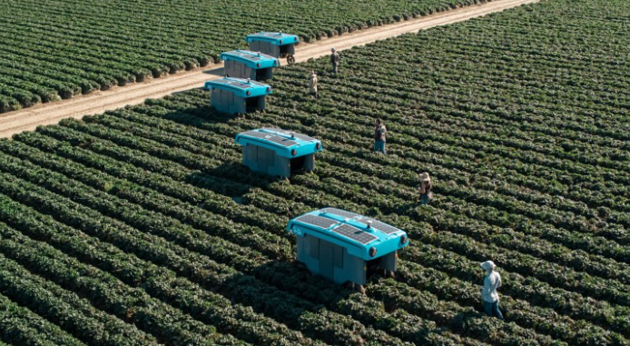
</div>
> Google X, the Moonshot Factory

A job description __Data Scientist, Plant Biology__ in Google X
]

--

.pull-right[
### What you should have

- Experience working with biological data, with an emphasis on NGS.

- Understanding of molecular biology, field trial design, or population genetics.

- Experience in the agriculture industry.

- Knowledge of statistical methods and applied machine learning.

...
]

---

# Syllabus

### Module 1: Introduction and PopGen terminology
- Introduction of population genomics
- Some case studies of crop domestication and improvement

### Module 2: Diversity measurement
- NGS and diversity measurement
- Population differentiation

### Module 3: Scan for direct and linked selection
- Direct selection
- Linked selection


---
# 151 crops and their domestication origins

<div align="center">

</div>

---
# Maize domestication


<div align="center">
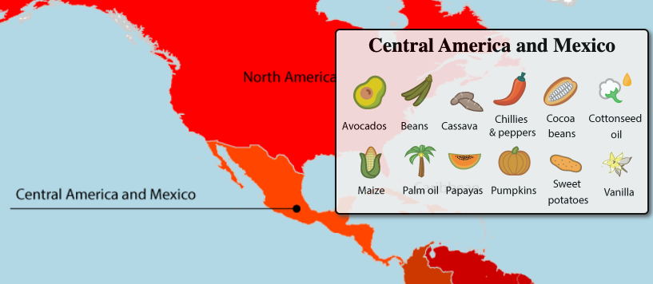
</div>


--

---------

.pull-left[
<div align="center">

</div>
]

.pull-right[
<div align="center">
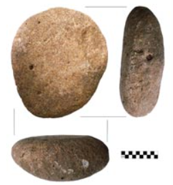
</div>
]

This __8,700__ year-old milling stone (excavated in an area of __the Balsas Valley__ in southwestern Mexico) was used to process maize and other crops. Maize starch grains were recovered from the stone.


---
# Plant Domestication

<div align="center">
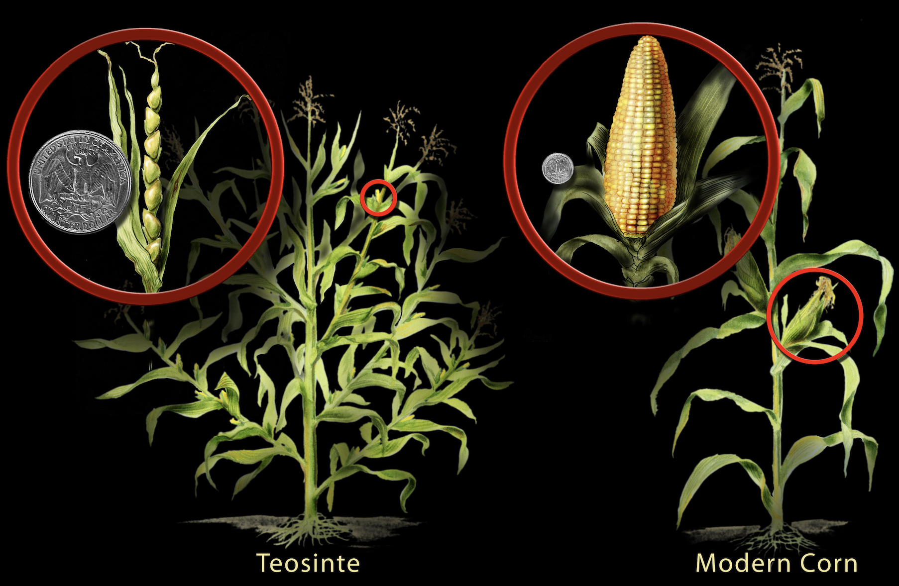
</div>

- “Plant domestication is the _genetic modification_ of a wild species to create a new form of a plant altered _to meet human needs_.” 
> Doebley et al., 2006

--

__Plant domestication__ is the process whereby wild plants have been evolved into crop plants through artificial selection. 

- This usually involves an early hybridization event followed by selective breeding.

---
# Wild and domesticated species

<div align="center">

</div>

--

__Fitness__ are different between wild ancestors and domesticated crops

- Fitness describes individual __reproductive__ success.

---

# Domestication Syndrome

.pull-left[
<div align="center">
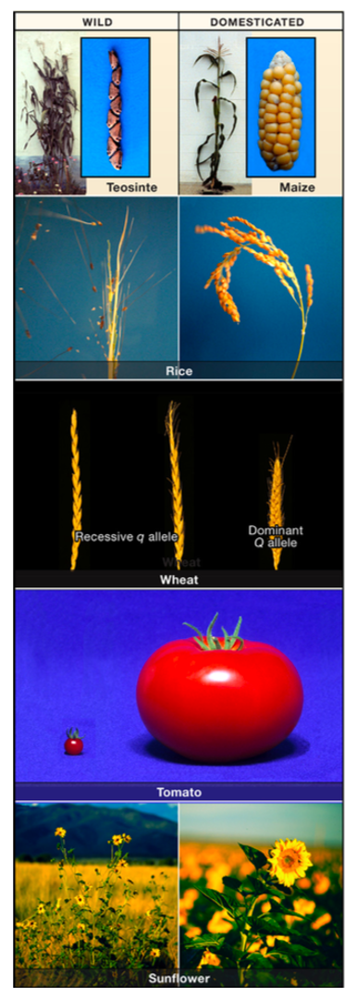
</div>
]

.pull-left[
Compared to their progenitors, crops typically have:
- Larger grains or fruits

- More robust plants overall

- More determinate growth or increased apical dominance  

- A loss of natural seed dispersal

> Doebley et al., 2006
]

---
# Genes controlling domestication traits

<div align="center">

</div>
> Doebley et al., 2006


---
# Population genomics for domestication

### Understand the PopGen

- To identify the selective sweeps 
  - [Hufford et al., 2012](https://www.nature.com/articles/ng.2309) _Nature Genetics_
  
- To infer the history of populations
  - [Beissinger et al., 2016](https://www.nature.com/articles/nplants201684) _Nature Plants_
  
- To examine the relative effects of evolutionary forces across the genome 
  - [Xu et al., 2020](https://www.nature.com/articles/s41467-020-19333-4) _Nature Communications_
  - [Meier et al., 2022](https://elifesciences.org/articles/75790) _eLife_
  
--

### Design a selection scan experiment
- Sampling wild and domesticated populations
- DNA sequencing and data analysis

---
# Sequencing platforms and technologies

### Illumina (HiSeq, MiSeq, NextSeq)
- Throughput: very high
- Read length: up to 2x300 bp 
- Accuracy: high (error rate is < 1%)

--

### PacBio/Nanopore
- Throughput: moderate
- Read length: very long (> 70kb or > 1Mb)
- Accuracy: low (error rate is about 10%-20%)

--

### Single-cell technologies (10x Genomics and spatial scRNA-seq)
- Single-cell resolution
- Functional genomics


---
# Basic sequence terminology

.pull-left[
<div align="center">

</div>

- An alignment of three sequences sampled from 3 plants of a population

- Each of the sequences has 10 nucleotides, from the same locus on a chromosome.
]

--

.pull-right[
There are two __polymorphisms__ (or segregating sites)

Single nucleotide polymorphisms ( __SNPs__ )
  - In the 3rd position, we have T/C alleles
  - In the 8th position, we have G/T alleles
]


The set of alleles found on a single sequence is referred to as a __Haplotype__.
- _TG_ haplotype and _CT_ haplotype

--

In the 3rd position, __Major allele__ is T and __Minor allele__ is C (minor allele frequency, or MAF, is 1/3)

--

If T is the same allele as the wild ancestor, then it is the __Ancestral allele__, and C is the __Derived allele__.

---

# Allele and genotype frequencies

.pull-left[
<div align="center">
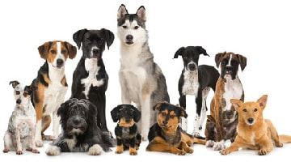
</div>
]


.pull-right[
- dog 1: AA AA __TT__ CC GG 
- dog 2: AA AA __CC__ CC GG
- dog 3: AA AA __CT__ CC GG 
- dog 4: AA AA __CT__ CC GG
- dog 5: AA AA __CC__ CC GG
]

Consider a diploid locus segregating for two alleles ( $A_1$ and $A_2$ ).
We usually define the less frequent allele (or minor allele) as the $A_1$ allele.

### Allele frequency ( $p$ and $q$ ) 
Frequency/proportion of alleles of a particular identity at one locus

### Genotype frequency ( $f_{11}$, $f_{12}$, $f_{22}$ )
Proportion of individuals with a specific genotype (combination of alleles)

---

# Allele and genotype frequencies

.pull-left[
<div align="center">

</div>
]

.pull-right[
- dog 1: AA AA __TT__ CC GG 
- dog 2: AA AA __CC__ CC GG
- dog 3: AA AA __CT__ CC GG 
- dog 4: AA AA __CT__ CC GG
- dog 5: AA AA __CC__ CC GG
]

Let $n$ be the total number of individuals in the population. Genotype frequency of __TT__ is: 1/5


--

The frequency of minor allele $A_1$ in the population is then given by

\begin{align*}
p = \frac{2n_{11}+n_{12}}{2n} = f_{11} + \frac{1}{2}f_{12}
\end{align*}

```{r}
n = 5
n11 = 1
f11 = n11/n
n12 = 2
p = f11 + 1/2*2/n
p ### allele freq of minor allele T
```


---

# Hardy-Weinberg Equilibrium

#### A population is in HWE if it has constant allele and genotype frequencies __from generation to generation__

- Allele frequencies in parents predict allele and genotype frequencies in offspring

--

### Caveats

- A large, randomly-mating population for diploid species

- No selection, no mutation, no migration, etc.
  
---

# In Hardy-Weinberg Equilibrium

If allele frequencies in parent population = $p$ & $q$, 
then, genotype frequencies in progeny after random mating are:

\begin{align*}
(p + q)^2 = p^2 + 2pq + q^2
\end{align*}

- The array of genotypes in progeny equals the square of the parental gametic array. 

- (sum of allele frequencies) $^2$ = (sum of genotype frequencies)


---
# Allele effects relative to fitness


<div align="center">

</div>

--

.pull-left[
### Advantageous
Increase the fitness

### Deleterious
Decrease the fitness

### Neutral
Have no effect

]

--

.pull-right[
### Positive selection
Increase the advantageous alleles

### Negative (purifying) selection
Remove the deleterious alleles

### Balancing selection
Keep both alleles
]


---
# Positive selection

.pull-left[
<div align="center">

</div>
]

--

.pull-right[
<div align="center">
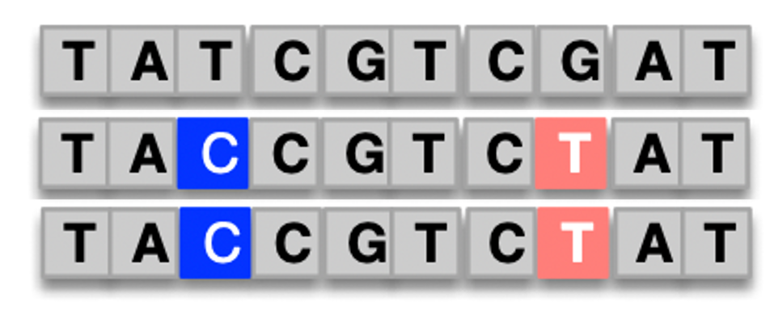
</div>
]

--

-----------

##### Refers to a history of a locus in which advantageous mutations have arisen and fixed or are in the process of fixing.

--

- Advantageous mutations __much rarer__ than deleterious mutations.

- Advantageous mutation can rapidly increase in frequency.
- Patterns generated by this rapid rise are used to detect signatures of positive selection.

---
# Case study (1): a selection sweep on Chr10

"Although man does not cause variability and cannot even prevent it, he can __select, preserve, and accumulate__ the variations given to him by the hand of nature in any way which he chooses; and thus he can certainly produce a great result."
> Charles Darwin, 1859, _On the Origin of Species_

--

.pull-left[
<div align="center">
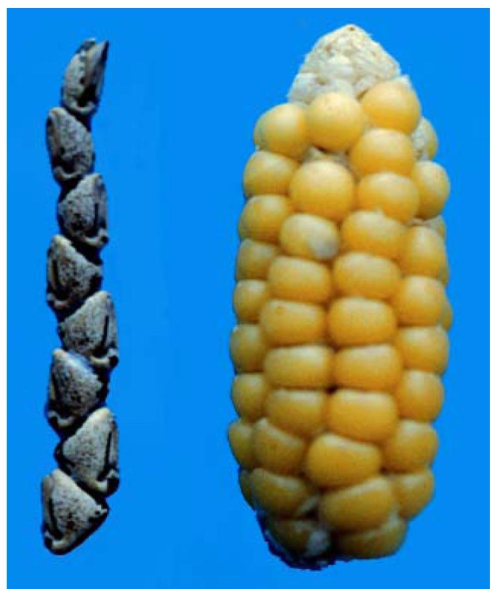
</div>
> Tian et al., 2009, _PNAS_
]


--

.pull-righ[
<div align="center">
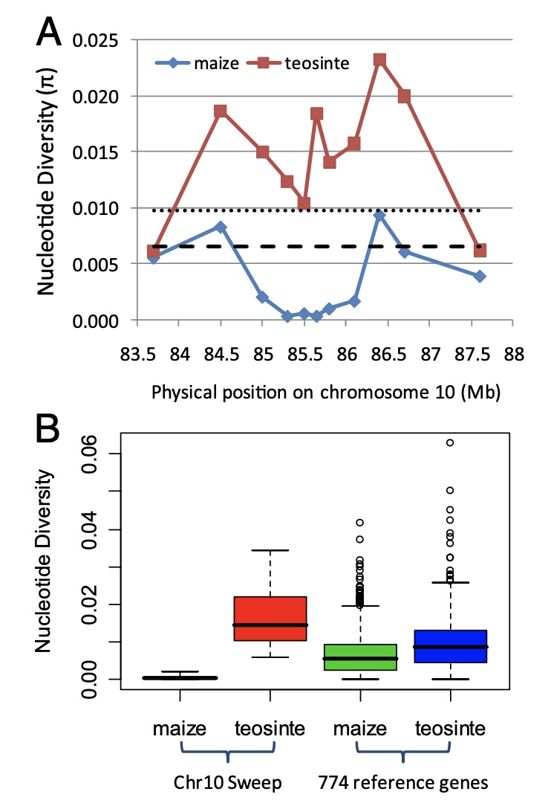
</div>
]

---
# Case study (2): genome-wide scan


.pull-left[
<div align="center">
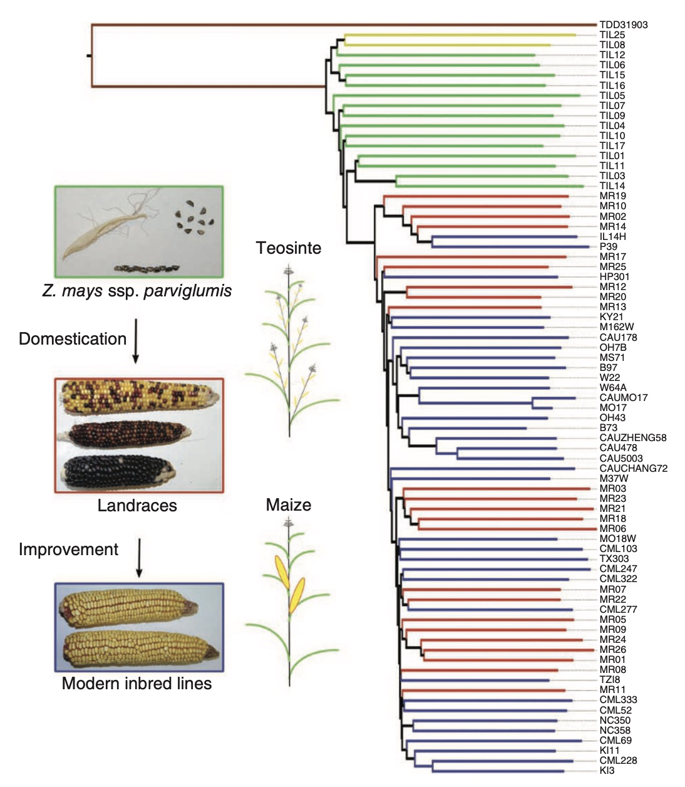
</div>
> Hufford et al., 2012, _NG_
]


--

.pull-righ[
<div align="center">
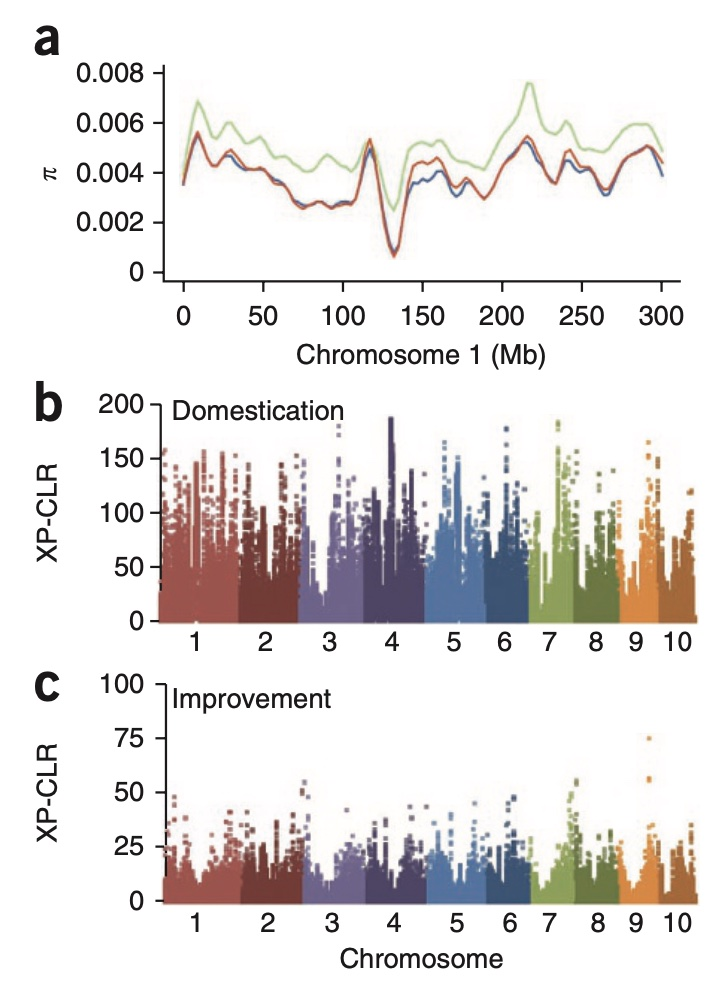
</div>
]

---
# Case study (3): recent improvement


Population structure of 1,604 inbred lines, including six heterotic groups.

<div align="center">
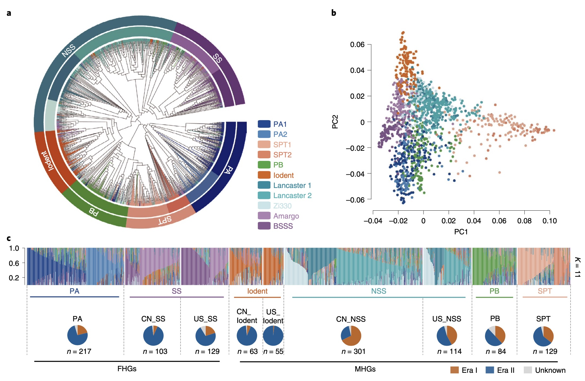
</div>
> Li et al., 2022, _NP_


---
# Case study (3): recent improvement


Atlas of selection sweeps in the female heterotic groups (FHGs) and male heterotic groups (MHGs).

<div align="center">
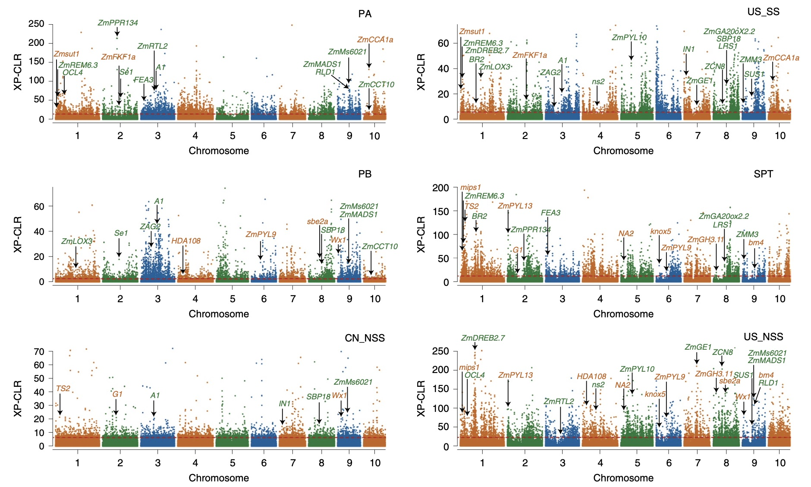
</div>
> Li et al., 2022, _NP_


---
# Negative (purifying) selection

.pull-left[
<div align="center">

</div>
]

--

.pull-right[
<div align="center">
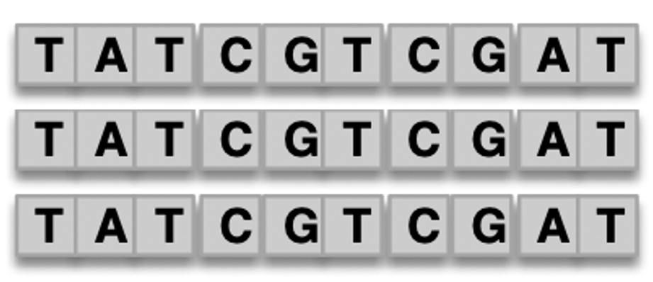
</div>
]

--

-----------

#### Refers to a history of a locus in which the vast majority of mutations that have arisen and been removed due to their deleterious effects.

--

- A gene or noncoding region under negative selection is often conserved.

- These genes or regions are constrained by selection.

- Relatively common in the genome

---
# Negative selection: Case study (1)

<div align="center">
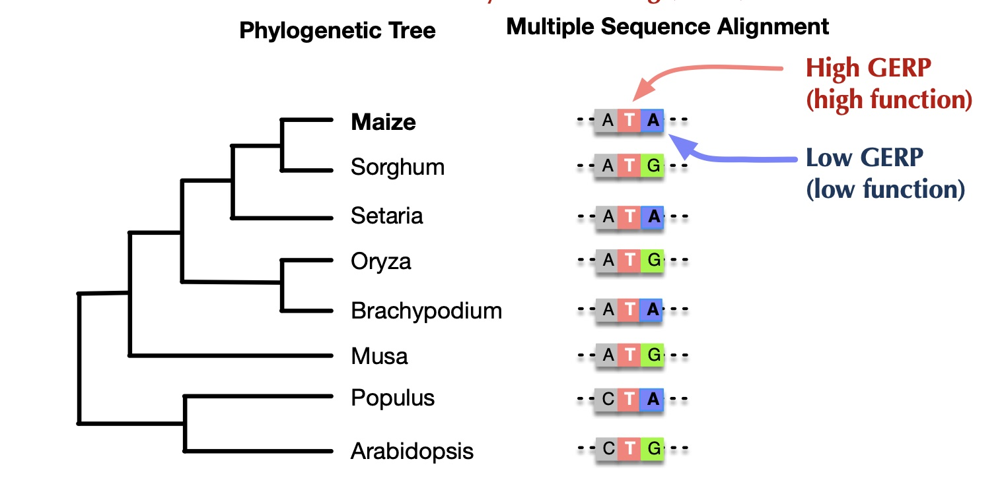
</div>
__Genomic Evolutionary Rate Profiling (GERP)__:
high GERP score, conserved region (functional importance); low GERP score, less conserved
> [Yang et. al., 2017](https://journals.plos.org/plosgenetics/article?id=10.1371/journal.pgen.1007019), PLOS Genetics.

---
# Case study (1): deteterious variants

<div align="center">
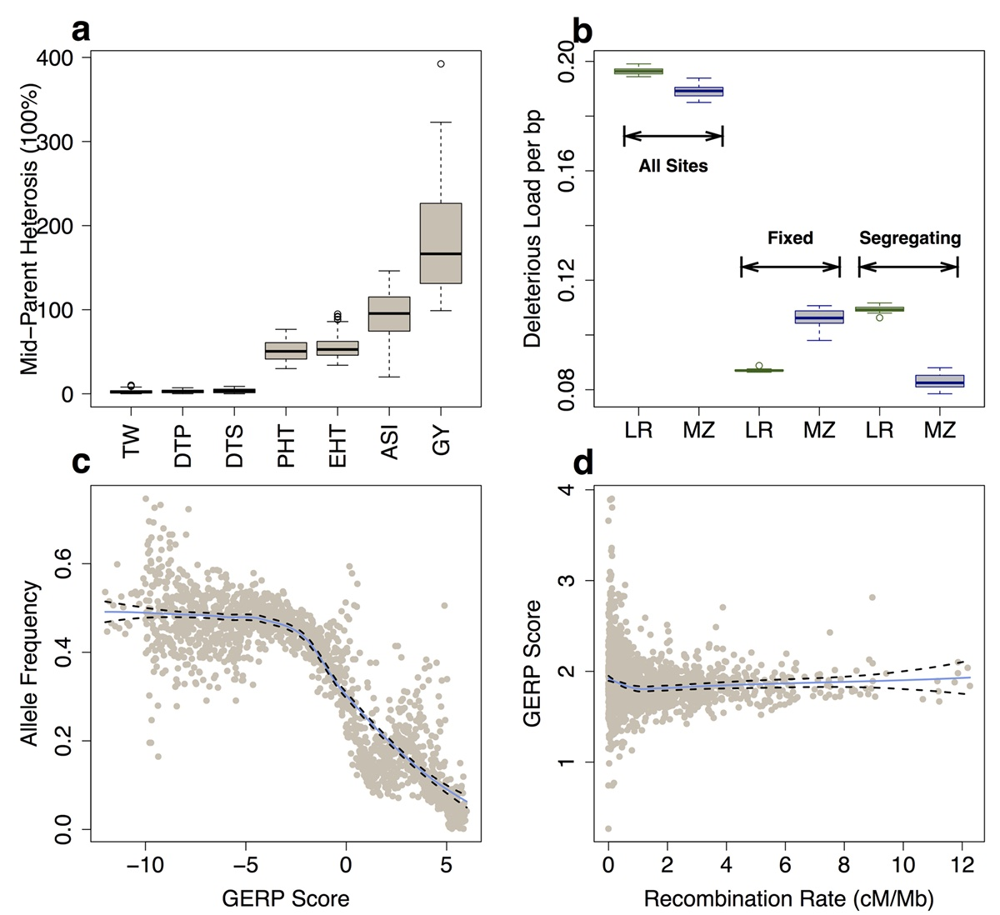
</div>

Heterosis and deterious variants in maize
> [Yang et. al., 2017](https://journals.plos.org/plosgenetics/article?id=10.1371/journal.pgen.1007019), PLOS Genetics.

---
# Case study (2): Fitness map in rice

Fitness consequence (FitCons) score ( $\rho$ ) using functional __genomic__ and __epigenomic__ datasets
> Joly-Lopez et. al., 2020, _Nature Plants_

- Chromatin accessibility
- mRNA and small RNA transcription
- DNA methylation
- 1477 rice accessions and 11 reference genomes
- Histone modifications and engaged RNA ploymerase activity

--

FitCons score ( $\rho$ ) is the probability than a mutation at that site will affect fitness.
- Values range from 0 to 1
- With 1 being the most likely to affect fitness.

--

Around __2%__ of the rice genome showed evidence of weak negative selection, 
- frequently at candidate regulatory sites, 
- including a novel set of 1,000 potentially active enhancer elements.

---
# Case study (2): Fitness map in rice

<div align="center">
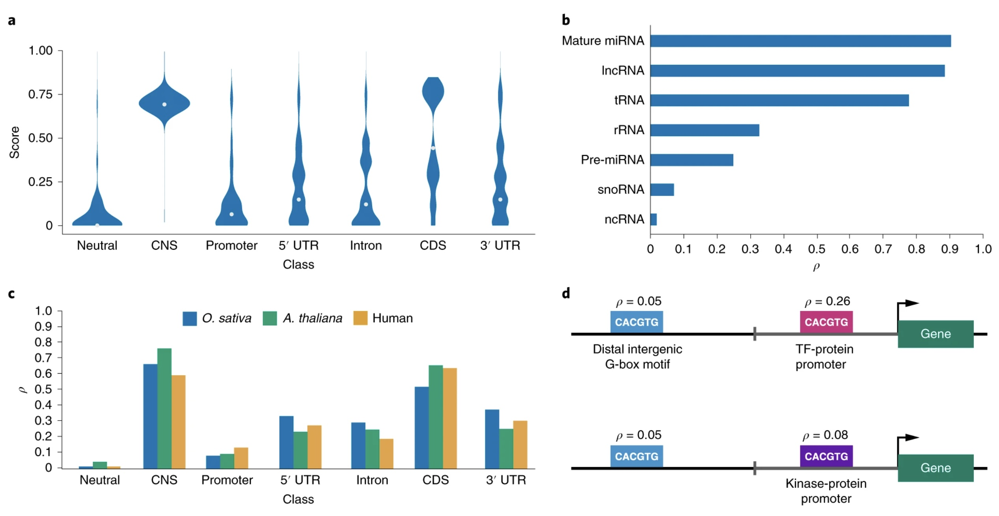
</div>

CNS: conserved noncoding sequences
> Joly-Lopez et. al., 2020, _Nature Plants_

---
# Balancing selection


- Alleles under balancing selection are not universally advantageous or deleterious.

--

- Balanced polymorphisms consist of alleles whose fitness changes with time, space, or population frequency. 

  - __Heterozygote advantage (or overdominant) selection__: heterozygotes genotypes have higher fitness than either homozygous genotype
  
  - __Spatially or temporally varying selection__: Fitness of alleles in a population is dependent on the environment or season


---

# Balancing selection: Case study (1)

Balancing selection matians different alleles at the selected loci.
> Charlesworth, 2006, _PLOS Genetics_

--


.pull-left[
<div align="center">
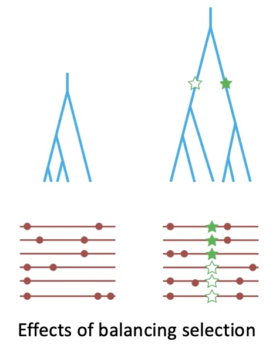
</div>
> Hahn, 2019, _Mol. Pop. Genet._
]

--

.pull-right[
<div align="center">
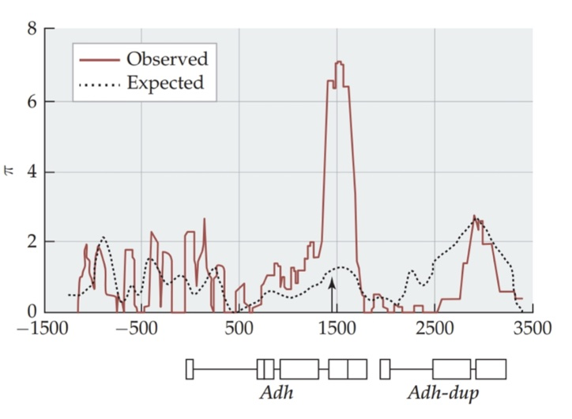
</div>
Signatures of balancing selection in the human ADH gene cluster
]

---

# Balancing selection: Case study (2)

Long-term balancing selection typically leaves very minimum increased genetic diversity

.pull-left[
<div align="center">
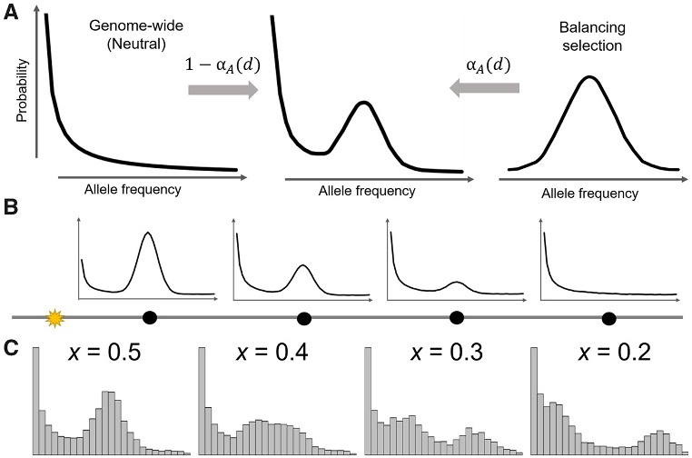
</div>
> Cheng and DeGiorgio, 2020, _MBE_
]

--

.pull-right[
<div align="center">
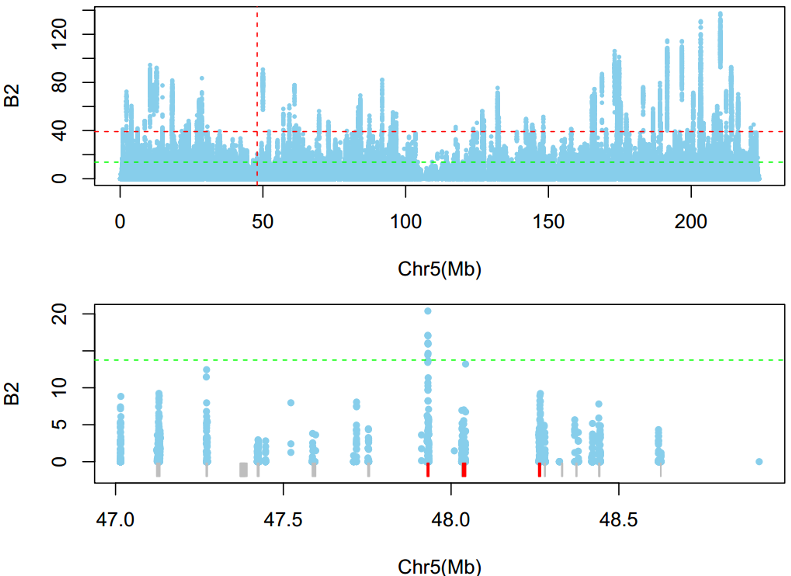
</div>
Balancing selection scan using a teosinte population.
> Xu et. al., 2022, [bioRxiv](https://www.biorxiv.org/content/10.1101/2022.02.09.479784v1).
]

---
# Balancing selection: Case study (2)

.pull-left[
Structural variations at the candidate GLR genes:
<div align="center">
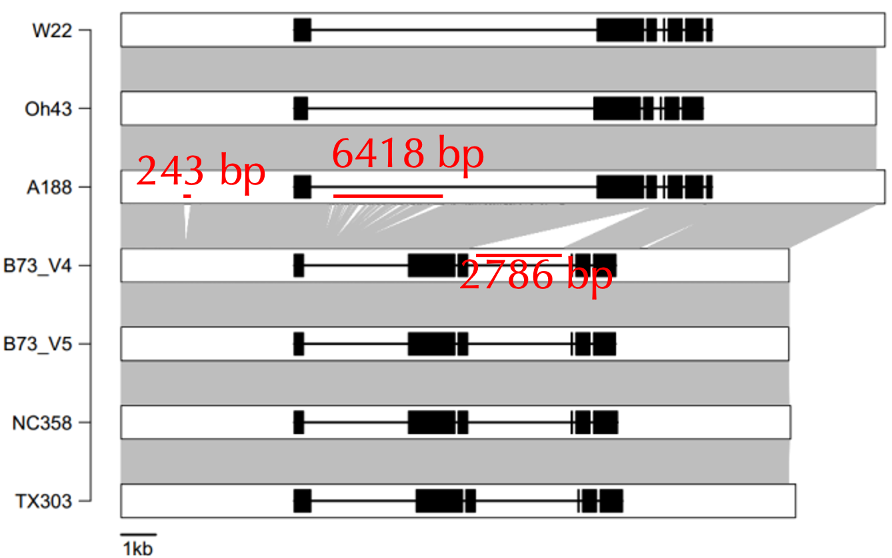
</div>
]

--

.pull-right[
The TE insertion likely spreading DNA methylation to the near exonic regions
<div align="center">
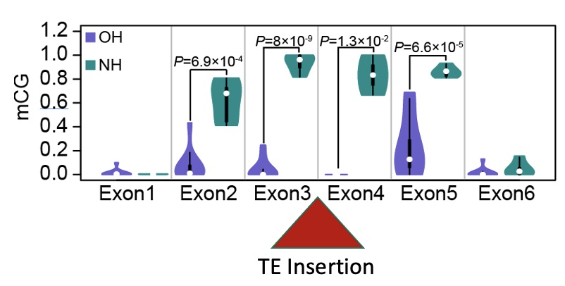
</div>
]


> Xu et. al., 2022, [bioRxiv](https://www.biorxiv.org/content/10.1101/2022.02.09.479784v1).

---
# Basic principles of evolutionary processes

Factors lead  to changes of allele frequency

### Systematic processes

Predictable both in amount and in direction

- __Selection__
  - An important forces in shaping the allele frequency changes
  
--

- _Migration_
  - not a major concern in plant breeding

- _Mutation_
  - Mutation is the ultimate source of genetic variation
  - Mutation alone produces slow change in allele frequency


---

# Basic principles of evolutionary processes

Factors lead  to changes of allele frequency


### Stochastic process

Arises in small populations from the effect of sampling.

- __Genetic drift__

  - Predictable in amount but not in direction


