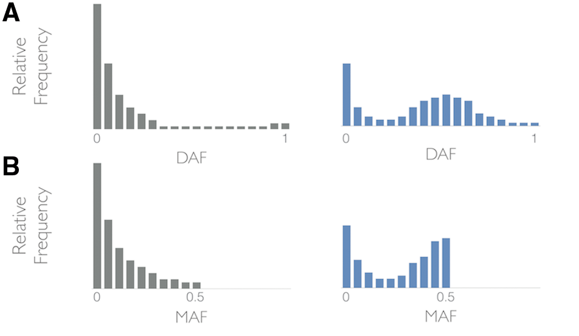

```{r setup, include=FALSE}
options(htmltools.dir.version = FALSE)
```


# Syllabus

### Module 1: Introduction and popgen terminology
- Introduction of population genomics
- Basic principles of evolutionary processes

--

### __Module 2: Scan for direct selection__
- __Direct selection__: Detecting selection using the SFS
  - The effects of selection on these mutation themselves

---

# Neutral theory of molecular evolution

The neutral theory asserts that the great majority of evolutionary changes at the molecular level are caused

- NOT by _Darwinian selection_ 

- But by _random drift of selectively neutral or nearly neutral mutants_


> Motoo Kimura (木村 資生), 1983 
> - Iowa State with Jay Lush and then University of Wisconsin with James Crow

--

#### __Core ideas of neutral theory__:

- #### Most mutations are not advantageous
  - Selectively (or effectively) neutral if $s < 1/(2N_e)$
- #### Most changes that are fixed over time are selectively neutral (fixed by drift)
   - Drift rather than selection predominates
   
---

# Neutral Theory

### What the neutral theory does not claim

- __Does NOT claim__ natural selection is unimportant in evolution

  - In fact, most morphological adaptations are the result of natural selection 

--

- It __does NOT deny__ that most mutations are (slightly) deleterious (it claims most of the variation _we see_ is neutral)

  - Most of the deleterious mutations have been eliminated
  
  - Rare mutations have been fixed


--

### Selection counteracts drift

- $s > 1/(2N_e)$

\begin{align*}
Pr(fix) = \frac{1 - e^{-2s}}{1-e^{-4N_es}}
\end{align*}


---

```{r echo=FALSE}
wright_fisher <- function(N=1000, A1=100, t=1000){
  p <- A1/(2*N)
  ### make a numeric vector to hold the results
  freq <- as.numeric();
  ### Use for loop to run over t generations
  for (i in 1:t){
    A1 <- rbinom(1, 2*N, p) # samling allele from a binom distribution
    p <- A1/(2*N)
    freq[i] <- p
  }
  return(freq)
}
```

```{r fig.align='center', fig.height=6}
set.seed(12347)
Ne=20; A1=1; t=4*Ne
frq <- wright_fisher(N=Ne, A1=A1, t=t)
plot(frq, type="l", ylim=c(0,1), col=3, xlab="Generations", ylab="Freq")
    for(u in 1:100){
      frq <- wright_fisher(N=Ne, A1=A1, t=t)
      random <- sample(1:1000,1,replace=F)
      randomcolor <- colors()[random] 
      lines(frq, type="l", lwd=3, col=(randomcolor))
    }
```

---

# Expected allele frequencies distribution

On timescales shorter than those required for mutations to fix, selection will change the mean frequency of alleles in a population.

--

For new mutations, the density of polymorphisms found at frequency $q$, is


\begin{align*}
f(q) & = \frac{2 \mu}{q(1-q)} \frac{1 - e^{(-4N_es)(1-q)}}{1 - e^{(-4N_e s)}} \\
\end{align*}

> Wright, 1969

- Where $\mu$ is the mutation rate.
- $s$ is the fitness effect. 
  - Advantageous mutations have $s > 0$ and deleterious mutations have $s <0$


---

# Types of selection

To find loci that are under selection we test for departures from the neutral theory

--

### Purifying selection: $N_e \times s < -1$
  - Deleterious mutations are eliminated


### Positive selection:   $N_e \times s > 1$
  - Opposite of purifying
  - Favorable mutations are selected

### Effectively netural: $-1 < N_e \times s < 1$


---

# The expected site frequency spectra

\begin{align*}
f(q) & = \frac{2 \mu}{q(1-q)} \frac{1 - e^{(-4N_es)(1-q)}}{1 - e^{(-4N_e s)}} \\
\end{align*}


```{r echo=TRUE, eval=FALSE, fig.align='center', out.width='80%'}
# expected freq spectra
f <- function(q, ns){
  frq = 2/(q*(1-q)) * (1 - exp(-4*ns*(1-q))) / (1 - exp(-4*ns))
  return(frq)}
q <- seq(from = 0.01, to =0.99, by=0.01)

## Ploting function
plot(q, f(q, ns=0.01), type="l", lty=1, lwd=3, xlab="Ns", 
     ylab="No. of polymorhpic sites", cex.lab=2)
lines(q, f(q, ns=-50), type="l", lty=1, lwd=3, col="red")
lines(q, f(q, ns=-5), type="l", lty=2, lwd=3, col="red")
lines(q, f(q, ns=5), type="l", lty=1, lwd=3, col="blue")
lines(q, f(q, ns=50), type="l", lty=2, lwd=3, col="blue")
legend(0.6, 200, title="Ne*s", legend=c("-50", "5", "0", "-5", "50"), 
       col=c("red", "red", "black", "blue", "blue"), 
       lty=c(1,2,1,1,2), cex=2, lwd=3)
```

---

# The expected distribution of $f(q)$

\begin{align*}
f(q) & = \frac{2 \mu}{q(1-q)} \frac{1 - e^{(-4N_es)(1-q)}}{1 - e^{(-4N_e s)}} \\
\end{align*}

--

.pull-left[
```{r echo=FALSE, fig.align='center', out.width='100%'}
# expected freq spectra
f <- function(q, ns){
  frq = 2/(q*(1-q)) * (1 - exp(-4*ns*(1-q))) / (1 - exp(-4*ns))
  return(frq)}
q <- seq(from = 0.01, to =0.99, by=0.01)

## Ploting function
plot(q, f(q, ns=0.01), type="l", lty=1, lwd=4, xlab="Frq of allele", ylab="No. of polymorhpic sites", cex.lab=1.5)
lines(q, f(q, ns=-5), type="l", lty=2, lwd=4, col="red")
lines(q, f(q, ns=5), type="l", lty=1, lwd=4, col="blue")
legend(0.6, 200, title="Ne*s", legend=c("-5", "0", "5"), 
       col=c("red", "black", "blue"), 
       lty=c(2,1,1), cex=2, lwd=3)
```
]


--

.pull-right[
- #### Deleterious alleles => lower frequencies
 - most strongly deleterious mutations are immediately removed from the population
 
- #### Advantage alleles shifted toward higher frequencies
  - most strongly advantageous mutations fix very rapidly.
]

---

# Signature of negative selection


.pull-left[
### Site Freq Spectrum (SFS)

<div align="center">

</div>
]

--

.pull-left[
- Comparison of expected and observed is __uneven__

- The rare alleles are at lower freq than expected

- Evidence of __negative selection__ (or __purifying selection__)

- However, confounded by population demographics (i.e., bottleneck effect)
]

---

# Signature of positive/balancing selection


.pull-left[
### Site Freq Spectrum (SFS)

<div align="center">

</div>
]

--

.pull-left[
- Comparison of expected and observed is __too even__

- The most common allele is more common than expected

- Evidence of __positive selection__ or __balancing selection__

- However, confounded by population demographics (i.e., population expansion)
]


---

# Diversity measurement

We now consider several statistics summarizing sequencing diversity that use information about __the frequency of derived alleles__
  - As these capture more information about our sequencing data.

--

Fu and Li (1993) defined a statistic, $\epsilon_1$, based on the number of __derived singletons__ in a sample.

\begin{align*}
\epsilon_1 = S_1 \\
\end{align*}

- Where $S_1$ is the number of segregating site with derived alleles found on only one haplotype.

--

If we don't know the ancestral status, we can aslo define a statistic, $\eta_1$, based on __all singletons__ in a sample

\begin{align*}
\eta_1 = S_1^*\frac{n-1}{n} \\
\end{align*}

- Where $S_1^*$ is all the singletons.

---
# Diversity measurement

A second summary statistic of diversity that uses ancestral state information is $\theta_H$:

\begin{align*}
\theta_H = \frac{\sum_{i=1}^{n-1} i^2S_i}{n(n-1)/2} \\
\end{align*}

- Where $S_i$ is again the number of segregating sites where $i$ haplotypes carry the derived allele (Fay and Wu, 2000).


---

# Summary of the $\theta$ statistics

All of these statistics --- $\epsilon_1, \eta_1, \theta_H$ --- are estimators of $\theta$ 
- at __mutation-drift__ equilibrium 
- under an __infinite sites__ mutational model


--

Specifically,

\begin{align*}
E(\epsilon_1) = E(\eta_1) = E(\theta_H)
\end{align*}

These relationships arise because we know the expected shape of the allele frequency distribution under our standard neutral assumptions.


---

# Detecting selection using the SFS

## The effects of positive selection


.pull-left[
<div align="center">

</div>
> Hanh, 2020
]

.pull-right[
- After sweep ended, new mutations started to accumulate.

- These new mutations are by definition __singletons__
 - there is only one origin in the sample with each derived allele.
]

The SFS can be skewed toward an excess of low-frequency polymorphisms relative to the neutral spectrum.

---
# Detecting selection using the SFS

## The effects of balancing selection

Here we consider a simple scenario with a single biallelic site that has been under balancing selection for a long time.
- Variation within each allelic class has been able to __build up__ and __reach equilibrium__

.pull-left[
<div align="center">

</div>
> Bitarello et al., 2018
]

.pull-right[
- Neutral mutations has accumulated both within and between allelic classes

- Overall variation is higher

- SNPs at intermediate frequency show __a distinctive "bump"__ in the SFS.
]


---
# Detecting selection using SFS

A straightforward way would be test a difference between two SFSs.
- However, linkage among sites means that __SNPs at a locus are not independent__, which violates the assumptions made by almost all such test.

--

### Instead, we use $\theta$ to detect deviations.

- $\theta_\pi$: pairwise necleotide diversity.

--

- $\theta_W$: Watterson's $\theta$, using total number of segregating sites

--

- $\epsilon_1 = S_1$: the number of derived singletons in a sample.
- $\eta_1$: based on all singletons in a sample.

--

Under the standard neutral model, all of these test statistics are expected to have a mean of 0.

---

# Tajima's D and related tests

Tajima (1989) constructed the first test to detect difference between the SFS. 

His statistic, $D$, was defined as:

\begin{align*}
D = \frac{\theta_\pi - \theta_W}{\sqrt{Var(\theta_\pi - \theta_W)}}
\end{align*}

--

Fu and Li (1993) created similar statistics. These are known as Fu and Li's $D$, $F$, $D^*$, and $F^*$.

\begin{align*}
D = \frac{\theta_\pi - \epsilon_1}{\sqrt{Var(\theta_\pi - \epsilon_1)}}
\end{align*}

\begin{align*}
F = \frac{\theta_W - \epsilon_1}{\sqrt{Var(\theta_W - \epsilon_1)}}
\end{align*}

\begin{align*}
D^* = \frac{\theta_\pi - \eta_1}{\sqrt{Var(\theta_\pi - \eta_1)}}
\end{align*}

\begin{align*}
F^* = \frac{\theta_W - \eta_1}{\sqrt{Var(\theta_W - \eta_1)}}
\end{align*}

---

# Tajima's D and related tests

Tajima (1989) constructed the first test to detect difference between the SFS. 

His statistic, $D$, was defined as:

\begin{align*}
D = \frac{\theta_\pi - \theta_W}{\sqrt{Var(\theta_\pi - \theta_W)}}
\end{align*}

Originally designed to fit a normal distribution, however, none of these test statistics fit a parametric distribution very well.

### Calculation

- __Only variable sites__ at each locus are needed

- The number of invariant sites do not figure into any calculations.

---

# Interpreting values of the test statistics

Tajima's $D$, Fu and Li's $D, F, D^*, F^*$:

\begin{align*}
D = \frac{\theta_\pi - \theta_W}{\sqrt{Var(\theta_\pi - \theta_W)}}
\end{align*}

- After a sweep, all SNPs are low in frequency, $\theta_\pi$ will be much lower than expected.

- While statistics based on counts of segregating sites (like $\theta_W$) will be much closer to their expected values.

--

------

- All __negative__ when there has been a sweep


---

# Interpreting values of the test statistics

Tajima's $D$, Fu and Li's $D, F, D^*, F^*$:

\begin{align*}
D = \frac{\theta_\pi - \theta_W}{\sqrt{Var(\theta_\pi - \theta_W)}}
\end{align*}

Balancing selection lead to __an excess of intermediate frequency neutral variation__ surrounding a selected site.

In such case, $\theta_\pi$ will be greater than $\theta_W$ and other statistics.

--

------

- All __negative__ when there has been a sweep

- All __positive__ when there is balancing selection

--

- Are usually __significant__ when the values  $> +2$ or $< -2$
  - The exact thresholds depend on sample size, number of SNPs, etc.

---
# Selective sweep on genetic variation

<div align="center">

</div>

- Tajima'd D is smaller than expected (positive selection)
- LD is increased around the selected site
- The number of variable sites (S) is reduced

---
# The power of the SFS

<div align="center">

</div>

Selection against dele- terious mutations will increase the fraction of mutations segregating at low frequencies in the sample. A selective sweep has roughly the same effect on the frequency spectrum (13). Conversely, positive selection will tend to in- crease the frequency in a sample of mutations segregating at high frequencies. 


---
# The power of the SFS

The time window for positive selection is limited.
- #### Too early during the sweep 
  - Signal will be not strong enough
  
--
  
- #### Too late after the sweep
  - Both levels and frequencies of variants will have returned to normal

--

Power also determined by the distance between our studied loci and the location of the selected site.
- Because of the effect of the recombination.
- Move far away enough and there will be no signal of selection at all.

