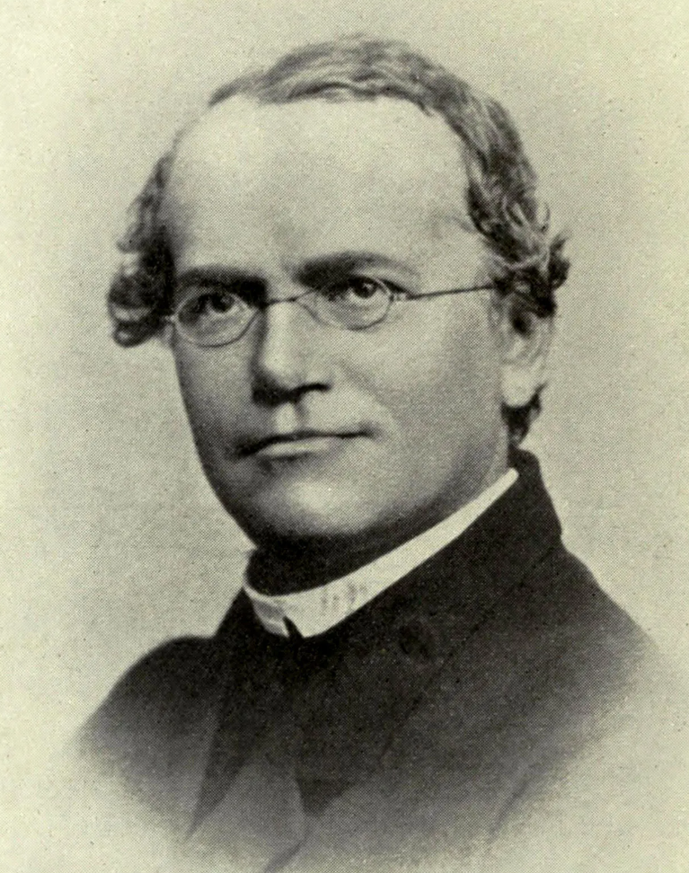

```{r setup, include=FALSE}
options(htmltools.dir.version = FALSE)
```

# About the course

### Course [website](https://jyanglab.com/agro931/)
  - Online HTML slides
  - Important dates

### Canvas 
  - Announcements
  - Handouts 
  - homework assignments (keys)

### Course format
  - In-person lecture session (with the Zoom option if needed)
  - In-class computational demo (Using [R software](https://www.r-project.org/) for statistical computing)
  
---
# Scope of the Course

### Population genetics

Study the genetic composition of natural populations and its evolutionary causes and consequences.

- `Popgen` is the study of **evolution**.

- The language of `popgen` is **Mathematics**.

--

### Quantitative genetics 

Study of the genetic basis of phenotypic variation.

- `Quantgen` is the study of the **complex trait**, or **phenotype**.

- The language of `Quantgen` is **Statistics**.

--

- [AGRO-932](https://jyanglab.com/agro932/) (Biometrical genetics and plant breeding) 
  - Spring of every odd-numbered year (next offfer: Spring 2027)

---
# Population genetics

.pull-left[
<div align="center">

</div>
- __Gregor Mendel__, the founder of modern genetics.
]

.pull-right[
<div align="center">

</div>
- __Charles Darwin__, the founder of modern evolution.
]

--

Population genetics emerged from early efforts to reconcile Mendelian genetics with Darwinian thought.

- Many of the important ideas and mathematical models emerged before the 1940s
- Before DNA was discovered and yet the usefulness of these models has not diminished

---
# Quantitative genetics 

It almost synonymous with __statistics__!

.pull-left[
<div align="center">

</div>
- __R. A. Fisher__ is a founder of quantitative genetics but also of analysis of variance and randomization procedures in statistics.
]

.pull-right[
<div align="center">

</div>
- The early geneticist __Karl Pearson__ originated the concepts of regression and correlation.
]

--

In the 2nd part of the course, we will be deeply involved with the statistical evaluation of the basic quantitative genetic models.


---

# Texts and other readings

Falconer & Mackay, 1996 Introduction to Quantitative Genetics. Fourth Edition.

<div align="center">

</div>

### __Study the material before class meets.__
- Pay attention to the problems in the textbook. 
- Note that problems and solutions are presented at the end of the text.


---

# Definitions

#### Locus (plural: loci)
A __locus__ is a specific spot in the genome: maybe an entire gene, or a single base pair. 
- such as, chr1 from 1001-1005: A A __T__ C G. 

--

#### Alleles
At each genetic locus, there may be multiple genetic variants segregating in the population
--- these are known as __alleles__.

- allele 1: A A __T__ C G. 
- allele 2: A A __C__ C G. 

Allele transfers from one generation to next

--

#### Genotype
- A __Genotype__ is a pair of alleles
Genotype is not transferred from one generation to the next due to segregation of alleles.


---

# Population

A population is a group of interbreeding individuals
- Same species
- Close proximity
- Share a gene pool

--

.pull-left[
<div align="center">

</div>
]

.pull-right[
- dog 1: AA AA __TT__ CC GG 
- dog 2: AA AA __CC__ CC GG
- dog 3: AA AA __CT__ CC GG 
- dog 4: AA AA __CT__ CC GG
- dog 5: AA AA __CC__ CC GG
assuming 2 alleles per locus
]

- Each offspring = random sample of one egg and one sperm from the gene pool
- The probability of sampling a particular allele = the frequency of that allele in the gene pool, assuming equal fitness, random mating, ...

