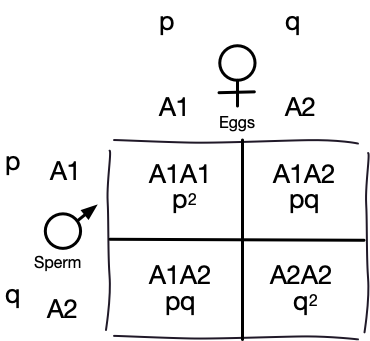
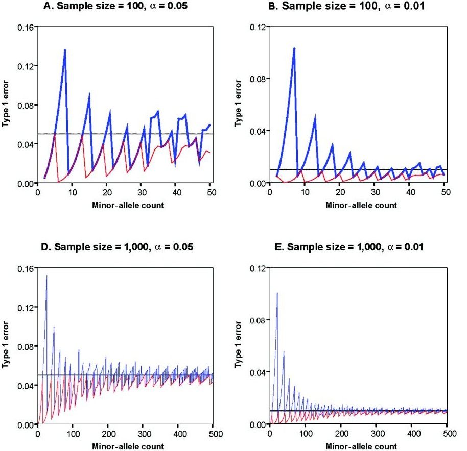

```{r setup, include=FALSE}
options(htmltools.dir.version = FALSE)
```

# Allele and genotype frequencies

.pull-left[
<div align="center">

</div>
]

.pull-right[
- dog 1: AA AA __TT__ CC GG 
- dog 2: AA AA __CC__ CC GG
- dog 3: AA AA __CT__ CC GG 
- dog 4: AA AA __CT__ CC GG
- dog 5: AA AA __CC__ CC GG
]

Consider a diploid locus segregating for two alleles ( $A_1$ and $A_2$ ).
We usually define the less frequent allele (or minor allele) as the $A_1$ allele.

### Allele frequency ( $p$ and $q$ ) 
Frequency/proportion of alleles of a particular identity at one locus

### Genotype frequency ( $f_{11}$, $f_{12}$, $f_{22}$ )
Proportion of individuals with a specific genotype (combination of alleles)

---

# Allele and genotype frequencies

.pull-left[
<div align="center">

</div>
]

.pull-right[
- dog 1: AA AA __TT__ CC GG 
- dog 2: AA AA __CC__ CC GG
- dog 3: AA AA __CT__ CC GG 
- dog 4: AA AA __CT__ CC GG
- dog 5: AA AA __CC__ CC GG
]

Let $n$ be the total number of individuals in the population. Genotype frequency of __TT__ is:

```{r}
n = 5
n11 = 1
f11 = n11/n
f11
```

--

The frequency of minor allele $A_1$ in the population is then given by

\begin{align*}
p = \frac{2n_{11}+n_{12}}{2n} = f_{11} + \frac{1}{2}f_{12}
\end{align*}


---

# Hardy-Weinberg Equilibrium

#### A population is in HWE if it has constant allele and genotype frequencies __from generation to generation__

- Allele frequencies in parents predict allele and genotype frequencies in offspring

--

### Caveats

- A large, randomly-mating population for diploid species

- No selection, no mutation, no migration, etc.
  
---

# In Hardy-Weinberg Equilibrium

If allele frequencies in parent population = $p$ & $q$, 
then, genotype frequencies in progeny after random mating are:

\begin{align*}
(p + q)^2 = p^2 + 2pq + q^2
\end{align*}

- The array of genotypes in progeny equals the square of the parental gametic array. 

- (sum of allele frequencies) $^2$ = (sum of genotype frequencies)


---
# For HWE to hold true

### NO

- Migration
- Mutation 
- Selection

### YES

- Random Mating
- Large Population Size

--

--------

- If any condition is not met, allele and genotype frequencies in the population may (will) change.

- With respect to one autosomal locus, __HWE is attained after one generation of random mating__.


---

# Proof of HWE

### 1. From allele frequency in parents to allele frequency in gametes

In the parent generation:

| Allele/Genotype | $A_1$   | $A_2$   | $A_1A_1$   | $A_1A_2$   | $A_2A_2$ |
| :-------: |: ------- :| :-------: | :-------: | :-------: | :-------: |
| Freq  | $p$   | $q$    | $p^2$    | $2pq$    | $q^2$    | 

---

# Proof of HWE

### 2. From allele frequency in gametes to genotype frequencies in zygotes

Random union among their gametes:

.pull-left[
<div align="center">

</div>
]

### For heterozygotes


The union of A1 eegs with A2 sperms need to be distinguished from that of A2 eggs with A1 sperms.

---

# Proof of HWE

### 3. From zygotes to adults

Genotype frequencies would be observable unless the zygotes survive equally well.


- Equal viability
- Same fitness and no selection

--

### 4. From genotype freq to allele freq in progeny

Given above genotype freq, allele freq for A1 allele in progeny can be calculated as:

\begin{align*}
f_1 = & \frac{2n_{11}+n_{12}}{2n} = f_{11} + \frac{1}{2}f_{12} \\
= & p^2 + pq = p(p+q) =p \\
\end{align*}


---

# Relationship between allele and genotype frequencies

```{r fig.height=4, fig.width=4}
p = seq(0, 1, by=0.01)
q = 1 - p
f11 <- p^2
f12 <- 2*p*q
f22 <- q^2

plot(f11, type="l", col="black", xlab="p", ylab="Genotype Frequency")
lines(f12, col="red")
lines(f22, col="blue")
```

---

# Relationship between allele and genotype frequencies

```{r echo=FALSE, fig.height=4, fig.width=4}
p = seq(0, 1, by=0.01)
q = 1 - p
f11 <- p^2
f12 <- 2*p*q
f22 <- q^2

plot(f11, type="l", col="black", xlab="p", ylab="Genotype Frequency")
lines(f12, col="red")
lines(f22, col="blue")
```

- Maximum frequency of heterozygotes occurs when p = q = 0.50

- Frequency of heterozygotes cannot be greater than 0.50

- When allele frequency is low, that allele occurs predominantly in heterozygotes

---

# How do we determine if a locus is in HWE?

### First, why do we care?

- One Locus?

- Across multiple Loci?

--

### Is your answer different if it is just one locus vs multiple loci?

- One Locus --- Estimate freq of recessive alleles 
  - How many people carry a disease

- Across multiple Loci
  - Which locus is affected by selection (or something else)?

---

# Chi-squared test of HWE

\begin{align*}
\chi^2 = \sum{\frac{(Obs - Exp)^2}{Exp}}
\end{align*}

--

### Example: M-N blood groups

| Genotype | $MM$   | $MN$   | $NN$   | Total  |
| :-------: |: ------- :| :-------: | :-------: | :-------: | 
| Observed  | $84$   | $131$    | $216$    | $431$    | 

--

#### Using HWE to calculate expected values

\begin{align*}
f_M = & \frac{2n_{MM}+n_{MN}}{2n} = \frac{2 \times 84 + 131}{2 \times 431} = 0.35 = p \\
f_N = & 0.65 = q \\
\end{align*}

--

| Genotype | $MM$   | $MN$   | $NN$   | Total  |
| :-------: |: ------- :| :-------: | :-------: | :-------: | 
| Observed  | $84$   | $131$    | $216$    | $431$    | 
| Expected  | $p^2 \times 431=53$   | $2pq \times 431=196$    | $q^2 \times 431=182$    | $431$    | 

---

# Chi-squared test of HWE


| Genotype | $MM$   | $MN$   | $NN$   | Total  |
| :-------: |: ------- :| :-------: | :-------: | :-------: | 
| Observed  | $84$   | $131$    | $216$    | $431$    | 
| Expected  | $p^2 \times 431=53$   | $2pq \times 431=196$    | $q^2 \times 431=182$    | $431$    | 

--

### Null hypothesis (H0): population is in HWE

\begin{align*}
\chi^2 = & \sum{\frac{(Obs - Exp)^2}{Exp}} \\
= & \frac{(84-53)^2}{53} + \frac{(131-196)^2}{196} + \frac{(216-182)^2}{182} \\
= & 46 \\
\end{align*}

- Degrees of freedom (df) = n-k (#genotype - #alleles) =1
- Critical values of $\chi^2$ with 1 df is $3.84$ at $\alpha=0.05$ and $6.63$ at $\alpha=0.01$.

--

Our value of $\chi^2 > 3.84$, therefore, we reject H0 and conclude that the population is NOT in HWE.


---

# Chi-squared test of HWE


| Genotype | $MM$   | $MN$   | $NN$   | Total  |
| :-------: |: ------- :| :-------: | :-------: | :-------: | 
| Observed  | $84$   | $131$    | $216$    | $431$    | 
| Expected  | $p^2 \times 431=53$   | $2pq \times 431=196$    | $q^2 \times 431=182$    | $431$    | 

```{r}
nMM = 84; nMN = 131; nNN = 216
n = nMM + nMN + nNN
p = (2*nMM + nMN)/(2*n) # M allele freq
q = 1- p # N allele freq

obs = c(nMM, nMN, nNN)
exp = c(p^2, 2*p*q, q^2)*n
stat <- sum(((obs-exp)^2)/exp)
stat

# pchisq gives the distribution function
1 - pchisq(stat, df=1)
```

#### Note that chisq.test is not suitable for HWE as it computes the df as 2

---

# Test for HWE

### Chi-squared test
- Expected count should be $≥5$ per category

- If allele frequencies are low and/or sample size is small results may be erroneous

--

### Exact Test for HWE

Using the multinomial probability equation:


\begin{align*}
p(data) = \frac{n!}{n_{11}!n_{12}!n_{22}!}p^{2n_{11}}q^{2n_{22}}(2pq)^{n_{12}}
\end{align*}

```{r}
exact.t <- function(n11, n12, n22){
  n <- n11 + n12 + n22
  p <- (2*n11 + n12)/(2*n)
  q = 1 - p
  prob1 <- factorial(n)/(factorial(n11) * factorial(n12) * factorial(n22))
  prob2 <- p^(2*n11)*q^(2*n22)*(2*p*q)^n12
  return(prob1*prob2)
}

exact.t(n11=2, n12=40, n22=2)
```
---
# Wigginton et al, 2005

[Am J Hum Genet 76:887-883](http://www.ncbi.nlm.nih.gov/pmc/articles/PMC1199378/)

.pull-left[
<div align="center">

</div>
]

--

.pull-right[
- Type1 error for Chi-squared (blue) and extact test (red) for HWE

- Both tests are better with higher minor allele freq and larger sample

- Chi-squared test has inflated type I error

- Exact test is always conservative while Chi-squared can be conservative or __anti-conservative__
]

---
# Work with your own data

```{r}
# This code implements an exact SNP test of Hardy-Weinberg Equilibrium as described in
# Wigginton, JE, Cutler, DJ, and Abecasis, GR (2005) A Note on Exact Tests of 
# Hardy-Weinberg Equilibrium. American Journal of Human Genetics. 76: 000 - 000  

# NOTE: return code of -1.0 signals an error condition

source("http://csg.sph.umich.edu/abecasis/Exact/snp_hwe.r")

data <- data.frame(HET=c(100, 57, 31), 
                   HOM1=c(3, 14,32), 
                   HOM2=c(5, 50,51))               

test_markers <- function(data){
  data$pval <- -9
  for (i in 1:nrow(data)){
    data$pval[i] <- SNPHWE(data[i, 1], data[i, 2], data[i, 3])
  }
  return(data)
}
test_markers(data)
```

